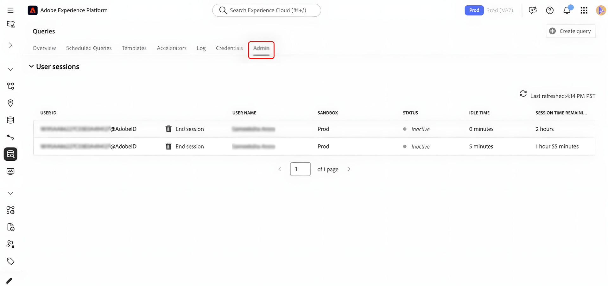

# Manage Query Service sessions

Use this guide to manage active Query Service sessions from the Adobe Experience Platform user interface. Session management helps administrators monitor concurrent Query Editor sessions across sandboxes and free capacity when users leave sessions open.

## Permissions required for session management {#permissions} 

>[!AVAILABILITY]
>
>Session management is available only to organizations with Data Distiller entitlements.

>[!IMPORTANT]
>
>This feature is intended for administrators. End users running queries cannot manage sessions.

To view and end sessions, you must belong to an organization with Data Distiller access and have the **[!UICONTROL Manage Query Session]** permission assigned. Users without the required permissions can access Query Service but cannot view or manage active sessions.

## View active sessions {#view-active-sessions}

Administrators can view all active Query Service sessions across sandboxes in your organization. In Experience Platform, select **[!UICONTROL Queries]** in the left navigation to open the Query Service workspace, then select the **[!UICONTROL Admin]** tab to access session management.

The session management table updates automatically in real time and lists all sessions currently consuming Query Service concurrent session capacity assigned to your organization. Each row represents a single session opened in the Query Editor.

## Session status and idle time {#session-status}

The session table provides information to help you decide whether a session can be safely ended.

| Column | Description |
| --- | --- |
| User ID | The Adobe ID of the user who owns the session |
| User name | The name associated with the Adobe ID |
| Sandbox | Indicates the sandbox where the session is running |
| Session status | Shows whether the session is **[!UICONTROL Active]** or **[!UICONTROL Inactive]** |
| Idle time | Displays how long the session has been open without interaction |
| Remaining session time | Indicates how long the session can remain open before automatic expiration |

### Session status

**[!UICONTROL Inactive]** indicates the user is not actively running a query; these sessions can be ended. **[!UICONTROL Active]** indicates a query is currently running; the **[!UICONTROL End session]** control is unavailable until query execution completes.

### Idle time and remaining session time

Idle time shows how long a session has been open without user interaction. Remaining session time indicates how long the session can stay open before it is automatically closed by the system. Sessions automatically expire after the maximum allowed duration (two hours of inactivity). This duration is system-defined and cannot be configured.

## End idle sessions {#end-idle-sessions}

You can end idle sessions to free concurrent session capacity for other users. Consider ending sessions with high idle time when users are no longer actively working.

From the session management table, select **[!UICONTROL End session]** to choose the inactive session you want to end.

A confirmation dialog appears to prevent accidental termination. Select **[!UICONTROL End session]** in the dialog to confirm the action. 

After the session ends, the session is removed from the table, capacity becomes available immediately, and the action is recorded for auditing.

>[!NOTE]
>
>Sessions with status **[!UICONTROL Active]** cannot be ended. This safeguard prevents interruption of in-progress workloads.

## Session behavior after termination {#session-behavior-after-termination}

When an administrator ends a session, the affected user's code remains in the editor without losing work. If the user attempts to run a query after termination, the system detects the ended session, re-establishes the connection automatically, and keeps Query Editor content intact.

This behavior ensures users do not lose work written in the editor and can continue once a new session is established.

## Audit logs for session management {#audit-logs}

The system logs session management actions to provide visibility and accountability. Audit logs record the session ID, the user whose session was ended, the administrator who performed the action, and the time of the action.

Use audit logs to review session termination history and investigate unexpected disconnections.

For more information about viewing audit logs, see the [Query Service audit log guide](../data-governance/audit-log-guide.md).

## Next steps {#next-steps}

Consider the following resources to extend your use of Query Service and Data Distiller:

* [Learn how users create and run queries in the Query Editor user guide](user-guide.md)
* [Monitor scheduled workloads using the scheduled queries monitoring documentation](monitor-queries.md)

