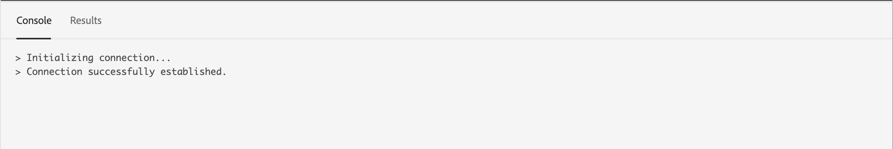
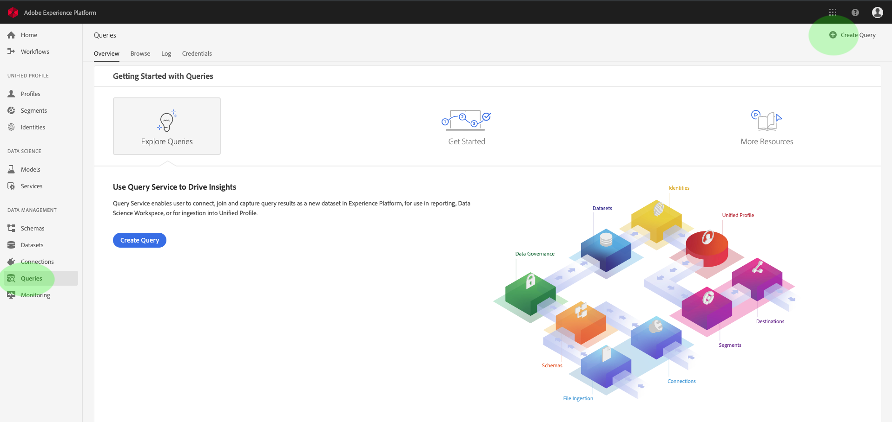
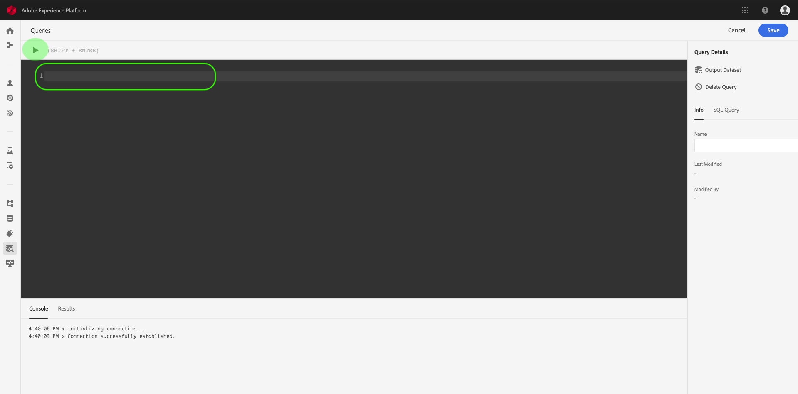
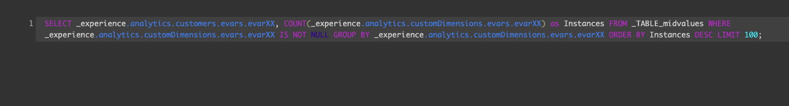
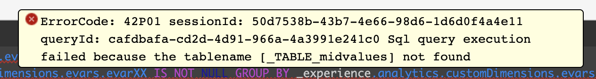
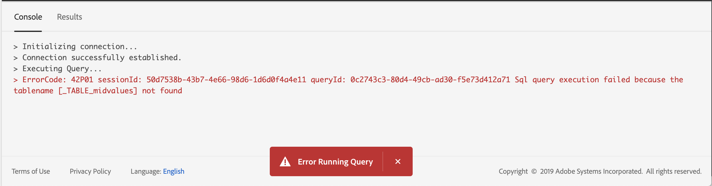
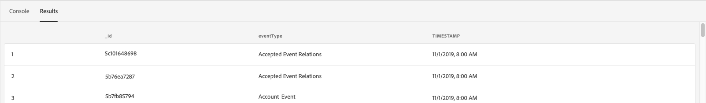

# [!DNL Query Editor] user guide

[!DNL Query Editor] is an interactive tool provided by Adobe Experience Platform [!DNL Query Service], which allows you to write, validate, and run queries for customer experience data within the [!DNL Experience Platform] user interface. [!DNL Query Editor] supports developing queries for analysis and data exploration, and allows you to run interactive queries for development purposes as well as non-interactive queries to populate datasets in [!DNL Experience Platform].

For more information about the concepts and features of [!DNL Query Service], see the [Query Service overview][query-service-overview]. To learn more about how to navigate the Query Service user interface on [!DNL Platform], see the [Query Service UI overview][query-service-ui].

## Getting started

[!DNL Query Editor] provides flexible execution of queries by connecting to [!DNL Query Service], and queries will only run while this connection is active.

### Connecting to [!DNL Query Service]

[!DNL Query Editor] takes a few seconds to initialize and connect to [!DNL Query Service] when it is opened. Console tells you when it is connected, as shown below. If you attempt to run a query before the editor has connected, it delays execution until the connection is complete. 

### How queries are run from [!DNL Query Editor]

Queries executed from [!DNL Query Editor] run interactively. This means that if you close the browser or navigate away, the query is canceled. This is also true for queries made to generate datasets from query outputs. 

## Query authoring using [!DNL Query Editor]

Using [!DNL Query Editor], you can write, execute, and save queries for customer experience data. All queries executed in [!DNL Query Editor], or saved, are available to all users in your organization with access to [!DNL Query Service].

### Accessing [!DNL Query Editor]

In the [!DNL Experience Platform] UI, click **[!UICONTROL Queries]** in the left navigation menu to open the [!DNL Query Service] workspace. Next, click **[!UICONTROL Create Query]** at the top right of the screen to start writing queries. This link is available from any of the pages in the [!DNL Query Service] workspace. 

  
### Writing queries

[!UICONTROL Query Editor] is organized to make writing queries as easy as possible. The screenshot below shows how the editor appears in the UI, with the **Play** button and SQL entry field highlighted.

To minimize your development time, it is recommended that you develop your queries with limits on the rows returned. For example, `SELECT fields FROM table WHERE conditions LIMIT number_of_rows`. After you have verified that your query produces the expected output, remove the limits and run the query with `CREATE TABLE tablename AS SELECT` to generate a dataset with the output. 

### Writing tools in [!DNL Query Editor]

- **Automatic syntax highlighting:** Makes reading and organizing SQL easier.

- **SQL key word auto-complete:** Start typing your query then use the arrow keys to navigate to the desired term and press **Enter**.

- **Table and field auto-complete:** Start typing the table name you want to `SELECT` from, then use the arrow keys to navigate to the table you are looking for, and press **Enter**. Once a table is selected, autocomplete will recognize fields in that table. 

### Error detection

[!DNL Query Editor] automatically validates a query as you write it, providing generic SQL validation and specific execution validation. If a red underline appears below the query (as shown in the image below), it represents an error within the query.

When errors are detected, you can view the specific error messages by hovering over the SQL code.

### Query details

While you are viewing a query in [!DNL Query Editor], the **[!UICONTROL Query Details]** panel provides tools to manage the selected query.

This panel allows you to generate an output dataset directly from the UI, delete or name the displayed query, and view the SQL code in an easy to copy format on the **[!UICONTROL SQL Query]** tab. This panel also shows useful metadata such as the last time the query was modified and who modified it, if applicable. To generate a dataset, click **[!UICONTROL Output Dataset]**. The **[!UICONTROL Output Dataset]** dialog appears. Enter a name and description, then click **[!UICONTROL Run Query]**. The new dataset is displayed in the **[!UICONTROL Datasets]** tab on the [!DNL Query Service] user interface on [!DNL Platform].

### Saving queries

[!DNL Query Editor] provides a save function that allows you to save a query and work on it later. To save a query, click **[!UICONTROL Save]** in the top right corner of [!DNL Query Editor]. Before a query can be saved, a name must be provided for the query using the **[!UICONTROL Query Details]** panel.

### How to find previous queries

All queries executed from [!DNL Query Editor] are captured in the Log table. You can use the search functionality in the **[!UICONTROL Log]** tab to find query executions. Saved queries are listed in the **[!UICONTROL Browse]** tab. 

See the [Query Service UI overview][query-service-ui] for more information. 

>[!NOTE]
>
>Queries that are not executed are not saved by the Log. In order for the query to be available in [!DNL Query Service], it must be run or saved in [!DNL Query Editor].

## Executing queries using Query Editor

To run a query in [!DNL Query Editor], you can enter SQL in the editor or load a previous query from the **[!UICONTROL Log]** or **[!UICONTROL Browse]** tab, and click **Play**. The status of query execution is displayed in the **[!UICONTROL Console]** tab below, and output data is shown in the **[!UICONTROL Results]** tab.

### Console

The console provides information on the status and operation of [!DNL Query Service]. The console displays the connection status to [!DNL Query Service], query operations being executed, and any error messages that result from those queries.

>[!NOTE]
>
>The console only shows errors that resulted from executing a query. It does not show query validation errors before a query is executed.

### Query results

After a query has completed, the results are displayed in the **[!UICONTROL Results]** tab, next to the **[!UICONTROL Console]** tab. This view shows the tabular output of your query, displaying up to 100 rows. This view allows you to verify that your query produces the expected output. To generate a dataset with your query, remove limits on rows returned, and run the query with `CREATE TABLE tablename AS SELECT` to generate a dataset with the output. See the [generating datasets tutorial][query-service-create-datasets] for instructions on how to generate a dataset from query results in [!DNL Query Editor].

## Run queries with [!DNL Query Service] tutorial video

The following video shows how to run queries in the Adobe Experience Platform interface and in a PSQL client. Additionally, using individual properties in an XDM object, using Adobe-defined functions, and using CREATE TABLE AS SELECT (CTAS) are demonstrated.

>[!VIDEO](https://video.tv.adobe.com/v/29796?quality=12&learn=on)

## Next steps

Now that you know what features are available in [!DNL Query Editor] and how to navigate the application, you can start authoring your own queries directly in [!DNL Platform]. For more information about running SQL queries against datasets in [!DNL Data Lake], see the guide on [running queries][query-service-running-queries]. For sample SQL queries for working with Adobe Analytics and Adobe Target data, see the [sample queries reference][query-service-sample-queries].

[query-service-overview]: ../home.md
[query-service-ui]: overview.md
[query-service-running-queries]: ../creating-queries/creating-queries.md
[query-service-sample-queries]: ../sample-queries/overview.md
[query-service-create-datasets]: ../creating-queries/create-datasets.md