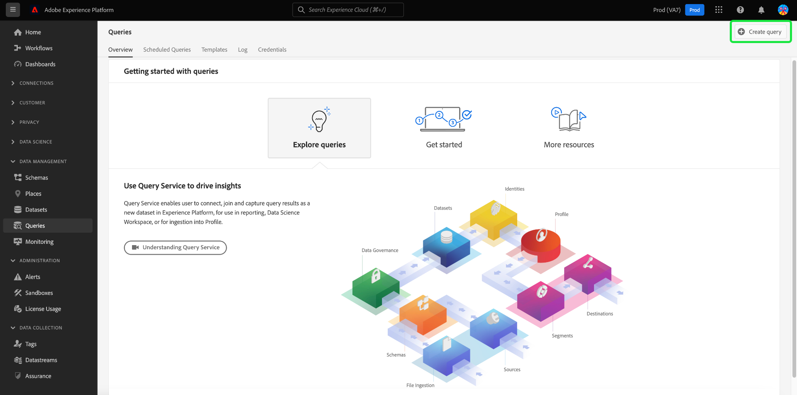

# Query Editor UI guide

Query Editor is an interactive tool provided by Adobe Experience Platform Query Service, which allows you to write, validate, and run queries for customer experience data within the [!DNL Experience Platform] user interface. Query Editor supports developing queries for analysis and data exploration, and allows you to run interactive queries for development purposes as well as non-interactive queries to populate datasets in [!DNL Experience Platform].

For more information about the concepts and features of Query Service, see the [Query Service overview](../home.md). To learn more about how to navigate the Query Service user interface on [!DNL Experience Platform], see the [Query Service UI overview](./overview.md).

## Getting started {#getting-started}

The Query Editor provides flexible execution of queries by connecting to Query Service, and queries only run while this connection is active.

## Accessing Query Editor {#accessing-query-editor}

In the [!DNL Experience Platform] UI, select **[!UICONTROL Queries]** in the left navigation menu to open the Query Service workspace. Next, to start writing queries, select **[!UICONTROL Create Query]** at the top right of the screen. This link is available from any of the pages in the Query Service workspace. 

### Connecting to Query Service {#connecting-to-query-service}

The Query Editor takes a few seconds to initialize and connect to Query Service when it is opened. The console tells you when it is connected, as shown below. If you attempt to run a query before the editor has connected, it delays execution until the connection is complete. 

### How queries are run from Query Editor {#run-a-query}

Queries executed from Query Editor run interactively which means that if you close the browser or navigate away, the query is cancelled. The same is true for queries made to generate datasets from query outputs.

## Query authoring using the Enhanced Query Editor {#query-authoring}

Using Query Editor, you can write, execute, and save queries for customer experience data. All queries executed, or saved in Query Editor are available to all users in your organization with access to Query Service.

### Database selector {#database-selector}

Select a database to query from the dropdown menu in the top right of the Query Editor. The selected database is shown in the dropdown.

### Settings {#settings}

A settings icon above the Query Editor input field includes an options to enable/disable dark theme or disable/enable auto-complete.

>[!TIP]
>
>You can [!UICONTROL Disable syntax auto complete] while authoring a query without losing your progress.

To enable dark or light themes, select the settings icon () followed by the option in the dropdown menu that appears.

#### Auto-complete {#auto-complete}

The Query Editor automatically suggests potential SQL keywords along with table or column details for the query as you write it. The auto-complete feature is enabled by default and can be disabled or enabled at any point from the Query Editor settings.

The auto-complete configuration setting is per user and remembered for the consecutive logins for that user. Disabling this feature stops several metadata commands from being processed and providing recommendations that typically benefit the speed of the author when editing queries.

### Execute multiple sequential queries {#execute-multiple-sequential-queries}

Use the Enhanced Query Editor to write more than one query and execute all queries in a sequential manner. The execution of multiple queries in a sequence each generate a log entry. However, only the results of the first query display in the Query Editor console. Check the query log if you need to troubleshoot or confirm the queries that were executed. See the [query logs documentation](./query-logs.md) for more information. 

>[!NOTE]
> 
>If a CTAS query is executed after the first query in the Query Editor, a table is still created however there is no output on the Query Editor console.

### Execute selected query {#execute-selected-query}

If you have written multiple queries but need to execute only one query, you can highlight your chosen query and select the 
[!UICONTROL Run selected query] icon. This icon is disabled by default until you select query syntax within the editor.

![The Query Editor with the [!UICONTROL Run selected query] icon highlighted.](../images/ui/query-editor/run-selected-query.png)

### Cancel Query Editor session {#cancel-query}

Take control of query execution and improve your productivity by canceling long-running queries. This action clears the Query Editor during a query run. Be aware, the query continues to execute in the background. If it is a CTAS query it will still generate an output dataset. To cancel the run in the editor and continue composing a SQL statement, select **[!UICONTROL Cancel query]** after executing a query.   

![The Query Editor with [!UICONTROL Cancel query] highlighted.](../images/ui/query-editor/cancel-query-run.png)

A confirmation dialog appears. Select **[!UICONTROL Confirm]** to cancel the query run.

### Result count {#result-count}

The Query Editor has a maximum 50,000 row output. You can choose the number of rows are displayed at one time in the Query Editor console. To change the number of rows displayed in the console, select the **[!UICONTROL Result count]** dropdown and select from the 50, 100, 150, 300, 500, and 1000 options.

>[!NOTE]
>
>As the Experience Platform UI can support up to 1000 rows, passing a LIMIT value over 1000 is ignored.

## Writing queries {#writing-queries}

[!UICONTROL Query Editor] is organized to make writing queries as easy as possible. The screenshot below shows how the editor appears in the UI, with the SQL entry field and **Play** highlighted.

To minimize your development time, you are recommended to develop your queries with limits on the number of rows returned. For example, `SELECT fields FROM table WHERE conditions LIMIT number_of_rows`. After you have verified that your query produces the expected output, remove the limits and run the query with `CREATE TABLE tablename AS SELECT` to generate a dataset with the output.

## Writing tools in Query Editor {#writing-tools}

Use the Query Editor's writing tools to enhance your query authoring process. Features include options to format text, copy SQL, manage query details, and save or schedule your work as you progress.

### Format text {#format-text}

The [!UICONTROL Format text] feature makes your query more readable by adding standardized syntax styling. Select **[!UICONTROL Format text]** to standardize all the text within the Query Editor.

>[!NOTE]
>
>The [!UICONTROL Format text] feature does not work with anonymous blocks. To learn how to chain one or more SQL statements sequentially, see the [anonymous block documentation](../key-concepts/anonymous-block.md). 

![The Query Editor with [!UICONTROL Format text] and the SQL statements highlighted.](../images/ui/query-editor/format-text.png)

<!-- ### Undo text {#undo-text}

If you format your SQL in the Query Editor, you can undo the formatting applied by the [!UICONTROL Format text] feature. To return your SQL back to its original form, select **[!UICONTROL Undo text]**.

![The Query Editor with [!UICONTROL Undo text] and the SQL statements highlighted.](../images/ui/query-editor/undo-text.png) -->

### Copy SQL {#copy-sql}

Select the copy icon to copy SQL form the Query Editor to your clipboard. This copy feature is available for both query templates and newly created queries in the Query Editor.

### Query details {#query-details}

To view a query in the Query Editor, select any saved template from the [!UICONTROL Templates] tab. The query details panel provides more information and tools to manage the selected query. It also shows useful metadata such as the last time that the query was modified and who modified it, if applicable.

>[!NOTE]
>
>The [!UICONTROL View schedule], [!UICONTROL Add schedule] and [!UICONTROL Delete query] options are only available after the query has been saved as a template. The [!UICONTROL Add schedule] option takes you directly to the schedule builder from the Query Editor. The [!UICONTROL View schedule] option takes you directly to the schedule inventory for that query. See the query schedules documentation to learn how to [create query schedules in the UI](./query-schedules.md#create-schedule).

From the details panel you can generate an output dataset directly from the UI, delete or name the displayed query, view the query run schedule, and add the query to a schedule.  

To generate an output dataset, select **[!UICONTROL Run as CTAS]**. The **[!UICONTROL Enter output dataset details]** dialog appears. Enter a name and description, then select **[!UICONTROL Run as CTAS]**. The new dataset is displayed in the **[!UICONTROL Datasets]** Browse tab. See [the view datasets documentation](../../catalog/datasets/user-guide.md#view-datasets) to learn more about available datasets for your organization.

>[!NOTE]
>
>The [!UICONTROL Run as CTAS] option is only available if the query has **not** been scheduled.

![The [!UICONTROL Enter output dataset details] dialog.](../images/ui/query-editor/output-dataset-details.png)

After you execute the **[!UICONTROL Run as CTAS]** action, a confirmation message pops up to notify you of the successful action. This popup message contains a link that provides a convenient way to navigate to the query logs workspace. See the [query logs documentation](./query-logs.md) for more information on query logs.

### Saving queries {#saving-queries}

The Query Editor provides a save function that allows you to save a query and work on it later. To save a query, select **[!UICONTROL Save]** in the top-right corner of Query Editor. Before a query can be saved, a name must be provided for the query using the **[!UICONTROL Query Details]** panel.

>[!NOTE]
>
>Queries named and saved in using the Query Editor are available as templates within the Query dashboard [!UICONTROL Templates] tab. See the [templates documentation](./query-templates.md) for more information.

When you save a query in the Query Editor, a confirmation message pops up to notify you of the successful action. This popup message contains a link that provides a convenient way to navigate to the queries scheduling workspace. See the [schedule queries documentation](./query-schedules.md) to learn how to run queries on a custom cadence.

### Scheduled queries {#scheduled-queries}

Queries that have been saved as a template can be scheduled from the Query Editor. Scheduling queries allows you to automate query runs on a custom cadence. You can schedule queries based on frequency, date, and time, and also choose an output dataset for your results if necessary. Query schedules can also be disabled or deleted through the UI.

Schedules are set in the Query Editor. When using the Query Editor, you can only add a schedule to a query that has already been created, and saved. The same limitation does not apply to the Query Service API.

>[!NOTE]
>
>Scheduled queries that fail ten consecutive runs are automatically put in a [!UICONTROL Quarantined] status. A query with this status requires your intervention before any further executions can take place. See the [quarantined queries](./monitor-queries.md#quarantined-queries) documentation for more details. 

See the query schedules documentation to learn how to [create query schedules in the UI](./query-schedules.md). Alternatively, to learn how to add schedules using the API, read the [scheduled queries endpoint guide](../api/scheduled-queries.md).

Any scheduled queries are added to the list in the [!UICONTROL Scheduled queries] tab. From that workspace you can monitor the status of all scheduled query jobs through the UI. On the [!UICONTROL Scheduled queries] tab, you can find important information about your query runs and subscribe to alerts. The available information includes the status, schedule details, and error messages/codes if a run failed. See the [Monitor scheduled queries document](./monitor-queries.md) for more information.

### How to find previous queries {#previous-queries}

All queries executed from Query Editor are captured in the Log table. You can use the search functionality in the **[!UICONTROL Log]** tab to find query executions. Saved queries are listed in the **[!UICONTROL Templates]** tab. 

If a query was scheduled, then the [!UICONTROL Scheduled Queries] tab provides improved visibility through the UI for those query jobs. See the [query monitoring documentation](./monitor-queries.md) for more information. 

>[!NOTE]
>
>Queries that are not executed are not saved by the Log. In order for the query to be available in Query Service, it must be run or saved in Query Editor.

### Object browser {#object-browser}

Use the object browser to easily search and filter datasets. The object browser reduces the time spent searching for tables and datasets in large environments with numerous datasets. With streamlined access to relevant data and metadata, you can focus more on query authoring and less on navigation.

To navigate your database with the object browser, enter a table name into the search field, or select **[!UICONTROL Tables]** to expand the list of available datasets and tables. When using the search field, the list of available tables are dynamically filtered based on your input.

Every dataset contained in [your selected database](#database-dropdown) is listed in a navigation rail to the left of the Query Editor. 

The schema displayed in the object browser is an observable schema. This means that you can use it to monitor changes and updates in real time as changes are immediately visible. The observable schemas help to ensure data synchronization and assists with debugging or analytics tasks.

#### Current limitation {#current-limitation}

The system processes queries sequentially, meaning only one query can run at a time. While a query is in progress, additional tables cannot be accessed in the left navigation.

#### Access table metadata {#table-metadata}

In addition to quick searches, you can now easily access metadata for any table by selecting the 'i' icon next to the table name. This provides you with detailed information about the selected table, that helps you to make informed decisions when writing queries.

#### Explore child tables

To explore child or linked tables, select the dropdown arrow next to a table name in the list. This expands the table to show any associated child tables, and gives a clear view of the data structure and allows for more complex query constructions. The icon next to the field name indicates the column's data type, to help you identify it during complex queries.

## Executing queries using Query Editor {#executing-queries}

To run a query in Query Editor, you can enter SQL in the editor or load a previous query from the **[!UICONTROL Log]** or **[!UICONTROL Templates]** tab, and select **Play**. The status of query execution is displayed in the **[!UICONTROL Console]** tab below, and output data is shown in the **[!UICONTROL Results]** tab.

### Console {#console}

The console provides information on the status and operation of Query Service. The console displays the connection status to Query Service, query operations being executed, and any error messages that result from those queries.

>[!NOTE]
>
>The console only shows errors that resulted from the execution of a query. It does not show the query validation errors that occur before a query is executed.

### Query results {#query-results}

After a query has been completed, the results are displayed in the **[!UICONTROL Results]** tab, next to the **[!UICONTROL Console]** tab. This view shows the tabular output of your query, displaying between 50 and 1000 rows of results depending on your chosen [result count](#result-count). This view allows you to verify that your query produces the expected output. To generate a dataset with your query, remove limits on rows returned, and run the query with `CREATE TABLE tablename AS SELECT` to generate a dataset with the output. See the [generating datasets tutorial](./create-datasets.md) for instructions on how to generate a dataset from query results in Query Editor.

## Examples {#examples}

Query Service provides solutions to a variety of use cases across industries and business scenarios. These examples demonstrate the flexibility and impact of the service in addressing diverse needs. To [uncover how Query Service can bring value to your specific business needs](../use-cases/overview.md), explore the comprehensive collection of use case documents. Learn how to use Query Service to provide insights and solutions for enhanced operational efficiency and business success.

<!-- This video is from 2019. The logic is sounds but the workflow is too outdated. -->

## Run queries with Query Service tutorial video {#query-tutorial-video}

The following video shows how to run queries in the Adobe Experience Platform interface and in a PSQL client. The video also demonstrates the use of individual properties in an XDM object, Adobe-defined functions, and how to use CREATE TABLE AS SELECT (CTAS) queries.

>[!NOTE]
>
>The UI depicted in the video is outdated but the logic used in the workflow remains the same.

>[!VIDEO](https://video.tv.adobe.com/v/29796?quality=12&learn=on)

## Next steps

Now that you know what features are available in Query Editor and how to navigate the application, you can start authoring your own queries directly in [!DNL Experience Platform]. For more information about running SQL queries against datasets in [!DNL Data Lake], see the guide on [running queries](../best-practices/writing-queries.md). 
