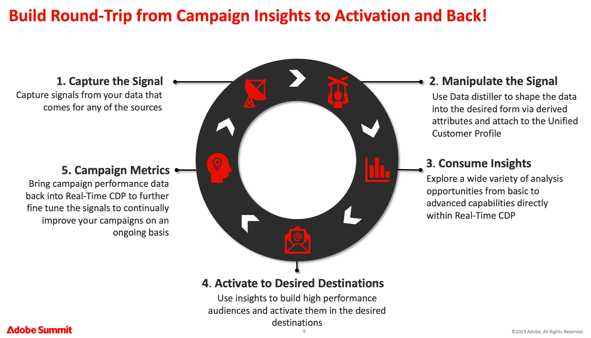
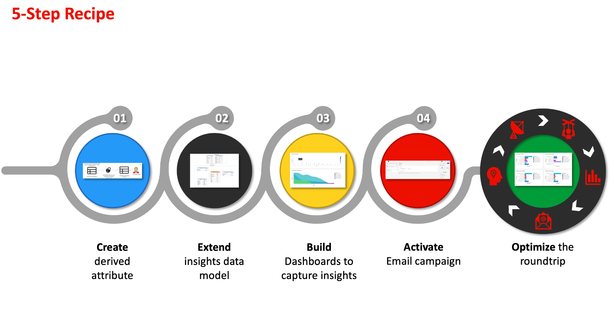
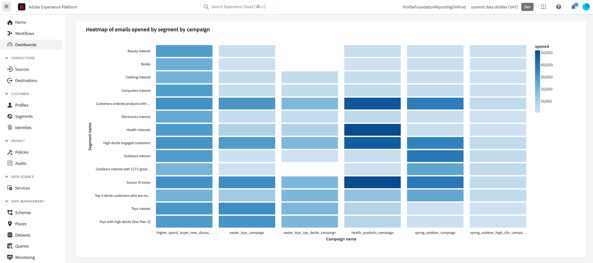
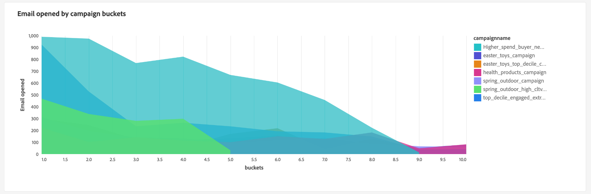
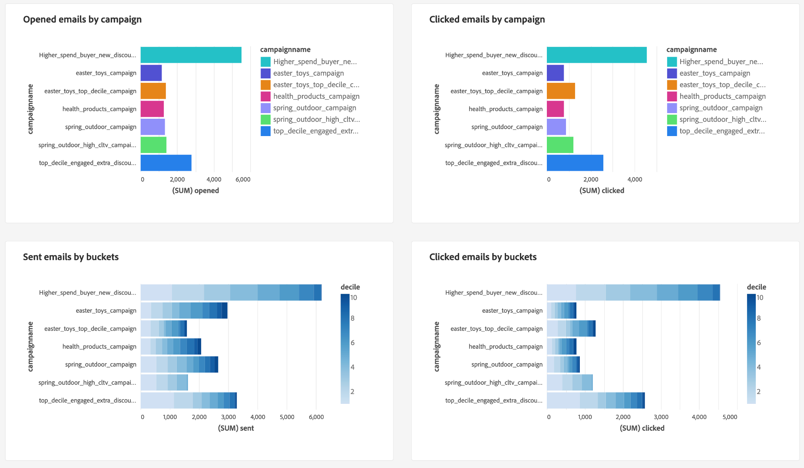

# Track data signals to generate your customer lifetime value

You can use Real-Time Customer Data Platform to track customer lifetime value (CLV) and visualize that metric with user-defined dashboards. Through the use of Data Distiller and user-defined dashboards, you can measure how valuable a customer is to your company across the entirety of your relationship. Knowing the CLV can help you develop your business's strategies to acquire new customers while retaining the existing ones and maintaining profit margins.

The following infographic depicts the cycle of data collection, manipulation, analysis, and actuation that generates high-performance data to improve your marketing campaigns.

This end-to-end use case demonstrates how data signals can be captured and modified to calculate the customer lifetime value derived attribute. These derived attributes can then be applied to your Real-Time CDP profile data and are available for use with user-defined dashboards to build a dashboard for insight analysis. Through Data Distiller, you can extend the Real-Time CDP insights data model and use the CLV derived attribute and dashboard insights to build a new audience and activate it to a desired destination. These high-performance audiences can then be used to power your next marketing campaign.

This guide is designed to help you to better understand your customer experience by measuring data signals across key touchpoints that drive CLV and implement a similar use case in your environment. The entire process is summarized in the image below.

## Getting started {#getting-started}

This guide requires that you have a working understanding of the following components of Adobe Experience Platform:

* [Query Service](../home.md): Provides a user interface and a RESTful API where you can use SQL queries to analyze and enrich your data. 
* [Segmentation Service](../../segmentation/home.md): Allows you to generate audiences from your Real-Time Customer Profile data.

## Prerequisites

This guide requires you to have the [Data Distiller](../data-distiller/overview.md) SKU as part of your package offering. If you are unsure whether you have this, please speak to your Adobe service representative.

## Create a derived attribute {#create-derived-attribute}

The first step in establishing your CLV is to create a derived attribute from the data signals captured from user actions. This particular use case is captured in a separate document about an airline loyalty scheme. See the guide to learn how to [use Query Service to create decile-based derived attributes for use with your profile data](./deciles-use-case.md). Full examples and explanations are provided in the document that explain the following steps:

* Create a schema to allow for decile bucketing.
* Use Query Service to create deciles.
* Generate decile datasets.
* Enable the schema for use in Real-Time Customer Profile.
* Create an identity namespace and mark it as the primary identifier.
* Create a query to calculate deciles over a lookback period.

## Extend the insights data model and schedule updates {#extend-data-model-and-set-refresh-schedule}

Next, you must build a custom data model or extend an existing Adobe Real-Time CDP data model to engage with your CLV reporting insights. See the documentation to learn how to [build a reporting insights data model through Query Service for use with accelerated store data and user-defined dashboards](../data-distiller/query-accelerated-store/reporting-insights-data-model.md#build-a-reporting-insights-data-model). The tutorial covers the following steps:

* Create a model for reporting insights with Data Distiller.
* Create tables, relationships, and populate data.
* Query the reporting insight data model.
* Extend your data model with the Real-Time CDP insights data model.
* Create dimension tables to extend your reporting insights model.
* Query your extended accelerated store reporting insights data model

Please see the Real-Time Customer Data Platform Insights Data Model documentation to learn how to [customize your SQL query templates to create Real-Time CDP reports for your marketing and key performance indicator (KPI) use cases](../../dashboards/cdp-insights-data-model.md).

Make sure to set a schedule to refresh your custom data model on a regular cadence. This ensures that the data comes back in as part of your ingestion pipeline as needed, and populates your user-defined dashboards. See the [schedule queries guide](../ui/query-schedules.md#create-schedule) to learn how to set up your schedule.

## Build a dashboard to capture insights {#build-a-custom-dashboard}

Now that you have created your custom data model, you are ready to visualize your data with custom queries and user-defined dashboards. See the user-defined dashboards overview for full guidance on how to [build a custom dashboard](../../dashboards/user-defined-dashboards.md). The UI guide includes details on:

* How to create a widget.
* How to use the widget composer.

Examples of custom CLV widgets that use decile buckets can be seen below.

## Create and activate high-performance audiences {#create-and-activate-audiences}

The next step is to build a segment definition and generate audiences from your Real-Time Customer Profile data. See the Segment Builder UI guide to learn how to [create and activate audiences in Platform](../../segmentation/ui/segment-builder.md). The guide provides sections on how to:

* Create segment definitions using a combination of attributes, events, and existing audiences as building blocks.
* Use the rule builder canvas and containers to control the order in which the segmentation rules are executed.
* View estimates of your prospective audience, allowing you to adjust your segment definitions as required.
* Enable all segment definitions for scheduled segmentation.
* Enable specified segment definitions for streaming segmentation.

Alternatively, there is also a [segment builder video tutorial](https://experienceleague.adobe.com/docs/platform-learn/tutorials/audiences/create-segments.html) available for more information.

## Activate your audience for an email campaign {#activate-audience-for-campaign}

Once you have built your audience, you are ready to activate it to a destination. Platform supports a variety of Email Service Providers (ESPs) that enable you to manage your email marketing activities, such as sending promotional email campaigns. 

Check the [email marketing destinations overview](../../destinations/catalog/email-marketing/overview.md#connect-destination) for a list of the supported destinations that you want to export data to (for example the [Oracle Eloqua](../../destinations/catalog/email-marketing/oracle-eloqua-api.md) page).

## See the returned analysis data from your campaign {#post-campaign-data-analysis} 

The data from sources can now be [incrementally processed](../essential-concepts/incremental-load.md) as part of a scheduled refresh to your data model in the accelerated data store. Any response events from customers can be ingested into Adobe Experience Platform as they happen or in batches. Your data model could be refreshed once, or multiple times a day depending on your settings or source connectors. See the [batch ingestion API overview](../../ingestion/batch-ingestion/api-overview.md) or the [streaming ingestion overview](../../ingestion/streaming-ingestion/overview.md) for more information. 

Once your data model is updated, your custom dashboard widgets provide meaningful signals that allow you to measure and visualize customer lifetime value.

A variety of visualization options are provided for your custom analysis. 

These insights can in turn help you develop your business strategies for subsequent campaigns.

## Next steps 

By reading this document you should have a better understanding of how you can use Real-Time Customer Data Platform to track and visualize the customer lifetime value (CLV) metric. To learn more about the many business use cases catered for through Query Service and Experience Platform, you are recommended to read read the following documents:

* [An end-to-end example of an abandoned browse use case that demonstrates the versatility and benefits of Query Service.](./abandoned-browse.md)
* [How to use Query Service and machine learning to determine and filter bot activity from genuine online website visitor traffic](./bot-filtering.md)
* [How to perform a match on your Platform data that combines results from multiple datasets by approximately matching a string of your choice.](./fuzzy-match.md)

<!-- "Data signals are actions taken by consumers while online that offer clues about intent that can be acted upon. This includes anything from visiting a website to filling out a change of address or clicking an ad."  -->

<!-- "Customer touchpoints are your brand's points of customer contact, from start to finish." -->
