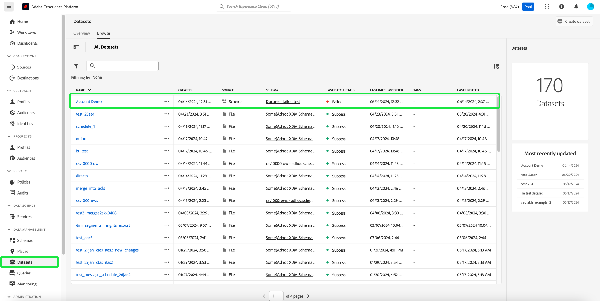
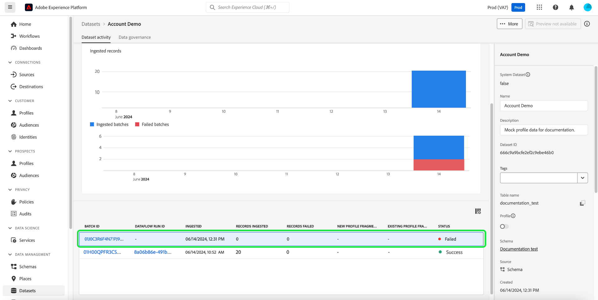
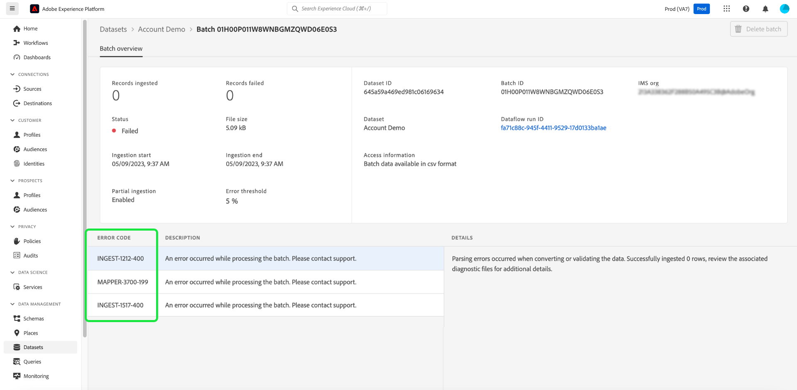
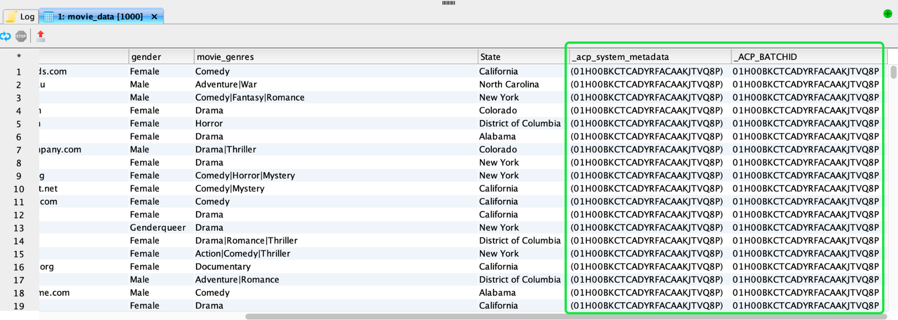
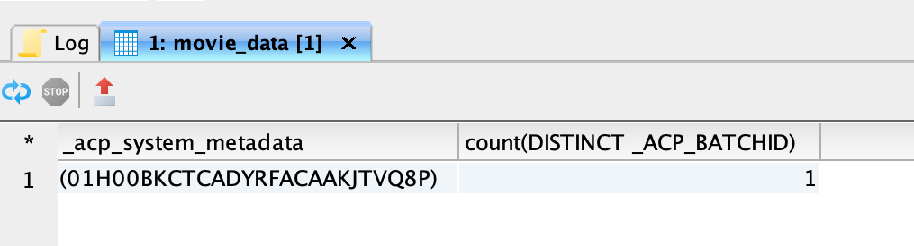
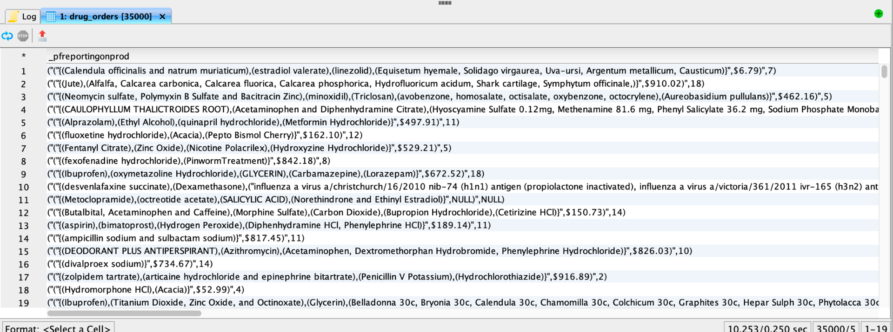
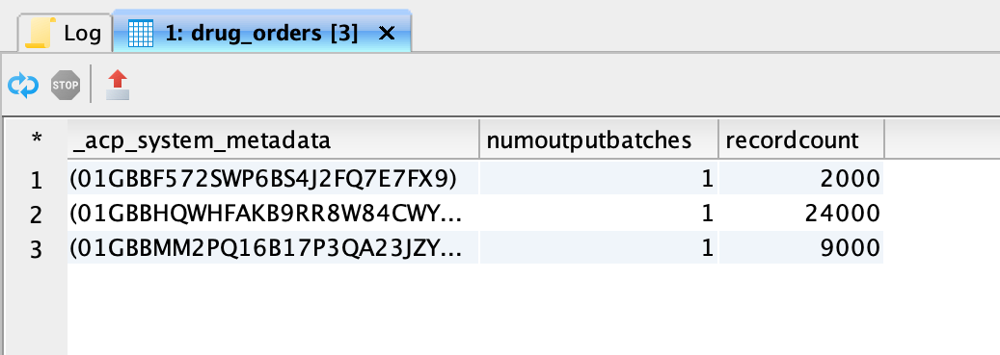
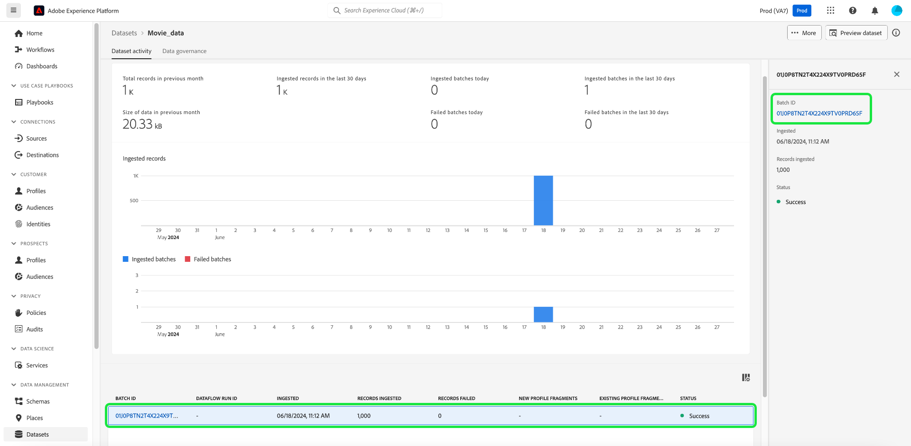

# Explore Ingested Batches in a Dataset

<!-- This document explains how data is ingested in batches, how to verify and validate these batches, and how to handle errors that may arise during the ingestion process. -->

This document explains the data ingestion process in Adobe Experience Platform and details how to verify and validate records in ingested batches. This document teaches you how to: 

- Handle errors that may arise during the ingestion process
- Access dataset batch metadata
- Troubleshoot and ensure data integrity by querying batches

>[!NOTE]
>
>Some screenshots in this guide are taken from [!DNL DBVisualizer]. To learn how to [connect Query Service with DBVisualizer](../clients/dbvisulaizer.md) or other [third-party BI tools](../clients/overview.md), see the linked documentation.

## Prerequisites

To help your understanding of the concepts discussed in this document, you should have knowledge of the following topics:

- **Data Ingestion**: See the [Data Ingestion overview](../../ingestion/home.md) to learn the basics of how data is ingested into the Platform, including the different methods and processes involved.
- **Batch Ingestion**: See the [batch ingestion API overview](../../ingestion/batch-ingestion/overview.md) to learn the basic concepts of batch ingestion. Specifically, what a "batch" is and how it functions within the Platform data ingestion process.
- **"Error Handling in Data Ingestion"**: Learn about the [different types of errors that can occur](../../ingestion/quality/error-diagnostics.md#retrieve-errors) during data ingestion and [how to handle them](../../ingestion/batch-ingestion/troubleshooting.md#what-if-a-batch-fails).
- **System Metadata in Datasets**: See the [Catalog Service overview](../../catalog/home.md) to learn how system metadata fields are used to track and query ingested data.
- **Experience Data Model (XDM)**: See the [Schemas UI overview](../../xdm/ui/overview.md) and the ['basics of schema composition'](../../xdm/schema/composition.md) to learn about XDM schemas and how they represent and validate the structure and format of data ingested into Platform.

## Basic principles of data ingestion in Platform {#data-ingestion-principles}

Data ingestion involves the collection and materializing of records in batches into Adobe Experience Platform. A "batch" is a data ingestion concept where a collection of records contained in a file, or streamed directly from the source, are materialized as a unit on the data lake. A batch refers to a collection of records that are processed as a unit.

When ingesting data into Platform, you must verify and validate the records within a batch that have been successfully ingested and be aware of the potential issues that can arise during the ingestion process. Error codes inform you of these issues when you investigate a dataset. Ingestion issues can include rows being skipped, stored separately, or data type values being inaccurately converted to NUll. This guide highlights the importance of monitoring and addressing these potential process errors and how to address them.

## Investigate any failed batch dataset ingestions {#investigate-failed-ingestions}

To investigate any failed batch dataset ingestion, first navigate to the [!UICONTROL Datasets] dashboard. In the Experience Platform UI, select **[!UICONTROL Datasets]** in the left-navigation to open the [!UICONTROL Datasets] dashboard. Next, select the name of a failed dataset from the [!UICONTROL Browse] tab to access the [!UICONTROL Dataset activity] screen.



The [!UICONTROL Dataset activity] view appears. This view contains details of your selected dataset. Ingested batches are displayed in a table format. To open the [!UICONTROL Batch overview], select a [!UICONTROL Batch ID] of a failed batch ingestion.



The [!UICONTROL Batch overview] appears with information on the failed batch ingestion. The error codes are available in this workspace.



### Common batch errors {#batch-errors}

When ingesting data into Experience Platform, you may encounter several common errors that can impact the success of your data batches. Understanding these errors is crucial for troubleshooting and ensuring data integrity. Here are the main types of ingestion errors you might face:

- `ERROR`: This code indicates severe issues like data corruption or format non-conformance, causing the entire batch to fail.
- `DCVS`: This code represents less serious issues like missing required fields. These rows are skipped and stored separately. THey are accessible via error diagnostics tools.
- `MAPPER`: These errors occur during data type conversion and result in NULL values being recorded. These records can be included in the final dataset but may need further exploration.

## Access dataset batch metadata {#access-dataset-batch-metadata}

To ensure that system columns (metadata columns) are included in the query results, use the SQL command `set drop_system_columns=false` in your Query Editor. This configures the behavior of your SQL query session. This input must be repeated if you start a new session.

Next, to view the system fields of the dataset, execute a SELECT all statement to display the results from the dataset, for example `select * from movie_data`. The results include two new columns on the right-hand side `acp_system_metadata` and `_ACP_BATCHID`. The metadata columns `_acp_system_metadata` and `_ACP_BATCHID` help identify the logical and physical partitions of ingested data.
 


When data is ingested into Platform, it is assigned a logical partition based on the incoming data. This logical partition is represented by `_acp_system_metadata.sourceBatchId`. This ID helps to group and identify the data batches logically before they are processed and stored.

After the data is processed and ingested into the data lake, it is assigned a physical partition represented by `_ACP_BATCHID`. This ID reflects the actual storage partition in the data lake where the ingested data resides.

To help understand how the data is grouped and distributed after ingestion, use the following query to count the number of distinct physical partitions (`_ACP_BATCHID`) for each logical partition (`_acp_system_metadata.sourceBatchId`).

```SQL
SELECT  _acp_system_metadata, COUNT(DISTINCT _ACP_BATCHID) FROM movie_data
GROUP BY _acp_system_metadata
```

The results of this query are shown in the image below. 



This means that the number of input batches does not necessarily match the number of output batches. The system determines the most efficient way to batch and store the data in the data lake. 

The following example uses a different dataset to illustrate this point. 

>[!NOTE]
>
>If you want to try this example out, you can ingest the provided sample file ([`Drug_checkout_data`](../images/use-cases/drug_checkout_data.zip)) into Platform and configure your schema mapping. 

The Drug checkout data file is a deeply nested set of 35,000 records. Use the SQL statement `SELECT * FROM drug_orders;` to preview of the first set of records in the JSON-based drug_orders dataset. 

The image below shows a preview of the file and its records.



<!-- test title -->
### Use SQL to generate insights on batch ingestion process {#sql-insights-on-batch-ingestion}

Use the SQL statement below to provide insights into how the data ingestion process has grouped and processed the input records into batches.

```sql
SELECT _acp_system_metadata,
       Count(DISTINCT _acp_batchid) AS numoutputbatches,
       Count(_acp_batchid)          AS recordcount
FROM   drug_orders
GROUP  BY _acp_system_metadata 
```

The query results are seen in the image below.



The results demonstrate the efficiency and behavior of the data ingestion process. Although three input batches were created -- each containing 2000, 24000, and 9000 records -- when the records were combined and deduplicated, only one unique batch remained.

>[!NOTE]
>
>All the records that are visible within a dataset are the ones that were successfully ingested. A successful batch ingestion does not mean that all the records that were sent from the source input are present. You must check for data ingestion failures to find the batches/records that did not make it in. 

## Validate a batch with SQL {#validate-a-batch-with-SQL}

In this next section, learn how to validate and verify the records that have been ingested into the dataset. 

[!TIP]
>
>The process requires the creation of a batch in Adobe Experience Platform in order to retrieve the batch ID and query records associated with that specific batch ID. If you wish to test the process yourself, you can ingest CSV data into Platform. Read the guide on how to [map a CSV file to an existing XDM schema using AI-generated recommendations](../../ingestion/tutorials/map-csv/recommendations.md). A [sample profile CSV file](../images/use-cases/sample-profiles.csv) is available for your convenience.

Once you have ingested a batch, [navigate to the [!UICONTROL Datasets activity tab]](#investigate-failed-ingestions) for the dataset you ingested data into. In the [!UICONTROL Dataset activity] view, select a batch from the list of available batches and copy the [!UICONTROL Batch ID] from the details panel on the right.



Next, use the following query to retrieve all the records that were included in the dataset as part of that batch:

```sql
SELECT * FROM   movie_data
WHERE  _acp_batchid='01H00BKCTCADYRFACAAKJTVQ8P' 
LIMIT 1;
```

The `_ACP_BATCHID` keyword is used to filter the [!UICONTROL Batch ID]. The `LIMIT` clause is helpful if you want to restrict the number of rows displayed, but a filter condition is more desirable. 

When you execute this query in the Query Editor, the results are truncated to 100 rows. The Query Editor is designed for quick previews and investigation. To retrieve up to 50,000 rows, use a third-party tool like DBVisualizer or DBeaver.

## Next steps {#next-steps}

By reading this document, you learned the essentials of verifying and validating records in ingested batches and handling common errors that result from the data ingestion process. You also gained insights into accessing dataset batch metadata, understanding logical and physical partitions, and querying specific batches using SQL commands. This knowledge helps ensure data integrity and optimize data storage on the platform.

Next, you should practice data ingestion to apply the concepts learned. Ingest a sample dataset into Adobe Experience Platform. You can use the provided sample files or your own data. If you have not done so already, read the tutorial on how to [ingest data into Adobe Experience Platform](../../ingestion/tutorials/ingest-batch-data.md).

Alternatively, to enhance your data analysis capabilities, you could learn how to [connect and verify Query Service with a variety of desktop client applications](../clients/overview.md). 


