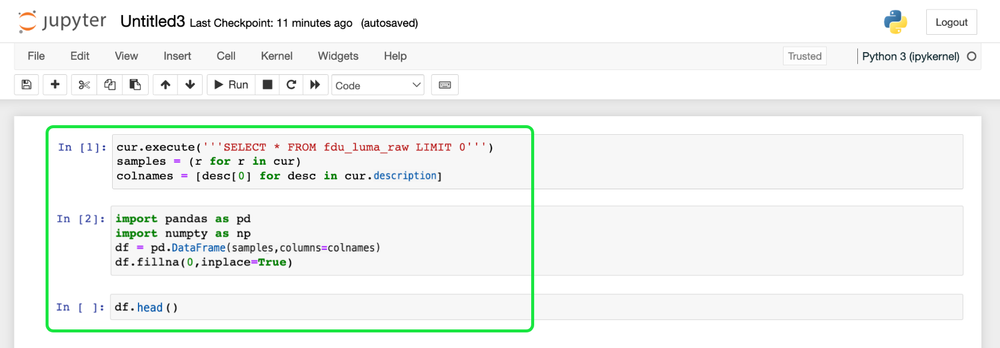
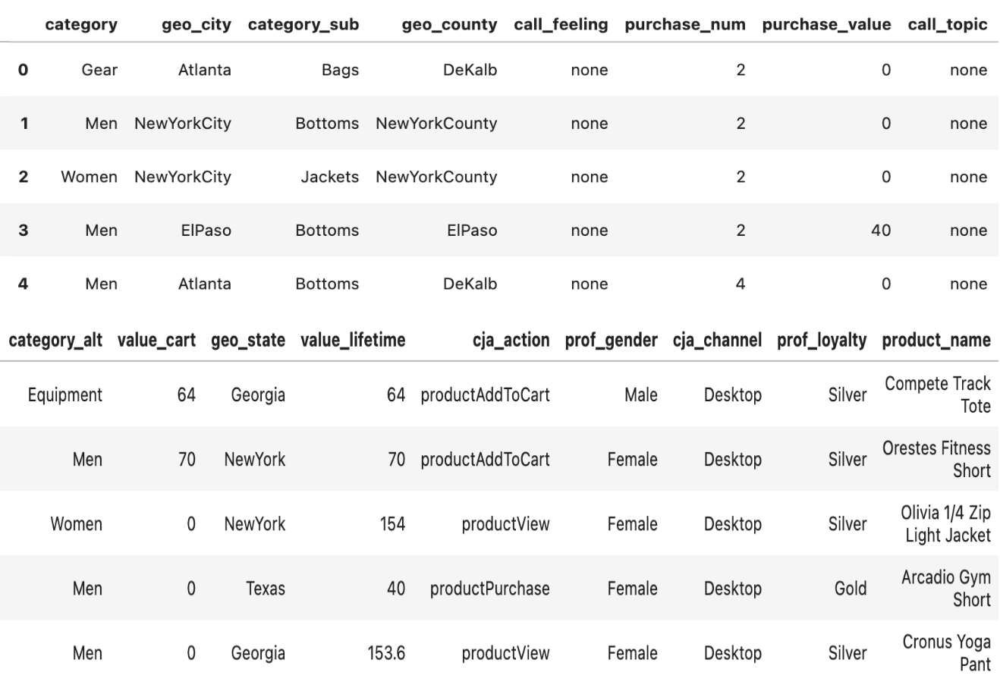

# Calculate propensity score with Query Service and machine learning

Query Service has access to large volumes of records stored on Adobe Experience Platform that can be leveraged using machine learning to generate propensity scores. This guide explains how to use Query Service to provide Platform data to train a machine learning model in a computational notebook. The model can then be used to predict a customers' propensity to purchase for each visit.

## Getting started

As part of this process requires you to train a machine learning model, this document assumes a working knowledge of one or more machine learning environments. 

This example uses [!DNL Jupyter Notebook] as a development environment. Although there are many options available, [!DNL Jupyter Notebook] is recommended because it is an open-source web application that has low computational requirements. It can be [downloaded from the official site](https://jupyter.org/). 

If you have not already done so, follow the steps to [connect [!DNL Jupyter Notebook] with Adobe Experience Platform Query Service](../clients/jupyter-notebook.md) before continuing with this guide.

The libraries used in this example include:

```JSON
python=3.6.7
psycopg2
sklearn
pandas
matplotlib
numpy
tqdm
```

## Import analytics tables from Platform into Jupyter Notebook {#import-analytics-tables}

To generate a propensity score model, analytics data stored in Platform must be imported into Jupyter Notebook. From a Python 3 Jupyter Notebook connected to Query Service, the following commands imports a customer behavior dataset from Luma, a fictitious clothing store. As Platform data is stored using the Experience Data Model (XDM)format, a sample JSON object must be generated that conforms to the schema's structure. See the documentation for instructions on how to [generate the sample JSON object](../../xdm/ui/sample.md).



The output displays a tabluarized view of all columns from Luma's behavioral dataset within the Jupyter Notebook dashboard.



### Prepare the data for machine learning

A target column must be identified to train a machine learning model. As propensity to buy is the goal for this use case, the `cja_action` column is chosen as the target column from the Luma results. The value `productPurchase` is the indicator for a customer purchase. The `purchase_value` and `purchase_num` columns are also {PLACEHOLDER removed } as they are directly related to the product purchase action.

The commands to carry out these actions are as follows:

```python
#define the target label for prediction
df['target'] = (df['cja_action'] == 'productPurchase').astype(int)
#remove columns that are dependant to the label
df.drop(['cja_action','purchase_value'], axis=1,inplace=True)
```

Next, the data from the Luma dataset must be transformed into appropriate representations. Two steps are required: 

1. Transform the columns representing numbers into numeric columns. To do this explicitly convert the data type in the `dataframe`.
1. Transform categorical columns into numeric columns as well.

```python
#convert columns that represent numbers
num_cols = ['purchase_num', 'value_cart', 'value_lifetime'  
df[num_cols] = (df[num_cols].apply(pdto_numeric, errors='coerce')
```

A technique called One-hot encoding is used to convert the categorical data variables for use with machine and deep learning algorithms. This in turn improves predictions as well as the classification accuracy of a model. Use the `Sklearn` library to represent each categorical value in a separate column.


