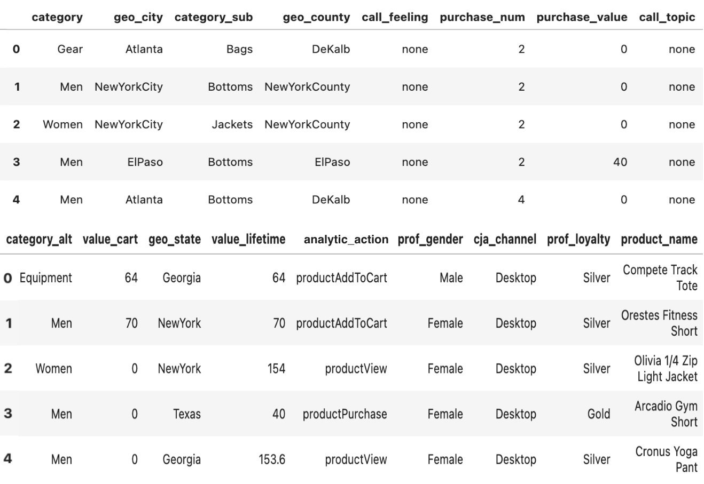

# Determine a propensity score using a machine-learning generated predictive model

Query Service has access to large volumes of records stored on Adobe Experience Platform that can be leveraged using machine learning to generate propensity scores. This guide explains how to use Query Service to provide Platform data to train a machine learning model in a computational notebook. The model can then be used to predict a customers' propensity to purchase for each visit.

## Getting started

As part of this process requires you to train a machine learning model, this document assumes a working knowledge of one or more machine learning environments. 

This example uses [!DNL Jupyter Notebook] as a development environment. Although there are many options available, [!DNL Jupyter Notebook] is recommended because it is an open-source web application that has low computational requirements. It can be [downloaded from the official site](https://jupyter.org/). 

If you have not already done so, follow the steps to [connect [!DNL Jupyter Notebook] with Adobe Experience Platform Query Service](../clients/jupyter-notebook.md) before continuing with this guide.

The libraries used in this example include:

```JSON
python=3.6.7
psycopg2
sklearn
pandas
matplotlib
numpy
tqdm
```

## Import analytics tables from Platform into Jupyter Notebook {#import-analytics-tables}

To generate a propensity score model, a projection of the analytics data stored in Platform must be imported into Jupyter Notebook. From a Python 3 Jupyter Notebook connected to Query Service, the following commands imports a customer behavior dataset from Luma, a fictitious clothing store. As Platform data is stored using the Experience Data Model (XDM)format, a sample JSON object must be generated that conforms to the schema's structure. See the documentation for instructions on how to [generate the sample JSON object](../../xdm/ui/sample.md).


The output displays a tabluarized view of all columns from Luma's behavioral dataset within the Jupyter Notebook dashboard.



### Prepare the data for machine learning

A target column must be identified to train a machine learning model. As propensity to buy is the goal for this use case, the `analytic_action` column is chosen as the target column from the Luma results. The value `productPurchase` is the indicator for a customer purchase. The `purchase_value` and `purchase_num` columns are also {PLACEHOLDER removed } as they are directly related to the product purchase action.

The commands to carry out these actions are as follows:

```python
#define the target label for prediction
df['target'] = (df['analytic_action'] == 'productPurchase').astype(int)
#remove columns that are dependant to the label
df.drop(['analytic_action','purchase_value'], axis=1,inplace=True)
```

Next, the data from the Luma dataset must be transformed into appropriate representations. Two steps are required: 

1. Transform the columns representing numbers into numeric columns. To do this explicitly convert the data type in the `dataframe`.
1. Transform categorical columns into numeric columns as well.

```python
#convert columns that represent numbers
num_cols = ['purchase_num', 'value_cart', 'value_lifetime'  
df[num_cols] = (df[num_cols].apply(pdto_numeric, errors='coerce')
```

A technique called One-hot encoding is used to convert the categorical data variables for use with machine and deep learning algorithms. This in turn improves predictions as well as the classification accuracy of a model. Use the `Sklearn` library to represent each categorical value in a separate column.

```python
from sklearn.preprocessing import OneHotEncoder

#get the categorical columns
cat_columns= list(set(df.columns) - set(num_cols + ['target']))

#get the dataframe with categorical columns only
df_cat = df.loc[:,cat_columns]

#initialize sklearn's One Hot Encoder
enc = OneHotEncoder(handle_unknown='ignore')

#fit the data into the encoder
enc.fit(df_cat)

#define one hot encoder's columns names
ohc_columns = [[c+'='+c_ for c_ in cat] for c, cat in zip(cat_columns, enc. categories_)]
ohc_columns = [item for sublist in ohc_columns for item in sublist]

#finalize the data input to the ML models
X = pd.DataFrame( np.concatenate((enc.transform(df_cat).toarray(),df[num_cols]),axis=1),
                  columns = ohc_columns + num_cols)

#define target column
y = df['target']
```

The data defined as X is tabularized and appears as below:


Now that the necessary data for machine learning is availalble, it can fit the preconfigured machine learning models in Python's `sklearn` library. [!DNL Logistics Regression] is used to train the propensity model and allows you to see the accuracy for test data. In this case it is approximately 85%.

The Logistic Regression algorithm and the train-test split method, used to estimate the performance of machine learning algorithms, are imported in the code block below:

```python
from sklearn. linear_model import LogisticRegression
from sklearn.model_selection import train_test_split

X_train, X_test, y_train, y_test = train_test_split(X, y, test_size=0.33, random_state=42)

clf LogisticRegression(max_iter=2000, random_state=0).fit(X_train, y_train)

print("Test data accuracy: {}".format(clf.score(X_test, y_test)))
```

The test data accuracy is: 0.8518518518518519.

Through the use of Logistics Regression, you can visualize the reasons for a purchase and sort the features that determine propensity by their ranked importance in descending orders. The first columns denote a higher causation that leads to the purchasing behavior. The latter columns indicate factors that do not lead to purchasing behavior.

The code to visualize the results as two bar charts is as follows:

```python
from matplotlib import pyplot as plt

#get feature importance as a sorted list of columns
feature_importance = np.argsort(-clf.coef_[0])
top_10_features_purchase_names = X.columns[feature_importance[:10]]
top_10_features_purchase_values = clf.coef_[0] [feature_importance[:10]]
top_10_features_not_purchase_names = X. columns[feature_importance[-10:]]
top_10_features_not_purchase_values = clf.coef_[0] [feature_importance[-10:]]

#plot the figures
fig, (ax1, ax2) = plt.subplots(1, 2, figsize=(10,5))

ax1.bar(np.arange(10),top_10_features_purchase_values)
ax1.set_xticks(np.arange(10))
axl.set_xticklabels(top_10_features_purchase_names,rotation = 90)
ax1.set_ylim([np.min(clf.coef_[0])-0.1,np.max(clf.coef_[0])+0.1])
ax1.set_title("Top 10 features to define \n a propensity to purchase")

ax2.bar(np.arange(10),top_10_features_not_purchase_values,color='#E15750')
ax2.set_xticks(np.arange(10))
ax2.set_xticklabels(top_10_features_not_purchase_names,rotation = 90)
ax2.set_ylim([np.min(clf.coef_[0])-0.1,np.max(clf.coef_[0])+0.1])
ax2.set_title("Top 10 features to define \n a propensity to NOT purchase")

plt.show()
```

A vertical bar chart visualization of results is seen below:


Several patterns can be discerened from the bar chart. The channels Point of sale (POS) and Call topics as reimbursement are the most important factors that decide a purchasing behavior. While the Call topics as complaints and invoices are important roles to define the not purchasing behavior. These are quantifiable, actionable insights that marketers can leverage to conduct marketing campaigns to address the propensity to purchase of these customers.

### Working on Sampled Data: Bootstrapping

In the case that data sizes are too large for your local machine to store the data for model training, you can take samples instead of the full data from Query Service. To know how much data is needed to sample from Query Service, you can apply a technique called bootstrapping. In this regard, bootstrapping means that the model is trained multiple times with various samples, and the variance of the model's accuracies among difference samples is inspected. To adjust the propensity model example given above, first encapsulate the whole machine learning workflow into a function. The code is as follows:

```python
def end_to_end_pipeline(df):
    
    #define the target label for prediction
    df['target'] = (df['analytic_action'] == 'product Purchase').astype(int)
    
    #remove columns that are dependent to the label
    df.drop(['analytic_action','purchase_value'],axis-1,inplace=True)
    
    num_cols = ['purchase_num','value_cart','value_lifetime']
    df[num_cols] = df[num_cols].apply(pd.to_numeric, errors='coerce')
    
    #get the categorical columns
    cat_columns = list(set(df.columns) - set(num_cols + ['target']))
    
    #get the data frame with categorical columns only
    df_cat = df.loc[:,cat_columns]
    
    #initialize sklearn's One Hot Encoder
    enc = OneHotEncoder(handle_unknown='ignore')
    
    #fit the data into the encoder
    enc.fit(df_cat)
    
    #define one hot encoder's columns names
    ohc_columns = [[c+'='+c_ for c_ in cat] for c,cat in zip(cat_columns, enc. categories_)]
    ohc_columns = [item for sublist in ohc_columns for item in sublist]
    
    #finalize the data input to the ML models
    X = pd.DataFrame( np.concatenate((enc.transform(df_cat).toarray(),df[num_cols]),axis=1),
                      columns = ohc_columns + num_cols)
    
    
    #define target column
    y = df['target']
    X_train, X_test, y_train, y_test= train_test_split(X, y, test_size=0.33, random_state=42)
    
    clf = LogisticRegression(max_iter=2000,random_state=0).fit(X_train, y_train)
    
    return clf.score (X_test, y_test)
```

This function can then be run multiple times in a loop, for example 10 times. The difference to the previous code is that the sample now is not taken from the whole table but only a sample of rows. For example, the sample code below only takes 1000 rows. The accuracies for each iteration can be stored. 

```python
from tqdm import tqdm

bootstrap_accuracy = []
for i in tqdm (range (100)):

    #sample data from QS
    cur.execute('''SELECT * FROM fdu_luma_raw ORDER BY random() LIMIT 1000''')
    samples = [r for r in cur]
    colnames = [desc[0] for desc in cur.description]
    df_samples = pd.DataFrame(samples,columns=colnames)
    df_samples.fillna(0,inplace=True)
    
    #train the propensity model with sampled data and output its accuracy
    bootstrap_accuracy.append(end_to_end_pipeline(df_samples))

bootstrap_accuracy = np.sort (bootstrap_accuracy)
```

The bootstrapped model's accuracies are then sorted. After which, the 10th and 90th quantile of the model's accuracies become a 95% Confidence Interval for the model's accuracies with the given sample size.


The above figure states that if you only take 1000 rows to train your models, you can expect the accuracies to fall between approximately 84% and 88%. You can adjust the LIMIT clause in Query Service queries based on your needs to ensure the performance of the models.

