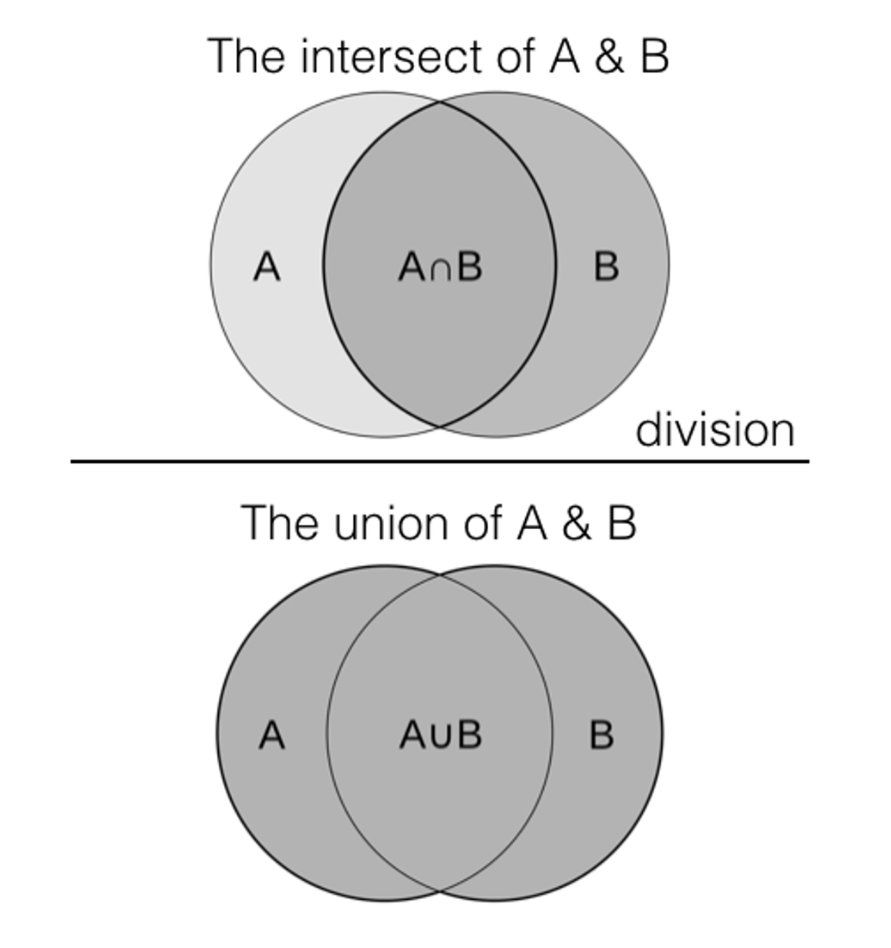

# Retrieve similar records with higher-order functions

Use Data Distiller higher-order functions to solve a variety of common use cases. To identify and retrieve similar or related records from one or more datasets, use the filter, transform, and reduce functions as detailed in this guide. To learn how higher-order functions can be used to process complex data types, see the documentation on how to [manage array and map data types](../sql/higher-order-functions.md).

Use this guide to identify products from different datasets that have a significant similarity in their characteristics or attributes. This methodology provides solutions to: data deduplication, record linkage, recommendation systems, information retrieval, and text analytics, among others.

The document describes the process of implementing a similarity join, which then uses Data Distiller higher-order functions to compute the similarity between sets of data and filter them based on selected attributes. SQL code snippets and explanations are provided for each step of the process. The workflow implements similarity joins using the Jaccard similarity measure and tokenization using Data Distiller higher-order functions. These methods are then used to identify and retrieve similar or related records from one or more datasets based on a similarity metric. The key sections of the process include: [tokenization using higher-order functions](#data-transformation), the [cross-join of unique elements](#cross-join-unique-elements), the [Jaccard similarity calculation](#compute-the-jaccard-similarity-measure), and the [threshold-based filtering](#similarity-threshold-filter).

## Prerequisites

Before continuing with this document, you should be familiar with the following concepts:

- A **similarity join** is an operation that identifies and retrieves pairs of records from one or more tables based on a measure of similarity between the records. The key requirements for a similarity join are as follows:
    - **Similarity metric**: A similarity join relies on a predefined similarity metric or measure. Such metrics include: the Jaccard similarity, cosine similarity, edit distance, and so on. The metric depends on the nature of the data and the use case. This metric quantifies how similar or dissimilar two records are.
    - **Threshold**: A similarity threshold is used to determine when the two records are considered similar enough to be included in the join result. Records with a similarity score above the threshold are considered matches.
- The **Jaccard similarity** index, or the Jaccard similarity measurement, is a statistic used to gauge the similarity and diversity of sample sets. It is defined as the size of the intersection divided by the size of the union of the sample sets. The Jaccard similarity measurement ranges from zero to one. A Jaccard similarity of zero indicates no similarity between the sets, and a Jaccard similarity of one indicates that the sets are identical.

- **Higher-order functions** in Data Distiller are dynamic, inline tools that process and transform data directly within SQL statements. These versatile functions eliminate the need for multiple steps in data manipulation, especially when [dealing with complex types like arrays and maps](../sql/higher-order-functions.md). By enhancing query efficiency and simplifying transformations, higher-order functions contribute to more agile analytics and better decision-making in various business scenarios.

## Getting started

The Data Distiller SKU is required to perform the higher-order functions on your Adobe Experience Platform data. If you do not have the Data Distiller SKU, contact your Adobe customer service representative for more information.

## Establish similarity {#establish-similarity}

This use case requires a similarity measure between text strings that can be used later to establish a threshold for filtering. In this example, the products in Set A and Set B represent the words in two documents.  

The Jaccard similarity measure can be applied to a wide range of data types, including text data, categorical data, and binary data. It is also suitable for real-time or batch processing as it can be computationally efficient to calculate for large datasets.

Product Set A and Set B contain the test data for this workflow.

- Product Set A: `{iPhone, iPad, iWatch, iPad Mini}`
- Product Set B: `{iPhone, iPad, Macbook Pro}`

To calculate the Jaccard similarity between product sets A and B, first find the **intersection** (common elements) of the product sets. In this case, `{iPhone, iPad}`. Next, find the **union** (all unique elements) of both product sets. In this example, `{iPhone, iPad, iWatch, iPad Mini, Macbook Pro}`.

Finally, use the Jaccard similarity formula: `J(A,B) = A∪B / A∩B` to calculate the similarity. 

J = Jaccard distance
A = set 1
B = set 2

The Jaccard similarity between product sets A and B is 0.4. This indicates a moderate degree of similarity between the words used in the two documents. This similarity between the two sets defines the columns in the similarity join. These columns represent pieces of information, or characteristics associated with the data, that are stored in a table and used for performing the similarity computations. 

### Pairwise Jaccard Computation with String Similarity {#pairwise-similarity}

To more accurately compare the similarities between strings, the pairwise similarity must be computed. Pairwise similarity splits highly dimensional objects into smaller dimensional objects for comparison and analysis. To do this, a string of text is broken into smaller parts or units (tokens). They could be individual letters, groups of letters (like syllables), or entire words. The similarity is calculated for each pair of tokens between each element in Set A with each element in Set B. This tokenization provides a foundation for analytical and computational comparisons, relationships, and insights to be drawn from the data.

For the pairwise similarity calculation, this example uses character bi-grams (two character tokens) to compare a similarity match between the text strings of the products in Set A and Set B. A bi-gram is a consecutive sequence of two items or elements in a given sequence or text. You can generalize this to n-grams. 

This example assumes that the case does not matter and that spaces should not be accounted for. According to these criteria, Set A and Set B have the following bi-grams:

Product Set A bi-grams:

- iPhone (5): "ip", "ph", "ho", "on", "ne"
- iPad (3): "ip", "pa", "ad"
- iWatch (5): "iw", "wa", "at", "tc", "ch"
- iPad Mini (7): "ip", "pa", "ad", "dm", "mi", "in", "ni"

Product Set B bi-grams:

- iPhone (5): "ip", "ph", "ho", "on", "ne"
- iPad (3): "ip", "pa", "ad"
- Macbook Pro (9): "Ma", "ac", "cb", "bo", "oo", "ok", "kp", "pr", "ro"

Next, calculate the Jaccard similarity coefficient for each pair:

|                   | iPhone (Set B)                               | iPad (Set B)                                | Macbook Pro (Set B)                       |
|-------------------|----------------------------------------------|---------------------------------------------|-------------------------------------------|
| iPhone (Set A)    | (Intersection: 5, Union: 5) = 5 / 5 = 1      | (Intersection: 1, Union: 7) =1 / 7 ≈ 0.14   | (Intersection: 0, Union: 14) = 0 / 14 = 0 |
| iPad (Set A)      | (Intersection: 1, Union: 7) = 1 / 7 ≈ 0.14   | (Intersection: 3, Union: 3) = 3 / 3 = 1     | (Intersection: 0, Union: 12) = 0 / 12 = 0 |
| iWatch (Set A)    | (Intersection: 0, Union: 8) = 0 / 8 = 0      | (Intersection: 0, Union: 8) = 0 / 8 = 0     | (Intersection: 0, Union: 8) = 0 / 8 =0    |
| iPad Mini (Set A) | (Intersection: 1, Union: 11) = 1 / 11 ≈ 0.09 | (Intersection: 3, Union: 7) = 3 / 7 ≈ 0.43  | (Intersection: 0, Union: 16) = 0 / 16 = 0 |

{style="table-layout:auto"}

## Create the test data with SQL {#create-test-data}

To manually create a test table for the product sets, use the SQL CREATE TABLE statement.

```SQL {line-numbers="true"}
CREATE TABLE featurevector1 AS SELECT *
FROM (
    SELECT 'iPad' AS ProductName
    UNION ALL
    SELECT 'iPhone'
    UNION ALL
    SELECT 'iWatch'
     UNION ALL
    SELECT 'iPad Mini'
);
SELECT * FROM featurevector1;
```

The following descriptions provide a breakdown of the SQL code block above:

- Line 1: `CREATE TEMP TABLE featurevector1 AS`: This statement creates a temporary table named `featurevector1`. Temporary tables are typically only accessible within the current session and are automatically dropped at the end of the session.
- Line 1 and 2: `SELECT * FROM (...)`: This part of the code is a subquery used to generate the data that is inserted into the `featurevector1` table.
Inside the subquery, multiple `SELECT` statements are combined using the `UNION ALL` command. Each `SELECT` statement generates one row of data with the specified values for the `ProductName` column.
- Line 3: `SELECT 'iPad' AS ProductName`: This generates a row with the value `iPad` in the `ProductName` column.
- Line 5: `SELECT 'iPhone'`: This generates a row with the value `iPhone` in the `ProductName` column.

The SQL statement creates a table as seen below:

|   | `ProductName` |
|---|---------------|
| 1 | iPad          |
| 2 |iPhone         |
| 3 | iWatch        |
| 4 |iPad Mini      |

{style="table-layout:auto"}

To create the second feature vector, use the following SQL statement:

```SQL
CREATE TABLE featurevector2 AS SELECT *
FROM (
    SELECT 'iPad' AS ProductName
    UNION ALL
    SELECT 'iPhone'
    UNION ALL
    SELECT 'Macbook Pro'
);
SELECT * FROM featurevector2;
```

## Data transformations {#data-transformation}

In this example, several actions must be performed to accurately compare the sets. First, any whitespaces are removed from the feature vectors as it is assumed that they do not contribute to the similarity measure. Then, any duplicates present in the feature vector are removed as they waste computational processing. Next, tokens of two characters (bi-grams) are extracted from the feature vectors. In this example, they are assumed to be overlapping. 

>[!NOTE]
>
>For illustration purposes, the processed columns are added next to the feature vector for each of the steps. 

The following sections illustrate the prerequisite data transformations like deduplication, whitespace removal, and lowercase conversion before starting the process of tokenization.

### Deduplication {#deduplication}

Next, use the `DISTINCT` clause to remove duplicates. There are no duplicates in this example, however it is an important step to improve the accuracy of any comparison. The necessary SQL is displayed below:

```SQL
SELECT DISTINCT(ProductName) AS featurevector1_distinct FROM featurevector1
SELECT DISTINCT(ProductName) AS featurevector2_distinct FROM featurevector2
```

### Whitespace removal {#whitespace-removal}

In the following SQL statement, the whitespaces are removed from the feature vectors. The `replace(ProductName, ' ', '') AS featurevector1_nospaces` part of the query takes the `ProductName` column from the `featurevector1` table and uses the `replace()` function. The `REPLACE` function replaces all occurrences of a space (' ') with an empty string (''). This effectively removes all spaces from the `ProductName` values. The result is aliased as `featurevector1_nospaces`.

```SQL
SELECT DISTINCT(ProductName) AS featurevector1_distinct, replace(ProductName, ' ', '') AS featurevector1_nospaces FROM featurevector1
```

The results are shown in the table below:

|   | featurevector1_distinct  | featurevector1_nospaces |
|---|---|---|
| 1 | iPad Mini  | iPadMini |
| 2 | iPad  | iPad |
| 3 | iWatch  | iWatch |
| 4 | iPhone  | iPhone |

{style="table-layout:auto"}

The SQL statement and its results on the second feature vector are seen below:

+++Select to expand

```SQL
SELECT DISTINCT(ProductName) AS featurevector2_distinct, replace(ProductName, ' ', '') AS featurevector2_nospaces FROM featurevector2
```

The results appear as below:

|   | featurevector2_distinct  | featurevector2_nospaces |
|---|---|---|
| 1 | iPad  | iPad |
| 2 | Macbook Pro  | MacbookPro |
| 3 | iPhone  | iPhone |

{style="table-layout:auto"}

+++

### Convert to lowercase {#lowercase-conversion}

Next, the SQL is improved to convert the product names to lowercase and remove any whitespaces. The lower function (`lower(...)`) is applied to the result of the `replace()` function. The lower function converts all characters in the modified `ProductName` values to lowercase. This ensures that the values are in lowercase regardless of their original case.

```SQL
SELECT DISTINCT(ProductName) AS featurevector1_distinct, lower(replace(ProductName, ' ', '')) AS featurevector1_transform FROM featurevector1;
```

The result of this statement is:

|   | featurevector1_distinct  | featurevector1_transform |
|---|---|---|
| 1 | iPad Mini  | ipadmini |
| 2 | iPad  | iPad |
| 3 | iWatch  | iWatch |
| 4 | iPhone  | iPhone |

{style="table-layout:auto"}

The SQL statement and its results on the second feature vector are seen below:

+++Select to expand

```SQL
SELECT DISTINCT(ProductName) AS featurevector2_distinct, lower(replace(ProductName, ' ', '')) AS featurevector2_transform FROM featurevector2
```

The results appear as below:

|   | featurevector2_distinct  | featurevector2_transform |
|---|---|---|
| 1 | iPad  | ipad |
| 2 | Macbook Pro  | macbookpro |
| 3 | iPhone  | iphone |

{style="table-layout:auto"}

+++

### Extract tokens using SQL {#tokenization}

The next step is tokenization, or text splitting. Tokenization is the process of taking text and breaking it into individual terms. Typically this involves splitting sentences into words. In this example, strings are broken down into bi-grams (and higher-order n-grams) by extracting tokens using SQL functions like `regexp_extract_all`. Overlapping bi-grams must be generated for effective tokenization.

The SQL is further improved to use `regexp_extract_all`. `regexp_extract_all(lower(replace(ProductName, ' ', '')), '.{2}', 0) AS tokens:` This part of the query further processes the modified `ProductName` values created in the previous step. It uses the `regexp_extract_all()` function to extract all non-overlapping substrings of one to two characters from the modified and lowercase `ProductName` values. The `.{2}` regular expression pattern matches substrings of two characters in length. The `regexp_extract_all(..., '.{2}', 0)` part of the function then extracts all matching substrings from the input text.

```SQL
SELECT DISTINCT(ProductName) AS featurevector1_distinct, lower(replace(ProductName, ' ', '')) AS featurevector1_transform, 
regexp_extract_all(lower(replace(ProductName, ' ', '')) , '.{2}', 0) AS tokens
FROM featurevector1;
```

The results are shown in the table below:

+++Select to expand

|   | featurevector1_distinct  | featurevector1_transform | tokens     |
|---|--------------------------|--------------|------------------------|
| 1 | iPad Mini                | ipadmini     | {"ip","ad","mi","ni"}  |
| 2 | iPad                     | iPad         | {"ip","ad"}            |
| 3 | iWatch                   | iWatch       | {"iw","at", "ch"}      |
| 4 | iPhone                   | iPhone       | {"ip","ho","ne"}       |

{style="table-layout:auto"}

+++

To further improve accuracy, the SQL must be used to create overlapping tokens. For example, the "iPad" string above is missing the "pa" token. To fix this, shift the lookahead operator (using `substring`) by one step and generate the bi-grams.

Similar to the previous step, `regexp_extract_all(lower(replace(substring(ProductName, 2), ' ', '')), '.{2}', 0):` extracts two-character sequences from the modified product name, but starts from the second character using the `substring` method to create overlapping tokens. Next, in lines 3-7 (`array_union(...) AS tokens`), the `array_union()` function combines the arrays of two-character sequences obtained by the two regular expression extractions. This ensures that the result contains unique tokens from both non-overlapping and overlapping sequences.

```SQL {line-numbers="true"}
SELECT DISTINCT(ProductName) AS featurevector1_distinct, 
       lower(replace(ProductName, ' ', '')) AS featurevector1_transform, 
       array_union(
           regexp_extract_all(lower(replace(ProductName, ' ', '')), '.{2}', 0),
           regexp_extract_all(lower(replace(substring(ProductName, 2), ' ', '')), '.{2}', 0)
       ) AS tokens
FROM featurevector1;
```

The results are shown in the table below:

+++Select to expand

|   | featurevector1_distinct  | featurevector1_transform | tokens     |
|---|--------------------------|--------------|------------------------|
| 1 | iPad Mini                | ipadmini     | {"ip","ad","mi","ni","pa","dm","in"}  |
| 2 | iPad                     | iPad         | {"ip","ad","pa"}            |
| 3 | iWatch                   | iWatch       | {"iw","at","ch","wa","tc"}  |
| 4 | iPhone                   | iPhone       | {"ip","ho","ne","ph","on"}  |

{style="table-layout:auto"}

+++

However, the use of `substring` as a solution to the problem has limitations. If you were to make tokens from the text based on tri-grams (three characters), it would require the use of two `substrings` to lookahead twice to get the required shifts. To make 10-grams, you would need nine `substring` expressions. This would make the code bloat and it becomes untenable. The use of plain regular expressions is unsuitable. A new approach is needed. 

### Adjust for the length of product name {#length-adjustment}

The SQl can be improved with the sequence and length functions. In the following example, `sequence(1, length(lower(replace(ProductName, ' ', ''))) - 3)` generates a sequence of numbers from one to the length of the modified product name minus three. For example, if the modified product name is "ipadmini" with a character length of eight, it generates numbers from one to five (eight-three).

The statement below extracts unique product names and then breaks down each name into sequences of characters (tokens) of four character lengths, excluding spaces, and presenting them as two columns. One column shows the unique product names and the other column shows their generated tokens.

```SQL
SELECT
   DISTINCT(ProductName) AS featurevector1_distinct,
  transform(
    sequence(1, length(lower(replace(ProductName, ' ', ''))) - 3),
    i -> substring(lower(replace(ProductName, ' ', '')), i, 4)
  ) AS tokens
FROM
  featurevector1;
```

The results are shown in the table below:

+++Select to expand

|   | featurevector1_distinct  | tokens                 |
|---|--------------------------|------------------------|
| 1 | iPad Mini                | {"ipad","padm","admi","dmin","mini"}  |
| 2 | iPad                     | {"ipad"}            |
| 3 | iWatch                   | {"iwat","watc","atch"}  |
| 4 | iPhone                   | {"ipho","phon","hone"}  |

{style="table-layout:auto"}

+++

### Ensure set token length {#ensure-set-token-length}

Additional conditions can be added to the statement to ensure that the generated sequences are of a specific length. The following SQL statement expands on the token generation logic by making the `transform` function is more complex. The statement uses the `filter` function within `transform` to ensure that the generated sequences are of six character length. It handles the cases where that is not possible by assigning NULL values to those positions.

```SQL
SELECT
  DISTINCT(ProductName) AS featurevector1_distinct,
  transform(
    filter(
      sequence(1, length(lower(replace(ProductName, ' ', ''))) - 5),
      i -> i + 5 <= length(lower(replace(ProductName, ' ', '')))
    ),
    i -> CASE WHEN length(substring(lower(replace(ProductName, ' ', '')), i, 6)) = 6
               THEN substring(lower(replace(ProductName, ' ', '')), i, 6)
               ELSE NULL
          END
  ) AS tokens
FROM
  featurevector1;
```

The results are shown in the table below:

+++Select to expand

|   | featurevector1_distinct  | tokens                 |
|---|--------------------------|------------------------|
| 1 | iPad Mini                | {"ipadmi","padmin","admini"}  |
| 2 | iPad                     | {null}      |
| 3 | iWatch                   | {"iwatch"}  |
| 4 | iPhone                   | {"iphone"}  |

{style="table-layout:auto"}

+++

## Explore solutions using Data Distiller higher-order functions {#higher-order-function-solutions}

Higher-order functions are powerful constructs that allow you to implement "programming" like syntax in Data Distiller. They can be used to iterate a function over multiple values in an array.

In the context of Data Distiller, higher-order functions are ideal for creating n-grams and iterating over sequences of characters.

The `reduce` function, especially when used within sequences generated by `transform`, provides a way to derive cumulative values or aggregates, which can be pivotal in various analytical and planning processes.

For example, in the SQl statement below, the `reduce()` function aggregates elements in an array using a custom aggregator. It simulates a for loop to **create the cumulative sums of all the integers** from one to five. `1, 1+2, 1+2+3, 1+2+3+4, 1+2+3+4`.

```SQL {line-numbers="true"}
SELECT transform(
    sequence(1, 5), 
    x -> reduce(
        sequence(1, x),  
        0,  -- Initial accumulator value
        (acc, y) -> acc + y  -- Higher-order function to add numbers
    )
) AS sum_result;
```

The following is an analysis of the SQL statement:

- Line 1: `transform` applies the function `x -> reduce` on each element generated in the sequence.
- Line 2: `sequence(1, 5)` generates a sequence of numbers from one to five.
- Line 3: `x -> reduce(sequence(1, x), 0, (acc, y) -> acc + y)` performs a reduction operation for each element x in the sequence (from 1 to 5).
    - The `reduce` function takes an initial accumulator value of 0, a sequence from one to the current value of `x`, and a higher-order function `(acc, y) -> acc + y` to add the numbers.
    - The higher-order function `acc + y` accumulates the sum by adding the current value `y` to the accumulator `acc`.
- Line 8: `AS sum_result` renames the resulting column as sum_result.

To summarize, this higher-order function takes two parameters (`acc` and `y`) and defines the operation to perform, which in this case is adding `y` to the accumulator `acc`. This higher-order function is executed for each element in the sequence during the reduction process.

The output of this statement is a single column (`sum_result`) that contains the cumulative sums of numbers from one to five.

### The value of higher-order functions {#value-of-higher-order-functions}

This section analyses a slimmed-down version of a tri-gram SQL statement to better understand the value of higher-order functions in Data Distiller to create n-grams more efficiently.

The statement below operates on the `ProductName` column within the `featurevector1` table. It produces a set of three-character substrings derived from the modified product names within the table, using positions obtained from the sequence generated.

```SQL {line-numbers="true"}
SELECT
  transform(
    sequence(1, length(lower(replace(ProductName, ' ', ''))) - 2),
    i -> substring(lower(replace(ProductName, ' ', '')), i, 3)
  ) 
FROM
  featurevector1
```

The following is an analysis of the SQL statement:

- Line 2: `transform` applies a higher-order function to each integer in the sequence.
- Line 3: `sequence(1, length(lower(replace(ProductName, ' ', ''))) - 2)` generates a sequence of integers from `1` to the length of the modified product name minus two. 
    - `length(lower(replace(ProductName, ' ', '')))` calculates the length of the `ProductName` after making it lowercase and removing spaces.
    - `- 2` subtracts two from the length to ensure that the sequence generates valid starting positions for 3-character substrings. Subtracting 2 ensures that you have enough characters following each starting position to extract a 3-character substring. The substring function here operates like a lookahead operator.
- Line 4: `i -> substring(lower(replace(ProductName, ' ', '')), i, 3)` is a higher-order function that operates on each integer `i` in the generated sequence.
    - The `substring(...)` function extracts a 3-character substring from the `ProductName` column.
    - Before extracting the substring, `lower(replace(ProductName, ' ', ''))` converts the `ProductName` to lowercase and removes spaces to ensure consistency.

The output is a list of substrings of three characters in length, extracted from the modified product names, based on the positions specified in the sequence.

## Filter the results {#filter-results}

The `filter` function, with subsequent [data transformations](#data-transformation), allows for a more refined and precise extraction of relevant information from text data. This enables you to derive insights, improve data quality, and facilitate better decision-making processes.

The `filter` function in the following SQL statement serves to refine and limit the sequence of positions within the string from which substrings are extracted using the subsequent transform function.

```SQL
SELECT
  transform(
    filter(
      sequence(1, length(lower(replace(ProductName, ' ', ''))) - 6),
      i -> i + 6 <= length(lower(replace(ProductName, ' ', '')))
    ),
    i -> CASE WHEN length(substring(lower(replace(ProductName, ' ', '')), i, 7)) = 7
               THEN substring(lower(replace(ProductName, ' ', '')), i, 7)
               ELSE NULL
          END
  )
FROM
  featurevector1;
```

The `filter` function generates a sequence of valid starting positions within the modified `ProductName` and extracts substrings of a specific length. Only starting positions that allow for the extraction of a seven-character substring are allowed. 

The condition `i -> i + 6 <= length(lower(replace(ProductName, ' ', '')))` ensures that the starting position `i` plus `6` (the length of the desired seven-character substring minus one) does not exceed the length of the modified `ProductName`.

The `CASE` statement is used to conditionally include or exclude substrings based on their length. Only seven-character substrings are included; others are replaced with NULL. These substrings are then used by the `transform` function to create a sequence of substrings from the `ProductName` column in the `featurevector1` table.

>[!TIP]
>
>You can use the [parameterized templates](../ui/parameterized-queries.md) feature to reuse and abstract logic within your queries. For example, when you build general-purpose utility functions (such as the one displayed above for tokenizing strings), you can use Data Distiller parameterized templates where the number of characters would be a parameter.

## Compute the cross-join of unique elements across two feature vectors {#cross-join-unique-elements}

Identifying the differences or discrepancies between the two datasets based on a specific transformation of the data is a common process to maintain data accuracy, improve data quality, and to ensure consistency across datasets. 

This SQL statement below extracts the unique product names that are present in `featurevector2` but not in `featurevector1` after applying the transformations.

```SQL
SELECT lower(replace(ProductName, ' ', '')) FROM featurevector2
EXCEPT
SELECT lower(replace(ProductName, ' ', '')) FROM featurevector1;
```

>[!TIP]
>
>In addition to `EXCEPT`, you could also use `UNION` and `INTERSECT` depending on your use case. Also, you can experiment with `ALL` or `DISTINCT` clauses to see the difference between including all values and returning only the unique values for the specified columns.

The results are shown in the table below:

+++Select to expand

|   | lower(replace(ProductName, ' ', ''))  |
|---|---------------------------------------|
| 1 | macbookpro                            |

{style="table-layout:auto"}

+++

Next, perform a cross join to combine elements from the two feature vectors to create pairs of elements for comparison. The first step in this process is to create a tokenized vector.

A tokenized vector is a structured representation of text data where each word, phrase, or unit of meaning (token) is converted into a numerical format. This conversion allows natural language processing algorithms to understand and analyze textual information.

The SQl below creates a tokenized vector.

```SQL
CREATE TABLE featurevector1tokenized AS SELECT
  DISTINCT(ProductName) AS featurevector1_distinct,
  transform(
    filter(
      sequence(1, length(lower(replace(ProductName, ' ', ''))) - 1),
      i -> i + 1 <= length(lower(replace(ProductName, ' ', '')))
    ),
    i -> CASE WHEN length(substring(lower(replace(ProductName, ' ', '')), i, 2)) = 2
               THEN substring(lower(replace(ProductName, ' ', '')), i, 2)
               ELSE NULL
          END
  ) AS tokens
FROM
  (SELECT lower(replace(ProductName, ' ', '')) AS ProductName FROM featurevector1);
SELECT * FROM featurevector1tokenized;
```

>[!NOTE]
>
>If you are using [!DNL DbVisualizer], after you create or delete a table, refresh the database connection so that the table's metadata cache is refreshed. Data Distiller does not push out metadata updates.

The results are shown in the table below:

+++Select to expand

|   | featurevector1_distinct  | tokens                 |
|---|--------------------------|------------------------|
| 1 | ipadmini                | {"ip","pa","ad","dm","mi","in","ni"}   |
| 2 | ipad                     | {"ip","pa","ad"}      |
| 3 | iwatch                   | {"iw","wa","at","tc","ch"}  |
| 4 | iphone                   | {"ip","ph","ho","on","ne"}  |

{style="table-layout:auto"}

+++

Then repeat the process for `featurevector2`:

```SQL
CREATE TABLE featurevector2tokenized AS 
SELECT
  DISTINCT(ProductName) AS featurevector2_distinct,
  transform(
    filter(
      sequence(1, length(lower(replace(ProductName, ' ', ''))) - 1),
      i -> i + 1 <= length(lower(replace(ProductName, ' ', '')))
    ),
    i -> CASE WHEN length(substring(lower(replace(ProductName, ' ', '')), i, 2)) = 2
               THEN substring(lower(replace(ProductName, ' ', '')), i, 2)
               ELSE NULL
          END
  ) AS tokens
FROM
(SELECT lower(replace(ProductName, ' ', '')) AS ProductName FROM featurevector2
);
SELECT * FROM featurevector2tokenized;
```

The results are shown in the table below:

+++Select to expand

|   | featurevector2_distinct  | tokens                 |
|---|--------------------------|------------------------|
| 1 | ipadmini                 | {"ip","pa","ad"}   |
| 2 | macbookpro               | {"ma","ac","cb","bo","oo","ok","kp","pr","ro"}  |
| 3 | iphone                   | {"ip","ph","ho","on","ne"}  |

{style="table-layout:auto"}

+++

With both tokenized vectors complete, you can now create the cross join. This is seen in the SQL below:

```SQL {line-numbers="true"}
SELECT
    A.featurevector1_distinct AS SetA_ProductNames,
    B.featurevector2_distinct AS SetB_ProductNames,
    A.tokens AS SetA_tokens1,
    B.tokens AS SetB_tokens2
FROM
    featurevector1tokenized A
CROSS JOIN
    featurevector2tokenized B;
```

The following is a summary of the SQl used to create the cross join:

- Line 2: `A.featurevector1_distinct AS SetA_ProductNames` selects the `featurevector1_distinct` column from the table `A` and assigns it an alias `SetA_ProductNames`. This section of SQL results in a list of distinct product names from the first dataset.
- Line 4: `A.tokens AS SetA_tokens1` selects the `tokens` column from the table or subquery `A` and assigns it an alias `SetA_tokens1`. This section of SQL results in a list of tokenized values associated with the product names from the first dataset.
- Line 8: The `CROSS JOIN` operation combines all possible combinations of rows from the two datasets. In other words, it pairs each product name and its associated tokens from the first table (`A`) with each product name and its associated tokens from the second table (`B`). This results in a Cartesian product of the two datasets, where each row in the output represents a combination of a product name and its associated tokens from both datasets.

The results are shown in the table below:

+++Select to expand

| *  | SetA_ProductNames  | SetB_ProductNames | SetA_tokens 1 | SetB_tokens 2 |
|---|---------------------|-------------------|---|---|
| 1 | ipadmini            | ipad              | {"ip","pa","ad","dm","mi","in","ni"}  | {"ip","pa","ad"} |
| 2 | ipadmini            | macbookpro        | {"ip","pa","ad","dm","mi","in","ni"}  | {"ma","ac","cb","bo","oo","ok","kp","pr","ro"}  |
| 3 | ipadmini            | iphone            | {"ip","pa","ad","dm","mi","in","ni"}  | {"ip","ph","ho","on","ne"}  |
| 4 | ipad                |  ipad             | {"ip","pa","ad"}  | {"ip","pa","ad"}   |
| 5 | ipad                | macbookpro        | {"ip","pa","ad"}  | {"ma","ac","cb","bo","oo","ok","kp","pr","ro"}  |
| 6 | ipad                | iphone            | {"ip","pa","ad"}  |  {"ip","ph","ho","on","ne"} |
| 7 | iwatch              | ipad              |  {"iw","wa","at","tc","ch"} |  {"ip","pa","ad"}   |
| 8 | iwatch              | macbookpro        |  {"iw","wa","at","tc","ch"} | {"ma","ac","cb","bo","oo","ok","kp","pr","ro"} |
| 9 | iwatch              | iphone            |  {"iw","wa","at","tc","ch"} | {"ip","ph","ho","on","ne"} |
| 10| iphone              | ipad              |  {"ip","ph","ho","on","ne"} | {"ip","pa","ad"} |
| 11| iphone              | macbookpro        |  {"ip","ph","ho","on","ne"} | {"ma","ac","cb","bo","oo","ok","kp","pr","ro"} |
| 12| iphone              |  iphone           |  {"ip","ph","ho","on","ne"} | {"ip","ph","ho","on","ne"} |

{style="table-layout:auto"}

+++

## Compute the Jaccard similarity measure {#compute-the-jaccard-similarity-measure}

Next, calculate use the Jaccard similarity coefficient to perform a similarity analysis between the two sets of product names by comparing their tokenized representations. The output of the SQL script below provides the following: product names from both sets, their tokenized representations, counts of common and total unique tokens, and the calculated Jaccard similarity coefficient for each pair of datasets.


```SQL {line-numbers="true"}
SELECT 
    SetA_ProductNames, 
    SetB_ProductNames, 
    SetA_tokens1,
    SetB_tokens2,
    size(array_intersect(SetA_tokens1, SetB_tokens2)) AS token_intersect_count,
    size(array_union(SetA_tokens1, SetB_tokens2)) AS token_union_count,
    ROUND(
        CAST(size(array_intersect(SetA_tokens1, SetB_tokens2)) AS DOUBLE) /    size(array_union(SetA_tokens1, SetB_tokens2)), 2) AS jaccard_similarity
FROM
    (SELECT
        A.featurevector1_distinct AS SetA_ProductNames,
        B.featurevector2_distinct AS SetB_ProductNames,
        A.tokens AS SetA_tokens1,
        B.tokens AS SetB_tokens2
    FROM
        featurevector1tokenized A
    CROSS JOIN
        featurevector2tokenized B
    );
```

The following is a summary of the SQL used to calculate the Jaccard similarity coefficient:

- Line 6: `size(array_intersect(SetA_tokens1, SetB_tokens2)) AS token_intersect_count` calculates the number of tokens that are common to both `SetA_tokens1` and `SetB_tokens2`. This calculation is achieved by computing the size of the intersection of the two arrays of tokens.
- Line 7: `size(array_union(SetA_tokens1, SetB_tokens2)) AS token_union_count` calculates the total number of unique tokens across both `SetA_tokens1` and `SetB_tokens2`. This line computes the size of the union of the two arrays of tokens.
- Line 8-10: `ROUND(CAST(size(array_intersect(SetA_tokens1, SetB_tokens2)) AS DOUBLE) / size(array_union(SetA_tokens1, SetB_tokens2)), 2) AS jaccard_similarity` calculates the Jaccard similarity between the token sets. These lines divide the size of the token intersection by the size of the token union and round the result to two decimal places. The result is a value between zero and one, where one indicates complete similarity.

The results are shown in the table below:

+++Select to expand

| *  | SetA_ProductNames  | SetB_ProductNames | SetA_tokens 1                         | SetB_tokens 2                                   | token_intersect_count | token_intersect_count | Jaccard similarity |
|---|---------------------|-------------------|---------------------------------------|-------------------------------------------------|----|----|----|
| 1 | ipadmini            | ipad              | {"ip","pa","ad","dm","mi","in","ni"}  | {"ip","pa","ad"}                                |  3  |  7  | 0.43   |
| 2 | ipadmini            | macbookpro        | {"ip","pa","ad","dm","mi","in","ni"}  | {"ma","ac","cb","bo","oo","ok","kp","pr","ro"}  | 0   | 16   | 0.0   |
| 3 | ipadmini            | iphone            | {"ip","pa","ad","dm","mi","in","ni"}  | {"ip","ph","ho","on","ne"}                      |  1  | 11   |  0.09  |
| 4 | ipad                |  ipad             | {"ip","pa","ad"}                      | {"ip","pa","ad"}                                |  3  | 3   |  1.0  |
| 5 | ipad                | macbookpro        | {"ip","pa","ad"}                      | {"ma","ac","cb","bo","oo","ok","kp","pr","ro"}  |  0  |  12  |  0.0  |
| 6 | ipad                | iphone            | {"ip","pa","ad"}                      |  {"ip","ph","ho","on","ne"}                     |  1  |  7  | 0.14   |
| 7 | iwatch              | ipad              |  {"iw","wa","at","tc","ch"}           |  {"ip","pa","ad"}                               |  0  | 8  |  0.0  |
| 8 | iwatch              | macbookpro        |  {"iw","wa","at","tc","ch"}           | {"ma","ac","cb","bo","oo","ok","kp","pr","ro"}  | 0   |  14  |  0.0  |
| 9 | iwatch              | iphone            |  {"iw","wa","at","tc","ch"}           | {"ip","ph","ho","on","ne"}                      |  0  |  10  |  0.0  |
| 10| iphone              | ipad              |  {"ip","ph","ho","on","ne"}           | {"ip","pa","ad"}                                |  1  |  7  |  0.14  |
| 11| iphone              | macbookpro        |  {"ip","ph","ho","on","ne"}           | {"ma","ac","cb","bo","oo","ok","kp","pr","ro"}  |  0  |  14  | 0.0   |
| 12| iphone              |  iphone           |  {"ip","ph","ho","on","ne"}           | {"ip","ph","ho","on","ne"}                      |  5  |  5  |  1.0  |

{style="table-layout:auto"}

+++

## Filter results based on Jaccard Similarity threshold {#similarity-threshold-filter}

Finally, filter the results based on a predefined threshold to select only those pairs that meet the similarity criteria. The SQL statement below filters the products with a Jaccard similarity coefficient of at least 0.4. This narrows down the results to pairs that exhibit a substantial degree of similarity.

```SQL
SELECT 
    SetA_ProductNames, 
    SetB_ProductNames
FROM 
(SELECT 
    SetA_ProductNames, 
    SetB_ProductNames, 
    SetA_tokens1,
    SetB_tokens2,
    size(array_intersect(SetA_tokens1, SetB_tokens2)) AS token_intersect_count,
    size(array_union(SetA_tokens1, SetB_tokens2)) AS token_union_count,
    ROUND(
        CAST(size(array_intersect(SetA_tokens1, SetB_tokens2)) AS DOUBLE) / size(array_union(SetA_tokens1, SetB_tokens2)),
        2
    ) AS jaccard_similarity
FROM
    (SELECT
        A.featurevector1_distinct AS SetA_ProductNames,
        B.featurevector2_distinct AS SetB_ProductNames,
        A.tokens AS SetA_tokens1,
        B.tokens AS SetB_tokens2
    FROM
        featurevector1tokenized A
    CROSS JOIN
        featurevector2tokenized B
    )
)
WHERE jaccard_similarity>=0.4
```

The results of this query give the columns for the similarity join, as seen below:

+++Select to expand

|   | SetA_ProductNames        | SetA_ProductNames      |
|---|--------------------------|------------------------|
| 1 | ipadmini                 | ipad                   |
| 2 | ipad                     | ipad                   |
| 3 | iphone                   | iphone                 |

{style="table-layout:auto"}

+++:

### Next steps {#next-steps}

By reading this document, you can now use this logic to highlight meaningful relationships or overlaps between disparate datasets. The ability to identify products from different datasets that have a significant similarity in their characteristics or attributes has numerous real-world applications. This logic could be used for scenarios such as:

- Product matching: to group or recommend similar products to customers. 
- Data cleansing: to improve data quality.
- Market basket analysis: to provide insights into customer behavior, preferences, and potential cross-selling opportunities. 

If you haven't already done so, you are recommended to read the [AI/ML feature pipeline overview](../data-distiller/ml-feature-pipelines/overview.md). Use that overview to learn how Data Distiller and your preferred machine learning can build custom data models that support your marketing use cases with Experience Platform data.
