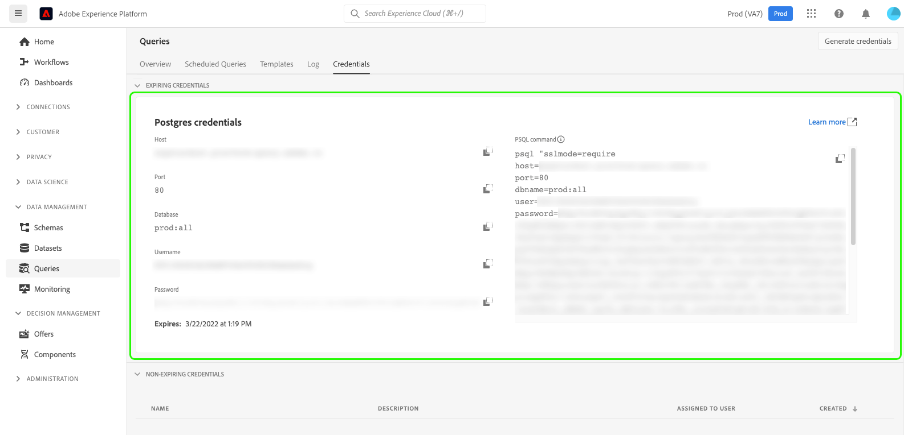

# Manage Platform data using [!DNL Python] and [!DNL SQLAlchemy] 

Learn how to use SQLAlchemy for greater flexibility in the management of your Adobe Experience Platform data. For those who are not as familiar with SQL, SQLAlchemy can greatly improve development time when working with relational databases. This document provides instructions and examples to connect [!DNL SQLAlchemy] to Query Service and begin using Python to interact with your databases.

[!DNL SQLAlchemy] is an Object Relational Mapper (ORM) and a [!DNL Python] code library that can transfer data stored in a SQL database into [!DNL Python] objects. You can then perform CRUD operations on data held within the Platform data lake using [!DNL Python] code. This removes the need to manage data using only PSQL.

## Getting started

To acquire the necessary credentials for connecting [!DNL SQLAlchemy] to Experience Platform, you must have access to the Queries workspace in the Platform UI. Please contact your organization administrator if you do not currently have access to the Queries workspace. 

## [!DNL Query Service] credentials {#credentials}

To find your credentials, log in to the Platform UI and select **[!UICONTROL Queries]** from the left navigation, followed by **[!UICONTROL Credentials]**. For complete directions on how to find your login credentials, please read the [credentials guide](../ui/credentials.md).



Although port 80 is the recommended port for a connection to Query Service, you can also use port 5432.

>[!IMPORTANT]
>
>If you use expiring credentials (as seen in the image above) to connect to Query Service, the session life for your connection will expire after the set period of time defined in your organization's settings. By default, this period is 24 hours. See the documentation to learn how to [connect a client with non-expiring credentials](../ui/credentials.md#non-expiring-credentials), or how to [change the session life for your expiring credentials](../ui/credentials.md#expiring-credentials). 

Once you have access to your QS credentials open your [!DNL Python] editor of choice.

### Store credentials in [!DNL Python] {#store-credentials}

In your [!DNL Python] editor, import the `urllib.parse.quote` library and save each credential variable as a parameter. The `urllib.parse` module provides a standard interface to break URL strings into components. The quote function replaces special characters in the URL string to make the data safe for use as URL components. An example of the required code is seen below:

>[!TIP]
>
>Use [!DNL Python]'s triple quotes to enter your multiple lines password string.

```python
from urllib.parse import quote

host = "<YOUR_HOST>"

port = "<YOUR_PORT>"

dbname = "<YOUR_DATABASE>"

user = "<YOUR_USERNAME>"

password = quote('''
<YOUR_PASSWORD>
''')
```

>[!NOTE]
>
>The password you provide to connect [!DNL SQLAlchemy] to Experience Platform will expire if you use expiring credentials. See the [credentials section](#credentials) for more information.

### Create an engine instance [#create-engine]

After the variables have been created, import the `create_engine` function and create a string to compile and format your Query Service credentials in SQLAlchemy. The `create_engine` function is then used to construct an engine instance. 

>[!NOTE]
>
>`create_engine`returns an instance of an engine. However, it does not open the connection to Query Service until a query is called that requires a connection.

SSL must be enabled when accessing Platform using third-party clients. As part of your engine, use the `connect_args` to enter additional keyword arguments. You are recommended to set your SSL mode to `require`. See the [SSL modes documentation](../clients/ssl-modes.md) for more information on accepted values. 

The example below displays the [!DNL Python] code necessary to initialize an engine and connection string.

```python
from sqlalchemy import create_engine

db_string = "postgresql://{user}:{password}@{host}:{port}/{dbname}".format(
    user=user,
    password=password,
    host=host,
    port = port,
    dbname = dbname
)

engine = create_engine(db_string, connect_args={'sslmode':'require'})
```

>[!NOTE]
>
>The password you provide to connect [!DNL SQLAlchemy] to Experience Platform will expire if you use expiring credentials. See the [credentials section](#credentials) for more information.

You are now ready to query Platform data using [!DNL Python]. The example shown below returns an array of Query Service table names.

```python
from sqlalchemy import inspect
insp = inspect(engine)
print(insp.get_table_names())
```

<!-- do we need to include: 
Now that we have created an engine, you can open a connection to the database to perform CRUD operations using [!DNL Python] instead of SQL. Use the `connect` method on the engine, to open the connection.

```python
connection = engine.connect()
```
 -->


