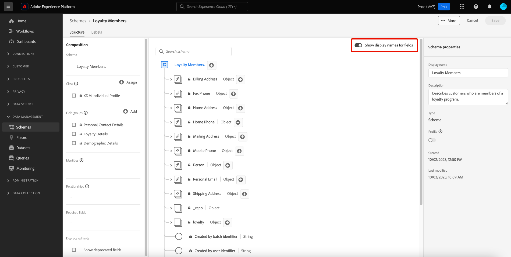

# Adobe Experience Platform release notes 

>[!IMPORTANT]
>
>Starting May 15th, 2023, the `Existing` status will be deprecated from the segment membership map in order to remove redundancy in the segment membership lifecycle. After this change, profiles qualified in a segment will be represented as `Realized` and profiles disqualified will continue to be represented as `Exited`. For more details on this change, please read the [Segmentation Service section](#segmentation).

**Release date: April 26, 2023**

Updates to existing features in Adobe Experience Platform:

- [Dashboards](#dashboards)
- [Data Prep](#data-prep)
- [Data Collection](#data-collection)
- [Destinations](#destinations)
- [Experience Data Model](#xdm)
- [Real-Time Customer Data Platform](#rtcdp)
- [Real-Time Customer Profile](#profile)
- [Segmentation Service](#segmentation)
- [Sources](#sources)

## Dashboards {#dashboards}

Adobe Experience Platform provides multiple dashboards through which you can view important insights about your organization's data, as captured during daily snapshots. 

**New or updated features** {#dashboards-new-updated-features}

| Feature | Description |
| --- | --- |
|User-defined dashboards| You can now **filter historical data** from your widget insights, and use either recent data or a custom analysis period. See the [user-defined dashboards guide](../../dashboards/standard-dashboards.md#filter-historical-data) for more information. You can also now **duplicate your existing widgets**. By customizing a duplicate and editing their attributes, you can avoid restarting from the beginning when creating a new, unique widget. Read the [widget duplication guide](../../dashboards/standard-dashboards.md#duplicate-a-widget) to learn more. |

{style="table-layout:auto"}

For more information on dashboards, including how to grant access permissions and create custom widgets, begin by reading the [dashboards overview](../../dashboards/home.md).

## Data Prep {#data-prep}

Data Prep allows data engineers to map, transform, and validate data to and from Experience Data Model (XDM).

**Updated features**

| Feature | Description |
| --- | --- |
| Updates to backfill period for Adobe Analytics in non-production sandboxes | The backfill period for Adobe Analytics in non-production sandboxes has been reduced to three months. Backfill for production sandboxes remain the same at 13 months. This change only applies to new flows and will not affect existing flows. For more information, read the [Adobe Analytics overview](../../sources/connectors/adobe-applications/analytics.md). |
| New mapper function to convert FPID strings to ECID | Use the `fpid_to_ecid` function to convert FPID strings into ECID for use in Experience Platform and Experience Cloud applications. For more information, read the [Data Prep functions guide](../../data-prep/functions.md). |

{style="table-layout:auto"}

For more information on Data Prep, please read the [Data Prep overview](../../data-prep/home.md).

## Data Collection {#data-collection}

Adobe Experience Platform provides a suite of technologies that allow you to collect client-side customer experience data and send it to the Adobe Experience Platform Edge Network where it can be enriched, transformed, and distributed to Adobe or non-Adobe destinations.

**New or updated features**

| Feature | Description |
| --- | --- |
| IP address obfuscation for datastreams | You can now define partial or full datastream-level IP obfuscation options in the [datastream configuration UI](../../datastreams/configure.md).   The datastream-level IP obfuscation setting takes precedence over any IP obfuscation configured in Adobe Target and Audience Manager.   Data sent to Adobe Analytics is not impacted by the datastream-level [!UICONTROL IP Obfuscation] setting. Adobe Analytics currently receives unobfuscated IP addresses. For Analytics to receive obfuscated IP addresses, you must configure IP obfuscation separately, in Adobe Analytics. This behavior will be updated in future releases.   For more details about IP obfuscation and instructions on how to configure it, see the [datastream configuration documentation](../../datastreams/configure.md#advanced-options). |
| [Datastream configuration overrides](../../datastreams/overrides.md) | You can now define additional configuration options for datastreams, which you can use to override specific settings, such as event datasets, Target property tokens, ID sync containers, and Analytics report suites.   Overriding datastream configurations is a two step process: <ol><li>First, you must define your datastream configuration overrides in the [datastream configuration page](../../datastreams/configure.md).</li><li>Then, you must send the overrides to the Edge Network either via a Web SDK command, or by using the Web SDK [tag extension](/help/tags/extensions/client/web-sdk/configure/configuration-overrides.md).</li></ol>|
| OAuth JWT Secret | The [OAuth JWT Secret](https://experienceleague.adobe.com/docs/experience-platform/tags/event-forwarding/secrets.html) allows customers to use Adobe and Google Service tokens to support server-to-server interactions in Event Forwarding. |
| [!DNL Pinterest Conversions API] extension | The [[!DNL Pinterest Conversions API]](https://experienceleague.adobe.com/docs/experience-platform/tags/extensions/server/pinterest/overview.html) event forwarding extension allows you to leverage data captured in Adobe Experience Platform Edge Network and send it to [!DNL Pinterest] in the form of server-side events using the [!DNL Pinterest Conversions API]. |

{style="table-layout:auto"}

## Destinations {#destinations}

[!DNL Destinations] are pre-built integrations with destination platforms that allow for the seamless activation of data from Adobe Experience Platform. You can use destinations to activate your known and unknown data for cross-channel marketing campaigns, email campaigns, targeted advertising, and many other use cases.

**New destinations** {#new-destinations}

| Destination | Description |
| ----------- | ----------- |
| [[!DNL Salesforce Marketing Cloud Account Engagement] connection](../../destinations/catalog/email-marketing/salesforce-marketing-cloud-account-engagement.md) | Use the Salesforce Marketing Cloud Account Engagement (formerly known as Pardot) destination to capture, track, score and grade leads. Use this destination for B2B use cases involving multiple departments and decision makers which require longer sales and decision cycles. |

{style="table-layout:auto"}

**New or updated functionality** {#destinations-new-updated-functionality}

| Functionality | Description |
| ----------- | ----------- |
| Dataflow monitoring for [!DNL Custom Personalization] and [!DNL Adobe Commerce] destinations | 
 You can now see activation metrics for the [Adobe Commerce](/help/destinations/catalog/personalization/adobe-commerce.md), [Custom Personalization](../../destinations/catalog/personalization/custom-personalization.md) and the [Custom Personalization With Attributes](../../destinations/catalog/personalization/custom-personalization.md) connections. 
 
{width="100" zoomable="yes"}
  See [Monitor dataflows in the Destinations workspace](../../dataflows/ui/monitor-destinations.md#monitor-dataflows-in-the-destinations-workspace) for more details. |
| New **[!UICONTROL Append segment ID to segment name]** field for the [!DNL Google Ad Manager] and [!DNL Google Ad Manager 360] destinations | 
You can now have the segment name in [[!DNL Google Ad Manager]](/help/destinations/catalog/advertising/google-ad-manager.md#parameters) and [[!DNL Google Ad Manager 360]](/help/destinations/catalog/advertising/google-ad-manager-360-connection.md#destination-details) include the segment ID from Experience Platform, like this: `Segment Name (Segment ID)`.

{width="100" zoomable="yes"}
 |
| Scheduled audience backfills | 
For the [[!DNL Google Display & Video 360]](/help/destinations/catalog/advertising/google-dv360.md#specifics) destination, the activation of audience backfills to the destination is scheduled to occur 24-48 hours after a segment is first mapped to a destination connection. This update is in response to Google's policy to wait 24 hours until ingesting data and will improve match rates between Real-Time CDP and [!DNL Google Display & Video 360].
 
Note that this is a backend configuration applicable to this destination only and that is unrelated to any customer-configurable scheduling options in the UI.
 |

{style="table-layout:auto"}

**Fixes and enhancements** {#destinations-fixes-and-enhancements}

- We have fixed an issue in the **Identities excluded** reporting metrics for file-based destination exports. Customers were receiving all the exported IDs from the activated export as expected. However, the **Identities excluded** reporting metric in the UI was incorrectly displaying high numbers of excluded identities due to incorrectly counting identities that were never supposed to be exported. (PLAT-149774)
- We have fixed an issue in the **Scheduling** step of the activation workflow. For destinations that require a mapping ID, customers were not able to add a mapping ID for segments added to existing destination connections. (PLAT-148808)

<!--
- We have fixed an issue with the beta SFTP destination where the port number was previously hardcoded to 22. The port is now configurable for this destination. 

-->

For more general information on destinations, refer to the [destinations overview](../../destinations/home.md).

## Experience Data Model (XDM) {#xdm}

XDM is an open-source specification that provides common structures and definitions (schemas) for data that is brought into Adobe Experience Platform. By adhering to XDM standards, all customer experience data can be incorporated into a common representation to deliver insights in a faster, more integrated way. You can gain valuable insights from customer actions, define customer audiences through segments, and use customer attributes for personalization purposes.

**Updated features**

| Feature | Description |
| --- | --- |
| Display names toggle | The Schema Editor now provides a toggle to change between the original field names and the more human-readable display names. {width="100" zoomable="yes"} This flexibility allows for improved field discoverability and editing of your schemas. The display names for standard field groups are system generated but can also be customized through the UI if required. Please read the [display name toggle documentation](https://experienceleague.adobe.com/docs/experience-platform/xdm/ui/resources/schemas.html#display-name-toggle) to learn more. |

{style="table-layout:auto"}

**New XDM components**

| Component type | Name | Description |
| --- | --- | --- |
| Schema | [[!UICONTROL Adobe Target Classification Fields]](https://github.com/adobe/xdm/pull/1719/files)  | A new XDM schema for Target Classification datasets containing a set of meta-data fields to classify Target activities and experiences.|

{style="table-layout:auto"}

**Updated XDM components**

| Component type | Name | Description |
| --- | --- | --- |
| Field Group | [[!UICONTROL Adobe Unified Profile Service Account Union Extension]](https://github.com/adobe/xdm/pull/1696/files)  | Added an account-extension field group for Real-Time Customer Profile that enables users to add segment membership on Account union. |
| Schema | [[!UICONTROL Computed Attributes System Schema]](https://github.com/adobe/xdm/pull/1696/files) | The Computed attributes field group used by Real-Time Customer Profile has been updated to a system read-only global schema. |
| Field Group | Multiple  | Added several events as fields for [[!UICONTROL Time-series Schema]](https://github.com/adobe/xdm/pull/1718/files). |
| Field Group | Profile Loyalty Details | [Fixed the title](https://github.com/adobe/xdm/pull/1717/files) for `xdm:upgradeDate` from "Program Name" to "Upgrade Date". |
| Field Group | Multiple | Several fields from [[!UICONTROL Decision Item]](https://github.com/adobe/xdm/pull/1714/files) have been updated to remove the double nested hierarchy. |

{style="table-layout:auto"}

For more information on XDM in Experience Platform, read the [XDM System overview](../../xdm/home.md).

## Real-Time Customer Data Platform

Built on Experience Platform, Real-Time Customer Data Platform ([!DNL Real-Time CDP]) helps companies bring together known and unknown data to activate customer profiles with intelligent decisioning throughout the customer journey. [!DNL Real-Time CDP] combines multiple enterprise data sources to create customer profiles in real time. Segments built from these profiles can then be sent to downstream destinations in order to provide one-to-one personalized customer experiences across all channels and devices.

**New features**

| Feature | Description |
| ------- | ----------- |
| Enhanced Real-Time CDP home page | The [Real-Time CDP home page](https://experience.adobe.com) has been enhanced with a refreshed look and improved performance. The home page is now permissions-aware and will present widgets relevant to the features that you have access to. For more information, read the [Real-Time CDP home page dashboard overview](../../rtcdp/home-page-dashboards.md). |
| Self-identification survey | The self-identification survey is a short questionnaire presented in the Adobe Experience Platform UI home page. Use the self-identification survey to build your Experience Platform personal profile and receive tailored guidelines based on your selections. For more information, read the [self-identification survey overview](../../landing/self-identification.md). |

For more information on [!DNL Real-Time CDP], see the [[!DNL Real-Time CDP] overview](../../rtcdp/overview.md).

## Real-Time Customer Profile {#profile}

Adobe Experience Platform enables you to drive coordinated, consistent, and relevant experiences for your customers no matter where or when they interact with your brand. With Real-Time Customer Profile, you can see a holistic view of each individual customer that combines data from multiple channels, including online, offline, CRM, and third party data. Profile allows you to consolidate customer data into a unified view offering an actionable, timestamped account of every customer interaction.

**Updated features**

| Feature | Description |
| ------- | ----------- |
| Pseudonymous profile data expiry | Pseudonymous profile data expiry is now generally available! This release will continuously remove stale pseudonymous profiles from your Experience Platform instance once enabled. To learn more about this feature and Pseudonymous Profiles, please read the [Pseudonymous Profile data expiration guide](../../profile/pseudonymous-profiles.md). |

{style="table-layout:auto"}

## Segmentation Service {#segmentation}

[!DNL Segmentation Service] defines a particular subset of profiles by describing the criteria that distinguishes a marketable group of people within your customer base. Segments can be based on record data (such as demographic information) or time series events representing customer interactions with your brand.

**New or updated features**

| Feature | Description |
| ------- | ----------- |
| Segment membership map | As a follow up to the previous announcement in February, on May 15th, 2023, the `Existing` status will be deprecated from the segment membership map in order to remove redundancy in the segment membership lifecycle. After this change, profiles qualified in a segment will be represented as `Realized` and profiles disqualified will continue to be represented as `Exited`.   This change could impact you if, you're using [enterprise destinations](../../destinations/destination-types.md#advanced-enterprise-destinations) (Amazon Kinesis, Azure Event Hubs, HTTP API), and might have automated downstream processes in place based on the `Existing` status. If this is the case for you, please review your downstream integrations. If you are interested in identifying newly qualified profiles beyond a certain time, please consider using a combination of the `Realized` status and the `lastQualificationTime` in your segment membership map. For more information, please reach out to your Adobe representative. |

{style="table-layout:auto"}

For more information on [!DNL Segmentation Service], please see the [Segmentation overview](../../segmentation/home.md).

## Sources {#sources}

Adobe Experience Platform can ingest data from external sources and allows you to structure, label, and enhance that data using Experience Platform services. You can ingest data from a variety of sources such as Adobe applications, cloud-based storage, third-party software, and your CRM system.

Experience Platform provides a RESTful API and an interactive UI that lets you set up source connections for various data providers with ease. These source connections allow you to authenticate and connect to external storage systems and CRM services, set times for ingestion runs, and manage data ingestion throughput.

**Updated features**

| Feature | Description |
| --- | --- |
| API support for filtering row-level data for Salesforce CRM source. | Use logical and comparison operators to filter row-level data for the Salesforce CRM source. Read the guide on [filtering data for a source using the API](../../sources/tutorials/api/filter.md) for more information. |
| Beta availability of Shopify Streaming | The [Shopify Streaming source](../../sources/connectors/ecommerce/shopify-streaming.md) is now available in beta. Use the Shopify Streaming source to stream data from your Shopify partners account to Experience Platform. |
| General availability of OneTrust Integration | The [OneTrust Integration source](../../sources/connectors/consent-and-preferences/onetrust.md) is now GA. Use the OneTrust Integration source to bring consent and preferences data from your OneTrust Integration account to Experience Platform. |

{style="table-layout:auto"}

To learn more about sources, read the [sources overview](../../sources/home.md).
