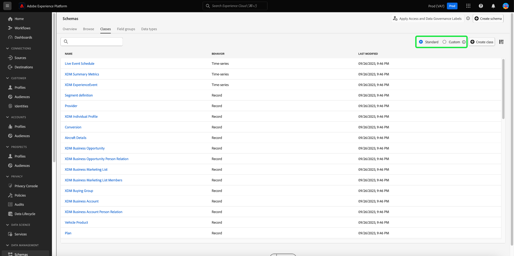
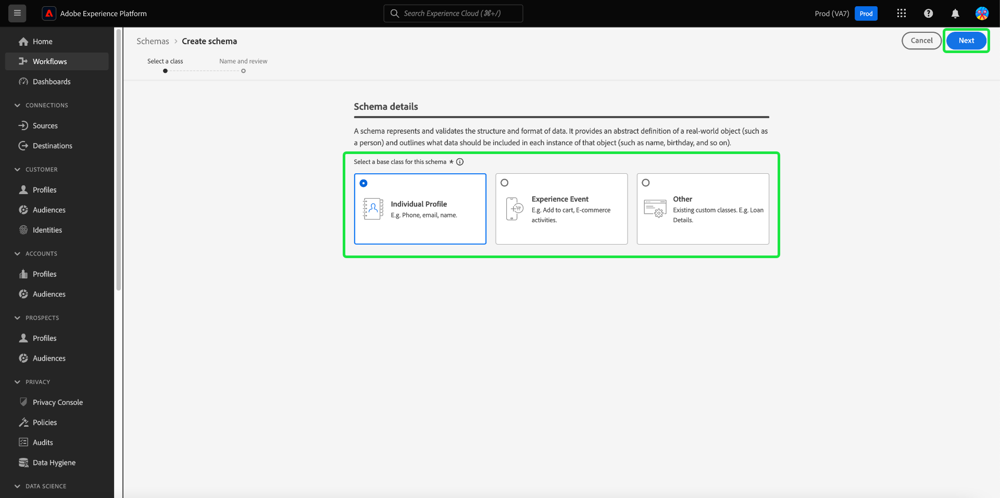
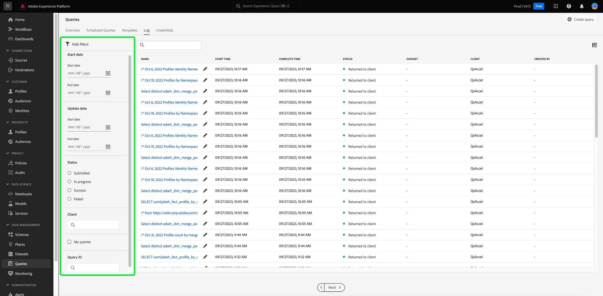

# Adobe Experience Platform release notes 

**Release date: September 28, 2023**

New features in Adobe Experience Platform:

- [Computed attributes](#computed-attributes)

Updates to existing features in Experience Platform:

- [Alerts](#alerts)
- [Dashboards](#dashboards)
- [Data collection](#data-collection)
- [Data governance](#data-governance)
- [Data hygiene](#hygiene) 
- [Destinations](#destinations)
- [Experience Data Model (XDM)](#xdm)
- [Identity Service](#identity-service)
- [Query Service](#query-service)
- [Segmentation Service](#segmentation)
- [Sources](#sources) 

## Computed attributes {#computed-attributes}

Computed attributes enable capability to easily summarize event data into profile attributes via an intuitive UI for enhanced behavior-based segmentation, personalization, and activation. With this feature, you can create computed attributes in a self serve manner, manage them, and use them in segmentation, Real-Time CDP destinations, or Adobe Journey Optimizer. Additionally, computed attributes simplify segmentation and journey workflows to help you seamlessly deliver relevant experiences. To learn more about computed attributes, please read the [computed attributes overview](../../profile/computed-attributes/overview.md).

## Alerts {#alerts}

Experience Platform allows you to subscribe to event-based alerts for various Platform activities. You can subscribe to different alert rules through the [!UICONTROL Alerts] tab in the Platform user interface, and can choose to receive alert messages within the UI itself or through email notifications.

**New or updated features**

| Feature | Description |
| --- | --- |
| Alerts history tab | The Alerts [!UICONTROL History] tab will now include all events including delays, starts, success, and failures. Read the [alerts UI documentation](../../observability/alerts/ui.md) for more information about the history tab. |

{style="table-layout:auto"}

To learn more about alerts, please read the [[!DNL Observability Insights] overview](../../observability/home.md).

## Dashboards {#dashboards}

Adobe Experience Platform provides multiple [!DNL dashboards] through which you can view important information about your organization's data, as captured during daily snapshots.

| Feature | Description |
| --- | --- |
| [License usage dashboard improvement](../../dashboards/guides/license-usage.md)  | Maintain control of your license agreements with improved reporting and key metric visualizations regarding your organization's license usage. These improvements provide a high degree of granularity over your license usage metrics for all the Experience Platform products that you have purchased. |

{style="table-layout:auto"}

To learn more about the license usage dashboard, see the [license usage dashboard overview](../../dashboards/guides/destinations.md).

## Data collection {#data-collection}

Adobe Experience Platform provides a suite of technologies that allow you to collect client-side customer experience data and send it to the Adobe Experience Platform Edge Network where it can be enriched, transformed, and distributed to Adobe or non-Adobe destinations.

**New or updated features**

| Type | Feature | Description |
| --- | --- | --- |
| Datastreams | Device lookup support | When configuring a datastream, you can now select the level of device lookup information to be collected. Device lookup information includes data about the device, hardware, operating system, and browser used to interact with your page.    Device lookup information cannot be collected along with user agent and client hints. Choosing to collect device information will disable the collection of user agent and client hints, and vice versa. All device lookup information is stored in the `xdm:device` field group. Learn more from the documentation on [configuring datastreams](../../datastreams/configure.md#geolocation-device-lookup). |
| Extensions | [!DNL TikTok] web events API extension | The [[!DNL TikTok] Web Events API](https://exchange.adobe.com/apps/ec/109834/tiktok-web-events-api) extension allows you to leverage data captured in the Adobe Experience Platform Edge Network and send it to [!DNL TikTok] in the form of server-side events using the [!DNL TikTok] Web Events API. |

{style="table-layout:auto"}

To learn more about data collection, please read the [data collection overview](../../tags/home.md).

## Data Governance {#data-governance}

Adobe Experience Platform Data Governance is a series of strategies and technologies used to manage customer data and ensure compliance with regulations, restrictions, and policies applicable to data usage. It plays a key role within Experience Platform at various levels, including cataloging, data lineage, data usage labeling, data access policies, and access control on data for marketing actions.

**New features**

| Feature | Description | 
| --- | --- |
| New Partner Ecosystem labels for third-party data | New data usage labels for third-party enrichment and prospecting are available. See the [documentation on Partner Ecosystem labels](../../data-governance/labels/reference.md#partner) for more information. |

{style="table-layout:auto"}

To learn more about data governance, read the [data governance overview](../../data-governance/home.md).

## Data hygiene {#hygiene}

Experience Platform provides a suite of data hygiene capabilities that allow you manage your stored data through programmatic deletions of consumer records and datasets. Using either the [!UICONTROL Data Lifecycle] workspace in the UI or through calls to the Data Hygiene API, you can effectively manage your data stores. Use these capabilities to ensure that information is used as expected, is updated when incorrect data needs fixing, and is deleted when organizational policies deem it necessary.

**New features**

| Feature | Description |
| --- | --- |
| [!BADGE Beta]{type=Informative} Record Delete (limited release) | Manage your data lifecycle across all data stores to meet customer commitments and license agreements with Advanced Data Lifecycle Management features in Adobe Experience Platform: Automated Dataset Expiration & Record Delete. With automated dataset expiration, you can delete entire datasets and set a date and time for the dataset to be deleted. Record Delete allows you to delete individual consumer profiles by targeting their primary identities. You can provide the primary identities individually through the UI or via CSV/JSON file upload. See the [Record Delete documentation](../../hygiene/ui/record-delete.md) for more information  |
| Dataset expirations | Minimize your data and stay in control of your license agreements with Automated Dataset Expiration. Reduce data volumes by deleting entire datasets and set a date and time for the dataset to be deleted. See the [dataset expirations documentation](../../hygiene/ui/dataset-expiration.md) for more information. |

{style="table-layout:auto"}

For more information on Platform's data hygiene capabilities, refer to the [data hygiene overview](../../hygiene/home.md).

## Destinations {#destinations}

[!DNL Destinations] are pre-built integrations with destination platforms that allow for the seamless activation of data from Adobe Experience Platform. You can use destinations to activate your known and unknown data for cross-channel marketing campaigns, email campaigns, targeted advertising, and many other use cases.

**New or updated destinations** {#new-updated-destinations}

| Destination | New or Updated |Description |
| ----------- |----------------|----------- |
| [[!DNL LiveRamp - Distribution]](../../destinations/catalog/advertising/liveramp-distribution.md) | New | Activate audiences previously onboarded to [!DNL LiveRamp] to premium publishers across mobile, web, display, and connected TV mediums.   After onboarding audiences to your [!DNL LiveRamp] account through the [LiveRamp - Onboarding](../../destinations/catalog/advertising/liveramp-onboarding.md) connection, use the new [[!DNL LiveRamp - Distribution]](../../destinations/catalog/advertising/liveramp-distribution.md) connection to activate the audiences to downstream destinations.  |
| [[!DNL HubSpot]](../../destinations/catalog/crm/hubspot.md) | New | [[!DNL HubSpot]](https://www.hubspot.com) is a CRM platform with all the software, integrations, and resources you need to connect marketing, sales, content management, and customer service. It allows you to connect your data, teams, and customers on one CRM platform.|
| [[!DNL Microsoft Dynamics 365]](../../destinations/catalog/crm/microsoft-dynamics-365.md) | Updated | Added support for [!DNL Dynamics 365] custom field prefixes for custom fields which were not created within the default solution in [!DNL Dynamics 365]. A new input field, **[!UICONTROL Customization Prefix]**, has been added in the [Fill in destination details](#destination-details) step. |
| [[!DNL Experience Cloud Audiences]](../../destinations/catalog/adobe/experience-cloud-audiences.md) | Updated | The Experience Cloud Audiences destination is now generally available. Use this destination to activate audiences from Real-Time CDP to Audience Manager and Adobe Analytics. You need an Audience Manager license to send audiences to Adobe Analytics. |

{style="table-layout:auto"}

<!-- 

Add these to release notes as they go out

| [[!DNL Qualtrics]] | New | Use the aggregation of multiple sources of operational data in Adobe Experience Platform as an input in Qualtrics Experience ID to better understand your customers and enable targeted outreach to close the gap when it comes to understanding intent, emotion and experience drivers. | 

-->

**New or updated functionality** {#destinations-new-updated-functionality}

| Functionality | Description |
| ----------- | ----------- |
| Data exports in Real-Time CDP | The [dataset export](../../destinations/ui/export-datasets.md) functionality is now generally available. See [which datasets you can export based on the Experience Platform app](../../destinations/ui/export-datasets.md#datasets-to-export) you purchased, and check the [guardrails for exporting datasets](/help/destinations/guardrails.md#dataset-exports). |
| (Beta) Support for exporting array-type objects | Export arrays of primitive values (string, int, or boolean values) as flat schema files to cloud storage destinations. Read more about the functionality in the [documentation](../../destinations/ui/export-arrays-calculated-fields.md).|
| Dynamic dropdown selectors in Destination SDK | When creating a destination through Destination SDK, you can now use [dynamic dropdown selectors](../../destinations/destination-sdk/functionality/destination-configuration/customer-data-fields.md#dynamic-dropdown-selectors) to populate the fields of a dropdown selector with values retrieved from an API. |

**Fixes and enhancements** {#destinations-fixes-and-enhancements}

- Make use of [monitoring transparency](../../dataflows/ui/monitor-destinations.md#dataflow-runs-for-streaming-destinations) now available for enterprise destinations ([HTTP API](../../destinations/catalog/streaming/http-destination.md), [Amazon Kinesis](../../destinations/catalog/cloud-storage/amazon-kinesis.md) and [Azure Event Hubs](../../destinations/catalog/cloud-storage/azure-event-hubs.md)) at the dataflow run level to monitor activation metrics and status in the [dataflow detail view](../../dataflows/ui/monitor-destinations.md#dataflow-run-details-page), with additional information via error codes and messages for troubleshooting.
- When you update the name of audiences mapped to the [Google Ad Manager](../../destinations/catalog/advertising/google-ad-manager.md), [Google Display & Video 360](../../destinations/catalog/advertising/google-dv360.md), and other destinations which use [audience update templates](../../destinations/destination-sdk/metadata-api/update-audience-template.md), these name changes are now reflected downstream in the destination.

For more general information on destinations, refer to the [destinations overview](../../destinations/home.md).

## Experience Data Model (XDM) {#xdm}

XDM is an open-source specification that provides common structures and definitions (schemas) for data that is brought into Adobe Experience Platform. By adhering to XDM standards, all customer experience data can be incorporated into a common representation to deliver insights in a faster, more integrated way. You can gain valuable insights from customer actions, define customer audiences through segments, and use customer attributes for personalization purposes.

**New features**

| Feature | Description |
| --- | --- |
| Quick actions added to Schema Editor  | New quick actions have been added to the canvas of the Schema editor. You can now copy the JSON structure or delete the schema directly from the editor. {width="100" zoomable="yes"}   |
| Filter XDM resources by custom or standard creator | The lists of available schemas, field groups, data types and classes are now pre-filtered based on their method of creation. This allows you to filter resources based on whether they were custom built or created by Adobe. {width="100" zoomable="yes"}   See the [create and edit resources documentation](../../xdm/ui/resources/classes.md#filter.md) for more information. |

**Updated features**

| Feature | Description |
| --- | --- |
|  Updated schema creation workflow  | A new schema creation workflow has been implemented to streamline the process.   {width="100" zoomable="yes"}   See the [schema creation documentation](../../xdm/ui/resources/schemas.md#create) for more information.  |

**New XDM components**

| Component type | Name | Description |
| --- | --- | --- |
|  Data type  |  [[!UICONTROL Return]](https://github.com/adobe/xdm/pull/1773/files)  |  The RMA (Return Merchandise Authorization) issued. |
| Data type  | [[!UICONTROL Return Item]](https://github.com/adobe/xdm/pull/1773/files)   |   The returned item's information within the RMA (Return Merchandise Authorization).  |

{style="table-layout:auto"}

**Updated XDM components**

| Component type | Name | Update description |
| --- | --- | --- |
| Extension  | [!UICONTROL AJO Entity Fields] | The [[!UICONTROL flag for multi-variant]](https://github.com/adobe/xdm/pull/1774/files) was added to [!UICONTROL AJO Entity Fields] to identify if the variant is a multi-variant or not.  |
|  Data type  |  [!UICONTROL Product list item]  | [[!UICONTROL Return Item]](https://github.com/adobe/xdm/pull/1773/files) was added to include the Return Merchandise Authorization information.  |
|  Data type  |  Order   |  [[!UICONTROL Return Info]](https://github.com/adobe/xdm/pull/1773/files) was added to include the RMA (Return Merchandise Authorization) issued.|

{style="table-layout:auto"}

For more information on XDM in Platform, see the [XDM System overview](../../xdm/home.md)

## Identity Service {#identity-service}

Adobe Experience Platform Identity Service provides you with a comprehensive view of your customers and their behavior by bridging identities across devices and systems, allowing you to deliver impactful, personal digital experiences in real time.

**New or updated features**

| Feature | Description |
| --- | --- |
| Identity Service UI enhancements | Use the improved custom namespace creation tool in the Experience Platform UI to better manage your custom namespaces and their corresponding identity types. The enhanced Identity Service UI provides you with: <ul><li>Contextual Experience: Visual cues, clarity, and context to what an identity namespace is and identity types are.</li><li>Accuracy: Better error handling, with no more duplicate identity names.</li><li>Discoverability: Access to documentation from within an in-product dialog.</li></ul> For more information, read the guide on [creating custom namespaces](../../identity-service/features/namespaces.md#create-namespaces). |
| Changes to identity graph limits | The identity graph limit has changed from 150 identities to 50 identities. When a new identity is ingested into a full graph, the oldest identity based on the ingestion timestamp and identity type are deleted. Cookie identity types are prioritized for deletion. Please contact your Adobe Account Team to request a change in identity type if your production sandbox contains: <ul><li>a custom namespace where the person identifiers (such as CRM IDs) are configured as cookie/device identity type.</li><li>a custom namespace where cookie/device identifiers are configured as cross-device identity type.</li></ul> Adobe engineering will manually process these requests. For more information, read the [guardrails for Identity Service data](../../identity-service/guardrails.md) and guide on [data management license entitlement best practices](../../landing/license-usage-and-guardrails/data-management-best-practices.md). |

{style="table-layout:auto"}

To learn more about Identity Service, please read the [Identity Service overview](../../identity-service/home.md).

## Query Service {#query-service}

Query Service allows you to use standard SQL to query data in Adobe Experience Platform [!DNL Data Lake]. You can join any datasets from the [!DNL Data Lake] and capture the query results as a new dataset for use in reporting, Data Science Workspace, or for ingestion into Real-Time Customer Profile.

**Updated features**

| Feature | Description |
| --- | --- |
| Log filtering UI updates  | Improved query log filtering improves visibility for user-generated logs for monitoring, administering, and troubleshooting. You can filter the list of query logs based on a variety of settings.   {width="100" zoomable="yes"}    See the [query logs documentation](../../query-service/ui/query-logs.md#filter-logs) for more information. |
| Multiple Query Editor UI updates  | You can now Execute multiple sequential queries in the Query Editor or write more than one query and execute all queries in a sequential manner. To add more flexibility to your query execution, you can highlight your chosen query and select that specific query to run independently from the others. See the [Query Editor UI guide](../../query-service/ui/user-guide.md#execute-multiple-sequential-queries) for more information. |

{style="table-layout:auto"}

For more information on Query Services, refer to the [Query Service overview](../../query-service/home.md).

## Segmentation Service {#segmentation}

[!DNL Segmentation Service] allows you to segment data stored in [!DNL Experience Platform] that relates to individuals (such as customers, prospects, users, or organizations) into audiences. You can create audiences through segment definitions or other sources from your [!DNL Real-Time Customer Profile] data. These audiences are centrally configured and maintained on [!DNL Platform], and are readily accessible by any Adobe solution. 

**New or updated features**

| Feature | Description |
| ------- | ----------- |
| Customizable columns | You can now customize the layout of Audience Portal with re-sizable columns. For more information on this feature, please read the [segmentation UI guide](../../segmentation/ui/overview.md#customize). |
| Update frequency breakdown | You can now view a breakdown of the update frequencies of the audiences in your organization. For more information on this feature, please read the [segmentation UI guide](../../segmentation/ui/overview.md#browse). |

To learn more about Segmentation Service, please read the [Segmentation Service overview](../../segmentation/home.md).

## Sources {#sources}

Experience Platform provides a RESTful API and an interactive UI that lets you set up source connections for various data providers with ease. These source connections allow you to authenticate and connect to external storage systems and CRM services, set times for ingestion runs, and manage data ingestion throughput.

**New or updated features**

| Feature | Description |
| --- | --- |
| New parameters for `offset` pagination in Self-Serve Sources (Batch SDK) | You can now specify an `endConditionName` and `endConditionValue` for your source when using `offset` pagination. These parameters allow you to indicate the condition that will end the pagination loop in the next HTTP request. For more information, read the [pagination guide for Self-Serve Sources (Batch SDK)](../../sources/sources-sdk/config/sourcespec.md#pagination). |

{style="table-layout:auto"}

To learn more about sources, please read the [sources overview](../../sources/home.md).
