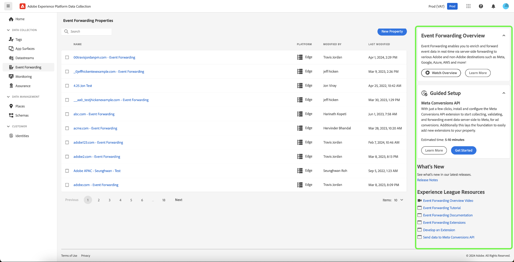

# Adobe Experience Platform release notes 

**Release date: April 30, 2024**

>[!TIP]
>
>Use the [Adobe Experience Platform glossary](/help/landing/glossary.md) to get familiar with terminology used in Real-Time Customer Data Platform and Adobe Experience Platform. If you cannot find a specific term that you are looking for, use the feedback options on the page to request new terms be added to the glossary.

Updates to existing features in Experience Platform:

- [Dashboards](#dashboards)
- [Data collection](#data-collection)
- [Destinations](#destinations)
- [Identity Service](#identity-service)
- [Monitoring](#monitoring)
- [Query Service](#query-service)
- [Sandboxes](#sandboxes)
- [Segmentation Service](#segmentation)
- [Sources](#sources)

## Dashboards {#dashboards}

Adobe Experience Platform provides multiple dashboards through which you can view important insights about your organization's data, as captured during daily snapshots.

**New or updated features**

| Feature | Description |
| --- | --- |
| Real-Time Customer Data Platform B2B insights | Explore pre-configured [Real-Time CDP B2B data insights on accounts and opportunities](../../dashboards/insights/account-profiles.md) to help you understand your data and inform your business decisions. You can also [build your own insights using the Real-Time CDP B2B Data Model](../../dashboards/data-models/cdp-insights-data-model-b2c.md) to visualize and explore your data and save your custom visualizations in your dashboard. |

{style="table-layout:auto"}

For more information on dashboards, including how to grant access permissions and create custom widgets, begin by reading the [dashboards overview](../../dashboards/home.md).

## Data collection {#data-collection}

Adobe Experience Platform provides a suite of technologies that allow you to collect client-side customer experience data and send it to the Experience Platform Edge Network where it can be enriched, transformed, and distributed to Adobe or non-Adobe destinations.

**New or updated features**

| Type | Feature | Description |
| --- | --- | --- |
| Extensions | [!DNL Acxiom Anonymous Visitor Insights] Tags Extension | Discover where your website visitors are coming from with [!DNL Acxiom's Visitor Insights]. By utilizing geo IP lookup technology, Acxiom can pinpoint the location of anonymous browsers. Once identified, a search in their organized database yields additional insights that are sent back to the browser. Content creators can thereby tailor their content to match these data points providing a more personalized and engaging experience for visitors, even if they started off as strangers. |
| Datastreams | [Edge Network bot detection](../../datastreams/bot-detection.md) | Traffic originating from nonhuman entities, such as automated programs, web scrapers, spiders, scripted scanners, can make it more difficult to identify events occuring from human visitors. This type of traffic can negatively affect important business metrics, leading to incorrect traffic reporting.  Bot detection allows you to identify events generated by [Adobe Experience Platform Data Collection](/help/collection/home.md) as being generated by known spiders and bots. By configuring bot detection for your datastreams, you can identify specific IP addresses, IP ranges and request headers which you would like to classified as bot events.   Identification of bot traffic can provide you with a more accurate measurement of user activity on your site or mobile application. |
| Mobile SDK | Major version release | New major versions of the Mobile SDK have been released for the following platforms: iOS Mobile Core 5.x and compatible iOS extensions, Android Mobile Core 3.x and compatible Android extensions, React Native Core 6.x and compatible React Native extensions, Flutter Core 4.x and compatible Flutter extensions. These release provide several new features and enhancements including support in the Android SDK for Jetpack Compose, support for Adobe Journey Optimizer code-based experiences, and general availability of the Adobe Journey Optimizer Messaging extension for Flutter. For more detailed release notes see [Mobile SDK release notes](https://developer.adobe.com/client-sdks/home/release-notes/).|
| Mobile SDK | Privacy | Due to Apple's policy update, starting on May 1, 2024, developers must implement new privacy features in order to submit to the App Store. All Adobe customers who use the Mobile SDK will need to upgrade to version 5.x of the SDK if they wish to receive App Store approval after May 1st. |
| Roku SDK | Roku SDK | The first major version of the Roku SDK has been released with support for the Streaming Media for the Experience Platform Edge Network. |
| Tags and Event Forwarding | In-product guidance | Experience Platform [Tags](../../tags/home.md) and [Event Forwarding](../../tags/ui/event-forwarding/overview.md) offer a new range of experiences that can help you get started quickly and realize a quick time to value. These experiences include new onboarding screens, in-product tutorials, and tool tips.  {width="100" zoomable="yes"} |
| Web SDK | Simplified Web SDK adoption for Audience Manager customers | Multiple Web SDK updates now simplify adoption of Web SDK without using Experience Data Model (XDM) for Experience Cloud Solutions, such as Audience Manager, Analytics and Target. Learn more about Audience Manager Web SDK adoption from the following guides: <ul><li><a href="https://experienceleague.adobe.com/en/docs/audience-manager/user-guide/migrate-to-web-sdk/dil-extension-to-web-sdk">Update your data collection library for Audience Manager from the Audience Manager tag extension to the Web SDK tag extension</li><li><a href="https://experienceleague.adobe.com/en/docs/audience-manager/user-guide/migrate-to-web-sdk/appmeasurement-to-web-sdk">Update your data collection library for Audience Manager from the AppMeasurement JavaScript library to the Web SDK JavaScript library</li></ul>|

{style="table-layout:auto"}

<!--| Web SDK | [Streaming Media Collection support in Web SDK](/help/collection/js/commands/configure/streamingmedia.md) | You can now use Experience Platform Web SDK to collect data related to media sessions on your website. The collected data can include information about media playbacks, pauses, completions, and other related events. Once collected, you can send this data to Adobe Experience Platform and/or Adobe Analytics, to generate reports. This feature provides a comprehensive solution for tracking and understanding media consumption behavior on your website.  See the [Web SDK](/help/collection/js/commands/configure/streamingmedia.md) documentation to learn how to configure the `streamingMedia` component.  See the guide on [migrating your Analytics for Streaming Media implementation from Media JS to Web SDK](https://experienceleague.adobe.com/en/docs/media-analytics/using/implementation/edge-recommended/media-edge-sdk/edge-web-sdk) for more details.|-->

To learn more about data collections, read the [data collection overview](../../collection/home.md).

## Destinations {#destinations}

[!DNL Destinations] are pre-built integrations with destination platforms that allow for the seamless activation of data from Adobe Experience Platform. You can use destinations to activate your known and unknown data for cross-channel marketing campaigns, email campaigns, targeted advertising, and many other use cases.

**New or updated functionality** {#destinations-new-updated-functionality}

| Functionality | Description |
| ----------- | ----------- |
| `isRequired` parameter now available for nested customer data fields in Destination SDK | When configuring a destination in Destination SDK, you can now [set nested customer data fields as required](/help/destinations/destination-sdk/functionality/destination-configuration/customer-data-fields.md#nested-fields). This way, users setting up your destination cannot proceed with their activation flow until they select a value for that field.|
| Edge segmentation is not a mandatory requirement anymore when setting up an Adobe Target destination with Web SDK | Previously, when configuring an [Adobe Target destination](/help/destinations/catalog/personalization/adobe-target-connection.md) with Web SDK, the datastream had to be enabled for personalization and edge segmentation. The requirement that the datastream be enabled for edge segmentation [has now been removed](/help/destinations/ui/activate-edge-personalization-destinations.md#configure-datastream). Note that this integration pattern only allows you to benefit from a subset of personalization use cases when using Adobe Target with Real-Time CDP. Read more about the [use cases enabled by integration type](/help/destinations/catalog/personalization/adobe-target-connection.md#supported-use-cases). |
| [!BADGE Beta]{type=Informative} Remove multiple audiences and datasets from activation flows | You can now select and remove multiple audiences and datasets from destination activation flows. See the [destination details](../../destinations/ui/destination-details-page.md#bulk-remove) and [dataset export](../../destinations/ui/export-datasets.md) documentation for more details. |

{style="table-layout:auto"}

For more general information on destinations, refer to the [destinations overview](../../destinations/home.md).

## Identity Service {#identity-service}

Use Adobe Experience Platform Identity Service to create a comprehensive view of your customers and their behaviors by bridging identities across devices and systems, allowing you to deliver impactful, personal digital experiences in real time.

**Updated features**

| Feature | Description |
| --- | --- |
| Deprecation of the `/orgs/{ORG}/` endpoints in the API | The following endpoints in the [[!DNL Identity Service] API](https://developer.adobe.com/experience-platform-apis/references/identity-service/) have been deprecated:<ul><li>`https://platform.adobe.io/data/core/idnamespace/orgs/{ORG}/identities`</li><li>`https://platform.adobe.io/data/core/idnamespace/orgs/{ORG}/identities/{ID}`</li></ul> You may use the `/idnamespace/identities` and the `/idnamespace/identities/{ID}` endpoints to accomplish the same tasks and retrieve either all namespaces in an organization, or a specific namespace in an organization. |

{style="table-layout:auto"}

For more information on Identity Service, read the [Identity Service overview](../../identity-service/home.md).

## Monitoring {#monitoring}

Use the monitoring dashboard in the Experience Platform UI to monitor the journey of your data from Sources, Identity Service, Real-Time Customer Profile, Audiences, and Destinations.

**Updated features**

| Feature | Description |
| --- | --- |
| Monitoring dashboard expansion | You can now use the monitoring dashboard for different data types based on your business use case. Use the monitoring dashboard to monitor person, account, and prospect data type activities in sources, audiences, and destinations. |

{style="table-layout:auto"}

For more information, read the guide on [using the monitoring dashboard](../../dataflows/ui/monitor.md).

## Query Service {#query-service}

Query Service allows you to use standard SQL to query data in Adobe Experience Platform [!DNL Data Lake]. You can join any datasets from the [!DNL Data Lake] and capture the query results as a new dataset for use in reporting, Data Science Workspace, or for ingestion into Real-Time Customer Profile.

**Updated features**

| Feature | Description |
| --- | --- |
| Query Quarantine | Automatically isolate failed query executions to prevent disruptions and maintain consistent performance. See the [query quarantine](../../query-service/ui/query-schedules.md#quarantine) documentation for more information.|
| Cancel query | Take control of query execution and improve your productivity by canceling long-running queries.See the [cancel query](../../query-service/ui/user-guide.md#cancel-query) documentation for more information. |
| Scheduled query alerts | Stay informed with proactive notifications while scheduling queries, ensuring efficient and timely task management. You can [subscribe to alerts either when creating a query](../../query-service/ui/query-schedules.md#alerts-for-query-status) or using the inline actions for existing scheduled queries. See the [subscribe to alerts with inline actions](../../query-service/ui/monitor-queries.md#alert-subscription) documentation for more information.|
| Improved scheduled query navigation | Easily navigate between query templates and scheduled runs for increased productivity. See the documentation on [viewing scheduled query runs](../../query-service/ui/query-schedules.md#scheduled-query-runs) for more information. |
| Extended Query Output | Access up to 500 rows of query results within the console for deeper analysis of your data.See the [result count](../../query-service/ui/user-guide.md#result-count) documentation for more information. |
| Legacy Query Editor sunset | As of 30-April-2024 the Enhanced Query Editor has become the default editor for all users. The legacy editor will be deprecated on 24-May-2024 and no longer be available for use. See the [Query Editor user guide](../../query-service/ui/user-guide.md) for more information. |

{style="table-layout:auto"}

For more information on Query Services, refer to the [Query Service overview](../../query-service/home.md).

## Sandboxes {#sandboxes}

Adobe Experience Platform is built to enrich digital experience applications on a global scale. Companies often run multiple digital experience applications in parallel and need to cater for the development, testing, and deployment of these applications while ensuring operational compliance. To address this need, Experience Platform provides sandboxes that partition a single Experience Platform instance into separate virtual environments to help develop and evolve digital experience applications.

**New or updated features**

| Feature | Description |
| --- | --- |
| [Sandbox tooling](../../sandboxes/ui/sandbox-tooling.md) | Use sandbox tooling to [export](../../sandboxes/ui/sandbox-tooling.md#export-entire-sandbox) all supported object types into a full sandbox package, then [import](../../sandboxes/ui/sandbox-tooling.md#import-entire-sandbox) the package across various sandboxes to replicate object configurations. |

{style="table-layout:auto"}

For more information on sandboxes, read the [sandboxes overview](../../sandboxes/home.md).

## Segmentation Service {#segmentation}

[!DNL Segmentation Service] allows you to segment data stored in [!DNL Experience Platform] that relates to individuals (such as customers, prospects, users, or organizations) into audiences. You can create audiences through segment definitions or other sources from your [!DNL Real-Time Customer Profile] data. These audiences are centrally configured and maintained on [!DNL Experience Platform], and are readily accessible by any Adobe solution. 

**Updated feature**

| Feature | Description |
| ------- | ----------- |
| Audience lifecycle states | Audience lifecycle states have been streamlined to simplify lifecycle management. To learn more about these lifecycle states, read the [Segmentation Service FAQ](../../segmentation/faq.md#lifecycle-states). |

{style="table-layout:auto"}

For more information on [!DNL Segmentation Service], please see the [Segmentation overview](../../segmentation/home.md).

## Sources {#sources}

Experience Platform provides a RESTful API and an interactive UI that lets you set up source connections for various data providers with ease. These source connections allow you to authenticate and connect to external storage systems and CRM services, set times for ingestion runs, and manage data ingestion throughput.

Use sources in Experience Platform to ingest data from an Adobe application or a third-party data source.

**New sources**

| New sources | Description |
| --- | --- |
| [!BADGE Beta]{type=Informative} [!DNL PathFactory] | Use the [[!DNL PathFactory] source](../../sources/tutorials/ui/create/marketing-automation/pathfactory.md) to integrate your visitor, session, and page view data from [!DNL PathFactory] to Experience Platform. Read the [[!DNL PathFactory] overview](../../sources/connectors/marketing-automation/pathfactory.md) for information on how to get started. |
| [!DNL Teradata Vantage] | Use the [[!DNL Teradata Vantage] source](../../sources/tutorials/ui/create/databases/teradata-vantage.md) to ingest data from hybrid multi-cloud environments to Experience Platform. Read the [[!DNL Teradata Vantage] overview](../../sources/connectors/databases/teradata-vantage.md) for information on how to get started. |

{style="table-layout:auto"}

**New and updated features**

| Feature | Description |
| --- | --- |
| Updates to IP addresses for allow listing in VA7 | The following IP addresses have been added to the list of IP addresses to add to your allow list for VA7 (North America): <ul><li>`20.98.198.224/29`</li><li>`20.119.28.57/32`</li><li>`20.232.89.104/29`</li><li>`20.98.195.172/32`</li><li>`172.210.218.144/28`</li></ul> For a comprehensive list of IP addresses to add to your allow list, read the [IP Address allow list document](../../sources/ip-address-allow-list.md). |
| Support for new authentication types with the [!DNL Azure Event Hubs] source | You can now connect your [!DNL Event Hubs] source to Experience Platform using either [!DNL Azure Active Directory Authentication] or [!DNL Scoped Azure Active Directory Authentication]. Read the guide on [connecting [!DNL Event Hubs] to Experience Platform](../../sources/tutorials/ui/create/cloud-storage/eventhub.md) for more information. | 
| Updates to [!DNL Data Landing Zone] credential retrieval | You can now use the right rail in the sources workspace to retrieve your [!DNL Data Landing Zone] credentials. You can also now use the right rail to refresh your credentials. Read the [[!DNL Data Landing Zone] UI guide](../../sources/tutorials/ui/create/cloud-storage/data-landing-zone.md) for more information. |

{style="table-layout:auto"}

<!--| Enhanced filtering and navigation in the sources UI workspace | Use the enhanced filtering, search, and inline action tools in the sources UI workspace to streamline your workflow. <ul><li>Use filtering and search capabilities to navigate your way through sources accounts and dataflows in your organization.</li><li>Use inline actions to modify configuration settings applied to your dataflows and improve organizational workflows. You can use inline actions to apply tags, set up alerts, or create ingestion jobs on demand.</li></ul> For more information, read the guide on [filtering sources objects in the UI](../../sources/tutorials/ui/filter.md).|-->

For more information on sources, read the [sources overview](../../sources/home.md).
