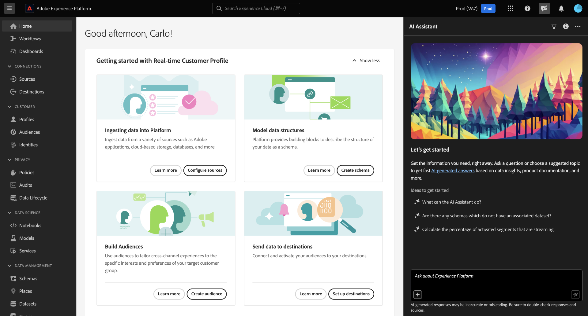

# Adobe Experience Platform release notes 

**Release date: June 18, 2024**

>[!TIP]
>
>[AI Assistant in Experience Platform](https://platform.adobe.com) is now available. Use AI Assistant to accelerate your workflows in Adobe applications. [Read more](#ai-assistant) about the new functionality.

New features in Adobe Experience Platform:

- [AI Assistant](#ai-assistant)
- [Authentication to Experience Platform APIs](#authentication-platform-apis)
- [Data Prep](#data-prep)
- [Destinations](#destinations)
- [Identity Service](#identity-service)
- [Privacy Service](#privacy)
- [Segmentation Service](#segmentation)
- [Use Case Playbooks](#use-case-playbooks)

## AI Assistant {#ai-assistant}

AI Assistant in Adobe Experience Platform is a conversational experience that you can use to accelerate your workflows in Adobe applications. You can use AI Assistant to better understand product knowledge, troubleshoot problems, or search through information and find operational insights. AI Assistant supports Experience Platform, Real-Time Customer Data Platform, Adobe Journey Optimizer and Customer Journey Analytics.

**New feature**

| Feature | Description |
| --- | --- |
| AI Assistant in Experience Platform | You can now use AI Assistant in Experience Platform. AI Assistant supports Experience Platform, Real-Time Customer Data Platform, Adobe Journey Optimizer, and Customer Journey Analytics.   {width="100" zoomable="yes"}   For more information about this feature, read the [AI Assistant UI guide](../../ai-assistant/ui-guide.md). |
| Support for product knowledge questions | [Product knowledge](../../ai-assistant/home.md#product-knowledge) are concepts and topics grounded in Experience League documentation and can be used for pointed learning, open discovery, and troubleshooting. You can ask AI Assistant product knowledge questions like: <ul><li>What are lookalike audiences?</li><li>How is Profile richness calculated?</li><li> Can I delete a profile enabled schema after data is ingested?</li></ul> |
| [!BADGE Beta]{type=Informative} Support for operational insights questions | [Operational insights](../../ai-assistant/home.md#operational-insights) are answers AI Assistant generates about your metadata objects including counts, lookups, and lineage impact. Operational insights does not look at any data within your sandbox. You can ask AI Assistant operational insights questions like: <ul><li>Which destinations are in an active state?</li><li>How many datasets do I have?</li><li>List the audiences which are used in live journeys.</li></ul> Operational insights are supported in the following domains: attributes, audiences, dataflows, datasets, destinations, journeys, schemas, and sources. |
| Access AI Assistant | To access AI Assistant for Experience Platform, Real-Time CDP, and Journey Optimizer, you must be added to a role that includes the **Enable AI Assistant** and **View Operational Insights** permissions. For more information, read the [feature access guide](../../ai-assistant/access.md). You must use the Admin Console for [access in Customer Journey Analytics](https://experienceleague.adobe.com/en/docs/analytics-platform/using/ai-assistant#feature-access). |

For more information about AI Assistant, read the [AI Assistant overview](../../ai-assistant/home.md).

## Authentication to Experience Platform APIs {#authentication-platform-apis}

The JWT method to obtain access tokens is now deprecated for new integrations and replaced by a simpler OAuth Server-to-Server authentication method.
{width="100" zoomable="yes"}
 

While existing API integrations using the JWT authentication method will continue to work until January 1st, 2025, Adobe strongly recommends that you migrate existing integrations to the new OAuth Server-to-Server method before that date. Read the guide on [migrating from Service Account (JWT) credential to OAuth Server-to-Server credential](https://developer.adobe.com/developer-console/docs/guides/authentication/ServerToServerAuthentication/migration/).

## Data Prep {#data-prep}

Use data prep to map, transform, and validate data to and from Experience Data Model (XDM).

**New or updated features**

| Feature | Description |
| --- | --- |
| Additions to reserved keywords list | The following words have been added to the data prep reserved keywords list:<ul><li>`do`</li><li>`empty`</li><li>`function`</li><li>`size`</li></ul> For more information, read the the [data prep functions guide](../../data-prep/functions.md). |

{style="table-layout:auto"}

For more information on Data Prep, read the [Data Prep overview](../../data-prep/home.md).

## Destinations {#destinations}

[!DNL Destinations] are pre-built integrations with destination platforms that allow for the seamless activation of data from Adobe Experience Platform. You can use destinations to activate your known and unknown data for cross-channel marketing campaigns, email campaigns, targeted advertising, and many other use cases.

**New or updated functionality** {#destinations-new-updated-functionality}

| Functionality | Description |
| ----------- | ----------- |
| Enhancement to ad-hoc export API to export external audiences | You can now use the ad-hoc export API to export external (custom upload) audiences. [Read more](/help/destinations/api/ad-hoc-activation-api.md) . |
| (Beta) Additional functions supported in beta phase of export array support | Previously, when activating audiences to file-based destinations and selecting Use calculated field, you were limited to using a subset of the audiences available through data prep. That limitation has now been lifted and customers have access to all functions available through data prep when exporting audiences to file-based destinations. [Read more](/help/destinations/ui/export-arrays-maps-objects.md#supported-functions). |
| Show only fields with data in the mapping step | When mapping profile attributes to your destinations, you can now toggle between all profile attributes or only those which contain data. By default, only the fields with data are shown. See the activation guides for [batch](../../destinations/ui/activate-batch-profile-destinations.md#mapping) and [streaming](../../destinations/ui/activate-segment-streaming-destinations.md#mapping) destinations for more details. |

{style="table-layout:auto"}

For more general information on destinations, refer to the [destinations overview](../../destinations/home.md).

## Identity Service {#identity-service}

Use Adobe Experience Platform Identity Service to create a comprehensive view of your customers and their behaviors by bridging identities across devices and systems, allowing you to deliver impactful, personal digital experiences in real time.

**Upcoming features**

| Feature | Description |
| --- | --- |
| [!BADGE Beta]{type=Informative} Identity graph linking rules | Participants of the beta program can use identity graph linking rules to to ensure person entity representation in the system by preventing "shared device" and other graph collapse scenarios. To achieve, this goal, participants during the beta program will have access to three features in a development sandbox environment: <ul><li>The graph simulation tool to understand how the graph algorithm functions.</li><li>The identity settings screen to configure unique namespaces and namespace priorities.</li><li>An identity dashboard to gain insight into ingested graphs.</li></ul> In addition, the beta program will include improvements in profile behavior stability. For more information, read the [identity graph linking rules](../../identity-service/identity-graph-linking-rules/overview.md) documentation. |

{style="table-layout:auto"}

For more information on Identity Service, read the [Identity Service overview](../../identity-service/home.md).

## [!DNL Privacy Service] {#privacy}

Several legal and organizational regulations give users the right to access or delete their personal data from your data stores upon request. Adobe Experience Platform [!DNL Privacy Service] provides a RESTful API and user interface to help you manage these data requests from your customers. With [!DNL Privacy Service], you can submit requests to access and delete private or personal customer data from Adobe Experience Cloud applications, facilitating automated compliance with legal and organizational privacy regulations.

**New features**

|Feature | Description|
|--- | ---|
| Privacy Service support for Adobe Journey Optimizer | Privacy Service capabilities are now compatible with the Adobe Journey Optimizer protocols for processing delete requests. See the [Adobe Journey Optimizer privacy requests documentation](https://experienceleague.adobe.com/en/docs/journey-optimizer/using/privacy/requests) for more information, or the Experience Platform documentation for a list of [Experience Cloud applications that are integrated with Privacy Service](../../privacy-service/experience-cloud-apps.md). |

See the [Privacy Service overview](../../privacy-service/home.md) for more information on the service.

## Segmentation Service {#segmentation}

[!DNL Segmentation Service] defines a particular subset of profiles by describing the criteria that distinguishes a marketable group of people within your customer base. Segments can be based on record data (such as demographic information) or time series events representing customer interactions with your brand.

**New or updated features**

| Feature | Description |
| ------- | ----------- |
| Time constraints update | The behavior for the "This month" and "This year" has been updated, and they now represent the "month-to-date" and "year-to-date" respectively. For more information on this change, read the [Segment Builder guide](../../segmentation/ui/segment-builder.md#rule-builder-canvas). |

{style="table-layout:auto"}

For more information on [!DNL Segmentation Service], please see the [Segmentation overview](../../segmentation/home.md).

## Use Case Playbooks {#use-case-playbooks}

[!DNL Use Case Playbooks] are available at no extra cost to all Adobe Experience Platform customers. To access a rich gallery of use case playbooks in the Experience Platform UI, you can now select **[!UICONTROL Playbooks]** from the left navigation.

[!DNL Use Case Playbooks] are designed to assist in overcoming challenges when starting with Real-Time Customer Data Platform or Adobe Journey Optimizer. They offer guidance and generate various assets that you can test and import into production environments when you're ready, even if you're not sure where to start or how to produce the correct assets for your intended use cases.

To get started, read the [Use Case Playbooks overview](/help/use-case-playbooks/playbooks/overview.md), which provides an overview of the playbooks' functionality, their purpose, and an end-to-end demonstration, including how to create instances and import generated assets into other sandbox environments.

To learn how you can access and set up an inspirational sandbox to experiment and explore various use case playbooks, see the [Navigate to Use Case Playbooks](/help/use-case-playbooks/playbooks/navigate.md) document.

To learn more about [!DNL Use Case Playbooks], read the following documentation pages:

- Obtain a list of all [available playbooks](/help/use-case-playbooks/playbooks/playbooks-list.md), grouped by product (Real-Time CDP or Journey Optimizer).
- Learn about what [permissions](/help/use-case-playbooks/playbooks/get-started.md#grant-your-team-the-required-access-permissions) are necessary for you ro use playbooks and the assets they create..
- Understand the [data awareness functionality](/help/use-case-playbooks/playbooks/data-awareness.md) which allows you to duplicate generated assets to other sandbox environments.
