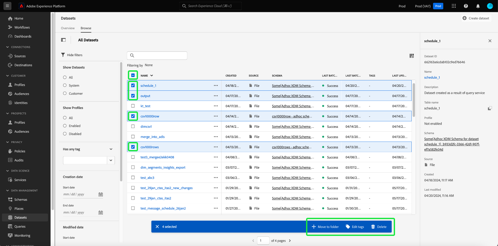
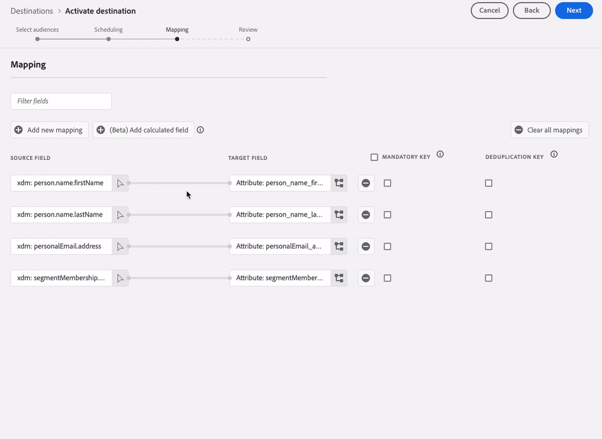
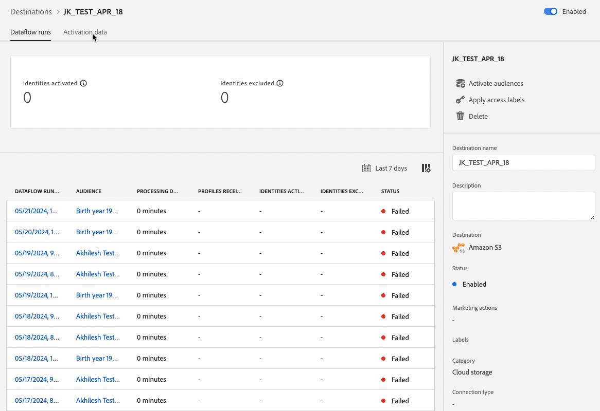
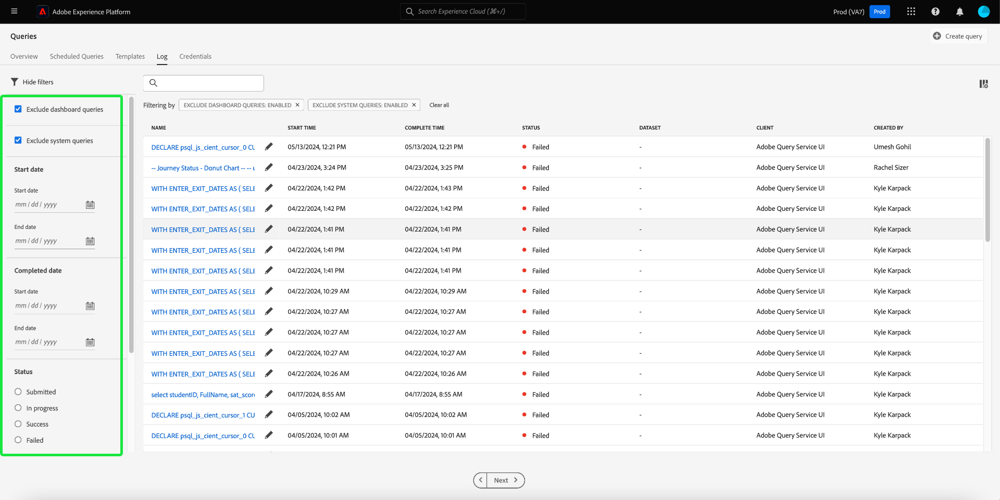
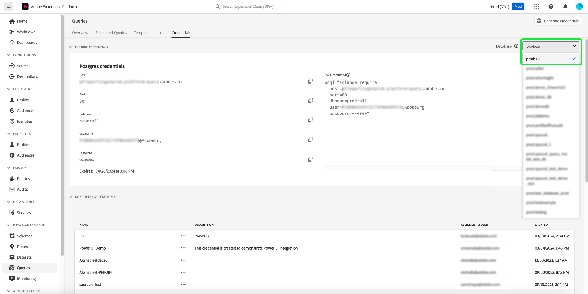

# Adobe Experience Platform release notes 

**Release date: May 21, 2024**

>[!TIP]
>
>The [Experience Platform API documentation](https://developer.adobe.com/experience-platform-apis/) is now interactive. Explore the API endpoints directly from the documentation pages to get immediate feedback and speed up your technical implementation. [Read more](#interactive-api-documentation) about the new functionality.

Updates to existing features in Experience Platform:

- [Catalog Service](#catalog-service)
- [Dashboards](#dashboards)
- [Data Governance](#governance)
- [Destinations](#destinations)
- [Query Service](#query-service)
- [Segmentation Service](#segmentation)
- [Sources](#sources)

Other updates in Adobe Experience Platform:

- [Documentation Updates](#documentation-updates)

## Catalog Service {#catalog-service}

Catalog Service is the system of record for data location and lineage within Adobe Experience Platform. While all data that is ingested into Experience Platform is stored in the data lake as files and directories, Catalog holds the metadata and description of those files and directories for lookup and monitoring purposes.

**New or updated features**

| Feature | Description |
| --- | --- |
| Bulk actions | The dataset inventory now supports bulk actions. Streamline your data management processes and ensure the efficient management of your datasets with bulk actions. Use bulk actions to save time by performing multiple actions on numerous datasets simultaneously.  Bulk actions include [Move to folder](../../catalog/datasets/user-guide.md#move-to-folders), [Edit tags](../../catalog/datasets/user-guide.md#manage-tags), and [Delete](../../catalog/datasets/user-guide.md#delete) datasets.   {width="100" zoomable="yes"}   For more information about this feature, read the [Datasets UI guide](../../catalog/datasets/user-guide.md#bulk-actions). |

{style="table-layout:auto"}

## Dashboards {#dashboards}

Adobe Experience Platform provides multiple dashboards through which you can view important insights about your organization's data, as captured during daily snapshots.

**New or updated features**

| Feature | Description |
| --- | --- |
| SQL Insights for extended app reporting  |  Seamlessly [transition the output of SQL analysis into comprehensible, business-friendly visual formats](../../dashboards/sql-insights-query-pro-mode/overview.md). Use custom SQL queries for precise data manipulation and the creation of dynamic charts from diverse structured datasets. You can use query pro mode to perform complex analysis with SQL and then share this analysis with non-technical users through charts on your custom dashboard or export them in CSV files. |

{style="table-layout:auto"}

## Data Governance {#governance}

Adobe Experience Platform Data Governance is a series of strategies and technologies used to manage customer data and ensure compliance with regulations, restrictions, and policies applicable to data usage. It plays a key role within [!DNL Experience Platform] at various levels, including cataloging, data lineage, data usage labeling, data access policies, and access control on data for marketing actions.

**New features**

| Feature | Description |
| --- | --- |
| mTLS support for HTTP API destinations and Adobe Journey Optimizer custom actions | Build customer trust with the strengthened security measures of the Mutual Transport Layer Security (mTLS) protocol. The [Experience Platform HTTP API destination](../../destinations/catalog/streaming/http-destination.md#mtls-protocol-support) and [Adobe Journey Optimizer custom actions](https://experienceleague.adobe.com/en/docs/journey-optimizer/using/orchestrate-journeys/about-journey-building/using-custom-actions) now support the mTLS protocol when sending data to configured endpoints. No additional configuration is required in your custom action or HTTP API destination to activate mTLS; this process occurs automatically when an mTLS-enabled endpoint is detected. You can [download the Adobe Journey Optimizer public certificate here](../../landing/governance-privacy-security/encryption.md#download-certificates) and the [Destinations Service public certificate here](../../landing/governance-privacy-security/encryption.md#download-certificates). See the [Experience Platform data encryption documentation](../../landing/governance-privacy-security/encryption.md#mtls-protocol-support) for more information on network connection protocols when exporting data to third-party systems. |

{style="table-layout:auto"}

## Destinations {#destinations}

[!DNL Destinations] are pre-built integrations with destination platforms that allow for the seamless activation of data from Adobe Experience Platform. You can use destinations to activate your known and unknown data for cross-channel marketing campaigns, email campaigns, targeted advertising, and many other use cases.

**New or updated functionality** {#destinations-new-updated-functionality}

| Functionality | Description |
| ----------- | ----------- |
| Reorder mapping fields for batch destinations | You can now change the order of the columns in your CSV exports by dragging and dropping the mapping fields in the [mapping step](../../destinations/ui/activate-batch-profile-destinations.md#mapping). The order of the mapped fields in the UI reflects in the order of the columns in the exported CSV file, from top to bottom, with the top row being the leftmost column in the CSV file.   {width="100" zoomable="yes"}|
| Preselected default export schedules for batch destinations | Experience Platform now automatically sets a default schedule for each file export. See the documentation on [scheduling audience exports](../../destinations/ui/activate-batch-profile-destinations.md#scheduling) to learn how to modify the default schedule. |
| Edit multiple audience activation schedules for batch destinations | You can now edit the activation schedule for multiple audiences exported to batch (file-based) destination from the **[!UICONTROL Activation data]** tab of the [destination details page](../../destinations/ui/destination-details-page.md#bulk-edit-schedule).   {width="100" zoomable="yes"}|
| Export multiple audiences on-demand to batch destinations | You can now select and export multiple audiences to batch destinations, through the [export files on-demand](../../destinations/ui/export-file-now.md) functionality. |

{style="table-layout:auto"}

For more general information on destinations, refer to the [destinations overview](../../destinations/home.md).

## Query Service {#query-service}

Query Service allows you to use standard SQL to query data in Adobe Experience Platform [!DNL Data Lake]. You can join any datasets from the [!DNL Data Lake] and capture the query results as a new dataset for use in reporting, Data Science Workspace, or for ingestion into Real-Time Customer Profile.

**Updated features**

| Feature | Description |
| --- | --- |
| Legacy Editor deprecated | The legacy editor has been deprecated and is no longer accessible for use. In its place, you can use the [enhanced features of the Query Editor](../../query-service/ui/user-guide.md#query-authoring) to write, validate, and run your queries. |
| Query Run Delay  | Stay in control of your compute hours by setting alerts for delays to your query runs. You can choose to receive alerts if a query status does not change state after a specific period of time. Just set your desired delay time in the Platform UI to stay informed on your query progress. To learn how to set this alert in the UI, refer to the [query schedules documentation](../../query-service/ui/query-schedules.md#alerts-for-query-status) or the [guide to inline query actions](../../query-service/ui/monitor-queries.md#query-run-delay). |
| Streamlined query log inventory  | You can now use an improved troubleshooting efficiency and task monitoring with a [streamlined query logs UI](../../query-service/ui/query-logs.md#filter-logs): <ul><li> The Platform UI now excludes all "System Queries" from logs tab by default. </li><li> View system queries by unchecking **Exclude system queries**. </li></ul>   {width="100" zoomable="yes"}   Use the streamlined query logs UI for a more focus view that helps you quickly identify and analyze the relevant logs.  |
| Database selector  | Use the new database selector dropdown menu to [conveniently access Customer Journey Analytics data views from Power BI or Tableau](../../query-service/ui/credentials.md#connect-to-customer-journey-analytics). You can now select your desired database directly from the Platform UI for a more seamless integration of your BI tools.   {width="100" zoomable="yes"}   |

{style="table-layout:auto"}

## Segmentation Service {#segmentation}

[!DNL Segmentation Service] allows you to segment data stored in [!DNL Experience Platform] that relates to individuals (such as customers, prospects, users, or organizations) into audiences. You can create audiences through segment definitions or other sources from your [!DNL Real-Time Customer Profile] data. These audiences are centrally configured and maintained on [!DNL Platform], and are readily accessible by any Adobe solution. 

**Updated feature**

| Feature | Description |
| --- | --- |
| Import externally generated audiences | Importing externally generated audiences now requires the "Import audience" permission. To learn more about permissions, read the [permissions UI guide](../../access-control/home.md#permissions). |

{style="table-layout:auto"}

## Sources {#sources}

Experience Platform provides a RESTful API and an interactive UI that lets you set up source connections for various data providers with ease. These source connections allow you to authenticate and connect to external storage systems and CRM services, set times for ingestion runs, and manage data ingestion throughput.

Use sources in Experience Platform to ingest data from an Adobe application or a third-party data source.

**New or updated features**

| Feature | Description |
| --- | --- |
| OAuth2 Client Credential authentication for [!DNL Salesforce] source | You can now use OAuth2 Client Credential to authenticate your [!DNL Salesforce] account on Experience Platform. Read the [!DNL Salesforce] source [API guide](../../sources/tutorials/api/create/crm/salesforce.md) and [UI guide](../../sources/tutorials/ui/create/crm/salesforce.md) for more information. |
| Support for sample dataflow for the [!DNL Marketo Engage] source | The [!DNL Marketo Engage] source now supports sample dataflows. Enable the the sample dataflow configuration to limit your ingestion rate and then try out Experience Platform features without having to ingest large amounts of data. For more information, read the guide on [creating a dataflow for [!DNL Marketo Engage] in the UI](../../sources/tutorials/ui/create/adobe-applications/marketo.md).|
| Updates to IP address allow list | Depending on your location, you must add a set of new IP addresses to your allow list in order to successfully use streaming sources. For a comprehensive list of the new IP addresses, read the [IP address allow list guide](../../sources/ip-address-allow-list.md). |

{style="table-layout:auto"}

**New or updated documentation**

| Updated documentation | Description |
| --- | --- |
| Documentation updates for [!DNL Google PubSub]| The [!DNL Google PubSub] source documentation has been updated with a comprehensive prerequisite guide. Use the new prerequisites section to learn how to create your service account, grant permissions at the topic or subscription level, and set configurations to optimize your usage of the [!DNL Google PubSub] source. Read the [[!DNL Google PubSub] overview](../../sources/connectors/cloud-storage/google-pubsub.md) for more information. |

{style="table-layout:auto"}

For more information on sources, read the [sources overview](../../sources/home.md).

## Documentation updates {#documentation-updates}

### Interactive Experience Platform API documentation {#interactive-api-documentation}

The [Experience Platform API documentation](https://developer.adobe.com/experience-platform-apis/) is now interactive. All the API reference pages now have a **Try it** .functionality that you can use to test API calls directly on the documentation website page. [Get the required authentication credentials](/help/landing/api-authentication.md) and start using the functionality to explore the API endpoints. 

Use this new functionality to explore the requests to and the responses from API endpoints, to get immediate feedback and speed up your technical implementation. For example, visit the [Identity Service API](https://developer.adobe.com/experience-platform-apis/references/identity-service/) or the [Schema Registry API](https://developer.adobe.com/experience-platform-apis/references/schema-registry/) endpoints to explore the new **Try it** functionality in the right rail.

>[!CAUTION]
>
>Be aware that by using the interactive API functionality on the documentation pages, you are making real API calls to the endpoints. Keep this in mind when experimenting with production sandboxes.

### Personalized insights and engagement {#personalized-insights-engagement}

A new end-to-end use case documentation page for [evolving one-time value to lifetime value](/help/rtcdp/use-case-guides/evolve-one-time-value-lifetime-value/evolve-one-time-value-to-lifetime-value.md) is now live. Read this documentation to understand how you can use Real-Time CDP and Adobe Journey Optimizer to convert sporadic visitors to your web properties to loyal customers.
