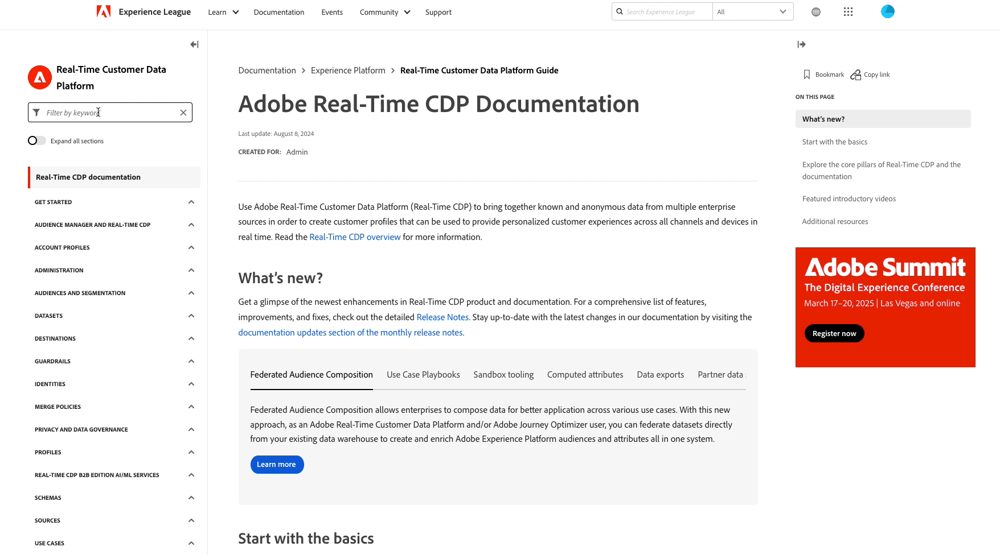

# Adobe Experience Platform release notes

>[!TIP]
>
>The new [AI Assistant product documentation](../../ai-assistant/landing.md) is now available. Use this page as a hub for all AI Assistant-related resources.

**Release date: November 26, 2024**

Updates to existing features and documentation in Adobe Experience Platform:

- [AI Assistant](#ai-assistant)
- [Destinations](#destinations)
- [Query Service](#query-service)
- [Sandboxes](#sandboxes)
- [Documentation updates](#documentation-updates)
  - [Interactive Experience Platform API documentation](#interactive-experience-platform-api-documentation)
  - [New table of contents on Experience League](#new-table-of-contents-on-experience-league)
  - [New AI Assistant landing page](#new-ai-assistant-landing-page)

## AI Assistant {#ai-assistant}

AI Assistant in Adobe Experience Platform is a conversational experience that you can use to accelerate your workflows in Adobe applications. You can use AI Assistant to better understand product knowledge, troubleshoot problems, or search through information and find operational insights. AI Assistant supports Experience Platform, Real-Time Customer Data Platform, Adobe Journey Optimizer and Customer Journey Analytics.

**New features**

| Feature | Description |
| --- | --- |
| [!BADGE Alpha]{type=Informative} Monitor significant changes and forecast audience growth | Use AI Assistant to monitor significant changes and provide growth forecasts for your audience and dataset sizes. You can then use this information to ensure the integrity of your audience data and offer forward-looking projections to support data-informed decision-making. For more information, read the guide on [monitoring significant changes and forecasting audience growth](../../ai-assistant/new-features/audience-forecasting.md). |
| [!BADGE Alpha]{type=Informative} Natural language estimation | Use AI Assistant's natural language estimation capabilities to estimate audience sizes and predict audience propensities based on simple, conversational questions. For more information, read the guide on [using natural language estimation with AI Assistant](../../ai-assistant/new-features/natural-language.md). |

{style="table-layout:auto"}

## Destinations {#destinations}

[!DNL Destinations] are pre-built integrations with destination platforms that allow for the seamless activation of data from Adobe Experience Platform. You can use destinations to activate your known and unknown data for cross-channel marketing campaigns, email campaigns, targeted advertising, and many other use cases.

**New or updated destinations** {#new-updated-destinations}

| Destination | Description |
| --- | --- |
| [Magnite Streaming Real-Time](/help/destinations/catalog/advertising/magnite-streaming.md) | Export audiences for activation, targeting, or suppression in the Magnite Streaming platform. Note that in order for audiences to be exported correctly to Magnite, you must use both the real-time and the batch destinations. |
| [Magnite Streaming Batch](/help/destinations/catalog/advertising/magnite-batch.md) | Export audiences for activation, targeting, or suppression in the Magnite Streaming platform. Note that in order for audiences to be exported correctly to Magnite, you must use both the real-time and the batch destinations. |

{style="table-layout:auto"}

**New or updated functionality** {#destinations-new-updated-functionality}

| Feature | Description |
| --- | --- |
| [Look up profile attributes in real-time on the edge](/help/destinations/ui/activate-edge-profile-lookup.md) | Learn how to look up edge profile attributes in real-time to deliver personalization experiences or inform decisioning rules through downstream applications, by using the Custom Personalization destination and Edge Network API.|

{style="table-layout:auto"}

For more information, read the [destinations overview](../../destinations/home.md).

## Query Service {#query-service} 

Query data in the Adobe Experience Platform data lake using standard SQL with Query Service. Seamlessly combine datasets and generate new ones from your query results to power reporting, enable data science workflows, or facilitate ingestion into Real-Time Customer Profile. For example, you can merge customer transaction data with behavioral data to identify high-value audiences for targeted marketing campaigns.

 **Updated features** 

| Feature | Description |
| --- | --- |
| Dater Distiller Authorization API | Manage and enforce IP-based access restrictions for Query Service sandboxes, to enhance data security and ensure compliance with organizational policies. Refer to the [Data Distiller Authorization API guide](../../query-service/auth-api/overview.md) for more information on its key features and capabilities, or the [OpenAPI documentation](https://developer.adobe.com/experience-platform-apis/references/data-distiller-auth/) for comprehensive information including endpoint details, parameter lists, request/response examples, and testing capabilities. |

For more information on [!DNL Query Service], please see the [[!DNL Query Service] overview](../../query-service/home.md). 

## Sandboxes {#sandboxes}

Adobe Experience Platform is built to enrich digital experience applications on a global scale. Companies often run multiple digital experience applications in parallel and need to cater for the development, testing, and deployment of these applications while ensuring operational compliance. To address this need, Experience Platform provides sandboxes that partition a single Experience Platform instance into separate virtual environments to help develop and evolve digital experience applications.

**New or updated features**

| Feature | Description |
| --- | --- |
| Package sharing with the sandbox tooling API | Use two new API endpoints, [`/handshake`](../../sandboxes/sandbox-tooling-api/packages.md#org-linking) and [`/transfers`](../../sandboxes/sandbox-tooling-api/packages.md#transfer-packages) to handle package sharing across organizations, such as request approvals, package visibility, and importing packages, using the sandbox tooling API. |

For more information on sandboxes, read the [sandboxes overview](../../sandboxes/home.md).

## Documentation updates {#documentation-updates}

### Interactive Experience Platform API documentation {#interactive-api-documentation}

The [Experience Platform API documentation](https://developer.adobe.com/experience-platform-apis/) is now fully interactive, allowing you to authenticate and explore APIs directly on the API reference documentation page. You can now go to the desired API reference documentation page, create or get your API authentication credentials, paste them into the **[!UICONTROL Try it]** block, and execute the call. All on one page. [Read more](/help/landing/api-authentication.md#get-credentials-functionality) about the functionality.

### New table of contents on Experience League {#new-table-of-contents-on-experience-league}

The table of contents on Experience League documentation pages has been improved to provide an improved experience for readers, including a keyword filter to discover the exact page you need, the ability to expand all pages, and more.   {width="250" align="center" zoomable="yes"}

### New AI Assistant landing page {#new-ai-assistant-landing-page}

Use the new [AI Assistant product documentation](../../ai-assistant/landing.md) page as a hub for all things AI Assistant. Refer to the product documentation for video tutorials, technical documentation, use cases, and links to blog posts about AI Assistant.
