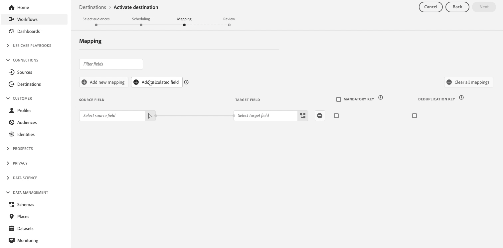

# Adobe Experience Platform release notes 

**Release date: October 29, 2024**

Updates to existing features and documentation in Adobe Experience Platform:

- [Dashboards](#dashboards)
- [Data collection](#data-collection-)
- [Destinations](#destinations)
- [Segmentation Service](#segmentation-service)
- [Sandboxes](#sandboxes)
- [Sources](#sources)

## Dashboards {#dashboards}

Experience Platform provides multiple dashboards through which you can view important insights about your organization's data, as captured during daily snapshots.

**New or updated features**

| Feature | Description |
| --- | --- |
| Data Distiller Templates | Explore multiple templates to gain structured insights into audience data. Use dashboards like **Advanced [!UICONTROL Audience Overlaps]**, **[!UICONTROL Audience Comparison]**, **[!UICONTROL Audience Trends]**, and **[!UICONTROL Audience Identity Overlaps]** to make data-driven decisions, optimize segmentation, and enhance engagement strategies. See the [Data Distiller Templates guide](../../dashboards/sql-insights-query-pro-mode/templates/overview.md) for more details. |
| Advanced Audience Overlaps | Quickly analyze audience intersections for specific audiences or view all overlaps to uncover valuable insights across your entire audience set. Use these insights to refine segmentation, reduce redundant messaging, and create more targeted campaigns for improved marketing efficiency. See the [Advanced Audience Overlaps guide](../../dashboards/sql-insights-query-pro-mode/templates/overlaps.md) for more details. |
| Audience Comparison enhancements | View a side-by-side comparison of key metrics between different audience groups using the **Audience Comparison** dashboard. With this dashboard you can select specific time frames and KPIs, such as audience size and identity composition, to make more informed decisions about audience segmentation and targeting strategies. Read the [Audience Comparison guide](../../dashboards/sql-insights-query-pro-mode/templates/comparison.md) for more information. |
| Audience Trends Visualization | Analyze audience metrics over time with the **[!UICONTROL Audience Trends]** dashboard. Visualize trends for audience size, number of identities, and number of single identity profiles to help you monitor audience evolution, measure growth, and refine your engagement strategies. See the [Audience Trends guide](../../dashboards/sql-insights-query-pro-mode/templates/trends.md) for more details. |
| Identity Overlaps Analysis | Analyze identity overlaps in selected audiences with the **[!UICONTROL Audience Identity Overlaps]** dashboard. View identity trends and breakdowns to understand how different identity types relate within your audience, enhancing identity stitching and improving customer segmentation accuracy. Refer to the [Audience Identity Overlaps guide](../../dashboards/sql-insights-query-pro-mode/templates/identity-overlaps.md) for more details. |

{style="table-layout:auto"}

For more information on dashboards, including how to grant access permissions and create custom widgets, begin by reading the [dashboards overview](../../dashboards/home.md).

## Data collection {#collection}

Adobe Experience Platform provides a suite of technologies that allow you to collect client-side customer experience data and send it to the Experience Platform Edge Network where it can be enriched, transformed, and distributed to Adobe or non-Adobe destinations.

**New features**

| Type | Feature | Description |
| --- | --- | --- |
| Tags and Extensions | Adobe Analytics JSON View | You can now use the Adobe Analytics tags extension to examine eVars, props, and event settings as JSON, which can now be included in the Web SDK extension and exported for editing. You can also upload or copy this data and store it on your device. Read the [Adobe Analytics extension documentation](../../tags/extensions/client/analytics/overview.md) for more information. |

{style="table-layout:auto"}

For more information, read the [data collection overview](../../collection/home.md).

## Destinations {#destinations}

[!DNL Destinations] are pre-built integrations with destination platforms that allow for the seamless activation of data from Adobe Experience Platform. You can use destinations to activate your known and unknown data for cross-channel marketing campaigns, email campaigns, targeted advertising, and many other use cases.

**New or updated functionality** {#destinations-new-updated-functionality}

| Feature | Description |
| ----------- | ----------- |
| [Array export support generally available](../../destinations/ui/export-arrays-maps-objects.md) | All customers can now use the **[!UICONTROL Add calculated field]** option when activating audiences *to file-based destinations* to export entire arrays or elements of arrays. Note that you still need to use the `array_to_string` function to flatten the array into a string in the target file.   {width="250" align="center" zoomable="yes"} |
| [Reporting accuracy enhancements for streaming destinations](/help/destinations/ui/export-datasets.md) | Starting with October 2024, Adobe is rolling out an update to increase reporting accuracy for streaming destinations. This enhancement ensures a better alignment between the Experience Platform and the destination platforms reporting.   Before this update, **[!UICONTROL Identities failed]** included all activation retries. After this update, only the last activation retry is included in the total count.   This enhancement currently applies to the [Google Customer Match destination](../../destinations/catalog/advertising/google-customer-match.md) but will be gradually rolled out to other Experience Platform streaming destinations. Following this enhancement, users of the [Google Customer Match destination](../../destinations/catalog/advertising/google-customer-match.md) may see an expected drop in their  **[!UICONTROL Identities failed]** count. |
| Flexible audience evaluation implications on [batch audience activation](../../destinations/ui/activate-batch-profile-destinations.md#export-full-files) | If you run [flexible audience evaluation](../../segmentation/ui/audience-portal.md#flexible-audience-evaluation) on audiences which are already set to be activated after segment evaluation, the audiences will be activated as soon as the flexible audience evaluation job finishes, regardless of any previous daily activation jobs.   This might result in audiences being exported multiple times a day, based on your actions. |

{style="table-layout:auto"}

For more information, read the [destinations overview](../../destinations/home.md).

## Segmentation Service {#segmentation-service}

[!DNL Segmentation Service] defines a particular subset of profiles by describing the criteria that distinguishes a marketable group of people within your customer base. Segments can be based on record data (such as demographic information) or time series events representing customer interactions with your brand.

**New or updated features**

| Feature | Description |
| ------- | ----------- |
| [!BADGE Limited Availability]{type=Informative} Flexible audience evaluation | Flexible audience evaluation lets you quickly create new audiences on demand for time-sensitive communications. More information on this new feature can be found within the [Audience Portal documentation](../../segmentation/ui/audience-portal.md#flexible-audience-evaluation). |

{style="table-layout:auto"}

For more information on [!DNL Segmentation Service], read the [Segmentation overview](../../segmentation/home.md).

## Sandboxes {#sandboxes}

Adobe Experience Platform is built to enrich digital experience applications on a global scale. Companies often run multiple digital experience applications in parallel and need to cater for the development, testing, and deployment of these applications while ensuring operational compliance. To address this need, Experience Platform provides sandboxes that partition a single Platform instance into separate virtual environments to help develop and evolve digital experience applications.

**New or updated features**

| Feature | Description |
| --- | --- |
| Sandbox tooling package sharing | You can now use sandbox tooling to easily export and import sandbox configurations between sandboxes across different organizations. There are now two categories of shared packages available: <ul><li>**[Private package](../../sandboxes/ui/sharing-packages-across-orgs.md#private-packages):** Use private package sharing with organizations that have approved the sharing request from the source organization.</li><li>**[Public package](../../sandboxes/ui/sharing-packages-across-orgs.md#public-packages):** Public packages can be shared without additional approvals and are easily imported using the package's payload.</li></ul> For more information on these features, read the guide  on [sharing packages across organizations](../../sandboxes/ui/sharing-packages-across-orgs.md).|
| [Package sharing](https://experienceleague.adobe.com/en/docs/experience-platform/sandbox/sandbox-tooling-api/packages#org-linking) in the sandbox tooling API | Use the sandbox tooling API to make requests to two new endpoints, `/handshake` and `/transfer` for sharing across organizations, fetching, and creating package sharing requests. An additional request has been added to the `/packages` endpoint to retrieve a package's payload. |

{style="table-layout:auto"}

For more information on sandboxes, read the [sandboxes overview](../../sandboxes/home.md).

## Sources {#sources}

Experience Platform provides a RESTful API and an interactive UI that lets you set up source connections for various data providers with ease. These source connections allow you to authenticate and connect to external storage systems and CRM services, set times for ingestion runs, and manage data ingestion throughput.

Use sources in Experience Platform to ingest data from an Adobe application or a third-party data source.

**Updated feature**

| Feature | Description |
| --- | --- |
| Support for filtering standard activity entities in [!DNL Marketo Engage] | You can use the [!DNL Flow Service] API to filter standard activity entities when ingesting data from your [!DNL Marketo Engage] source. Read the guide on [filtering [!DNL Marketo] standard activity data](../../sources/tutorials/api/filter.md#filter-activity-entities-for-marketo-engage) for more information. |

{style="table-layout:auto"}

For more information, read the [sources overview](../../sources/home.md).
