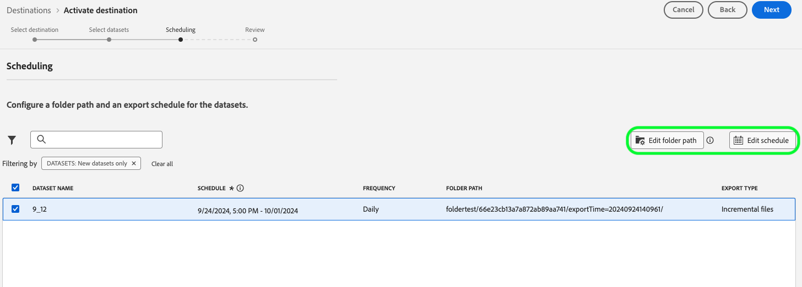
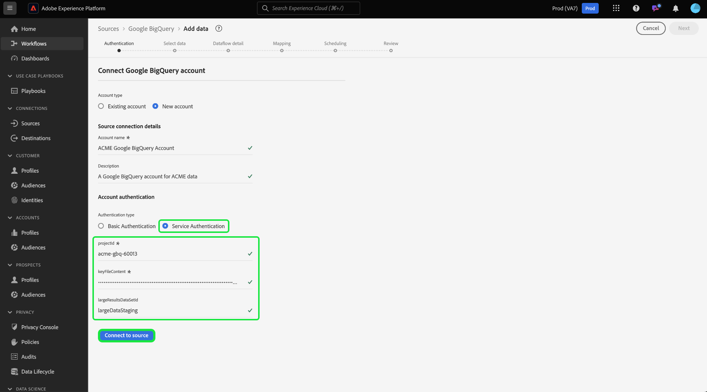

# Adobe Experience Platform release notes 

**Release date: September 24, 2024**

Updates to existing features and documentation in Adobe Experience Platform:

- [Alerts](#alerts)
- [Dashboards](#dashboards)
- [Data Prep](#data-prep)
- [Destinations](#destinations)
- [Experience Data Model (XDM)](#xdm)
- [Identity Service](#identity-service)
- [Query Service](#query-service)
- [Segmentation Service](#segmentation-service)
- [Sources](#sources)

## Alerts {#alerts}

Experience Platform allows you to subscribe to event-based alerts for various Platform activities. You can subscribe to different alert rules through the [!UICONTROL Alerts] tab in the Platform user interface, and can choose to receive alert messages within the UI itself or through email notifications.

**New or updated features**

| Feature | Description |
| --- | --- |
| Development sandbox support | You can now [subscribe to alerts](../../observability/alerts/ui.md) in both production and development sandboxes, enabling seamless monitoring across all environments. |
| Email templates | [Email alerts](../../observability/alerts/ui.md) now include detailed asset information, ensuring you have all the key details at your fingertips. |
| Enhanced Customization | You can now configure [alert thresholds](../../observability/alerts/ui.md#alert-threshold) offering greater flexibility to tailor alerts to your specific needs for the following alert types: <ul><li>Segment Job Delay</li><li>Segment Export Delay</li><li>Destination Flow Run Delay</li><li>Identity Service Flow Run Delay</li><li>Profile Flow Run Delay</li><li>Sources Flow Run Delay</li><li>Query Run Delay</li><li>Activation Skip Rate Exceeded</li><li>Sources Ingestion Error Rate Exceeded</ul> |
| Expanded Alerts | Audit event information alerts are now available for subscription for the following [alert rules](../../observability/alerts/rules.md): <ul><li>Audience create</li><li>Audience update</li><li>Audience delete</li><li>Dataset create</li><li>Dataset update</li><li>Dataset delete</li><li>Schema create</li><li>Schema update</li><li>Schema delete. |

{style="table-layout:auto"}

For more information about alerts, read the [[!DNL Observability Insights] overview](../../observability/home.md).

## Dashboards {#dashboards}

Experience Platform provides multiple dashboards through which you can view important insights about your organization's data, as captured during daily snapshots.

**New or updated features**

| Feature | Description |
| ------- | ----------- |
| License Usage Add-ons table | Gain granular visibility into license usage and manage your Platform resources with dedicated tables for core products and add-ons. Track and analyze key metrics for each core product with drill-through views at the sandbox level. Add-on metrics integrate seamlessly with core product metrics, offering a comprehensive view of usage. Enhanced visibility helps you optimize license management and align resources with organizational needs. See the [[!UICONTROL License Usage] dashboard guide](../../dashboards/guides/license-usage.md#overview-tab) for more details. |
| Query Pro Mode - Global Filter Upgrades | Enhance analysis with Query Pro Mode's new date filter. Refine insights with dynamic date parameters in your SQL queries and filter data by specific time frames. Choose preset or custom date ranges with an intuitive UI, keeping dashboards relevant for all users. Simplify workflows, maintain precision, and make timely decisions. Read the [guide on creating date filters](../../dashboards/sql-insights-query-pro-mode/filters/global-filter.md) for more information. |
| Query Pro Modes - Drill Throughs  | Unlock deeper insights with Query Pro Mode's Drill Through feature and seamlessly navigate from high-level charts to detailed dashboards. Use this feature to effortlessly move from summaries to in-depth analysis, and explore trends, customer behaviors, and KPIs. Automatic filter pass-throughs and multi-level drill-throughs keep data consistent, ensuring a smooth exploration. Simplify workflows, keep context, and speed up decisions. Read the [step-by-step guide on creating drill-throughs](../../dashboards/sql-insights-query-pro-mode/drill-through.md) for more information. |
| Query Pro Mode - Advanced Table Attributes  | Use Query Pro Mode advanced table attributes to streamline data visualization, enhance workflow efficiency, and improve data clarity. Add automatic sorting, resizing, and pagination to your tables directly from custom dashboards. Sort columns to prioritize key data, resize for optimal readability, and navigate large datasets seamlessly without modifying SQL queries. Read the '[View More](../../dashboards/sql-insights-query-pro-mode/view-more.md)' guide to learn how to integrate these features and elevate your data insights. |
| Total Data Volume | The "Average Profile Richness" metric has been replaced with the "Total Data Volume" metric. Total Data Volume refers to the total amount of data available that can be used with Real-Time Customer Profile for engagement and personalization workflows. More details about this change can be found in the [Total Data Volume guide](../../landing/license-usage-and-guardrails/total-data-volume.md). |

{style="table-layout:auto"}

For more information on dashboards, including how to grant access permissions and create custom widgets, begin by reading the [dashboards overview](../../dashboards/home.md).

## Data Prep {#data-prep}

Use data prep to map, transform, and validate data to and from Experience Data Model (XDM).

**New or updated features**

| Feature | Description |
| --- | --- |
| [!BADGE Beta]{type=Informative} New Data Prep functions for use in Destinations | You can now use the following array functions for Destinations use cases:<ul><li>`array_to_string`</li><li>`filterArray`</li><li>`transformArray`</li><li>`flattenArray`</li></ul> For more information, read the the [data prep functions guide](../../data-prep/functions.md#arrays). |

{style="table-layout:auto"}

For more information on Data Prep, read the [Data Prep overview](../../data-prep/home.md).

## Destinations {#destinations}

**Updated: September 30, 2024**

[!DNL Destinations] are pre-built integrations with destination platforms that allow for the seamless activation of data from Adobe Experience Platform. You can use destinations to activate your known and unknown data for cross-channel marketing campaigns, email campaigns, targeted advertising, and many other use cases.

**New or updated destinations** {#new-updated-destinations}

| Destination | Description |
| --- | --- |
| [Amazon Ads](/help/destinations/catalog/advertising/amazon-ads.md) | The September 2024 release adds the mapping option to export the `countryCode` parameter into Amazon Ads. Use `countryCode` in the [mapping step](/help/destinations/catalog/advertising/amazon-ads.md#map) to improve your identity match rates with Amazon. |
| [[!BADGE B2B]{type=Informative} Demandbase](/help/destinations/catalog/advertising/demandbase.md) | Use this destination to activate your account audiences for Account-Based Marketing (ABM) use cases. Advertise to relevant personas and roles in your target accounts via DemandBase's B2B Demand Side Platform (DSP). Target accounts can also be enriched with Demandbase third-party data, for other downstream use-cases in marketing and sales. |

{style="table-layout:auto"}

**New or updated functionality** {#destinations-new-updated-functionality}

| Feature | Description |
| --- | --- |
| [Dataset export](/help/destinations/ui/export-datasets.md) enhancements | The September 2024 release of Experience Platform includes several enhancements to the dataset export feature capabilities, to better support various data egress use cases. These feature enhancements include: <ul><li>New data folder configurability options, including the option to add and remove subfolders.</li><li>New export options including full file export (once) and the ability to specify end dates</li><li>Note: Adobe is also introducing a default end date of May 1st 2025 for all dataset export dataflows created prior to the September release. For any of these dataflows, customers will need to update the end date in the dataflow manually before the end date, otherwise exports will stop on this date.</li></ul>   {width="250" align="center" zoomable="yes"} |

{style="table-layout:auto"}

For more information, read the [destinations overview](../../destinations/home.md).

## Experience Data Model (XDM) {#xdm}

XDM is an open-source specification that provides common structures and definitions (schemas) for data that is brought into Adobe Experience Platform. By adhering to XDM standards, all customer experience data can be incorporated into a common representation to deliver insights in a faster, more integrated way. You can gain valuable insights from customer actions, define customer audiences through segments, and use customer attributes for personalization purposes.

**Updated features**

| Feature | Description |
| --- | --- |
| Enhancements to the Schema Editor | Take control of your schema relationships with an updated relationship workflow in the Schema Editor. Easily update or remove existing relationships directly from the Experience Platform UI, making schema management smoother and more intuitive. Adjust reference schemas and rename relationships with confidence, ensuring seamless data integrity across segmentation and other key processes. To learn more about efficiently managing your schema relationships, see the guides on [defining relationship fields in the UI](../../xdm/tutorials/relationship-ui.md#create-a-relationship-field-group) and for [B2B relationships](../../xdm/tutorials/relationship-b2b.md#edit-a-b2b-schema-relationship). |

{style="table-layout:auto"}

For more information on XDM, read the [XDM System overview](../../xdm/home.md).

## Identity Service {#identity-service}

Use Adobe Experience Platform Identity Service to create a comprehensive view of your customers and their behaviors by bridging identities across devices and systems, allowing you to deliver impactful, personal digital experiences in real time.

**Updated feature**

| Feature | Description |
| --- | --- |
| Limited Availability of identity graph linking rules | Identity graph linking rules is a suite of tools in Identity Service that you can use to ensure accurate personalization for your users. <ul><li>You can now make use of the [identity optimization algorithm](../../identity-service/identity-graph-linking-rules/identity-optimization-algorithm.md) to ensure that an identity graph is representative of a single person, and therefore, prevents the unwanted merging of identities on Real-Time Customer Profile.</li><li>Configure [namespace priorities](../../identity-service/identity-graph-linking-rules/namespace-priority.md) to define the importance of your respective namespaces and influence how your profiles are formed and segmented.</li><li>Use the [graph simulation tool in the UI](../../identity-service/identity-graph-linking-rules/graph-simulation.md) to simulate identity graphs with varying configurations.</li><li>Use the [identity settings interface](../../identity-service/identity-graph-linking-rules/identity-settings-ui.md) to designate your unique namespace and establish priorities for all namespaces in your organization.</li><li>Refer to the [identity dashboard](../../identity-service/identity-graph-linking-rules/implementation-guide.md#validate-your-graphs) for metrics and trends regarding your graph data.</li></ul> To try out identity graph linking rules, contact your Adobe Account Team for access to development sandboxes. |

**Updated documentation**

| Feature | Description |
| --- | --- |
| Troubleshooting guide for identity graph linking rules | Read the new [troubleshooting guide for identity graph linking rules](../../identity-service/identity-graph-linking-rules/troubleshooting.md) for approaches and debugging solutions that you can undertake to resolve common issues that you might encounter when working with identity graph linking rules. |
| FAQ for identity graph linking rules | Read the new [identity graph linking rules FAQ](../../identity-service/identity-graph-linking-rules/troubleshooting.md#frequently-asked-questions) for a list of answers to frequently asked questions regarding namespace priority, the identity optimization algorithm, and other facets of identity graph linking rules. |

{style="table-layout:auto"}

For more information on Identity Service, read the [Identity Service overview](../../identity-service/home.md).

## Query Service {#query-service}

Query Service allows you to use standard SQL to query data in Adobe Experience Platform [!DNL data lake]. You can join any datasets from data lake and capture the query results as a new dataset for use in reporting, Data Science Workspace, or for ingestion into Real-Time Customer Profile.

**Updated features**

| Feature | Description |
| --- | --- |
| Data Distiller Audiences | Easily create, manage, and activate audiences with the SQL audience extension in Experience Platform's Data Distiller. Define audience segments with SQL commands directly from your data lake, bypassing the need for raw data in profiles. Refine targeting strategies and automatically sync audiences to file-based destinations with this flexible, data-driven approach. Streamline workflows, optimize audience management, and unlock data's full potential. Read the [guide on using the SQL audience extension](../../query-service/data-distiller-audiences/overview.md) to elevate your audience strategies. |
| Data Distiller Statistics - Hypercubes | Optimize big data analysis with Hypercubes. Handle complex calculations—like distinct counts and multi-dimensional analysis—without reprocessing historical data. Incrementally update data, streamline workflows, and cut processing time while maintaining accuracy and efficiency. Get faster, scalable, and cost-effective insights that transform decision-making. Explore the [guide on using Hypercubes](../../query-service/hypercubes/overview.md) to unlock advanced analysis. |
| Query Editor Object browser | Boost query efficiency with the new Object Browser in the Query Editor. Quickly search, filter, and access datasets to write and refine queries faster. With real-time schema updates and instant table metadata, you can streamline workflows, cut navigation time, and enhance your query experience. Unlock your data's potential and optimize analysis. Read the [guide on using the Object Browser](../../query-service/ui/user-guide.md#object-browser) for more information. |
| Compute Hours | Gain control over resource usage with the newly visible Compute Hours metric for scheduled queries. View Comput Hours at the query execution level to monitor and optimize resource use for CTAS/ITAS batch queries. Track start times, completion status, and compute time for each query run. Fine-tune performance and reduce costs effortlessly. Read the [guide on Compute Hours](../../query-service/ui/query-schedules.md#compute-hours-at-job-level) for information on how to maximize your query efficiency. |

{style="table-layout:auto"}

To learn more about Query Service, read the [Query Service overview](../../query-service/home.md).

## Segmentation Service {#segmentation-service}

[!DNL Segmentation Service] defines a particular subset of profiles by describing the criteria that distinguishes a marketable group of people within your customer base. Segments can be based on record data (such as demographic information) or time series events representing customer interactions with your brand.

**New or updated features**

| Feature | Description |
| ------- | ----------- |
| Streaming segmentation criteria update | Starting with the September 2024 release, the criteria for your audiences to be eligible for streaming segmentation have been updated. More information about these changes can be found in the [streaming segmentation eligibility criteria update](../../segmentation/eligibility-criteria-update.md). |
| Unified Search implementation | Search behavior within Segment Builder will now use Unified Search. This allows for a more robust experience when managing and searching for audiences to reuse for segment membership. For more information on this change, read the [Segment Builder guide](../../segmentation/ui/segment-builder.md#rule-builder-canvas). |

{style="table-layout:auto"}

For more information on [!DNL Segmentation Service], read the [Segmentation overview](../../segmentation/home.md).

## Sources {#sources}

Experience Platform provides a RESTful API and an interactive UI that lets you set up source connections for various data providers with ease. These source connections allow you to authenticate and connect to external storage systems and CRM services, set times for ingestion runs, and manage data ingestion throughput.

Use sources in Experience Platform to ingest data from an Adobe application or a third-party data source.

**Updated feature**

| Feature | Description |
| --- | --- |
| [!BADGE Beta]{type=Informative} Support for encrypted data ingestion in the UI | You can now ingest encrypted data from a cloud storage batch source using the sources workspace in the Experience Platform user interface. Read the tutorial on [ingesting encrypted data in the UI](../../sources/tutorials/ui/encryped-ingestion.md) for more information. |
| General Availability of [!DNL Snowflake Streaming] source | The [!DNL Snowflake Streaming] source is now in GA. Use this source to stream data from your [!DNL Snowflake] account to Experience Platform. Read the [[!DNL Snowflake Streaming] overview](../../sources/connectors/databases/snowflake-streaming.md)for more information. |
| Support for service account authentication in [!DNL Google BigQuery] | You can now connect your [!DNL Google BigQuery] account to Experience Platform using service account authentication. Read the [[!DNL Google BigQuery] overview](../../sources/connectors/databases/bigquery.md#generate-your-google-bigquery-credentials) for more information.   {width="250" align="center" zoomable="yes"}|
| Support for skipping sample data preview | You can now elect to skip data preview when creating a source connection with the following sources: <ul><li>[[!DNL Google BigQuery]](../../sources/tutorials/ui/create/databases/bigquery.md#skip-preview-of-sample-data)</li><li>[[!DNL Salesforce]](../../sources/tutorials/ui/create/crm/salesforce.md#skip-preview-of-sample-data)</li><li>[[!DNL Snowflake]](../../sources/tutorials/ui/create/databases/snowflake.md#skip-preview-of-sample-data)</li></ul> You can skip data preview to circumvent a timeout that may occur when ingesting large batches data. Doing so may prevent the auto-validation of your calculated and required fields. If you elect to skip data preview,  then you may have to manually validate your calculated and required fields during mapping. |
| Support for disabling chunking in [!DNL SFTP] | You can now configure a setting that allows you to disable chunking in the [!DNL SFTP] source. Read the [[!DNL SFTP] overview](../../sources/connectors/cloud-storage/sftp.md) for more information.|

{style="table-layout:auto"}

For more information, read the [sources overview](../../sources/home.md).
