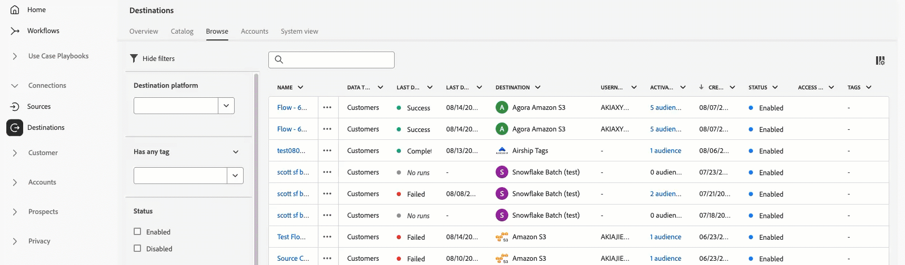

# Adobe Experience Platform release notes

>[!TIP]
>
>Refer to the following documentation for release notes of other Adobe Experience Platform applications:
>
>- [Adobe Journey Optimizer](https://experienceleague.adobe.com/en/docs/journey-optimizer/using/whats-new/release-notes)
>- [Adobe Journey Optimizer B2B](https://experienceleague.adobe.com/en/docs/journey-optimizer-b2b/user/release-notes)
>- [Customer Journey Analytics](https://experienceleague.adobe.com/en/docs/analytics-platform/using/releases/pre-release-notes)
>- [Federated Audience Composition](https://experienceleague.adobe.com/en/docs/federated-audience-composition/using/e-release-notes)
>- [Real-Time CDP Collaboration](https://experienceleague.adobe.com/en/docs/real-time-cdp-collaboration/using/latest)

**Release date: August 19, 2025**


New features and updates to existing features in Adobe Experience Platform:

- [Alerts](#alerts)
- [Catalog Service](#catalog-service)
- [Destinations](#destinations)
- [Experience Data Model (XDM)](#xdm)
- [Sandboxes](#sandboxes)
- [Segmentation Service](#segmentation-service)
- [Sources](#sources)

## Alerts {#alerts}

Experience Platform allows you to subscribe to event-based alerts for various Experience Platform activities. You can subscribe to different alert rules through the [!UICONTROL Alerts] tab in the Experience Platform user interface, and can choose to receive alert messages within the UI itself or through email notifications.

**New features**

| Feature | Description |
| ------- | ----------- |
| Streaming throughput capacity alerts | Three new alerts allow users to subscribe to and configure alerts to proactively manage and monitor performance of streaming throughput capacity. New alerts include when streaming throughput reached 80%, 90%, or exceeds capacity limits. For more information, read the [capacity alert rules](../../observability/alerts/rules.md#capacity) guide. |

For more information about alerts, read the [[!DNL Observability Insights] overview](../../observability/home.md).

## Catalog Service {#catalog-service}

Catalog Service is the system of record for data location and lineage within Adobe Experience Platform. While all data that is ingested into Experience Platform is stored in the data lake as files and directories, Catalog holds the metadata and description of those files and directories for lookup and monitoring purposes.

**New or updated features**

| Feature | Description |
| --- | --- |
| Data retention for Real-Time Customer Profile | You can **only** update the data retention period for Real-Time Customer Profile once every 30 days. |

For more information about Catalog Service, read the the [Catalog Service overview](../../catalog/home.md).

## Destinations {#destinations}

[!DNL Destinations] are pre-built integrations with destination platforms that allow for the seamless activation of data from Experience Platform. You can use destinations to activate your known and unknown data for cross-channel marketing campaigns, email campaigns, targeted advertising, and many other use cases.

>[!IMPORTANT]
>
>**Dataset export schedule extension**
>
>If your organization has dataset export dataflows created prior to November 2024, these dataflows will stop working on **September 1st, 2025**. If you need the dataflows to keep exporting data after September 1st, 2025, you must extend their schedules for each destination to which you are exporting datasets, by following the steps in [this guide](../../destinations/ui/dataset-expiration-update.md).

>[!IMPORTANT]
>
>**IP allowlist update required for API-based destinations**
>
>Due to upgrades to the streaming destinations export engine, organizations using [IP allowlists](../../destinations/catalog/streaming/ip-address-allow-list.md) for API-based destinations must add the following IP addresses to their allowlists **before September 15, 2025**:
>
>**Required IP addresses:**
>
>```
>3.209.222.108
>3.211.230.204
>35.169.227.49
>66.117.18.133
>66.117.18.134
>66.117.18.135
>```
>
>**This change applies to the following destination types:**
>
>- [Streaming audience export destinations](../../destinations/destination-types.md#streaming-destinations) ([Pega CDH Realtime Audience](/help/destinations/catalog/personalization/pega-v2.md), API-based integrations with [Salesforce Marketing Cloud](../../destinations/catalog/email-marketing/salesforce-marketing-cloud-exact-target.md) and [Oracle Eloqua](../../destinations/catalog/email-marketing/oracle-eloqua-api.md))
>- Public or private destinations built through [Destination SDK](../../destinations/destination-sdk/getting-started.md)
>
>**Action required:** If you have worked with Adobe to allowlist any IP addresses to API-based streaming destinations, you need to add the IP addresses above to your allowlist to ensure uninterrupted dataflows to your API-based destinations.

**New destinations**

| Destination | Description |
| --- | --- |
| [[!DNL Acxiom Real ID Audience Connection]](../../destinations/catalog/advertising/acxiom-real-id-audience-connection.md) destination  | Use the [!DNL Acxiom Real ID Audience Connection] destination to enhance audiences with [!DNL Acxiom's] [Real ID](https://www.acxiom.com/real-id/real-id/) technology and activate audiences to multiple platforms, such as [!DNL Altice], [!DNL Ampersand], [!DNL Comcast], and more. |

**Updated destinations**

| Destination | Description |
| --- | --- |
| [[!DNL Microsoft Bing]](../../destinations/catalog/advertising/bing.md) internal upgrade | Starting August 11, 2025, for a short period of time, you may have seen two **[!DNL Microsoft Bing]** cards side-by-side in the destinations catalog. This is due to an internal upgrade to the destinations service. The existing **[!DNL Microsoft Bing]** destination connector has been renamed to **[!UICONTROL (Deprecated) Microsoft Bing]** and a new card with the name **[!UICONTROL Microsoft Bing]** is now available to you. <br> The upgrade has been completed and the deprecated card has been removed from the destination catalog. Use the **[!UICONTROL Microsoft Bing]** connection in the catalog for new activation data flows. If you had any active dataflows to the **[!UICONTROL (Deprecated) Microsoft Bing]** destination, they will be updated automatically, so no action is required from you. <br><br>If you are creating dataflows through the [Flow Service API](https://developer.adobe.com/experience-platform-apis/references/destinations/), you must update your [!DNL flow spec ID] and [!DNL connection spec ID] to the following values:<ul><li>Flow spec ID: `8d42c81d-9ba7-4534-9bf6-cf7c64fbd12e`</li><li>Connection spec ID: `dd69fc59-3bc5-451e-8ec2-1e74a670afd4`</li></ul> Following this upgrade, you may experience a **drop in the number of activated profiles** in your dataflows to [!DNL Microsoft Bing]. This drop is caused by the introduction of the **ECID mapping requirement** for all activations to this destination platform.|
| Authentication expiration details for [[!DNL LinkedIn]](../../destinations/catalog/social/linkedin.md) and [LinkedIn Matched Audiences](../../destinations/catalog/social/linkedin-b2b.md) destinations | Authentication expiration information for [!DNL LinkedIn] destinations is now visible directly in the Experience Platform interface, so you can see when your authentication will expire and renew it before it causes any disruptions to your dataflows. You can monitor your token expiration dates from the **[!UICONTROL Account expiration date]** column in either the **[[!UICONTROL Accounts]](../../destinations/ui/destinations-workspace.md#accounts)** or the **[[!UICONTROL Browse]](../../destinations/ui/destinations-workspace.md#browse)** tabs.|
| [LinkedIn Matched Audiences](../../destinations/catalog/social/linkedin-b2b.md) [!DNL IDFA] identity support removal |Starting with September 2025, you can no longer map [!DNL IDFA] as a target identity, since [!DNL IDFA] is no longer supported by the [!DNL LinkedIn Matched Audiences] destination. See the [!DNL LinkedIn Matched Audiences] integration [documentation](https://learn.microsoft.com/en-us/linkedin/marketing/matched-audiences/create-and-manage-segment-users?view=li-lms-2025-07&tabs=http#idtypes) for more details. This change is due to LinkedIn's requirements, and is not related to any Experience Platform destination service upgrades. |

**New or updated functionality**

| Feature | Description |
| --- | --- |
| Enhanced search, filtering, and tagging capabilities for destinations | Improve your destination management workflow with enhanced search, filtering, and tagging capabilities across the [Browse](../../destinations/ui/destinations-workspace.md#browse) and [Accounts](../../destinations/ui/destinations-workspace.md#accounts) tabs. <br> You can now search for specific dataflows and accounts by name, filter by various criteria including destination platform, status, and dates, and create custom tags to organize your destinations. Column sorting is also available for key fields like last dataflow run time, making it easier to identify and manage your destination connections. <br> |

## Experience Data Model (XDM) {#xdm}

XDM is an open-source specification that provides common structures and definitions (schemas) for data that is brought into Experience Platform. By adhering to XDM standards, all customer experience data can be incorporated into a common representation to deliver insights in a faster, more integrated way. You can gain valuable insights from customer actions, define customer audiences through segments, and use customer attributes for personalization purposes.

**New features**

| Feature | Description |
| ------- | ----------- |
| Model-Based Schemas | Simplify your data modeling with Model-Based Schemas. You can now create schemas more easily with comprehensive how-to examples and guidance. This feature is currently available to Campaign Orchestration license holders and will expand to Data Distiller customers at GA, making data modeling more accessible and efficient. |

For more information, read the [XDM overview](../../xdm/home.md).

<!--
## Real-Time Customer Profile {#profile}

Real-Time Customer Profile provides a unified, actionable view of each customer by consolidating data from all channels into a single profile.

**New or updated features**

| Feature | Description |
| --- | --- |
| Enhanced lookup functionality in the Entities API | The Entities API now supports the following: <ul><li>Person (Profile)</li><li>Experience Events</li><li>Account</li><li>Opportunity</li></ul> This update simplifies API usage and helps ensure optimal performance and reliability. If you previously used lookups for other entity types—including join tables and custom Multi-Entity types—now is a great opportunity to review your API usage and take advantage of the improved experience. For more information, read the [Real-Time CDB B2B Edition architecture upgrade guide](../../rtcdp/b2b-architecture-upgrade.md). |

For more information on Real-Time Customer Profile, read the [Profile overview](../../profile/home.md).

-->

## Sandboxes {#sandboxes}

Experience Platform is built to enrich digital experience applications on a global scale. Companies often run multiple digital experience applications in parallel and need to cater for the development, testing, and deployment of these applications while ensuring operational compliance.

**New or updated features**

| Feature | Description |
| --- | --- |
| Dependency object de-duplication in importing workflow | Sandbox tooling will now always reuse existing objects if objects with the same name are detected, to avoid object proliferation. This change applies to the following objects: <ul><li>Schema</li><li>Field group</li><li>Audience</li><li>`decisioning_ranking`</li><li>`decisioning_rules`</li></ul> For more information, read the [guide on objects supported for sandbox tooling](../../sandboxes/ui/sandbox-tooling.md#objects-supported-for-sandbox-tooling). |
| Entire sandbox support for across orgs package sharing | Sandbox tooling now supports **Entire sandbox** type in across org package sharing. You can now share both entire sandbox and Multi-object packages across orgs. For more information, read the [guide on objects supported for sandbox tooling](../../sandboxes/ui/sharing-packages-across-orgs.md). |

For more information on sandboxes, read the [sandboxes overview](../../sandboxes/home.md).

## Segmentation Service {#segmentation-service}

[!DNL Segmentation Service] defines a particular subset of profiles by describing the criteria that distinguishes a marketable group of people within your customer base. Audiences can be based on record data (such as demographic information) or time series events representing customer interactions with your brand.

**New or updated features**

| Feature | Description |
| ------- | ----------- |
| Audience estimates | Audience estimates are now displayed as a **range**, which is based on the confidence interval of the sampling data. To learn more about estimates, read the [Segment Builder guide](/help/segmentation/ui/segment-builder.md#audience-properties). |

For more information, read the [[!DNL Segmentation Service] overview](../../segmentation/home.md).

## Sources {#sources}

Experience Platform provides a RESTful API and an interactive UI that lets you set up source connections for various data providers with ease. These source connections allow you to authenticate and connect to external storage systems and CRM services, set times for ingestion runs, and manage data ingestion throughput.

**New or updated functionality**

| Feature | Description |
| --- | --- |
| General availability of the [!DNL Oracle NetSuite] source | The [!DNL Oracle NetSuite] source is now generally available. You can now connect your [!DNL Oracle NetSuite] account to Experience Platform to ingest activities and entities data for unified analysis and activation. For more information, read the [[!DNL Oracle NetSuite] overview](../../sources/connectors/marketing-automation/oracle-netsuite.md). |
| General availability of the [!DNL PathFactory] source | The [!DNL PathFactory] source is now generally available. You can connect your [!DNL PathFactory] account to Experience Platform to ingest visitors, sessions, and page views data for unified analysis and activation. For more information, read the [[!DNL PathFactory] overview](../../sources/connectors/marketing-automation/pathfactory.md). |
| General availability of the [!DNL Stripe] source | The [!DNL Stripe] source is now generally available. You can connect your [!DNL Stripe] account to Experience Platform to ingest payment and transaction data for unified analysis and activation. For more information, read the [[!DNL Stripe] overview](../../sources/connectors/payments/stripe.md). |
| Enhanced authentication for [!DNL Azure Blob Storage] | You can now use service principal based authentication to connect your [!DNL Azure Blob Storage] source to Experience Platform. Use service principal based authentication for enhanced security, easier credential rotation, and a more granular access control for your account. For more information, read the [[!DNL Azure Blob Storage] overview](../../sources/connectors/cloud-storage/blob.md). |

For more information, read the [sources overview](../../sources/home.md).

<!--
| [!DNL Marketo] source documentation updates | Get complete visibility into how your [!DNL Marketo] data is transformed when it enters Experience Platform. All field mappings now include detailed explanations of data transformations, so you can understand exactly how your `PersonID` becomes `leadID` and `eventType` becomes `activityType`. |
| [!BADGE Beta]{type=Informative} Support for [!DNL Azure Private Links] in the UI | You can now use [!DNL Azure Private Links] for a select group of sources in the UI. Use this feature to create a private endpoint that which your source can connect to. With private endpoints, you can set up connections and dataflows that bypass the public internet, giving you enhanced security and network isolation for your sensitive data. Support for [!DNL Azure Private Links] is available to the following following sources: <ul><li>[[!DNL Azure Blob Storage]](../../sources/connectors/cloud-storage/blob.md)</li><li>[[!DNL ADLS Gen2]](../../sources/connectors/cloud-storage/adls-gen2.md)</li><li>[[!DNL Azure File Storage]](../../sources/connectors/cloud-storage/azure-file-storage.md)</li><li>[[!DNL Snowflake]](../../sources/connectors/databases/snowflake.md)</li></ul> For more information, read the guide on [[!DNL Azure Private Links]](../../sources/tutorials/ui/private-link.md). |

| Enhanced [[!DNL Marketo Engage]](../../destinations/catalog/adobe/marketo-engage-connection.md) destination  | The enhanced [[!DNL Marketo Engage]](../../destinations/catalog/adobe/marketo-engage-connection.md) destination is an upgraded version of the existing [[!DNL (Legacy) (V2) Marketo Engage]](../../destinations/catalog/adobe/marketo-engage.md) connector. This new connector brings profile sync capabilities in addition to the existing audience sync capabilities from the legacy connector, providing a tighter integration with [!DNL Marketo Engage]. <br> The [[!DNL (Legacy) (V2) Marketo Engage]](../../destinations/catalog/adobe/marketo-engage.md) connector will be deprecated in **March 2026**. To ensure a smooth transition to the new **[[!UICONTROL Marketo Engage]](../../destinations/catalog/adobe/marketo-engage-connection.md)** destination, review the following key points and required actions: <ul><li>All users of the existing **[!UICONTROL (Legacy) (V2) Marketo Engage]** must migrate to the new **[!UICONTROL Marketo Engage]** destination by March 2026.</li><li> **Existing dataflows will not be migrated automatically.** You must [set up a new connection](../../destinations/ui/connect-destination.md) to the new **[!UICONTROL Marketo Engage]** destination and activate your audiences there.</li></ul>|
-->
