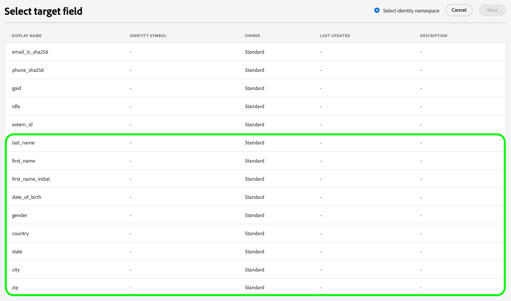

# Adobe Experience Platform release notes

>[!TIP]
>
>Refer to the following documentation for release notes of other Adobe Experience Platform applications:
>
>- [Adobe Journey Optimizer](https://experienceleague.adobe.com/en/docs/journey-optimizer/using/whats-new/release-notes)
>- [Adobe Journey Optimizer B2B](https://experienceleague.adobe.com/en/docs/journey-optimizer-b2b/user/release-notes)
>- [Customer Journey Analytics](https://experienceleague.adobe.com/en/docs/analytics-platform/using/releases/pre-release-notes)
>- [Federated Audience Composition](https://experienceleague.adobe.com/en/docs/federated-audience-composition/using/e-release-notes)
>- [Real-Time CDP Collaboration](https://experienceleague.adobe.com/en/docs/real-time-cdp-collaboration/using/latest)

**Release date: June 18, 2025**

New features and updates to existing features in Adobe Experience Platform:

- [Access control](#access-control)
- [Advanced data lifecycle management](#advanced-data-lifecycle-management)
- [Catalog Service](#catalog-service)
- [Dashboards](#dashboards)
- [Data Governance](#data-governance)
- [Destinations](#destinations)
- [Federated Audience Composition](#fac)
- [Privacy Service](#privacy-service)
- [Sandboxes](#sandboxes)
- [Segmentation](#segmentation-service)
- [Sources](#sources)

## Access control {#access-control}

Experience Platform leverages [Adobe Admin Console](https://adminconsole.adobe.com) product profiles to link users with permissions and sandboxes. Permissions control access to a variety of Experience Platform capabilities, including data modeling, profile management, and sandbox administration.

**Key features**

| Feature | Description |
| ------- | ----------- |
| Export Dashboard Data permission | The **[!UICONTROL Download CSV]** and **[!UICONTROL Send as email]** options in dashboards now require the **[!UICONTROL Export Dashboard Data]** permission. This permission ensures that only authorized users can export tabulated insight data, supporting tighter governance and data access control policies. Read the [permissions section of the access control guide](../../access-control/home.md#permissions) for more information. |

For more information, please see the [access control overview](../../access-control/home.md). 

## Advanced data lifecycle management {#advanced-data-lifecycle-management}

Experience Platform provides a suite of data hygiene capabilities that allow you to manage your stored data through programmatic deletions of consumer records and datasets. Using either the Data Lifecycle workspace in the UI or through calls to the Data Hygiene API, you can effectively manage your data stores. Use these capabilities to ensure that information is used as expected, is updated when incorrect data needs fixing, and is deleted when organizational policies deem it necessary.

**New documentation**

| New documentation | Description |
| --- | --- |
| Record Delete General Availability | You can now delete individual records based on identity fields using the UI or API. This feature helps reduce storage, enforce governance, and improve data hygiene by allowing deletions from a single dataset or across all datasets. Volume limits and entitlement requirements apply. Read the [delete records guide](../../hygiene/ui/record-delete.md) for more information. |

For more information, read the [advanced data lifecycle management overview](../../hygiene/home.md).

## Catalog Service {#catalog-service}

Catalog Service is the system of record for data location and lineage within Adobe Experience Platform. While all data that is ingested into Experience Platform is stored in the data lake as files and directories, Catalog holds the metadata and description of those files and directories for lookup and monitoring purposes.

**New or updated features**

| Feature | Description |
| --- | --- |
| Improved dataset preview: faster navigation and clearer insights |  Quickly preview dataset data, view underlying SQL queries, and explore up to 100 rows with improved filtering and clearer structure visibility, all within the familiar Dataset Preview experience. Read the [datasets user guide](../../catalog/datasets/user-guide.md#preview) for more information. |

{style="table-layout:auto"}

## Dashboards {#dashboards}

Experience Platform provides multiple dashboards through which you can view important insights about your organization's data, as captured during daily snapshots.

**New or updated features**

| Feature | Description |
| ------- | ----------- |
| Send as Email Export Option | You can now export up to 10,000 records from Query Pro mode dashboards by selecting **[!UICONTROL Send as email]** from the **[!UICONTROL View more]** menu. This option securely sends a download link to your Adobe-associated email for larger exports. Read the [view more guide](../../dashboards/sql-insights-query-pro-mode/view-more.md#export) for more information. |

For more information on dashboards, including how to grant access permissions and create custom widgets, begin by reading the [dashboards overview](../../dashboards/home.md).

## Data Governance {#data-governance}

Adobe Experience Platform Data Governance is a series of strategies and technologies used to manage customer data and ensure compliance with regulations, restrictions, and policies applicable to data usage. It plays a key role within [!DNL Experience Platform] at various levels, including cataloging, data lineage, data usage labeling, data access policies, and access control on data for marketing actions.

**New features**

| Feature | Description |
| --- | --- |
| Azure CMK Alerts and IP Allowlist Configuration | You can now allowlist Adobe's static IP address in Azure Key Vault to ensure continued access when network restrictions are enabled. This helps prevent disruptions to Platform services due to restricted key access. |
| CMK Configuration Alerts and Resolutions  | Experience Platform now triggers alerts when Adobe services lose access to your Azure Key Vault (for example, due to removed IP allowlist entries or disabled keys). A new guide helps you understand each alert and take corrective action. |

For more information, read the [data governance overview](../../data-governance/home.md).

## Destinations {#destinations}

[!DNL Destinations] are pre-built integrations with destination platforms that allow for the seamless activation of data from Adobe Experience Platform. You can use destinations to activate your known and unknown data for cross-channel marketing campaigns, email campaigns, targeted advertising, and many other use cases.

**New destinations**

| Destination | Description |
| --- | --- |
| [[!DNL Algolia]](../../destinations/catalog/personalization/algolia.md) connection| Use the [!DNL Algolia] destination to deliver consistent personalization across sites from home page to search. Build rich audiences from multiple data sources and share them across various channels for improved targeting strategies and campaign personalization. |

**New or updated functionality**

| Feature | Description |
| --- | --- |
| [Google Customer Match + DV360](../../destinations/catalog/advertising/google-customer-match-dv360.md) general availability | The Google Customer Match + DV360 destination is now available for all Experience Platform users. The documentation now includes detailed guidance for [account linking](../../destinations/catalog/advertising/google-customer-match-dv360.md#linking) between [!DNL Adobe] and [!DNL Google] advertising accounts. |
| [Audience-level monitoring](../../dataflows/ui/monitor-destinations.md#audience-level-dataflow-runs-for-streaming-destinations) for streaming destinations | Audience-level monitoring is now available for the following destinations: <ul><li>[[!DNL (API) Oracle Eloqua] connection](../../destinations/catalog/email-marketing/oracle-eloqua-api.md)</li><li>[[!DNL (V2) Marketo Engage]](../../destinations/catalog/adobe/marketo-engage.md)</li><li>[[!DNL Airship Attributes]](../../destinations/catalog/mobile-engagement/airship-attributes.md)</li><li>[[!DNL Amazon Kinesis]](../../destinations/catalog/cloud-storage/amazon-kinesis.md)</li><li>[[!DNL Azure Event Hubs]](../../destinations/catalog/cloud-storage/azure-event-hubs.md)</li><li>[[!DNL Google Customer Match + Display & Video 360]](../../destinations/catalog/advertising/google-customer-match-dv360.md)</li><li>[[!DNL HTTP API]](../../destinations/catalog/streaming/http-destination.md)</li><li>[[!DNL HubSpot]](../../destinations/catalog/crm/hubspot.md)</li><li>[[!DNL Magnite: Real-time]](../../destinations/catalog/advertising/magnite-streaming.md)</li><li>[[!DNL Marketo Engage Person Sync]](../../destinations/catalog/adobe/marketo-engage-person-sync.md)</li><li>[[!DNL Microsoft Dynamics 365]](../../destinations/catalog/crm/microsoft-dynamics-365.md)</li><li>[[!DNL Moengage]](../../destinations/catalog/mobile-engagement/moengage.md)</li><li>[[!DNL Outreach]](../../destinations/catalog/crm/outreach.md)</li><li>[[!DNL PubMatic Connect]](../../destinations/catalog/advertising/pubmatic.md)</li><li>[[!DNL PubMatic Connect (Custom Audience ID Mapping)]](../../destinations/catalog/advertising/pubmatic.md)</li><li>[[!DNL Qualtrics Automations]](../../destinations/catalog/survey/qualtrics-automations.md)</li><li>[[!DNL RainFocus Attendee Profiles]](../../destinations/catalog/marketing-automation/rainfocus.md)</li><li>[[!DNL SAP Commerce]](../../destinations/catalog/ecommerce/sap-commerce.md)</li><li>[[!DNL Snowflake]](../../destinations/catalog/cloud-storage/snowflake.md)</li><li>[[!DNL Yahoo DataX]](../../destinations/catalog/advertising/datax.md)</li><li>[[!DNL Zendesk]](../../destinations/catalog/crm/zendesk.md)</li></ul>|
| Additional identifiers support for [Facebook](../../destinations/catalog/social/facebook.md#supported-identities) destinations | The [!DNL Facebook] destination now supports the mapping of new address-related fields for improved targeting and matching with profiles on Facebook properties. For details about the new address-related fields, see the [supported identities](../../destinations/catalog/social/facebook.md#supported-identities) section.   {width="200" align="center" zoomable="yes"}|
| [[!DNL Braze]](../../destinations/catalog/mobile-engagement/braze.md) destination upgrade | Starting June 19, 2025, you can see two **[!DNL Braze]** cards side-by-side in the destinations catalog. This is due to an internal upgrade to the destinations service. The existing [!DNL Braze] destination connector has been renamed to **[!UICONTROL (Deprecated) Braze]** and a new card with the name **[!UICONTROL Braze]** is now available to you.   Use the **[!UICONTROL Braze]** connection in the catalog for new activation data flows. If you have any active dataflows to the **[!UICONTROL (Deprecated) Braze]** destination, they will be updated automatically, so no action is required from you.   If you are creating dataflows through the [Flow Service API](https://developer.adobe.com/experience-platform-apis/references/destinations/), you must update your [!DNL flow spec ID] and [!DNL connection spec ID] to the following values: <ul><li>Flow spec ID: `cb7919bd-69aa-462d-bcc0-db7cdc7fdf51`</li><li>Connection spec ID: `ab957205-5a78-4393-b901-b930ed548220`</li></ul> |

{style="table-layout:auto"}

For more information, read the [Destinations overview](../../destinations/home.md).

## Federated Audience Composition {#fac}

Federated Audience Composition allows enterprises to compose data for better application across various use cases. With this new approach, as an Adobe Real-Time Customer Data Platform and/or Adobe Journey Optimizer user, you can federate datasets directly from your existing data warehouse to create and enrich Adobe Experience Platform audiences and attributes all in one system.

| New feature | Description |
| ----------- | ----------- |
| General Availability for Adobe Healthcare Shield Customers | Federated Audience Composition will be available to Adobe Healthcare Shield customers for audience creation, enrichment and profile enrichment use cases by the end of June. For more information on Federated Audience Composition's privacy and security measures, read the [privacy and security in Federated Audience Composition overview](https://experienceleague.adobe.com/en/docs/federated-audience-composition/using/start/privacy-security). For more information on HIPAA compliance for Experience Platform products in general, read the [HIPAA and Adobe Products and Services overview](https://www.adobe.com/trust/compliance/hipaa-ready.html). |

For more information, read the [Federated Audience Composition documentation](https://experienceleague.adobe.com/en/docs/federated-audience-composition/using/home).

## [!DNL Privacy Service] {#privacy}

Several legal and organizational regulations give users the right to access or delete their personal data from your data stores upon request. Adobe Experience Platform [!DNL Privacy Service] provides a RESTful API and user interface to help you manage these data requests from your customers. With [!DNL Privacy Service], you can submit requests to access and delete private or personal customer data from Adobe Experience Cloud applications, facilitating automated compliance with legal and organizational privacy regulations.

**New features**

| Feature | Description|
| --- | ---|
| Support for Tennessee and Minnesota Privacy Laws | Privacy Service now supports the Tennessee Information Protection Act (`tipa_tn_usa`) and the Minnesota Consumer Data Privacy Act (`mcdpa_mn_usa`). You can process access and delete requests in compliance with these new state-level regulations. See the [Regulations overview](https://experienceleague.adobe.com/en/docs/experience-platform/privacy/regulations/overview) for more details. |

See the [Privacy Service overview](../../privacy-service/home.md) for more information on the service.

## Sandboxes {#sandboxes}

Adobe Experience Platform is built to enrich digital experience applications on a global scale. Companies often run multiple digital experience applications in parallel and need to cater for the development, testing, and deployment of these applications while ensuring operational compliance.

**New or updated features**

| Feature | Description |
| --- | --- |
| Object configuration updates migration | You can now migrate iterative object configuration updates across sandboxes after the initial replication. This enhancement supports development workflows where configurations need to be updated and propagated across environments without recreating the entire sandbox setup. For more information, read the guide on [transferring configuration updates across sandboxes](../../sandboxes/ui/sandbox-tooling.md#move-configs). |

{style="table-layout:auto"}

For more information on sandboxes, read the [sandboxes overview](../../sandboxes/home.md).

## Segmentation Service {#segmentation-service}

[!DNL Segmentation Service] defines a particular subset of profiles by describing the criteria that distinguishes a marketable group of people within your customer base. Audiences can be based on record data (such as demographic information) or time series events representing customer interactions with your brand.

**New or updated features**

| Feature | Description |
| ------- | ----------- |
| Look-alike insights availability update | Look-alike insights and look-alike audiences are automatically disabled for environments that show low usage. Low usage is defined as not viewing look-alike insights for the last three months or not creating a new look-alike audience for the last six months. More information about this change can be found in the [look-alike audiences guide](../../segmentation/types/lookalike-audiences.md). |

## Sources {#sources}

Experience Platform provides a RESTful API and an interactive UI that lets you set up source connections for various data providers with ease. These source connections allow you to authenticate and connect to external storage systems and CRM services, set times for ingestion runs, and manage data ingestion throughput.

**Updated features**

| Feature | Description |
| --- | --- |
| [!BADGE Beta]{type=Informative} UI support for [!DNL Azure Databricks] | You can now connect your [!DNL Azure Databricks] account to Experience Platform using the sources workspace in the UI. Read the guide on [connecting [!DNL Databricks] to Experience Platform in the UI](../../sources/connectors/databases/databricks.md) for more information. |
| Support for new authentication type for [!DNL Azure Synapse Analytics] | The [!DNL Azure Synapse Analytics] will now also support service principal authentication, in addition to the existing connection string authentication. For more information, read the [[!DNL Azure Synapse Analytics] authentication overview](../../sources/connectors/databases/synapse-analytics.md). |
| [!DNL Salesforce] Basic Authentication deprecation | Basic Authentication for [Salesforce CRM](../../sources/connectors/crm/salesforce.md) and [Salesforce Service Cloud](../../sources/connectors/customer-success/salesforce-service-cloud.md) will be deprecated by January 2026. Customers must migrate to OAuth 2.0 authentication to maintain connectivity. This change affects both source connectors and ensures improved security and compliance with Salesforce's authentication standards. |

{style="table-layout:auto"}

For more information, read the [sources overview](../../sources/home.md).
