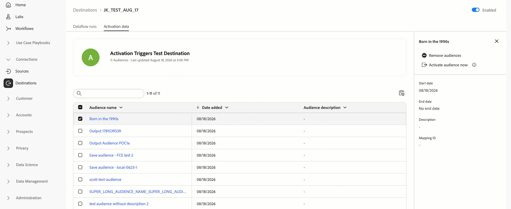
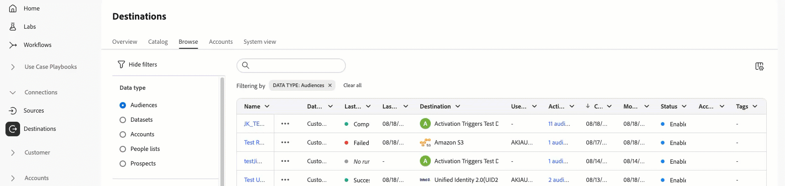

# Adobe Experience Platform release notes

>[!TIP]
>
>Refer to the following documentation for release notes of other Adobe Experience Platform applications:
>
>- [Adobe Journey Optimizer](https://experienceleague.adobe.com/en/docs/journey-optimizer/using/whats-new/release-notes)
>- [Adobe Journey Optimizer B2B](https://experienceleague.adobe.com/en/docs/journey-optimizer-b2b/user/release-notes)
>- [Customer Journey Analytics](https://experienceleague.adobe.com/en/docs/analytics-platform/using/releases/latest)
>- [Federated Audience Composition](https://experienceleague.adobe.com/en/docs/federated-audience-composition/using/release-notes)
>- [Real-Time CDP Collaboration](https://experienceleague.adobe.com/en/docs/real-time-cdp-collaboration/using/latest)

**Release date: August 2026**

New features and updates to existing features in Adobe Experience Platform:

- [Data Governance](#data-governance)
- [Data Ingestion](#data-ingestion)
- [Destinations](#destinations)
- [Run and Operate](#run-and-operate)
- [Segmentation Service](#segmentation-service)
- [Sources](#sources)

## Data Governance {#data-governance}

Use Data Governance to manage data usage policies and enforce compliance with data usage labels across Experience Platform.

**New or updated features**

| Feature | Description |
| --- | --- |
| Object-Level Access Control for Datasets | Apply access labels to entire datasets to control which users can read or write them. |
| mTLS Certificate Hierarchy Update | Adobe is updating the CA hierarchy used to issue client certificates for outbound mTLS connections. If your systems validate Adobe's mTLS client certificate, add the new root and intermediate CA certificates to your trust store to avoid connection or delivery failures. |

{style="table-layout:auto"}

For more information, read the [Data Governance overview](/help/data-governance/home.md).

## Data Ingestion {#data-ingestion}

Use batch and streaming ingestion to bring data into Experience Platform from a variety of sources.

**New or updated features**

| Feature | Description |
| --- | --- |
| Updated [Batch Ingestion guardrails](/help/ingestion/guardrails.md) | Batch ingestion limits have increased to 25,000 files per batch and up to 1 TB for regular batches. Batches that exceed these maximums fail at ingestion time, with updated error messages to help identify the issue. |

{style="table-layout:auto"}

For more information, read the [data ingestion overview](/help/ingestion/home.md).

## Destinations {#destinations}

[!DNL Destinations] are pre-built integrations with destination platforms that allow for the seamless activation of data from Experience Platform. You can use destinations to activate your known and unknown data for cross-channel marketing campaigns, email campaigns, targeted advertising, and many other use cases.

**New or updated functionality**

| Feature | Description |
| --- | --- |
| [!BADGE Beta]{type=Informative} Activate audiences on-demand for streaming destinations | Trigger an immediate, on-demand resend of an audience's full current membership to a streaming destination without waiting for the next scheduled export. This feature is in private beta and available for a limited number of streaming destinations. Contact your Adobe representative to request access.   {zoomable="yes"} |
| [Data type filter in the destinations catalog](/help/destinations/catalog/overview.md) | Filter destinations by data type in the **[!UICONTROL Browse]** tab of the destinations catalog.   {zoomable="yes"} |

{style="table-layout:auto"}

**New or updated destinations**

| Feature | Description |
| --- | --- |
| External ID support for [[!DNL Amazon S3] assumed role authentication](/help/destinations/catalog/cloud-storage/amazon-s3.md#assumed-role-authentication) | Adobe now presents your Organization ID as the `sts:ExternalId` on every `AssumeRole` call for the [!DNL Amazon S3] destination's assumed role authentication flow. Add an `sts:ExternalId` condition to your IAM role's trust policy in AWS and set it to your Organization ID to strengthen the security of your assumed role connection. |
| [[!DNL ZoomInfo Account Audiences]](/help/destinations/catalog/advertising/zoominfo-account-audiences.md) | Use the [!DNL ZoomInfo Account Audiences] destination to activate account audiences from Experience Platform to [!DNL ZoomInfo] for account-based marketing use cases. |
| Exclude exited profiles from [[!DNL LiveRamp] - Onboarding](/help/destinations/catalog/advertising/liveramp-onboarding.md) exports | Exports to the [!DNL LiveRamp] - Onboarding destination no longer include profiles that have exited an audience. |

{style="table-layout:auto"}

**Fixes and improvements**

| Fix | Description |
| --- | --- |
| B2B audience export fix | When you export B2B audiences to a destination, Experience Platform now sends only the audiences that have actually changed for a profile. Previously, an update to one audience caused every audience that the profile qualified for to be resent, resulting in larger exports than necessary. This brings B2B audience exports in line with existing streaming and batch audience export behavior. |

{style="table-layout:auto"}

For more information, read the [Destinations overview](/help/destinations/home.md).

## Run and Operate {#run-and-operate}

**New or updated features**

| Feature | Description |
| --- | --- |
| [Additional health checks](/help/run-and-operate/health-checks.md) | Health checks now cover additional checks across the new Query Service, Merge Policies, and Segmentation categories, in addition to the existing Schemas and Identities, Ingestion, Automatic Data Expiration, and Datasets categories. |

{style="table-layout:auto"}

## Segmentation Service {#segmentation-service}

Use Segmentation Service to create audiences from your customer data and manage their full lifecycle in Experience Platform.

**New or updated features**

| Feature | Description |
| --- | --- |
| Flexible Batch Schedules (Limited Availability) | Flexible Batch Schedules lets you evaluate audiences on demand using user-defined schedules, giving you greater control and flexibility over your audience evaluations. You can define the cadence, and each schedule can evaluate up to 10,000 audiences at a time. |
| Run Now (Limited Availability) | Run Now lets you trigger audience evaluation for a specific audience on demand, without waiting for a system-defined or user-defined schedule. |
| Time-series custom objects (B2B) | You can now use time-series relational schemas in custom objects for segmentation use cases in B2BCDP. |

{style="table-layout:auto"}

For more information, read the [Segmentation Service overview](/help/segmentation/home.md).

## Sources {#sources}

Experience Platform provides a RESTful API and an interactive UI that lets you set up source connections for various data providers with ease. These source connections allow you to authenticate and connect to external storage systems and CRM services, set times for ingestion runs, and manage data ingestion throughput.

**New or updated sources**

| Source | Description |
| --- | --- |
| New sources in GA | The following sources have been promoted from Beta to General Availability (GA): <ul><li>[[!DNL Braze]](/help/sources/connectors/marketing-automation/braze.md)</li><li>[[!DNL Capillary]](/help/sources/connectors/loyalty/capillary.md)</li><li>[[!DNL Didomi]](/help/sources/connectors/consent-and-preferences/didomi.md)</li><li>[[!DNL LAVA]](/help/sources/connectors/loyalty/lava.md)</li><li>[[!DNL Rainfocus]](/help/sources/connectors/analytics/rainfocus.md)</li><li>[[!DNL Relay]](/help/sources/tutorials/ui/create/marketing-automation/relay-connector.md)</li><li>[[!DNL Shopify Streaming]](/help/sources/connectors/ecommerce/shopify-streaming.md)</li><li>[[!DNL Talon.One Batch]](/help/sources/tutorials/ui/create/loyalty/talon-one-batch.md)</li><li>[[!DNL Talon.One Streaming]](/help/sources/tutorials/ui/create/loyalty/talon-one-streaming.md)</li></ul> |
| Self Serve Sources (Streaming SDK) now in GA | Self-Serve Sources (Streaming SDK) are now generally available. Partners can build and configure streaming sources with secure authentication using either OAuth or HMAC-based authentication. Authentication is required for all Streaming SDK sources. HMAC authentication validates incoming events using SHA-256 signatures, while existing configuration remains compatible with the new authentication options. |
| Sources compatible with TLS v1.3 | The following source connectors are now compatible with Transport Layer Security (TLS) version 1.3: <ul><li>[[!DNL Azure Data Lake Storage Gen2]](/help/sources/connectors/cloud-storage/adls-gen2.md)</li><li>[[!DNL Azure Blob Storage]](/help/sources/connectors/cloud-storage/blob.md)</li><li>[[!DNL Azure Event Hubs]](/help/sources/connectors/cloud-storage/eventhub.md)</li><li>[[!DNL Azure Synapse Analytics]](/help/sources/connectors/databases/synapse-analytics.md)</li><li>[[!DNL Data Landing Zone]](/help/sources/connectors/cloud-storage/data-landing-zone.md)</li><li>[[!DNL Snowflake] batch connector](/help/sources/connectors/databases/snowflake.md)</li></ul> |
| [!DNL Google Ads] (V2) source connector | You can now use the Google Ads (V2) source connector to ingest advertising account, campaign, ad group, ad, asset, experience, and performance data from the [!DNL Google Ads] API into Experience Platform. |

{style="table-layout:auto"}

For more information, read the [sources overview](../../sources/home.md).
