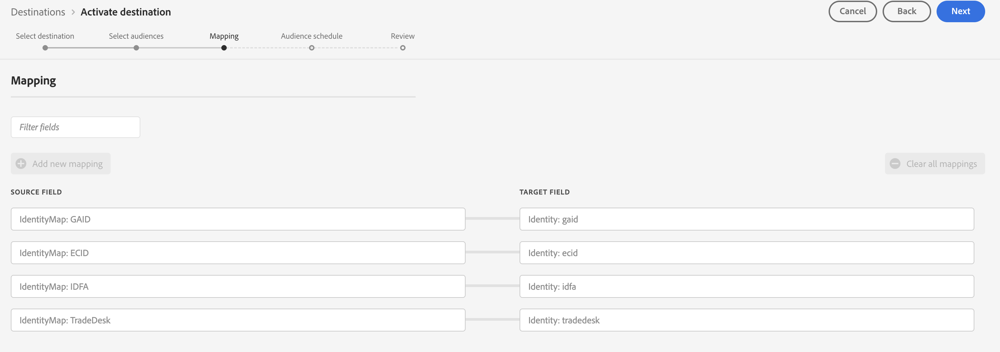
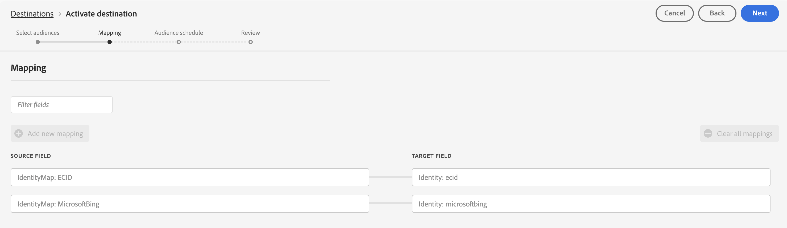

# Adobe Experience Platform release notes

>[!TIP]
>
>Refer to the following documentation for release notes of other Adobe Experience Platform applications:
>
>- [Adobe Journey Optimizer](https://experienceleague.adobe.com/en/docs/journey-optimizer/using/whats-new/release-notes)
>- [Adobe Journey Optimizer B2B](https://experienceleague.adobe.com/en/docs/journey-optimizer-b2b/user/release-notes)
>- [Customer Journey Analytics](https://experienceleague.adobe.com/en/docs/analytics-platform/using/releases/pre-release-notes)
>- [Federated Audience Composition](https://experienceleague.adobe.com/en/docs/federated-audience-composition/using/e-release-notes)
>- [Real-Time CDP Collaboration](https://experienceleague.adobe.com/en/docs/real-time-cdp-collaboration/using/latest)

**Release date: January 27, 2026**

New features and updates to existing features in Adobe Experience Platform:

- [Agent Orchestrator](#agent-orchestrator)
- [Destinations](#destinations)
- [Real-Time Customer Profile](#real-time-customer-profile)
- [Schemas](#schemas)
- [Segmentation Service](#segmentation-service)
- [Sources](#sources)

## Agent Orchestrator {#agent-orchestrator}

Agent Orchestrator enables you to build and deploy AI-powered agents that can automate workflows and interact with customers across multiple channels.

**New or updated features**

| Feature | Description |
| --- | --- |
| Adobe Experience Platform Agents usage-bound trial | **Select customers now have a complimentary trial access to Adobe Experience Platform Agents**. You can use the trial to explore and interact with Agents through the AI Assistant interface powered by Adobe Experience Platform Agent Orchestrator. The trial offers hands-on experience with AI Agents that operate within the context of customers' existing Experience Cloud products and environments, allowing teams to evaluate value before committing to a full purchase. Adobe Experience Platform Agents are guided by user input and oversight and respect existing product-level access controls, ensuring users can only perform actions or view data for which they are authorized within the underlying Experience Cloud applications. Read the [Experience Platform Agents usage-bound trial overview](https://experienceleague.adobe.com/en/docs/experience-cloud-ai/experience-cloud-ai/agents/trial) for information on how to get started. |

{style="table-layout:auto"}

For more information, see the [Agent Orchestrator documentation](https://experienceleague.adobe.com/en/docs/experience-cloud-ai/experience-cloud-ai/agents/agent-orchestrator).

## Destinations {#destinations}

[!DNL Destinations] are pre-built integrations with destination platforms that allow for the seamless activation of data from Experience Platform. You can use destinations to activate your known and unknown data for cross-channel marketing campaigns, email campaigns, targeted advertising, and many other use cases.

**New or updated destinations**

| Destination | Description |
| --- | --- |
| [Kevel destination](/help/destinations/catalog/advertising/kevel.md) connector now available | The [!DNL Kevel] streaming destination for Adobe Experience Platform enables customers to activate Adobe audiences directly into [!DNL Kevel]'s UserDB and Segment Management APIs to support real-time targeting at ad decision time. [[!DNL Kevel]](https://www.kevel.com/) provides the AI-enabled technology and expert guidance that help innovative commerce leaders launch, scale, and succeed in retail media. [!DNL Kevel]'s Retail Media Cloud powers targeted, attributable, customizable ad formats for on-site and off-site advertising. |
| [Index Exchange](/help/destinations/catalog/advertising/index-exchange.md) destination connector now available | Use this destination connector to export audience segments from Adobe Experience Platform directly to [!DNL Index Exchange]'s programmatic advertising platform. [!DNL Index] is a global advertising supply-side platform that helps media owners maximize the value of their content across every screen. With over 20 years of industry leadership, [!DNL Index] connects the world's largest brands with premium experience makers to deliver high-quality consumer experiences. |
| Regional endpoints support for Braze connections | All [region-specific endpoints](https://www.braze.com/docs/user_guide/administrative/access_braze/sdk_endpoints) supported by [!DNL Braze] are now available for selection during the destination configuration flow. Ask your [!DNL Braze] representative which endpoint instance you should use. |
| Weekly and monthly scheduling support for [Liveramp Onboarding](../../destinations/catalog/advertising/liveramp-onboarding.md#scheduling) | You can now configure weekly and monthly export schedules for the Liveramp Onboarding destination.   This release is being rolled out gradually and will be complete by January 30th. |
| Enhanced activation experience for [The Trade Desk](../../destinations/catalog/advertising/tradedesk.md) and [Microsoft Bing](../../destinations/catalog/advertising/bing.md) destinations | The Trade Desk and Microsoft Bing destinations now include predefined mandatory mappings for an optimized activation experience.    This release is being rolled out gradually and will be complete by January 30th.  {width="150" align="center" zoomable="yes"}    {width="150" align="center" zoomable="yes"} |
|AES256 encryption support for [Amazon S3](../../destinations/catalog/cloud-storage/amazon-s3.md#destination-details) destinations | You can now configure AES256 encryption for your Amazon S3 exports. Two options are available: <ul><li>**[!UICONTROL Default]**: Data will be encrypted at rest with the default encryption algorithm set on your bucket.</li><li>**[!UICONTROL SSE-S3/AES256]**: Experience Platform adds the `s3:x-amz-server-side-encryption": "AES256` header in the export and data will be encrypted at rest with the AES256 algorithm when it lands in S3. **This option takes precedence over any default encryption algorithm configured on your S3 bucket**.</li></ul> This release is being rolled out gradually and will be complete by January 30th.|
| Phone number activation support for [The Trade Desk - CRM](../../destinations/catalog/advertising/tradedesk-emails.md#phone-hashing) connection | The Trade Desk - CRM destination now supports phone number activation in addition to email addresses. You can activate both unhashed phone numbers in E.164 format and hashed phone numbers (SHA256_E.164 format) to your Trade Desk account for audience targeting and suppression based on CRM data. Phone numbers must be normalized to E.164 format before activation.|
| [Snowflake Batch](../../destinations/catalog/warehouses/snowflake-batch.md) destination updates | The Snowflake Batch destination now includes region selection capability during destination configuration. You can now select the specific Snowflake region where your instance is provisioned, ensuring optimal data transfer and compliance with regional requirements. Additionally, the default merge policy restriction has been removed, allowing you to export audiences mapped to any merge policy.   The [!DNL Snowflake] batch destination is currently only available to Real-Time CDP customers provisioned in the Experience Platform VA7 region.|

**New or updated functionality**

| Feature | Description |
| --- | --- |
| Updated guardrail limits for [Adobe Target](../../destinations/catalog/personalization/adobe-target-connection.md) destinations | The maximum number of audiences that can be mapped to a single Adobe Target destination has been increased from 50 to 250. This aligns Adobe Target with the standard audience limit for other destinations, providing greater flexibility for audience activation workflows. You can now activate more audiences to Adobe Target destinations without needing to create multiple dataflows. |
| [Edit destinations](/help/destinations/ui/edit-destination.md) and [edit marketing actions](/help/destinations/ui/edit-activation.md#edit-marketing-actions) general availability | The option to edit destinations and marketing actions is now available to all users. |
| Toggle field display names in the Mapping [step](/help/destinations/ui/activate-segment-streaming-destinations.md#mapping)  | When mapping schema fields to a destination, you can now toggle between displaying the full XDM field name and showing only the display name.    |

{style="table-layout:auto"}

For more information, read the [Destinations overview](../../destinations/home.md).

## Real-Time Customer Profile {#real-time-customer-profile}

Real-Time Customer Profile enables you to see a holistic view of each individual customer by combining data from multiple channels, including online, offline, CRM, and third-party data. Profile allows you to consolidate your customer data into a unified view offering an actionable, timestamped account of every customer interaction.

**New or updated features**

| Feature | Description |
| --- | --- |
| [Streaming capacity](/help/landing/license-usage-and-guardrails/capacity.md) enforcement | Experience Platform now enforces streaming throughput capacities for Real-Time Customer Profile and Identity Service. When customers exceed their contracted streaming capacity, data will be queued and processed in a first-in-first-out manner. This ensures predictable system performance and prevents capacity violations from impacting data ingestion quality. Important notes: <ul><li>Streaming upserts will not be available on the data lake when capacity is exceeded</li><li>This enforcement does not apply to customers with Adobe Journey Optimizer licenses</li><li>Queued data will be processed sequentially once capacity becomes available.</li></ul> For more information, read the [capacity overview](/help/landing/license-usage-and-guardrails/capacity.md). |
| Entity lookup deprecation | Using the entity lookup API for experience events is now deprecated for all Real-Time CDP Prime customers. This deprecation helps align Real-Time CDP with licensing functionality. Real-Time CDP Ultimate customers who intend to use this functionality can contact Adobe Customer Care to re-enable this feature.  For more information, read the [entities API guide](/help/profile/api/entities.md). |
| Monitor profile ingestion job status | You can now monitor the job-level progress percentage for batch Profile ingestion dataflow runs. This feature provides real-time visibility into the current progress of batch ingestion jobs, including critical checkpoints that indicate whether the ingestion is ready for customer segmentation and Adobe Journey Optimizer lookups. For large ingestions that may take several hours to process, this progress transparency helps you understand whether the job is progressing normally or encountering issues, reducing uncertainty during data processing.For more information, read the [monitor profiles guide](/help/dataflows/ui/monitor-profiles.md). |
| Profile viewer enhancements (GA) | The following enhancements to the Profile viewer are now generally available. <ul><li>**Combined view**: Attribute, events, and insights have been combined into a single view.</li><li>**AI-generated insights**: The profile details page now displays AI-generated insights, letting you know details generated from your profile. These insights can include information such as propensity scores and trend analysis.</li><li>**Style update**: The profile details page has been visually refreshed.</li><li>**Browse**: You can now explore your profiles through an interactive card-based carousel with search and customization.</li></ul> For more information, read the [profile viewer guide](/help/profile/ui/user-guide.md). |

{style="table-layout:auto"}

For more information, read the [[!DNL Real-Time Customer Profile] overview](../../profile/home.md).

## Segmentation Service {#segmentation-service}

[!DNL Segmentation Service] defines a particular subset of profiles by describing the criteria that distinguishes a marketable group of people within your customer base. Audiences can be based on record data (such as demographic information) or time series events representing customer interactions with your brand.

**New or updated features**

| Feature | Description |
| ------- | ----------- |
| External audience data expiration refresh | External audiences (such as CSV uploads) now support a force refresh capability for data expiration settings. This feature lets users manually refresh the data expiration for external audiences, providing greater control over audience lifecycle management. This is particularly useful for audiences that need to persist beyond their initial data expiration period or require reactivation without re-uploading the data. For more information about this feature, read the [Audience Portal overview](../../segmentation/ui/audience-portal.md#audience-summary). |

For more information, read the [[!DNL Segmentation Service] overview](../../segmentation/home.md).

## Sources {#sources}

Experience Platform provides a RESTful API and an interactive UI that lets you set up source connections for various data providers with ease. These source connections allow you to authenticate and connect to external storage systems and CRM services, set times for ingestion runs, and manage data ingestion throughput.

**New or updated sources**

| Source | Description |
| --- | --- |
| [[!DNL Oracle Eloqua]](/help/sources/connectors/marketing-automation/eloqua.md) V2 source | A new [!DNL Oracle Eloqua] source connector is now available, replacing the [deprecated connector](/help/sources/connectors/marketing-automation/oracle-eloqua.md). This updated connector provides enhanced functionality and improved reliability for ingesting data from [!DNL Oracle Eloqua] into Experience Platform. Customers using the existing connector should migrate to the new implementation, as existing connections will no longer function. The new connector supports all setup and configuration steps needed to connect to [!DNL Oracle Eloqua] and ingest marketing automation data. |
| [[!DNL Salesforce Marketing Cloud]](/help/sources/connectors/marketing-automation/sfmc.md) V2 source | A new [!DNL Salesforce Marketing Cloud] source connector is now available, replacing the [deprecated connector](/help/sources/connectors/marketing-automation/salesforce-marketing-cloud.md). This updated connector provides improved performance and additional capabilities for ingesting data from [!DNL Salesforce Marketing Cloud] into Experience Platform. Customers using the existing connector should transition to the new implementation. The new connector includes comprehensive setup instructions for connecting to [!DNL Salesforce Marketing Cloud] and ingesting marketing automation data. |

For more information, read the [sources overview](../../sources/home.md).

