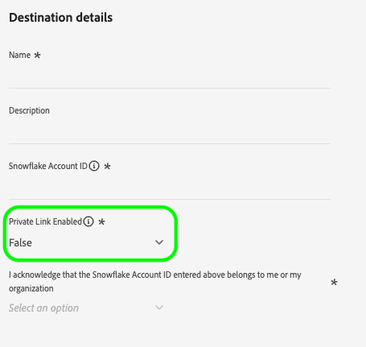
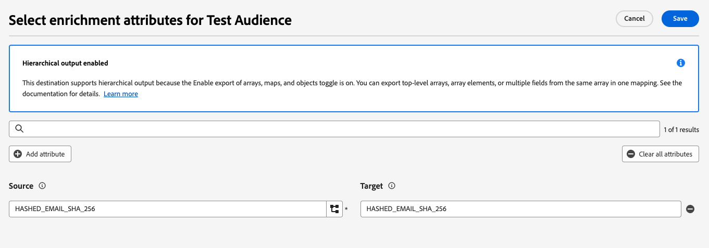
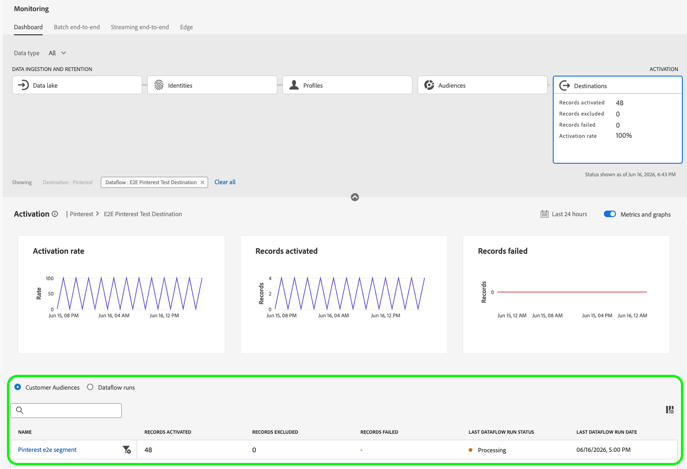
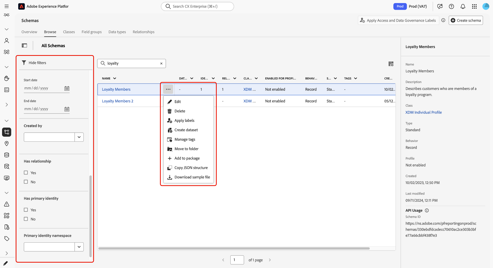

# Adobe Experience Platform release notes

>[!TIP]
>
>Refer to the following documentation for release notes of other Adobe Experience Platform applications:
>
>- [Adobe Journey Optimizer](https://experienceleague.adobe.com/en/docs/journey-optimizer/using/whats-new/release-notes)
>- [Adobe Journey Optimizer B2B](https://experienceleague.adobe.com/en/docs/journey-optimizer-b2b/user/release-notes)
>- [Customer Journey Analytics](https://experienceleague.adobe.com/en/docs/analytics-platform/using/releases/latest)
>- [Federated Audience Composition](https://experienceleague.adobe.com/en/docs/federated-audience-composition/using/release-notes)
>- [Real-Time CDP Collaboration](https://experienceleague.adobe.com/en/docs/real-time-cdp-collaboration/using/latest)

**Release date: June 16, 2026**

New features and updates to existing features in Adobe Experience Platform:

- [Destinations](#destinations)
- [Experience Data Model (XDM)](#xdm)
- [Query Service](#query-service)
- [Real-Time Customer Profile](#profile)
- [Run and Operate](#run-and-operate)
- [Segmentation Service](#segmentation-service)
- [Sources](#sources)

## Destinations {#destinations}

[!DNL Destinations] are pre-built integrations with destination platforms that allow for the seamless activation of data from Experience Platform. You can use destinations to activate your known and unknown data for cross-channel marketing campaigns, email campaigns, targeted advertising, and many other use cases.

**New or updated destinations**

| Feature | Description |
| --- | --- |
| [!BADGE Beta]{type=Informative} [When to activate](../../destinations/ui/when-to-activate.md) | Control which profile change types trigger exports to a destination. Enable or disable three trigger types per dataflow: attribute changes, audience qualification and disqualification, and identity changes. All three triggers are enabled by default. During beta, this feature is available on request. Contact your Adobe representative to request access.   {zoomable="yes"} |
| [Azure Private Link for Azure destinations](../../destinations/catalog/cloud-storage/azure-private-link.md) | Route data exports to [[!DNL Azure Blob Storage]](../../destinations/catalog/cloud-storage/azure-blob.md), [[!DNL Azure Data Lake Storage Gen2]](../../destinations/catalog/cloud-storage/adls-gen2.md), and [[!DNL Azure Event Hubs]](../../destinations/catalog/cloud-storage/azure-event-hubs.md) over private IP addresses on the [!DNL Microsoft Azure] backbone instead of the public internet. This feature is available to customers with **Healthcare Shield** or **Privacy and Security Shield** entitlements. Contact your Adobe representative to request setup. |
| [[!DNL Snowflake Streaming]](../../destinations/catalog/warehouses/snowflake.md) and [[!DNL Snowflake Batch]](../../destinations/catalog/warehouses/snowflake-batch.md) Private Link support | A new **[!UICONTROL Private Link Enabled]** dropdown selector is now available when configuring [!DNL Snowflake] streaming and batch destination connections. Enable this option only if your [!DNL Snowflake] account is configured for private link-only inbound access. Leaving this set to **[!UICONTROL False]** for private link-only accounts causes data sharing to fail. This update is being rolled out through June 19, 2026.   {zoomable="yes"} |
| [!BADGE Beta]{type=Informative} [Export arrays as enrichment attributes](../../destinations/ui/activate-batch-profile-destinations.md#select-enrichment-attributes) | Export array fields as enrichment attributes when activating audiences to cloud storage destinations. Select individual fields from an array of objects, or export the full array. The data is then exported as separate columns in JSON and Parquet output.   {zoomable="yes"} |
| [[!DNL Google Ad Manager 360]](../../destinations/catalog/advertising/google-ad-manager-360-connection.md) now generally available | The [!DNL Google Ad Manager 360] destination (formerly in beta) is now generally available. |
| [[!DNL Google Customer Match + Display & Video 360]](../../destinations/catalog/advertising/google-customer-match-dv360.md) now generally available | The [!DNL Google Customer Match + Display & Video 360] destination (formerly in limited availability) is now generally available. |
| [Audience-level reporting for additional destinations](../../dataflows/ui/monitor-destinations.md#audience-level-view) | Audience-level reporting is now available for several high-usage destinations: [Facebook](../../destinations/catalog/social/facebook.md), [TikTok](../../destinations/catalog/social/tiktok.md), [(Legacy) Amazon Ads](../../destinations/catalog/advertising/amazon-ads.md), [Braze](../../destinations/catalog/mobile-engagement/braze.md), [LinkedIn Matched Audiences](../../destinations/catalog/social/linkedin.md), [(Companies) LinkedIn](../../destinations/catalog/social/linkedin-b2b.md), [Twitter Custom Audiences](../../destinations/catalog/social/twitter.md), [Pinterest Customer List](../../destinations/catalog/advertising/pinterest.md), [Salesforce CRM](../../destinations/catalog/crm/salesforce.md), [Mailchimp Tags](../../destinations/catalog/email-marketing/mailchimp-tags.md), [Gainsight PX](../../destinations/catalog/analytics/gainsight-px.md), and [Demandbase People](../../destinations/catalog/advertising/demandbase-people.md). Previously, these destinations only supported dataflow run-level reporting, making it harder to understand how many profiles were activated for each audience. For more information, read the [audience-level view](../../dataflows/ui/monitor-destinations.md#audience-level-view) documentation.   {zoomable="yes"} |

{style="table-layout:auto"}

**Fixes and improvements**

| Fix | Description |
| --- | --- |
| [[!DNL Reddit Custom Audience]](../../destinations/catalog/advertising/reddit-custom-audience.md) activation fix | Fixed an issue that prevented customers from activating data when attempted more than 24 hours after authentication. |
| [[!DNL Facebook]](../../destinations/catalog/social/facebook.md) restricted audience enforcement | Starting June 8, 2026, [!DNL Facebook] blocks audiences containing restricted or sensitive data (such as health or financial information) under its Terms of Service. See the [restricted audience data](../../destinations/catalog/social/facebook.md#restricted-audiences) section for troubleshooting steps. |
| [External audiences activation guardrail update](../../destinations/guardrails.md#batch-file-based-activation) | The maximum number of external audiences (such as custom upload, Federated Audience Composition, and Audience Composition) that can be activated per destination instance has been increased to 100. |
| [Dataset export file splitting](../../destinations/ui/export-datasets.md) | Previously, datasets with fewer than 50,000 records were sometimes split into multiple files. Datasets with 50,000 records or fewer are now always exported as a single file. |

{style="table-layout:auto"}

For more information, read the [Destinations overview](../../destinations/home.md).

## Experience Data Model (XDM) {#xdm}

Experience Data Model (XDM) is an open-source specification that provides common structures and definitions (schemas) for data that is brought into Experience Platform.

**New or updated features**

| Feature | Description |
| --- | --- |
| [Schema inventory enhancements](../../xdm/ui/resources/schemas.md) | The schema browse page now includes additional schema metadata, enhanced filtering options, user-defined tags and folders, and inline actions for common schema management tasks. These updates help you find, organize, and manage schemas more efficiently from a single location.   {zoomable="yes"} |

{style="table-layout:auto"}

For more information, read the [XDM overview](../../xdm/home.md).

## Real-Time Customer Profile {#real-time-customer-profile}

Real-Time Customer Profile gives you a complete view of each individual customer by combining data from multiple channels, including online, offline, CRM, and third-party data. Use Profile to consolidate your customer data into a unified view offering an actionable, timestamped account of every customer interaction.

**New or updated features**

| Feature | Description |
| ------- | ----------- |
| Batch profile ingestion | Batch profile ingestion now enforces format validation on Experience Event `_id` values. Records containing restricted characters in the `_id` field are rejected at ingestion time in the Profile Store. This validation is applied at the record level - batches continue to process successfully, while only non-compliant records are dropped by Profile Store. Customers can correct invalid `_id` values and resend the affected records, ensuring no permanent data loss. See the [XDM ExperienceEvent class documentation](/help/xdm/classes/experienceevent.md) for more details. |

## Run and Operate {#run-and-operate}

**New or updated features**

| Feature | Description |
| --- | --- |
| [Anti-pattern detection in Job Schedules](../../run-and-operate/job-schedules-anti-patterns.md) | Three anti-patterns are now automatically detected in the Job Schedules view: exceeding 90 profile ingestion runs per day, profile ingestion scheduled too close to segmentation, and segmentation scheduled too close to destination activation. The last-7-days lookback now includes a calendar view for date selection. This feature is being rolled out through the end of June 2026. |
| [Health checks for P-TTL and e-TTL](../../run-and-operate/health-checks.md) | Two new health checks are now available: Pseudonymous Profile TTL (P-TTL) checks whether the expiration policy is active for your sandbox and lists relevant unauthenticated namespaces. Experience Event Datasets TTL (e-TTL) scans data lake and profile event datasets to identify where automatic data expiration is not configured. |

{style="table-layout:auto"}

## Segmentation Service {#segmentation-service}

Use Segmentation Service to create audiences from your customer data and manage their full lifecycle in Experience Platform.

**New or updated features**

| Feature | Description |
| ------- | ----------- |
| Persistent split support | You can now choose between persistent and random percentage splits in Audience Composition. Persistent split keeps the same profile in the same bucket across evaluations, while random split may place a profile in a different bucket across evaluations. When using persistent split, select an identity namespace with low variance to ensure reliable audience membership. Read the [Audience Composition guide](/help/segmentation/ui/audience-composition.md) for more details. |

{style="table-layout:auto"}

For more information, read the [Audiences overview](../../segmentation/home.md).

## Sources {#sources}

Experience Platform provides a RESTful API and an interactive UI that lets you set up source connections for various data providers with ease. These source connections allow you to authenticate and connect to external storage systems and CRM services, set times for ingestion runs, and manage data ingestion throughput.

**New or updated sources**

| Source | Description |
| --- | --- |
| General availability of the [!DNL LAVA] source | You can now bring loyalty and engagement data from [[!DNL LAVA]](https://www.lava.ai/) into Experience Platform using the [[!DNL LAVA] source](../../sources/connectors/loyalty/lava.md). Stream member profiles, rewards, and events from [!DNL LAVA] and [!DNL LAVA] integrations to enrich Real-Time Customer Profile and support segmentation, personalization, and activation. Create a separate source connection for each data type you need, and map email on member profiles to stitch [!DNL LAVA] records with your existing profiles. For prerequisites, an optional setup package, and step-by-step setup, read the [[!DNL LAVA] source documentation](../../sources/connectors/loyalty/lava.md).|

{style="table-layout:auto"}

**Updates and fixes**

| Source | Description |
| --- | --- |
| Automatic dataflow disabling for failed sources dataflows | Sources dataflows that fail continuously for 30 days are automatically disabled. When a dataflow is disabled, review the failure reason in Monitoring, apply the necessary updates, and re-enable the dataflow. Common failure reasons include credentials, permissions, or schema and mapping configuration changes. |
| HMAC-based authentication support for [!DNL Shopify Streaming] | HMAC-based authentication is now supported for the [!DNL Shopify Streaming] source connector, available in both the UI and API. See the [[!DNL Shopify Streaming] overview](../../sources/connectors/ecommerce/shopify-streaming.md) for key rotation behavior and setup instructions. |
| Improved source dataflow inventory management | The Sources dataflow inventory has been modernized with advanced search and filtering, support for tags and folders, resizable columns, and more contextual actions to help users organize and manage dataflows more efficiently. Read the [documentation](../../sources/tutorials/ui/filter.md) for more information. |

{style="table-layout:auto"}

For more information, read the [sources overview](../../sources/home.md).

<!--

| [Scheduled queries with no end date](../../query-service/api/scheduled-queries.md) | Create scheduled queries that run indefinitely without specifying an end date. Use this for continuous recurring workflows. The UI may display indefinite schedules using a far-future date such as 31.12.9999. |

## Advanced data lifecycle management {#advanced-data-lifecycle-management}

Experience Platform provides a suite of data hygiene capabilities that let you manage your stored data through programmatic deletions of consumer records and datasets.

**New or updated features**

| Feature | Description |
| --- | --- |
| [Multi-dataset and targeted services for work orders](../../hygiene/api/jobs.md) | Two new API-only capabilities are now available for data lifecycle work orders. Use targeted services to scope deletion to specific services (profile, identity, or [!DNL Adobe Journey Optimizer]) without modifying data in the lake. Use multi-dataset support to target one, many, or all datasets in a single work order submission. |

{style="table-layout:auto"}

For more information, read the [advanced data lifecycle management overview](../../hygiene/home.md).

-->

