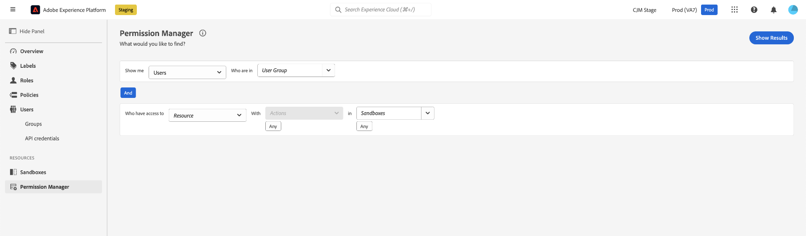
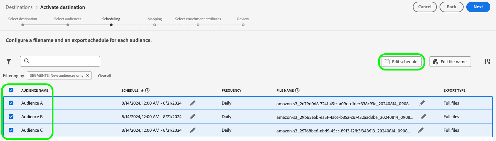
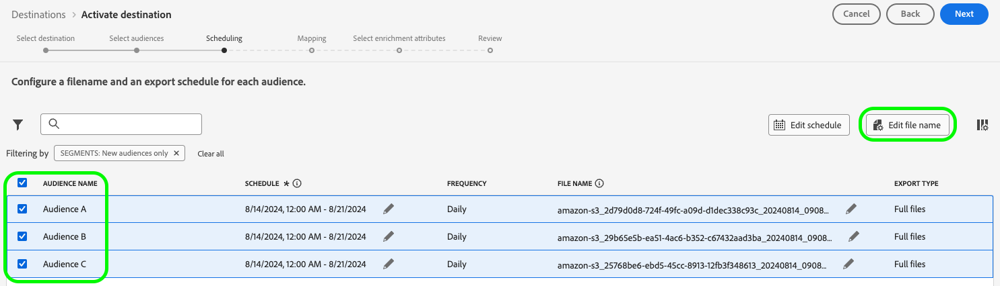
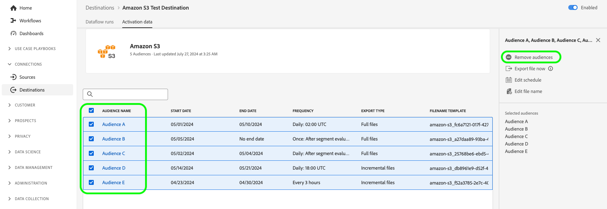
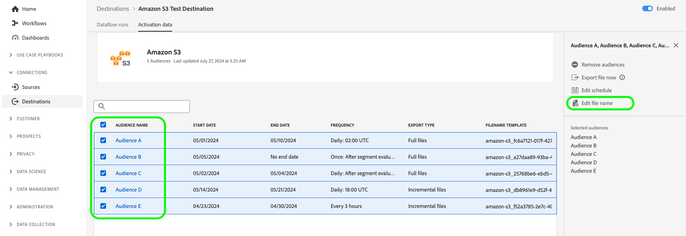
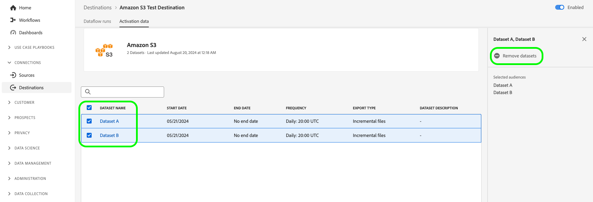

# Adobe Experience Platform release notes 

**Release date: August 20, 2024**

>[!TIP]
>
>View an [overview of sample use cases documentation](https://experienceleague.adobe.com/en/docs/experience-platform/rtcdp/use-cases/overview) to learn about various use cases such as prospecting, acquisition, and more that your organization can achieve with Real-Time CDP.

Updates to existing features and documentation in Experience Platform:

- [Attribute-based access control](#abac)
- [Data Ingestion](#data-ingestion)
- [Destinations](#destinations)
- [Experience Data Model (XDM)](#xdm)
- [Identity Service](#identity-service)
- [Segmentation Service](#segmentation)
- [Sources](#sources)

## Attribute-based access control {#abac}

Attribute-based access control is a capability of Adobe Experience Platform that gives privacy-conscious brands greater flexibility to manage user access. Individual objects such as schema fields and segments can be assigned to user roles. This feature lets you grant or revoke access to individual objects for specific Platform users in your organization.

Through attribute-based access control, administrators of your organization can control users' access to sensitive personal data (SPD), personally identifiable information (PII), and other customized type of data across all Platform workflows and resources. Administrators can define user roles that have access only to specific fields and data that correspond to those fields.

**New feature**

| Feature update | Description |
| --- | --- |
| New Permission Manager feature | You can now utilize [Permission Manager](../../access-control/abac/permission-manager/overview.md) to generate reports using simple queries, which will help you understand access management and save time verifying access permissions across several workflows and granularity levels. For more information on creating reports for users and roles, see the [Permission Manager user guide](../../access-control/abac/permission-manager/permissions.md). {width="250" align="center" zoomable="yes"} |

{style="table-layout:auto"}

For more information on attribute-based access control, see the [attribute-based access control overview](../../access-control/abac/overview.md). For a comprehensive guide on the attribute-based access control workflow, read the [attribute-based access control end-to-end guide](../../access-control/abac/end-to-end-guide.md).

## Data Ingestion (updated August 23rd) {#data-ingestion}

Adobe Experience Platform provides a rich set of features to ingest any type and any latency of data. You can ingest using Batch or Streaming APIs, using Adobe-built sources, data integration partners or the Adobe Experience Platform UI.

**Update to date format handling in batch data ingestion**

This release addresses an issue with the *date format handling* in batch data ingestion. Previously, the system transformed date fields inserted by clients as `Date` into `DateTime` format. This meant that the timezone was automatically added to fields and it caused difficulties for users who preferred or required the `Date` format. Going forward, the timezone will not automatically be added to `Date`-type fields. This update ensures that the exported format of data matches the format represented on the profile for that field as requested by customers.

`Date` fields before the release : `"birthDate": "2018-01-12T00:00:00Z"`
`Date` fields after the release: `"birthDate": "2018-01-12"`

Read more about [batch ingestion](/help/ingestion/batch-ingestion/overview.md).

## Destinations {#destinations}

[!DNL Destinations] are pre-built integrations with destination platforms that allow for the seamless activation of data from Adobe Experience Platform. You can use destinations to activate your known and unknown data for cross-channel marketing campaigns, email campaigns, targeted advertising, and many other use cases.

**New or updated destinations** {#new-updated-destinations}

| Destination | Description |
| ----------- | ----------- |
| [Braze](/help/destinations/catalog/mobile-engagement/braze.md) | [!UICONTROL Braze] manages a number of different instances for their dashboard and REST endpoints. [!UICONTROL Braze] customers should use the correct REST Endpoint based on which instance you are provisioned to. This release adds a new US-07 endpoint that you can select when connecting to [!UICONTROL Braze]. |

{style="table-layout:auto"}

**New or updated functionality** {#destinations-new-updated-functionality}

| Feature | Description |
| ----------- | ----------- |
| Exporting files on-demand to batch destinations is now generally available. | The option to export files on-demand to batch destinations is now available to all customers. See the [dedicated documentation](../../destinations/ui/export-file-now.md) for more details.|
| Edit export schedules for multiple exported audiences in the [scheduling step](../../destinations/ui/activate-batch-profile-destinations.md#scheduling). | The option to edit the export schedules for multiple exported audiences directly from the scheduling step of the audience activation workflow is now available to all customers. {width="250" align="center" zoomable="yes"}|
| Edit file names for multiple exported audiences in the [scheduling step](../../destinations/ui/activate-batch-profile-destinations.md#scheduling). | The option to edit the names of multiple exported files directly from the scheduling step of the audience activation workflow is now available to all customers. {width="250" align="center" zoomable="yes"}|
| Remove multiple audiences from a dataflow from the [Destination Details](../../destinations/ui/destination-details-page.md#bulk-remove) page.  | The option to remove multiple audiences from existing dataflows from the **[!UICONTROL Destination Details]** page is now available to all customers. {width="250" align="center" zoomable="yes"} |
| Export multiple files on-demand to batch destinations from the [Destination Details](../../destinations/ui/destination-details-page.md#bulk-export) page. | The option to export multiple files on-demand to batch destinations from the **[!UICONTROL Destination Details]** page is now available to all customers. {width="250" align="center" zoomable="yes"} |
| Edit file names for multiple exported audiences from the [Destination Details](../../destinations/ui/destination-details-page.md#bulk-edit-file-names) page. | You can now edit the names of multiple exported files directly from the **[!UICONTROL Destination Details]** page. {width="250" align="center" zoomable="yes"} |
| Remove multiple datasets from a dataflow from the [Destination Details](../../destinations/ui/export-datasets.md#remove-dataset) page. | The option to remove multiple datasets from a dataflow is now available to all customers. {width="250" align="center" zoomable="yes"} |

{style="table-layout:auto"}

For more information, read the [destinations overview](../../destinations/home.md).

## Experience Data Model (XDM) {#xdm}

XDM is an open-source specification that provides common structures and definitions (schemas) for data that is brought into Adobe Experience Platform. By adhering to XDM standards, all customer experience data can be incorporated into a common representation to deliver insights in a faster, more integrated way. You can gain valuable insights from customer actions, define customer audiences through segments, and use customer attributes for personalization purposes.

**New features**

| Feature | Description |
| --- | --- |
| ML-assisted schema creation flow |  Use advanced machine-learning algorithms to analyze your sample data files and automatically create optimized schemas using standard and custom fields. Key Features: <ul><li>Faster Schema Creation: Generate schemas directly from sample data files using ML-recommended and generated XDM fields.</li><li>Flexible Schema Evolution: Easily add or update fields in the generated schema.</li><li>Seamless Integration: Fully integrated with the core schema creation flow in the Schema Ul, ensuring a smooth and cohesive user experience.</li><li>Efficient Review & Editing: Quickly view and update your schema using the Flat View editor, making the creation process more efficient and user-friendly.</li></ul> To learn more, read the [ML-assisted schema creation workflow guide](../../xdm/ui/ml-assisted-schema-creation.md). |

{style="table-layout:auto"}

For more information on XDM in Platform, see the [XDM System overview](../../xdm/home.md).

## Identity Service {#identity-service}

Use Adobe Experience Platform Identity Service to create a comprehensive view of your customers and their behaviors by bridging identities across devices and systems, allowing you to deliver impactful, personal digital experiences in real time.

**Updated documentation**

| Feature | Description |
| --- | --- |
| Graph configurations guide | Read the [graph configurations guide](../../identity-service/identity-graph-linking-rules/example-configurations.md) for information on common graph scenarios that you might encounter while working with identity graph linking rules and identity data. The graph configurations guide provides examples ranging from simple single-person graph scenarios to complex and hierarchical multi-person graph scenarios. You can also use the guide for examples of events and algorithm configurations that you can input in the [graph simulation UI](../../identity-service/identity-graph-linking-rules/graph-simulation.md), as well as breakdowns of how primary identities are selected given certain graph scenarios.  |

{style="table-layout:auto"}

For more information on Identity Service, read the [Identity Service overview](../../identity-service/home.md).

## Segmentation Service {#segmentation}

[!DNL Segmentation Service] allows you to segment data stored in [!DNL Experience Platform] that relates to individuals (such as customers, prospects, users, or organizations) into audiences. You can create audiences through segment definitions or other sources from your [!DNL Real-Time Customer Profile] data. These audiences are centrally configured and maintained on [!DNL Platform], and are readily accessible by any Adobe solution. 

**Updated features**

| Feature | Description |
| ------- | ----------- |
| Ingestion details | For audiences with the Custom upload origin, you can more comprehensively view details of the audience's ingestion within the audience details page. Additionally, you can apply labels to the payload attributes by selecting the schema and selecting the desired attributes for labelling. More information about the ingestion details section can be found in the [Audience Portal guide](../../segmentation/ui/audience-portal.md#ingestion-details). |

{style="table-layout:auto"}

For more information on [!DNL Segmentation Service], please see the [Segmentation overview](../../segmentation/home.md).

## Sources

Experience Platform provides a RESTful API and an interactive UI that lets you set up source connections for various data providers with ease. These source connections allow you to authenticate and connect to external storage systems and CRM services, set times for ingestion runs, and manage data ingestion throughput.

Use sources in Experience Platform to ingest data from an Adobe application or a third-party data source.

**Updated documentation**

| Updated documentation | Description |
| --- | --- |
| Expanded documentation on updating dataflows | The guide on [updating existing sources dataflows in the UI](../../sources/tutorials/ui/update-dataflows.md) has been updated to provide more information on the variety of configurations you can make to an existing dataflow. The guide has also been updated to clarify the expected behavior when a disabled dataflow is re-enabled. |

{style="table-layout:auto"}

For more information, read the [sources overview](../../sources/home.md).
