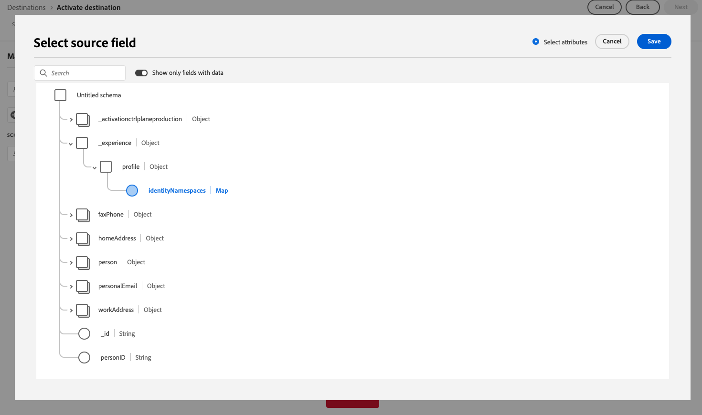

# Adobe Experience Platform release notes 

**Release date: March 26, 2025**

Updates to existing features and documentation in Adobe Experience Platform:

- [Adobe Experience Platform release notes](#adobe-experience-platform-release-notes)

  - [Dashboards](#dashboards)
  - [Destinations](#destinations)
  - [Federated Audience Composition](#federated-audience-composition)
  - [Segmentation Service](#segmentation-service)
  - [Sources](#sources)

## Dashboards {#dashboards}

Experience Platform provides multiple dashboards through which you can view important insights about your organization's data, as captured during daily snapshots.

**New or updated features**

| Feature | Description |
| ------- | ----------- |
| Metrics-based license usage dashboard | The license usage dashboard now includes a streamlined UI with two tabs: **Metrics** and **Products**. The new **Metrics** tab offers a consolidated view of all trackable license metrics across your purchased products. Each metric includes an inline info icon displaying descriptions and associated products. Users can select Production or Development sandboxes, view historical usage trends in interactive charts, and export sandbox-specific data as CSV files. These updates streamline license tracking and provide clearer insights. Learn more in the [license usage dashboard guide](../../dashboards/guides/license-usage.md) for more details. |
| Updated prediction frequency | The license usage dashboard now provides more accurate insights into projected consumption by updating usage predictions **weekly** instead of monthly. These forecasts show estimated usage over the next six weeks based on recent trends. This change allows for faster decision-making, earlier intervention, and improved license planning. See the [license usage dashboard guide](../../dashboards/guides/license-usage.md#predicted-usage) for details. |
| Updated metric descriptions in UI | Metric definitions in the license usage dashboard have been revised for clarity and consistency. You can now view updated descriptions directly in the dashboard using inline info icons next to each metric in the **Metrics** tab. These updates make it easier to understand how metrics are tracked and which products they apply to. See the [license usage dashboard guide](../../dashboards/guides/license-usage.md#available-metrics) for more details. |

{style="table-layout:auto"}

For more information on dashboards, including how to grant access permissions and create custom widgets, begin by reading the [dashboards overview](../../dashboards/home.md).

## Destinations {#destinations}

[!DNL Destinations] are pre-built integrations with destination platforms that allow for the seamless activation of data from Adobe Experience Platform. You can use destinations to activate your known and unknown data for cross-channel marketing campaigns, email campaigns, targeted advertising, and many other use cases.

**New or updated destinations** {#new-updated-destinations}

| Destination | Description |
| --- | --- |
| [Demandbase People connection](/help/destinations/catalog/advertising/demandbase-people.md) | Use the [!DNL Demandbase People] connection to activate profiles for your Demandbase campaigns for audience targeting, personalization, and suppression. |
| [Bombora account connection](/help/destinations/catalog/advertising/bombora.md) | Use the  [!DNL Bombora] connection to activate profiles for your Bombora campaigns for audience targeting, personalization, and suppression, based on [account audiences](/help/segmentation/types/account-audiences.md). |
| [Airship Attributes](/help/destinations/catalog/mobile-engagement/airship-attributes.md) upgrade | Starting March 25, 2025, you can see two **[!UICONTROL Airship Attributes]** cards side-by-side in the destinations catalog. This is due to an internal upgrade to the destinations service. The existing **[!UICONTROL Airship Attributes]** destination connector has been renamed to **[!UICONTROL (Deprecated) Airship Attributes]** and a new card with the name **[!UICONTROL Airship Attributes]** is now available to you.   Use the **[!UICONTROL Airship Attributes]** connection in the catalog for new activation data flows. If you have any active dataflows to the [!DNL (Deprecated) Airship Attributes] destination, they will be updated automatically, so no action is required from you.   If you are creating dataflows through the [Flow Service API](https://developer.adobe.com/experience-platform-apis/references/destinations/), you must update your [!DNL flow spec ID] and [!DNL connection spec ID] to the following values: <ul><li> Flow spec ID: `a862e0be-966e-4e5a-80d3-1bb566461986`</li><li> Connection spec ID: `594bc002-4a47-49b7-8a98-ac0d21045502`</li> </ul>|

{style="table-layout:auto"}

**New or updated functionality** {#destinations-new-updated-functionality}

| Feature | Description |
| --- | --- |
| [Reporting accuracy enhancements for streaming destinations](../../dataflows/ui/monitor-destinations.md) | Starting with March 2025, Adobe is rolling out an update to increase reporting accuracy for streaming destinations. This enhancement ensures a better alignment between the reporting in Experience Platform and the destination platforms.   Before this update, **[!UICONTROL Identities failed]** included all activation retries. After this update, only the last activation retry is included in the total count.   This enhancement applies to all streaming destinations.   Following this enhancement, users of streaming destinations may see an expected drop in their **[!UICONTROL Identities failed]** count. |
| [Map-type field export support for enterprise and edge destinations](/help/destinations/ui/export-arrays-maps-objects.md) | When exporting data to the [Amazon Kinesis](/help/destinations/catalog/cloud-storage/amazon-kinesis.md), [HTTP API](/help/destinations/catalog/streaming/http-destination.md), [Azure Event Hubs](/help/destinations/catalog/cloud-storage/azure-event-hubs.md), and [Adobe Target](/help/destinations/catalog/personalization/adobe-target-connection.md) destinations, you can now select map-type fields for export in the mapping step of the activation workflow.   {width="250" align="center" zoomable="yes"}|

{style="table-layout:auto"}

For more information, read the [destinations overview](../../destinations/home.md). 

## Federated Audience Composition {#federated-audience-composition}

For information on the latest updates for Federated Audience Composition, read the [dedicated release notes](https://experienceleague.adobe.com/en/docs/federated-audience-composition/using/release-notes) here.

## Segmentation Service {#segmentation-service}

[!DNL Segmentation Service] defines a particular subset of profiles by describing the criteria that distinguishes a marketable group of people within your customer base. Segments can be based on record data (such as demographic information) or time series events representing customer interactions with your brand.

| Feature | Description |
| ------- | ----------- |
| Account Audience Builder enhancements | Within Audience Builder, you can now filter attributes to only display populated attributes as well as view summary data for these populated attributes. More information on these enhancements can be found in the [Audience Builder](../../rtcdp/segmentation/audience-builder.md) documentation. |
| Flexible audience evaluation general availability | Flexible audience evaluation is now generally available! You can use flexible audience evaluation to create new audiences on demand for time-sensitive communications. More information about flexible audience evaluation can be found in the [flexible audience evaluation overview](../../segmentation/methods/flexible-audience-evaluation.md). |

For more information on [!DNL Segmentation Service], please see the [Segmentation overview](../../segmentation/home.md).

## Sources {#sources}

Experience Platform provides a RESTful API and an interactive UI that lets you set up source connections for various data providers with ease. These source connections allow you to authenticate and connect to external storage systems and CRM services, set times for ingestion runs, and manage data ingestion throughput.

Use sources in Experience Platform to ingest data from an Adobe application or a third-party data source.

**New sources**

| Feature | Description |
| --- | --- |
| [!DNL Bombora Intent] | The [!DNL Bombora Intent] source is now available in the sources catalog. Use this source to: <ul><li>Integrate Bombora's Company Surge Intent data to identify accounts actively researching your products or services.</li><li>Prioritize in-market accounts to create precise segments and execute hyper-targeted ABM campaigns, ensuring your marketing efforts focus on those account most likely to convert.</li><li>Leverage intent-driven strategies to optimize ad spend, boost engagement, and maximize ROI.</li></ul> For more information, read the guide on [connecting your [!DNL Bombora] account to Experience Platform](../../sources/tutorials/ui/create/data-partners/bombora.md). |
| [!DNL Demandbase Intent] | The [!DNL Demandbase Intent]¸ source is now available in the sources catalog. Use this source to: <ul><li>Integrate Demandbase's Account Intent data to identify high-interest accounts based on real-time engagements.</li><li>By prioritizing the strongest intent signals, you can create precise segments and deliver hyper-targeted campaigns to ensure that your marketing efforts focus on accounts most likely to convert.</li><li>Activate intent-driven strategies to enable optimization of ad spend, increased engagement, and higher ROI.</li></ul> For more information, read the guide on [connecting your [!DNL Demandbase] account to Experience Platform](../../sources/tutorials/ui/create/data-partners/demandbase.md). |

{style="table-layout:auto"}

**Updated features**

| Feature | Description |
| --- | --- |
| Enhancements to the [!DNL Google Ads] source | You can now use the [[!DNL Google Ads] source](../../sources/connectors/advertising/ads.md) to ingest aggregate data. You can use the [!DNL Google Ads Query Builder] to specify the attributes, segments, and resources that you want to ingest to Experience Platform. For more information, read the guide on [connecting your [!DNL Google Ads] account to Experience Platform](../../sources/tutorials/ui/create/advertising/ads.md). |
| Enhancements to the [!DNL Microsoft Dynamics] source | You can now specify the primary key of a given [!DNL Microsoft Dynamics] table when exploring the contents and structure of your data. Use this feature to optimize your queries with the [!DNL Microsoft Dynamics] source. For more information, read the guide on [connecting your [!DNL Microsoft Dynamics] source to Experience Platform using the API](../../sources/tutorials/api/create/crm/ms-dynamics.md). |
| Support for API key authentication in Self-Serve Sources (Batch SDK) | You can now use API key authentication as an authentication type when integrating a new source with Self-Serve Sources (Batch SDK). For more information, read the guide on [configuring your auth spec in Batch SDK](../../sources/sources-sdk/config/authspec.md). |
| Support for attribute-based access control in sources | You can now use attribute-based access control functions against your sources dataflows. Read the following guides for more information: <ul><li>[Apply labels to your sources dataflows using the API](../../sources/tutorials/api/labels.md)</li><li>[Apply labels to your sources dataflows using the UI](../../sources/tutorials/ui/labels.md). |

{style="table-layout:auto"}

For more information, read the [sources overview](../../sources/home.md).
