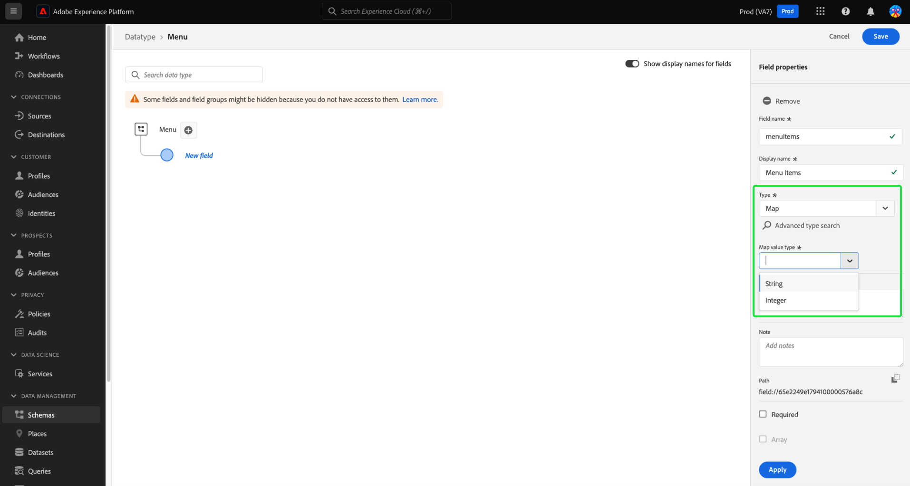
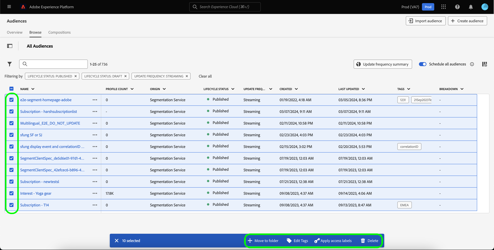
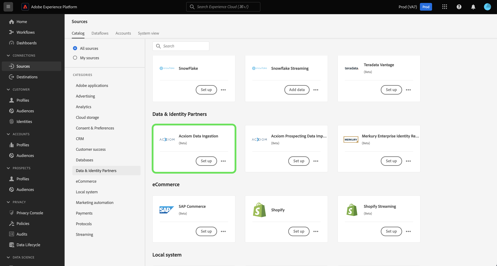
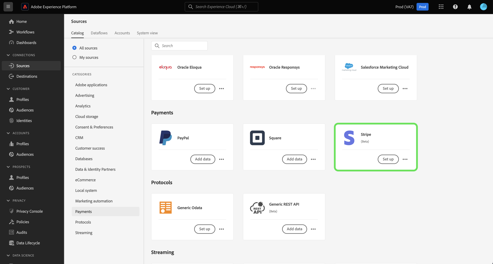
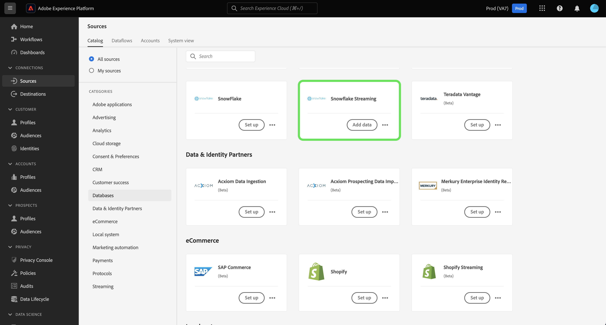

# Adobe Experience Platform release notes 

**Release date: March 19, 2024**

>[!TIP]
>
>Use the [Adobe Experience Platform glossary](/help/landing/glossary.md) to get familiar with terminology used in Real-Time Customer Data Platform and Adobe Experience Platform. If you cannot find a specific term that you are looking for, use the feedback options on the page to request new terms be added to the glossary.

Updates to existing features in Experience Platform:

- [Catalog Service](#catalog-service)
- [Data collection](#data-collection)
- [Data Prep](#data-prep)
- [Destinations](#destinations)
- [Experience Data Model (XDM)](#xdm)
- [Segmentation Service](#segmentation)
- [Sources](#sources)

## Catalog Service {#catalog-service}

Catalog Service is the system of record for data location and lineage within Adobe Experience Platform. While all data that is ingested into Experience Platform is stored in the data lake as files and directories, Catalog holds the metadata and description of those files and directories for lookup and monitoring purposes.

| Feature | Description |
| --- | --- |
| More actions | To make operations more flexible and help you manage your data, you can now use the "More actions" feature from the details view to perform additional tasks on a dataset. You can either delete the dataset or enable it for use with Real-Time Customer Profile from the details page of a chosen dataset. **Note:** if you enable a dataset for Profile ingestion, the dataset's schema must be compatible with Real-Time Customer Profile. ![The Datasets workspace with the [!UICONTROL ... More] dropdown menu highlighted.](../2024/assets/march/more-actions.png "The Datasets workspace with the More dropdown menu highlighted."){width="100" zoomable="yes"}. Read the [datasets user guide](../../catalog/datasets/user-guide.md) documentation for addition information. |

{style="table-layout:auto"}

For more information on Catalog Service, refer to the [Catalog Service overview](../../catalog/home.md).

## Data Prep {#data-prep}

Data Prep allows data engineers to map, transform, and validate data to and from Experience Data Model (XDM).

**New or updated features**

| Feature | Description |
| --- | --- |
| New mapper functions for Adobe Analytics | You can now use the following functions to extract event data from Adobe Analytics: <ul><li>`aa_get_event_id`</li><li>`aa_get_event_value`</li><li>`aa_get_product_categories`</li><li>`aa_get_product_names`</li><li>`aa_get_product_quantities`</li><li>`aa_get_product_prices`</li><li>`aa_get_product_event_values`</li><li>`aa_get_product_evars`</li></ul> For more information on these functions, read the [Data Prep functions guide](../../data-prep/functions.md#analytics-functions) |

{style="table-layout:auto"}

For more information on Data Prep, read the [Data Prep overview](../../data-prep/home.md).

## Data collection {#data-collection}

Adobe Experience Platform provides a suite of technologies that allow you to collect client-side customer experience data and send it to the Adobe Experience Platform Edge Network where it can be enriched, transformed, and distributed to Adobe or non-Adobe destinations.

**New features**

| Type | Feature | Description |
| --- | --- | --- |
| Extensions | [!DNL Merkury] Tag Extension | The [[!DNL Merkury] tag extension](https://exchange.adobe.com/apps/ec/600027/merkury-tag) provides industry leading match rates for anonymous website visitors to a [!DNL Merkury] ID. Brands can leverage the power of the [!DNL Merkury] tag and Adobe to deliver real-time personalized website experiences. Additionally, the [!DNL Merkury] tag enables the growth of first-party digital data along with connected online and offline customer profiles. |

{style="table-layout:auto"}

To learn more about data collection, please read the [data collection overview](../../tags/home.md).

## Destinations {#destinations}

[!DNL Destinations] are pre-built integrations with destination platforms that allow for the seamless activation of data from Adobe Experience Platform. You can use destinations to activate your known and unknown data for cross-channel marketing campaigns, email campaigns, targeted advertising, and many other use cases.

**New and updated destinations** {#new-updated-destinations}

| Destination | Type | Description |
| ----------- | --------- | ----------- |
| [(Beta) Acxiom Data Enhancement connection](../../destinations/catalog/data-partner/acxiom-data-enhancement.md) | New | Use this connector to activate first-party profiles from Real-Time CDP to Acxiom for data enrichment and use across marketing channels. You can then use the Acxiom source to import the profiles with enhanced data and work with them in Real-Time CDP. |
| [(Beta) Acxiom Prospect Suppression connection](../../destinations/catalog/data-partner/acxiom-prospect-suppression.md) | New | Export your first-party audiences to the Acxiom destination, to allow Acxiom to suppress known or converted customers. Then, use the [Acxiom prospecting data import](../../sources/connectors/data-partners/acxiom-prospecting-data-import.md) source connector to ingest and activate prospect lists from Acxiom, with your known or converted customers removed. |
| [Amazon Ads connection](../../destinations/catalog/advertising/amazon-ads.md) | Update | When exporting data to the Amazon Ads destination, you can now route the data to the Amazon DSP or the Amazon Marketing Cloud (new). |
| [LiveRamp Onboarding connection](../../destinations/catalog/advertising/liveramp-onboarding.md) | Update | The LiveRamp Onboarding destination now has support for deliveries to Europe and Australia [!DNL LiveRamp] [!DNL SFTP] instances. The maximum exported file size was also increased to 10 million rows (from 5 million, previously). |

{style="table-layout:auto"}

<!--

**New or updated functionality** {#destinations-new-updated-functionality}

-->

For more general information on destinations, refer to the [destinations overview](../../destinations/home.md).

## Experience Data Model (XDM) {#xdm}

XDM is an open-source specification that provides common structures and definitions (schemas) for data that is brought into Adobe Experience Platform. By adhering to XDM standards, all customer experience data can be incorporated into a common representation to deliver insights in a faster, more integrated way. You can gain valuable insights from customer actions, define customer audiences through segments, and use customer attributes for personalization purposes.

**New features**

| Feature | Description |
| --- | --- |
| Experience Platform UI map datatype support | Further customize your Experience Data Model (XDM) data structure by defining map fields in the Platform UI. You can now create map fields in the Schema Editor to model flexible data structures or efficiently store key-value pairs. Select "Map" from the Type dropdown when defining a new field to configure subfields and assign them to field groups. Supported map value types are string and integer. {width="100" zoomable="yes"}  To learn how to [define map fields in the UI](../../xdm/ui/fields/map.md), see the UI guide. |

{style="table-layout:auto"}

For more information on XDM in Platform, see the [XDM System overview](../../xdm/home.md).

## Segmentation Service {#segmentation}

[!DNL Segmentation Service] allows you to segment data stored in [!DNL Experience Platform] that relates to individuals (such as customers, prospects, users, or organizations) into audiences. You can create audiences through segment definitions or other sources from your [!DNL Real-Time Customer Profile] data. These audiences are centrally configured and maintained on [!DNL Platform], and are readily accessible by any Adobe solution. 

**New feature**

| Feature | Description |
| ------- | ----------- |
| Bulk actions | The audience inventory now supports bulk actions. Using bulk actions, you can quickly select multiple audiences to move them to a folder, apply tags, apply access labels, or delete.   {width="100" zoomable="yes"}  For more information about this feature, read the [Segmentation Service UI guide](../../segmentation/ui/overview.md#bulk-actions). |

{style="table-layout:auto"}

To learn more about Segmentation Service, read the [Segmentation Service overview](../../segmentation/home.md).

## Sources {#sources}

Experience Platform provides a RESTful API and an interactive UI that lets you set up source connections for various data providers with ease. These source connections allow you to authenticate and connect to external storage systems and CRM services, set times for ingestion runs, and manage data ingestion throughput.

**New and updated sources**

| Feature | Type | Description |
| --- | --- | --- |
| [!BADGE Beta]{type=Informative} [!DNL Acxiom Data Ingestion] | New | Use the [[!DNL Acxiom Data Ingestion] source](../../sources/tutorials/ui/create/data-partners/acxiom-data-ingestion.md) to ingest [!DNL Acxiom] data into Real-Time Customer Data Platform and enrich first-party profiles. Then, you can use your [!DNL Acxiom]-enriched first-party profiles to improve audiences and activate across marketing channels.   {width="100" zoomable="yes"}   Read the [[!DNL Acxiom Data Ingestion] overview](../../sources/connectors/data-partners/acxiom-data-ingestion.md) for information on how to get started.  |
| [!BADGE Beta]{type=Informative} [!DNL Stripe] | New | Use the [[!DNL Stripe] source](../../sources/connectors/payments/stripe.md) to ingest data captured during the purchase flow by your customers into Experience Platform. Once ingested, you can use this data to create personalized offers and unlock richer business insights.   {width="100" zoomable="yes"}   Read the [[!DNL Stripe] overview](../../sources/connectors/payments/stripe.md) for information on how to get started.  |
| UI support for [!DNL Snowflake Streaming] | New | You can now use the [[!DNL Snowflake Streaming] source](../../sources/tutorials/ui/create/databases/snowflake-streaming.md) in the Experience Platform UI, to stream data from your [!DNL Snowflake] database.   {width="100" zoomable="yes"}   Read the [[!DNL Snowflake Streaming] overview](../../sources/connectors/databases/snowflake-streaming.md) for information on how to get started. |

{style="table-layout:auto"}

For more information on sources, read the [sources overview](../../sources/home.md).
