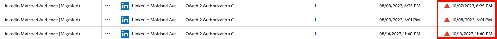

# Adobe Experience Platform release notes

>[!TIP]
>
>Refer to the following documentation for release notes of other Adobe Experience Platform applications:
>
>- [Adobe Journey Optimizer](https://experienceleague.adobe.com/en/docs/journey-optimizer/using/whats-new/release-notes)
>- [Adobe Journey Optimizer B2B](https://experienceleague.adobe.com/en/docs/journey-optimizer-b2b/user/release-notes)
>- [Customer Journey Analytics](https://experienceleague.adobe.com/en/docs/analytics-platform/using/releases/pre-release-notes)
>- [Federated Audience Composition](https://experienceleague.adobe.com/en/docs/federated-audience-composition/using/e-release-notes)
>- [Real-Time CDP Collaboration](https://experienceleague.adobe.com/en/docs/real-time-cdp-collaboration/using/latest)

**Release date: September 23, 2025**

New features and updates to existing features in Adobe Experience Platform:

- [Agent Orchestrator](#agent-orchestrator)
- [Alerts](#alerts)
- [Destinations](#destinations)
- [Experience Data Model (XDM)](#xdm)
- [Real-Time Customer Profile](#profile)
- [Segmentation Service](#segmentation-service)
- [Sources](#sources)

## Agent Orchestrator {#agent-orchestrator}

Adobe Experience Platform Agent Orchestrator is the new agentic layer in Adobe Experience Platform.

**New features**

| Feature | Description |
| --- | --- |
| Agent Orchestrator | Adobe Experience Platform Agent Orchestrator is the new agentic layer in Adobe Experience Platform. Designed to leverage the platform's rich data and customer knowledge, Experience Platform Agent Orchestrator powers the intelligence and reasoning behind purpose-built expert Adobe Experience Platform Agents, enabling them to execute complex decision-making and problem-solving tasks at speed and scale — all with human oversight. When you ask questions or request help via natural language in a conversational interface like AI Assistant, Agent Orchestrator automatically calls upon specialized agents to get you the right answers. Agent Orchestrator remembers your conversation history, enabling you to build on previous questions naturally without repeating context, and combines insights from multiple agents to present you with clear, unified responses. For more information, read the [Agent Orchestrator documentation](https://experienceleague.adobe.com/en/docs/experience-cloud-ai/experience-cloud-ai/agents/agent-orchestrator). |
| Audience Agent | The Audience Agent lets you view insights about audiences, including detecting significant audience size changes, detecting duplicate audiences, explore your audience inventory, and retrieve your audiences' size. For more information, read the [Audience Agent documentation](https://experienceleague.adobe.com/en/docs/experience-cloud-ai/experience-cloud-ai/agents/audience). |

For more information, read the [Agent Orchestrator documentation](https://experienceleague.adobe.com/en/docs/experience-cloud-ai/experience-cloud-ai/home).

## Alerts {#alerts}

Experience Platform allows you to subscribe to event-based alerts for various Experience Platform activities. You can subscribe to different alert rules through the [!UICONTROL Alerts] tab in the Experience Platform user interface, and can choose to receive alert messages within the UI itself or through email notifications.

**New features**

| Feature | Description |
| --- | --- |
| Streaming profile ingestion alerts | You can now subscribe to two new alerts for streaming ingestion on a dataflow level: <ul><li>Streaming Ingestion Failure Rate Exceeded</li><li>Streaming Ingestion Skipped Rate Exceeded</li></ul> In-platform or email alerts will notify you when the thresholds are exceeded for the default threshold, or a custom threshold you define. For more information, read the [Profile alerts](../../observability/alerts/rules.md#profile) guide. |

{style="table-layout:auto"}

For more information about alerts, read the [[!DNL Observability Insights] overview](../../observability/home.md).

## Destinations {#destinations}

[!DNL Destinations] are pre-built integrations with destination platforms that allow for the seamless activation of data from Experience Platform. You can use destinations to activate your known and unknown data for cross-channel marketing campaigns, email campaigns, targeted advertising, and many other use cases.

**New or updated destinations**

| Destination | Description |
| --- | --- |
| [!BADGE Beta]{type=Informative} [[!DNL Snowflake Batch]](../../destinations/catalog/cloud-storage/snowflake-batch.md) connector | A new [!DNL Snowflake Batch] connector is now available, providing an alternative to the streaming connector for specific use cases. |
| [[!DNL Data Landing Zone]](../../destinations/catalog/cloud-storage/data-landing-zone.md) encryption support | You can now attach RSA-formatted public keys to encrypt your exported files, giving you the same level of security that other cloud storage destinations provide for your sensitive information. |
| Authentication expiration details for [[!DNL Pinterest]](../../destinations/catalog/advertising/pinterest.md) destinations | Authentication expiration information for [!DNL Pinterest] destinations is now visible directly in the Experience Platform interface, so you can see when your authentication will expire and renew it before it causes any disruptions to your dataflows. You can monitor your token expiration dates from the **[!UICONTROL Account expiration date]** column in either the **[[!UICONTROL Accounts]](../../destinations/ui/destinations-workspace.md#accounts)** or the **[[!UICONTROL Browse]](../../destinations/ui/destinations-workspace.md#browse)** tabs.|

**New or updated functionality**

| Feature | Description |
| --- | --- |
| Enhanced destination management capabilities in the Experience Platform UI | Improve your destination management workflow with new sorting capabilities across the [[!UICONTROL Browse]](../../destinations/ui/destinations-workspace.md#browse) and [[!UICONTROL Accounts]](../../destinations/ui/destinations-workspace.md#accounts) tabs. You can now also see a visual indicator when your account authentication is about to expire.   {width="100" zoomable="yes"} |
| Persistent column width settings | Column width settings now persist when navigating away from a page and returning to it. For example, if you adjust a column width in the [[!UICONTROL Browse]](../../destinations/ui/destinations-workspace.md#browse) tab, your custom column width will remain the same when you navigate away and return to that tab. |

For more information, read the [Destinations overview](../../destinations/home.md).

## Experience Data Model (XDM) {#xdm}

XDM is an open-source specification that provides common structures and definitions (schemas) for data that is brought into Experience Platform. By adhering to XDM standards, all customer experience data can be incorporated into a common representation to deliver insights in a faster, more integrated way. You can gain valuable insights from customer actions, define customer audiences through segments, and use customer attributes for personalization purposes.

**New features**

| Feature | Description |
| ------- | ----------- |
| Model-based schemas | Simplify your data modeling with Model-Based Schemas. You can now create schemas more easily with comprehensive how-to examples and guidance. This feature is currently available to Campaign Orchestration license holders and will expand to Data Distiller customers at GA, making data modeling more accessible and efficient. The feature includes support for time-series data and change data capture capabilities. |
| Data Mirror | Ingest row-level changes from cloud data warehouses (e.g., Snowflake, Databricks, BigQuery) into Adobe Experience Platform using model-based schemas. Data Mirror eliminates upstream ETL and preserves relationships, versioning, and deletions by mirroring existing database structures directly into the data lake. Time-series and record event schema behavior with change data capture capabilities are all supported. This feature is currently available for Campaign Orchestration license holders and will expand through this limited release, also including Customer Journey Analytics customers. See the [Data Mirror documentation](../../xdm/data-mirror/overview.md) for more details. Contact your Adobe representative for access. |

For more information, read the [XDM overview](../../xdm/home.md).

## Real-Time Customer Profile {#profile}

Adobe Experience Platform enables you to drive coordinated, consistent, and relevant experiences for your customers no matter where or when they interact with your brand. With Real-Time Customer Profile, you can see a holistic view of each individual customer that combines data from multiple channels, including online, offline, CRM, and third party data. Profile allows you to consolidate customer data into a unified view offering an actionable, timestamped account of every customer interaction.

**Updated features**

| Feature | Description |
| ------- | ----------- |
| [!BADGE Alpha]{type=Informative} Profile viewer enhancements | The September 2025 release includes the following enhancements to the Profile viewer. <ul><li>**Combined view**: Attribute, events, and insights have been combined into a single view.</li><li>**AI-generated insights**: The profile details page now displays AI-generated insights, letting you know details generated from your profile. These insights can include information such as propensity scores and trend analysis.</li><li>**Style update**: The profile details page has been visually refreshed.</li><li>**Browse**: You can now explore your profiles through an interactive card-based carousel with search and customization.</li></ul> |

For more information, read the [Real-Time Customer Profile overview](../../profile/home.md).

## Segmentation Service {#segmentation-service}

[!DNL Segmentation Service] defines a particular subset of profiles by describing the criteria that distinguishes a marketable group of people within your customer base. Audiences can be based on record data (such as demographic information) or time series events representing customer interactions with your brand.

**New or updated features**

| Feature | Description |
| ------- | ----------- |
| Account audiences with experience events deprecation | After the B2B architecture upgrade, account audiences with experience events are no longer supported. Instead, use the new segment of segments approach: create a People audience with Experience Events, then refer to that People audience when creating an Account Audience. This provides a more flexible and maintainable approach to B2B audience creation. |

**Important updates**

| Update | Description |
| ------- | ----------- |
| Audience estimates auto-refresh revert | The auto-refresh enhancement for audience estimates has been reverted. Audience estimates will continue to be generated within Segment Builder, but the automatic refresh functionality has been removed. |
| External audience | Starting on September 30th, external audiences will be retrieved through Unified Search in Segment Builder. If you are using Segment Match, you can enable the legacy experience within Segment Builder. |

For more information, read the [[!DNL Segmentation Service] overview](../../segmentation/home.md).

## Sources {#sources}

Experience Platform provides a RESTful API and an interactive UI that lets you set up source connections for various data providers with ease. These source connections allow you to authenticate and connect to external storage systems and CRM services, set times for ingestion runs, and manage data ingestion throughput.

**New or updated features**

| Feature | Description |
| --- | --- |
| New sources in General Availability | The following sources are now in General Availability: Several source connectors have been updated from Beta to GA: <ul><li>[Acxiom Data Ingestion](../../sources/connectors/data-partners/acxiom-data-ingestion.md)</li><li>[Acxiom Prospect Data Ingestion](../../sources/connectors/data-partners/acxiom-prospecting-data-import.md)</li><li>[Merkury Enterprise](../../sources/connectors/data-partners/merkury.md)</li><li>[SAP Commerce](../../sources/connectors/ecommerce/sap-commerce.md)</li></ul>. These sources are now fully supported and ready for production use. |
| [!DNL Snowflake] key-pair authentication support | Enhanced security for Snowflake connections with support for key-pair authentication. Basic authentication (username/password) will be deprecated by November 2025, so customers are encouraged to migrate to key-pair authentication for improved security. For more information, read the [[!DNL Snowflake] documentation](../../sources/connectors/databases/snowflake.md). |
| [!BADGE Beta]{type=Informative} [!DNL Capillary Streaming Events] | Use the [[!DNL Capillary Streaming Events] source](../../sources/connectors/loyalty/capillary.md) to stream loyalty data from your [!DNL Capillary] account to Experience Platform. |
| [!BADGE Beta]{type=Informative} [!DNL Relay Connector] | Use the [[!DNL Relay Connector]](../../sources/tutorials/ui/create/marketing-automation/relay-connector.md) to stream Events data from your [!DNL Relay Network] integration into Experience Platform. |
| General Availability of Private Link Support in sources | You can now use **private links** for a select group of sources. Use this feature to create a private endpoint that which your source can connect to. With private endpoints, you can set up connections and dataflows that bypass the public internet, giving you enhanced security and network isolation for your sensitive data. Support for private links is available to the following following sources: <ul><li>[[!DNL Azure Blob Storage]](../../sources/connectors/cloud-storage/blob.md)</li><li>[[!DNL ADLS Gen2]](../../sources/connectors/cloud-storage/adls-gen2.md)</li><li>[[!DNL Azure File Storage]](../../sources/connectors/cloud-storage/azure-file-storage.md)</li></ul>. For more information read the guides on creating private links [in the API](../../sources/tutorials/api/private-link.md) and [in the UI](../../sources/tutorials/ui/private-link.md). |

For more information, read the [sources overview](../../sources/home.md).
