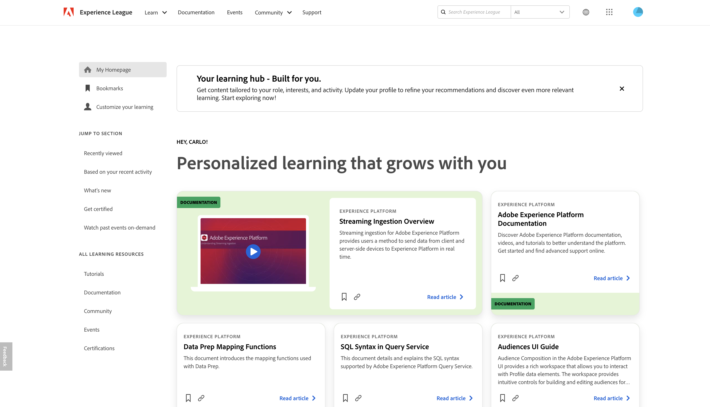

# Adobe Experience Platform release notes

>[!TIP]
>
>Refer to the following documentation for release notes of other Adobe Experience Platform applications:
>
>- [Adobe Journey Optimizer](https://experienceleague.adobe.com/en/docs/journey-optimizer/using/whats-new/release-notes)
>- [Adobe Journey Optimizer B2B](https://experienceleague.adobe.com/en/docs/journey-optimizer-b2b/user/release-notes)
>- [Customer Journey Analytics](https://experienceleague.adobe.com/en/docs/analytics-platform/using/releases/latest)
>- [Real-Time CDP Collaboration](https://experienceleague.adobe.com/en/docs/real-time-cdp-collaboration/using/latest)

**Release date: April 29, 2025**

Updates to existing features and documentation in Adobe Experience Platform:

- [Experience League](#experience-league)
- [Data Collection](#data-collection)
- [Destinations](#destinations)
- [Experience Data Model](#xdm)
- [Identity Service](#identity)
- [Query Service](#query-service)
- [Sandboxes](#sandboxes)
- [Sources](#sources)
- [Use Case Playbooks](#use-case-playbooks)

## Experience League {#experience-league}

Experience League is a comprehensive learning platform designed to help you enhance your skills with Adobe products. It offers a variety of resources, including: courses, documentation, community pages, events, and access to certifications.

| Feature | Description |
| --- | --- |
| Personalized home page | Access and customize your personalized home page on [Experience League](https://experienceleague.adobe.com/en/home#). Sign in with your Adobe credentials and then select **[!UICONTROL Experience League]** on the top menu to start optimizing your learning experience: <ul><li>**Bookmarks**: Use the [!UICONTROL Bookmarks] feature to save and collect your favorite resources in one place. You can save a variety of content, including playlists, articles, and tutorials.</li><li>**Customize your learning**: Enhance your learning experience by updating your Experience League profile with the roles, industries, products, and experience level that best match your needs.</li><li>**Recommendations**: View learning content recommended based on your recent activity.</li><li>**Recently viewed**: Use the [!UICONTROL Recently viewed] section to quickly navigate back to recently viewed content such as documentation and videos.</li><li>**Learning resources**: Use the [!UICONTROL All learning resources] panel to navigate to tutorials, documentation, community, events, and certifications.</li><li>**What's new**: View the [!UICONTROL What's new] section for a stream of the latest content on Experience League.</li><li>**Watch past events on-demand**: Watch previously recorded live streams on product spotlights, use cases, and tutorials with the [!UICONTROL Watch past events on-demand] section.</li></ul>  {width="250" align="center" zoomable="yes"} |

{style="table-layout:auto"}

## Data collection {#data-collection}

Adobe Experience Platform provides a suite of technologies that allow you to collect client-side customer experience data and send it to the Adobe Experience Platform Edge Network where it can be enriched, transformed, and distributed to Adobe or non-Adobe destinations.

**New or updated features**

| Feature | Description |
| --- | --- |
| [!DNL Adform] extension | The [!DNL Adform] server-side extension enables brands to easily retarget audiences off-site using ECIDs. This server-side extension is not reliant on third-party cookies or cookie alternate IDs. Additionally, because this is done entirely server-side, no additional pixels or other client-side changes are needed. For more information, see the [Adform extension overview](/help/tags/extensions/server/adform/overview.md). |
| [!DNL Amazon] web events API extension | The [!DNL Amazon] Conversions API extension enables advertisers to share website interactions directly with [!DNL Amazon], providing improved attribution, data reliability, and campaign optimization. This extension supports event forwarding, allowing you to send conversion events such as purchases, cart additions, and more, while ensuring proper deduplication for accurate reporting. For more information, see the [Amazon extension overview](/help/tags/extensions/server/amazon/overview.md). |

{style="table-layout:auto"}

## Destinations {#destinations}

[!DNL Destinations] are pre-built integrations with destination platforms that allow for the seamless activation of data from Adobe Experience Platform. You can use destinations to activate your known and unknown data for cross-channel marketing campaigns, email campaigns, targeted advertising, and many other use cases.

**New or updated destinations** {#new-updated-destinations}

| Destination | Description |
| --- | --- |
| [Marketo Engage Person Sync](/help/destinations/catalog/adobe/marketo-engage-person-sync.md) | Adobe updated the [!DNL Marketo Engage Person Sync] destination to fix an issue that affected customers when multiple emails were present in the identity map.|
| [(V2) Pega CDH Realtime Audience connection](/help/destinations/catalog/personalization/pega-v2.md) | Use the [!DNL (V2) Pega Customer Decision Hub Realtime Audience] destination in Adobe Experience Platform to send profile attributes and audience membership data to Pega Customer Decision Hub for next-best-action decisioning, when you have multiple Pega Customer Decision Hub applications configured in your Pega account.|

**New or updated functionality** {#destinations-new-updated-functionality}

| Feature | Description |
| --- | --- |
| **Weekly** and **Monthly** scheduling options for full file exports | You can now schedule full file exports for people and prospect audiences on a weekly or monthly basis when activating to cloud storage file-based destinations. [Read more](/help/destinations/ui/activate-batch-profile-destinations.md#export-full-files) about scheduling options. |

{style="table-layout:auto"}

**Fixes, enhancements, and other announcements** {#destinations-fixes-and-enhancements}

- **Enforcement of dataset export end dates delayed to September 1, 2025**  
As part of the [September 2024 release](/help/release-notes/2024/september-2024.md#destinations-new-updated-functionality), Adobe set a default end date of May 1, 2025, for any dataset export dataflows created *before that release*. Adobe is now extending this enforcement deadline to **September 1, 2025** to provide customers with additional time to update their schedules. Refer to the scheduling section of the [export datasets tutorial](../../destinations/ui/export-datasets.md#schedule-dataset-export) for information on how to edit the end date of a dataset export dataflow.

- **Improved handling of failed SFTP transfers for LiveRamp Onboarding**  
Adobe has implemented a fix for an issue affecting file exports to the [LiveRamp Onboarding](/help/destinations/catalog/advertising/liveramp-onboarding.md) destination via SFTP. Occasionally, file transfers failed due to transient server-side issues, and temporary files from failed attempts remained on the server. These undeletable files blocked subsequent retries, as Adobe did not have permission to overwrite them.  
With the fix, if a retry attempt cannot delete the temporary file, Adobe will generate a new file with an appended suffix ,`attempt2`, to ensure the retry completes successfully.

## Experience Data Model (XDM) {#xdm}

XDM is an open-source specification that provides common structures and definitions (schemas) for data that is brought into Adobe Experience Platform. By adhering to XDM standards, all customer experience data can be incorporated into a common representation to deliver insights in a faster, more integrated way. You can gain valuable insights from customer actions, define customer audiences through segments, and use customer attributes for personalization purposes.

**Updated XDM components**

| Feature | Description |
| --- | --- |
| String fields receive a minimum value of one | New string fields are given a minimum length of one by default. Null values for non-required fields are still acceptable. For more information on best practices, read the guide on [best practices for data modeling](../../xdm/schema/best-practices.md#data-integrity-tips) |

{style="table-layout:auto"}

For more information on XDM in Experience Platform, see the [XDM System overview](../../xdm/home.md).

## Identity Service {#identity}

Use Adobe Experience Platform Identity Service to create a comprehensive view of your customers and their behaviors by bridging identities across devices and systems, allowing you to deliver impactful, personal digital experiences in real time.

**Updated features**

| Feature | Description |
| --- | --- |
| [!BADGE Limited Availability]{type=Informative} [!DNL Identity Graph Linking Rules] Identity Graph Linking Rules can now be accessed by all customers in development sandboxes. <ul><li>**Activation requirements**: The feature will remain inactive until you configure and save your [!DNL Identity Settings]. Without this configuration, the system will continue to operate normally, with no changes in behavior.</li><li>**Important notes**: During this Limited Availability phase, Edge segmentation may produce unexpected segment membership results. However, streaming and batch segmentation will function as expected.</li><li>**Next steps**: For information on how to enable this feature in production sandboxes, please contact your Adobe account team.</li></ul> |

{style="table-layout:auto"}

For more information, read the [[!DNL Identity Graph Linking Rules] documentation](../../identity-service/identity-graph-linking-rules/overview.md).

## Query Service {#query-service}

Query data in the Adobe Experience Platform data lake using standard SQL with Query Service. Seamlessly combine datasets and generate new ones from your query results to power reporting, enable data science workflows, or facilitate ingestion into Real-Time Customer Profile. For example, you can merge customer transaction data with behavioral data to identify high-value audiences for targeted marketing campaigns.

**Updated features**

| Feature | Description |
| --- | --- |
| SQL audience overwrite | Refresh audience membership by overwriting existing profiles with the results of a new SQL query. This allows you to manage dynamic audiences more efficiently by removing outdated records and inserting updated ones in a single operation. For more information, see the [SQL audience extension guide](../../query-service/data-distiller-audiences/overview.md#replace-audience). |
| Download and Copy Query Results | [Download query results directly from the Query Editor](../../query-service/ui/overview.md#download-query-results) as CSV, XLSX, or JSON files, or [copy results to your clipboard](../../query-service/ui/overview.md#copy-results) as comma-separated values (CSV) for quick use in spreadsheet applications like Excel. These enhancements streamline offline analysis, reporting, and data validation workflows. |
| View Query Results in Full Screen | [Preview query results in a full-screen dialog](../../query-service/ui/overview.md#view-results) to improve readability, easily scan large datasets, and select rows for copying. The full-screen view provides a resizable grid layout, helping you review wide tables and detailed output more efficiently. |
| Enhanced Column Selection in Model Prediction | Select specific columns and apply aliases using the extended `model_predict` syntax. Retrieve intermediate prediction results such as feature vectors and probability scores. The enhanced selection requires a feature flag activation. See [Model lifecycle documentation](../../query-service/advanced-statistics/models.md#select-specific-output-fields) for syntax examples and feature flag details. |
| Save Model Prediction Outputs Using CREATE TABLE and INSERT INTO | [Save selected prediction outputs into new tables using CREATE TABLE AS SELECT or insert into existing tables using INSERT INTO SELECT](../../query-service/advanced-statistics/models.md#predict). If enhanced column selection is enabled, intermediate results such as feature vectors and probabilities can also be persisted alongside final predictions. For usage examples, refer to the [SQL syntax documentation](../../query-service/sql/syntax.md#create-table-as-select). |

For more information on [!DNL Query Service], please see the [[!DNL Query Service] overview](../../query-service/home.md).

## Sandboxes {#sandboxes}

Adobe Experience Platform is built to enrich digital experience applications on a global scale. Companies often run multiple digital experience applications in parallel and need to cater for the development, testing, and deployment of these applications while ensuring operational compliance. To address this need, Experience Platform provides sandboxes that partition a single Experience Platform instance into separate virtual environments to help develop and evolve digital experience applications.

**New or updated features**

| Feature | Description |
| --- | --- |
| Sandbox tooling plugin support expansion | Custom actions can now be copied as a dependent object when duplicating Journey objects in sandbox tooling. Additionally, you can select existing actions to reuse in the target sandbox. They can also be added to a package independently. For complete information on supported Adobe Journey Optimizer objects, read the [sandbox tooling](../../sandboxes/ui/sandbox-tooling.md#adobe-journey-optimizer-objects) guide. |

{style="table-layout:auto"}

For more information on sandboxes, read the [sandboxes overview](../../sandboxes/home.md).

## Sources {#sources}

Experience Platform provides a RESTful API and an interactive UI that lets you set up source connections for various data providers with ease. These source connections allow you to authenticate and connect to external storage systems and CRM services, set times for ingestion runs, and manage data ingestion throughput.

Use sources in Experience Platform to ingest data from an Adobe application or a third-party data source.

**New sources**

| Feature | Description |
| --- | --- |
| [!BADGE Beta]{type=Informative} [!DNL Algolia User Profiles] | The [[!DNL Algolia User Profiles]](../../sources/connectors/data-partners/algolia-user-profiles.md) source is now available. Use this source to bring your [!DNL Algolia] user profiles affinities data to Experience Platform. You can then use this data to improve user engagement, conversion rates, and overall customer experience by providing high-performance search solutions for websites, e-commerce platforms, and applications. For more information, read the guide on how to [ingest [!DNL Algolia User Profiles] data to Experience Platform](../../sources/tutorials/ui/create/data-partners/algolia-user-profiles.md). |
| [!BADGE Beta]{type=Informative} API support for [!DNL Azure Databricks] | The [!DNL Azure Databricks] source is now available in the API. Use the [!DNL Flow Service] API to connect your [!DNL Databricks] account and bring your [!DNL Databricks] data to Experience Platform. For more information read the documentation on [[!DNL Azure Databricks]](../../sources/connectors/databases/databricks.md). |

{style="table-layout:auto"}

**Updated features**

| Feature | Description |
| --- | --- |
| Updated XDM fields for ingesting Streaming Media data into Experience Platform. | The new XDM field group, `mediaReporting`, is now available for ingesting Streaming Media data via the Adobe Analytics source into Experience Platform. This field replaces the `media.mediaTimed` field.   During a transitional period of three months, data ingestion on `media.mediaTimed` fields will continue. However, at the end of July 2025, the `media.mediaTimed` fields will be fully deprecated and no longer visible in the Experience Platform Schema UI, and data will only be sent using the `mediaReporting` fields.  If have you implemented the Analytics source to collect Streaming Media data into Platform before April 22, 2025, then you must migrate your existing configurations to send data using the new field group. This migration must be complete by the end of July 2025. Contact your Adobe Account Team for migration support. |
| New authentication types for [!DNL MariaDB] and [!DNL PostgreSQL] | You can now use basic authentication to authenticate your [!DNL MariaDB] and [!DNL PostgreSQL] sources on Experience Platform. Read the following documentation for more information: <ul><li>[[!DNL MariaDB]](../../sources/connectors/databases/mariadb.md)</li><li>[[!DNL PostgreSQL]](../../sources/connectors/databases/postgres.md) |
| Row-level filtering support for [!DNL Amazon Redshift] | You can use row-level filtering capabilities for your [!DNL Amazon Redshift] data on Experience Platform. For more information, read the guide on [filtering row-level data for sources in the API](../../sources/tutorials/api/filter.md). |

{style="table-layout:auto"}

For more information, read the [sources overview](../../sources/home.md).

## Use Case Playbooks {#use-case-playbooks}

Use Case Playbooks were originally designed to help overcome challenges when getting started with Real-Time Customer Data Platform or Adobe Journey Optimizer. They continue to evolve, and now enable you to jumpstart key marketing use cases and provide inspiration and pre-built assets to test and move into production.

Use Case Playbooks have transitioned from a discovery tool into a collaborative framework. They now help you build, manage, and share your own playbooks across different organizations.

**Updated features**

| Feature | Description |
| --- | --- |
| [!BADGE Beta]{type=Informative} Author and share your own playbooks | A new Playbook Authoring Framework enables you to create, manage, and share your own use case playbooks. This includes support for capturing key metadata, editing journey maps, and associating relevant technical assets. You can share Playbooks across organizations to standardize marketing approaches and maintain consistency. |

{style="table-layout:auto"}

To learn how you can author and share your own playbooks, read the [Author and share your own playbooks](/help/use-case-playbooks/playbooks/author.md) document.

For more information, read the [Use Case Playbooks overview](/help/use-case-playbooks/playbooks/overview.md), which provides an overview of the playbooks' functionality, their purpose, and an end-to-end demonstration, including how to create instances and import generated assets into other sandbox environments.
