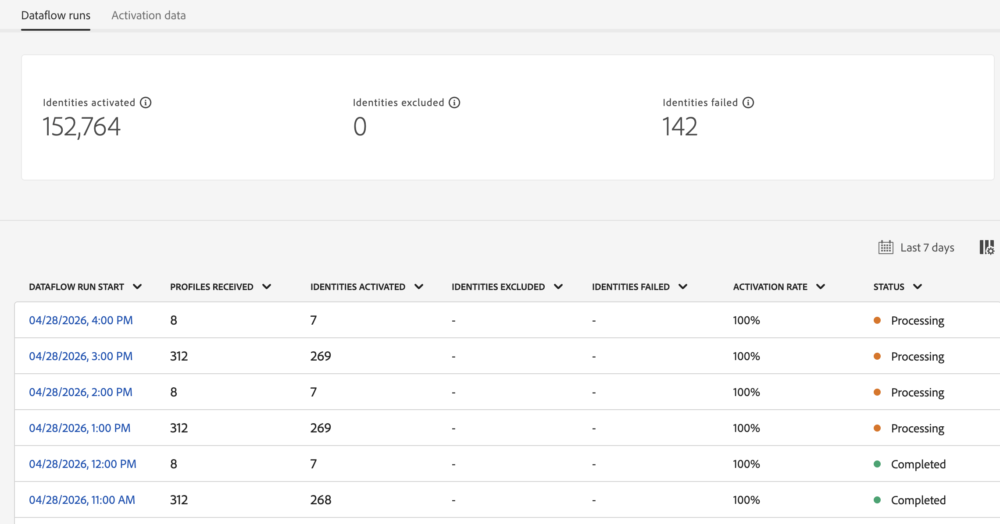
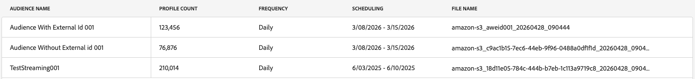
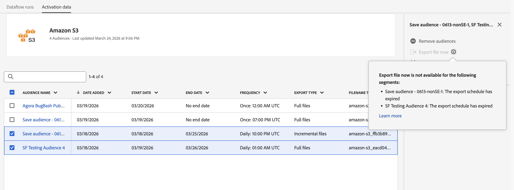

# Adobe Experience Platform release notes

>[!TIP]
>
>Refer to the following documentation for release notes of other Adobe Experience Platform applications:
>
>- [Adobe Journey Optimizer](https://experienceleague.adobe.com/en/docs/journey-optimizer/using/whats-new/release-notes)
>- [Adobe Journey Optimizer B2B](https://experienceleague.adobe.com/en/docs/journey-optimizer-b2b/user/release-notes)
>- [Customer Journey Analytics](https://experienceleague.adobe.com/en/docs/analytics-platform/using/releases/latest)
>- [Federated Audience Composition](https://experienceleague.adobe.com/en/docs/federated-audience-composition/using/release-notes)
>- [Real-Time CDP Collaboration](https://experienceleague.adobe.com/en/docs/real-time-cdp-collaboration/using/latest)

**Release date: March 24, 2026**

New features and updates to existing features in Adobe Experience Platform:

- [Data collection](#data-collection)
- [Destinations](#destinations)
- [Experience Data Model (XDM)](#xdm)
- [Query Service](#query-service)
- [Real-Time CDP](#rtcdp)
- [Sandboxes](#sandboxes)
- [Sources](#sources)
 
## Data collection {#data-collection}

Adobe Experience Platform provides a suite of technologies that allow you to collect client-side customer experience data and send it to the Adobe Experience Platform Edge Network where it can be enriched, transformed, and distributed to Adobe or non-Adobe destinations.

**New or updated features**

| Feature | Description |
| --- | --- |
| View build details | You can now access Builds and build details from either a Library or an Environment to view the currently live build and inspect the contents (extensions, data elements, and rules). For more information, see the [Builds overview](../../tags/ui/publishing/builds.md#build-details). |

{style="table-layout:auto"}

For more information, read the [Data collection overview](../../tags/home.md).

## Destinations {#destinations}

[!DNL Destinations] are pre-built integrations with destination platforms. Use destinations to activate your known and unknown data for cross-channel marketing campaigns, email campaigns, targeted advertising, and many other use cases.

**New or updated destinations**

| Destination | Description |
| --- | --- |
| [!BADGE Beta]{type=Informative} [Microsoft Ads Customer Match](../../destinations/catalog/advertising/microsoft-ads-customer-match.md) | Match customers by email address and reengage with them across the [!DNL Microsoft Advertising Network], including Search and Audience ads. Link your [!DNL Microsoft Advertising] account to Real-Time CDP to automate customer match list creation and management directly from Experience Platform. To gain access, contact your Adobe account manager. |
| [!BADGE Beta]{type=Informative} [Reddit Custom Audience](../../destinations/catalog/advertising/reddit-custom-audience.md) | Send audiences from Experience Platform to [!DNL Reddit Ads]. Connect your [!DNL Reddit] account, map identities, and activate audiences to reach people actively exploring their interests on [!DNL Reddit]. |
| [Amazon Ads v2](../../destinations/catalog/advertising/amazon-ads-v2.md) | Use the [!DNL Amazon Ads v2] card for all new [!DNL Amazon Ads] connections. [!DNL Amazon Ads v2] connects to [!DNL Ads Data Manager], which provides support for expanded identity types, address-related fields, and data-sharing across [!DNL Amazon Ads] products, improving targeting and audience match rates. The existing [!DNL Amazon Ads] connector in the catalog has been renamed to [(Legacy) [!DNL Amazon Ads]](../../destinations/catalog/advertising/amazon-ads.md). If you have an existing legacy connection, it continues to function without any required changes. |
| [[!DNL Rokt]](../../destinations/catalog/advertising/rokt.md) | Use [!DNL Rokt] to connect Experience Platform audiences to AI-driven real-time decisioning, improving campaign performance through more precise targeting, suppression, and personalization. |
| External audience support for [Criteo](../../destinations/catalog/advertising/criteo.md) | Activate audiences from origins beyond Segmentation Service to [!DNL Criteo], including custom upload audiences (imported from CSV), look-alike audiences, federated audiences, and audiences created in other Experience Platform apps such as [!DNL Adobe Journey Optimizer]. See the [supported audiences](../../destinations/catalog/advertising/criteo.md#supported-audiences) section for details. This update is rolling out through the end of April. |
| [Acxiom Audience Connection](../../destinations/catalog/advertising/acxiom-audience-connection.md) | The [!DNL Acxiom Audience Connection] destination is now generally available. Use it to enhance audiences with [!DNL Acxiom's Real ID] technology and activate them to [!DNL Altice], [!DNL Ampersand], [!DNL Comcast], [!DNL Cox], [!DNL Facebook], [!DNL Amazon], [!DNL Pinterest], [!DNL Vizio], [!DNL LG Ads], [!DNL Spectrum], and [!DNL Viant]. |
| [Acxiom Real ID Audience Connection](../../destinations/catalog/advertising/acxiom-real-id-audience-connection.md) | The [!DNL Acxiom Real ID Audience Connection] destination is now generally available. Use it to activate audiences using [!DNL Acxiom's Real ID] as the match key across [!DNL Altice], [!DNL Ampersand], [!DNL Comcast], [!DNL Cox], [!DNL Facebook], [!DNL Amazon], [!DNL Pinterest], [!DNL Vizio], [!DNL LG Ads], [!DNL Spectrum], and [!DNL Viant]. |

{style="table-layout:auto"}

**Fixes and improvements**

| Fix | Description |
| --- | --- |
| New `TS` column for [Snowflake Streaming](../../destinations/catalog/warehouses/snowflake.md) destinations | The [Snowflake Streaming](../../destinations/catalog/warehouses/snowflake.md) destination now includes a `TS` timestamp column in the shared table, showing when each row was last updated. |
| Monitoring support for [Custom Personalization](../../destinations/catalog/personalization/custom-personalization.md) destinations | The [dataflow runs page](../../dataflows/ui/monitor-destinations.md#dataflow-runs-for-streaming-destinations) now shows metrics for [Custom Personalization](../../destinations/catalog/personalization/custom-personalization.md) destinations. Previously, these metrics were not available for this destination type. Use them to verify that audiences are activating as expected and to diagnose issues.   {zoomable="yes"} |
| Profile counts in the activation workflow review step | The review step of the activation workflow now shows profile counts for audiences that are already activated. Profile counts are also shown for [streaming destinations](../../destinations/ui/activate-segment-streaming-destinations.md), not just [batch destinations](../../destinations/ui/activate-batch-profile-destinations.md).   {zoomable="yes"} |
| [!DNL Pinterest] token expiry visibility | The [[!DNL Pinterest]](../../destinations/catalog/advertising/pinterest.md) destination now displays the token expiration date so you can see when re-authentication is needed. [!DNL Pinterest] tokens expire every 30 days. When a token expires, data exports stop working. To avoid interruptions, [refresh your authentication credentials](../../destinations/catalog/advertising/pinterest.md#refresh-authentication-credentials) before the token expires. |
| Export file now disabled for expired schedules | When your audience schedule is expired, **[!UICONTROL Export file now]** is now disabled before you attempt to use it, and a tooltip explains why. Previously, selecting the action would result in an error.   {zoomable="yes"} |
| Column visibility fix in activation workflow | Fixed an issue where changing visible columns in one table incorrectly affected other tables in the activation workflow. |

{style="table-layout:auto"}

For more information, read the [Destinations overview](../../destinations/home.md).

## Experience Data Model (XDM) {#xdm}

XDM is an open-source specification that provides common structures and definitions (schemas) for data that is brought into Experience Platform. By adhering to XDM standards, all customer experience data can be incorporated into a common representation to deliver insights in a faster, more integrated way. You can gain valuable insights from customer actions, define customer audiences through segments, and use customer attributes for personalization purposes.

| Feature | Description |
| --- | --- |
| Field Group Usage And Discovery Enhancements | View which schemas use a field group and access metadata such as compatible classes, required attributes, and governance labels directly in the UI. You can also filter field groups by class compatibility and industry tags to more efficiently discover relevant resources and assess impact before making changes. See the [Explore field groups guide](../../xdm/ui/explore.md#explore-field-groups.md) for more details. |

For more information, read the [XDM overview](../../xdm/home.md).

## Query Service {#query-service}

Use Query Service to query data in Adobe Experience Platform [!DNL Data Lake] with standard SQL. Join any datasets from the [!DNL Data Lake] and capture query results as a new dataset for use in reporting, Data Science Workspace, or ingestion into Real-Time Customer Profile.

**New or updated features**

| Feature | Description |
| --- | --- |
| Data Distiller Accelerators | Run and schedule Adobe-managed, parameterized SQL templates in the Query Service UI to perform common analyses without writing SQL. This helps you standardize analytics workflows and reuse trusted query logic across your organization. See the [Data Distiller accelerators guide](../../query-service/ui/accelerators.md) for more details. |
| Query Service Session Management | View and end active Query Service sessions from the [!UICONTROL Admin] tab to monitor usage and free idle session capacity. This helps administrators maintain reliable Data Distiller workflows by reclaiming capacity from inactive sessions. See the [Manage Query Service sessions guide](.../../query-service/ui/session-management.md) for more details. |

{style="table-layout:auto"}

For more information, read the [Query Service overview](../../query-service/home.md).

## Real-Time CDP {#rtcdp}

Real-Time CDP provides unified, actionable customer profiles by ingesting, processing, and activating data across multiple channels in real time. With Real-Time CDP, organizations can connect existing data sources, build and activate rich audiences, and ensure privacy-compliant activation across destinations, all from within Experience Platform. This enables marketers, analysts, and IT teams to deliver highly personalized, timely experiences for their customers through seamless, cross-channel marketing campaigns.

**New or updated features**

| Feature | Description |
| --- | --- |
| Real-Time CDP MCP (Beta) | Use the [Real-Time CDP MCP](../../rtcdp/rtcdp-mcp.md) to bring Real-Time CDP into AI agents and MCP-compatible clients, enabling you to interact with Real-Time CDP tools directly through your native LLM experience. By connecting an MCP-compatible client (such as Claude, ChatGPT, Claude Code, Codex, Cursor, or VS Code) to the endpoint provided by your Adobe representative, you can use natural language to inspect audiences, destination configuration, and activation run history, without writing Experience Platform REST API calls or navigating multiple UI workflows. After completing a browser-based Adobe sign-in, you will have read-only access to tools including: <ul><li>Search Existing Audiences</li><li>Preview Audience Membership</li><li>List Destination Types</li><li>List Configured Accounts</li><li>List Configured Destinations</li><li>List Source Connections</li><li>List Target Connections</li><li>Inspect Activation Runs</li></ul>. Each request requires `imsOrgId` and `sandboxName` parameters to ensure actions are scoped to your organization and sandbox. **Note**: Write operations are not supported in this Beta release. |

{style="table-layout:auto"}

For more information, read the [Real-Time CDP overview](../../rtcdp/home.md).

## Sandboxes {#sandboxes}

Adobe Experience Platform is built to enrich digital experience applications on a global scale. Companies often run multiple digital experience applications in parallel and need to cater to the development, testing, and deployment of these applications while ensuring operational compliance.

**New or updated features**

| Feature | Description |
| --- | --- |
| Express Copy | Use Express Copy to copy objects to a target sandbox in a single action from the [Sandbox Tooling UI](/help/sandboxes/ui/sandbox-tooling.md#express-copy). Dependent objects are detected automatically and are created in the target sandbox or reused when they already exist. |

{style="table-layout:auto"}

For more information, read the [sandboxes overview](../../sandboxes/home.md).

## Sources {#sources}

Experience Platform provides a RESTful API and an interactive UI that lets you set up source connections for various data providers with ease. These source connections allow you to authenticate and connect to external storage systems and CRM services, set times for ingestion runs, and manage data ingestion throughput.

**New or updated sources**

| Source | Description |
| --- | --- |
| Automatic dataflow disabling | Sources ingestion dataflows that fail continuously for 30 days are automatically disabled, helping to surface unhealthy dataflows and reduce repeated failed runs. |
| [!BADGE Beta]{type=Informative} [!DNL Talon.One] | The [[!DNL Talon.One] source](../../sources/connectors/loyalty/talon-one.md) for Experience Platform is now available in both batch and streaming modes. Use the [[!DNL Talon.One Batch Source Connector]](../../sources/tutorials/ui/create/loyalty/talon-one-batch.md) to periodically ingest closed sessions and historical loyalty transactions, and the [[!DNL Talon.One Streaming Events]](../../sources/tutorials/ui/create/loyalty/talon-one-streaming.md) source to bring [!DNL Talon.One] events into Experience Platform in near real-time. Together, they make it easier to load and activate [!DNL Talon.One] loyalty data across Real-Time CDP, Adobe Journey Optimizer, and Offer Decisioning.|
| Row-level filtering support for [!DNL Salesforce] using SOQL | You can now apply [!DNL Salesforce] Object Query Language (SOQL) filters directly in [!DNL Salesforce] source connections, allowing you to restrict row-level data before it is ingested into Experience Platform. Use the capability to: <ul><li>Define SOQL where-clause style conditions on Salesforce objects (for example, only leads with Email != null or opportunities in specific stages)</li><li>Limit ingestion to only the rows that meet your criteria, reducing unnecessary data movement, storage, and downstream processing</li><li>Align Experience Platform ingestion more closely with your CRM data access and compliance rules, by controlling which records are brought into Experience Platform at the source</li></ul>. For more information, read the guide on [row-level filtering for sources](../../sources/tutorials/api/filter.md). |

{style="table-layout:auto"}

For more information, read the [sources overview](../sources/home.md).