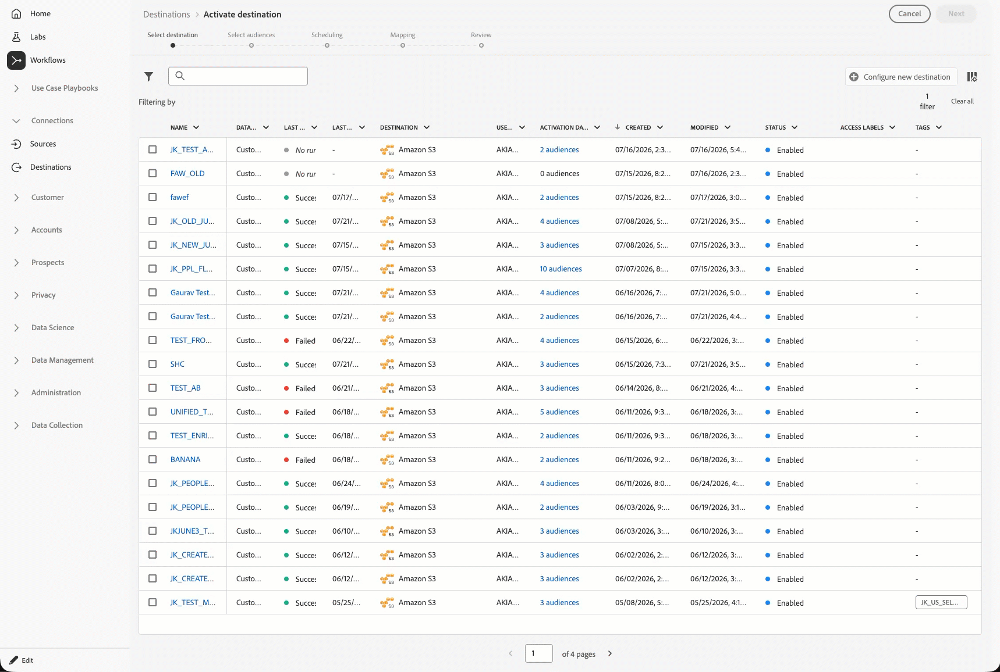
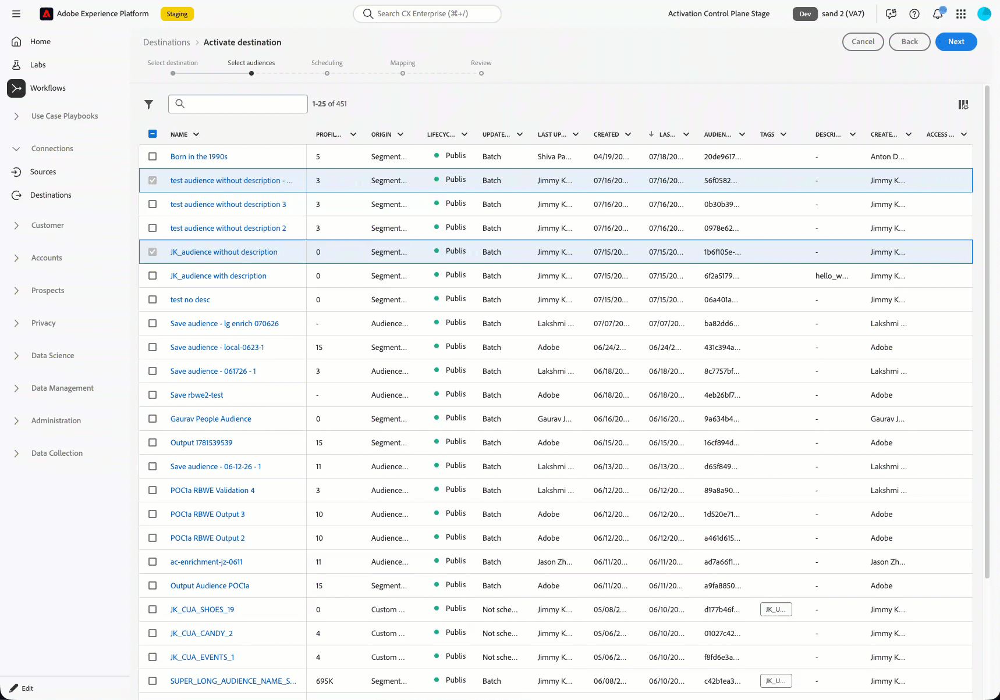
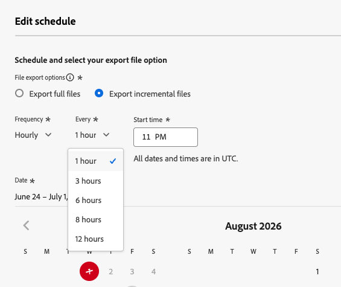
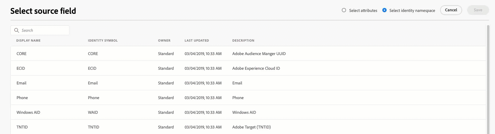
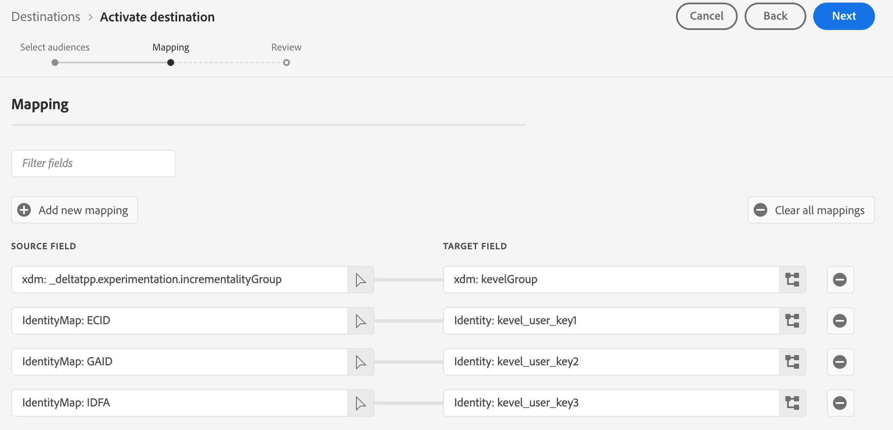

# Adobe Experience Platform pre-release notes

>[!IMPORTANT]
>
>This document is intended as a **preview** of the release notes for the current month. Release items are subject to change, and may be added or removed in the final release.

>[!TIP]
>
>Refer to the following documentation for release notes of other Adobe Experience Platform applications:
>
>- [Adobe Journey Optimizer](https://experienceleague.adobe.com/en/docs/journey-optimizer/using/whats-new/release-notes)
>- [Adobe Journey Optimizer B2B](https://experienceleague.adobe.com/en/docs/journey-optimizer-b2b/user/release-notes)
>- [Customer Journey Analytics](https://experienceleague.adobe.com/en/docs/analytics-platform/using/releases/latest)
>- [Federated Audience Composition](https://experienceleague.adobe.com/en/docs/federated-audience-composition/using/release-notes)
>- [Real-Time CDP Collaboration](https://experienceleague.adobe.com/en/docs/real-time-cdp-collaboration/using/latest)

**Release date: July 2026**

New features and updates to existing features in Adobe Experience Platform:

- [Destinations](#destinations)
- [Real-Time Customer Profile](#real-time-customer-profile)
- [Segmentation Service](#segmentation-service)
- [Sources](#sources)

## Destinations {#destinations}

[!DNL Destinations] are pre-built integrations with destination platforms that allow for the seamless activation of data from Experience Platform. You can use destinations to activate your known and unknown data for cross-channel marketing campaigns, email campaigns, targeted advertising, and many other use cases.

**New or updated functionality**

| Feature | Description |
| --- | --- |
| [Control which audiences to export to enterprise destinations](../destinations/ui/activate-segment-streaming-destinations.md#select-destination) | Use the new **[!UICONTROL Include mapped audiences only]** toggle to choose what the `segmentMembership` object contains when you export audiences to the [!DNL HTTP API], [!DNL Amazon Kinesis], and [!DNL Azure Event Hubs] destinations. Turn it on to include only the audiences mapped in that dataflow, or leave it off to include every audience a profile qualifies for. All dataflows to enterprise destinations created prior to this release, will default to the toggle off, keeping their existing behavior. |
| [Find and filter destinations faster](../destinations/ui/activate-segment-streaming-destinations.md#select-destination) | In the **[!UICONTROL Select destination]** step of the activation workflow, you can now search by flow name to locate a destination or existing dataflow. You can also use filtering and tagging options to find the right destination to activate data to.   {zoomable="yes"} |
| [Find and filter audiences faster](../destinations/ui/activate-segment-streaming-destinations.md#select-audiences) | In the **[!UICONTROL Select audiences]** step of the activation workflow, you can now filter audiences by evaluation type (edge, streaming, or batch), namespace origin, audience tags, and more.   {zoomable="yes"} |
| [Export incremental datasets every hour](../destinations/ui/export-datasets.md) | Set incremental dataset exports to run on an hourly basis, so your destinations get fresh data more frequently.   {zoomable="yes"} |
| [Search for namespaces in the Select source field page](../destinations/ui/activate-segment-streaming-destinations.md#select-source-field) | Use the new search field in the **[!UICONTROL Select source field]** dialog to filter the identity namespace list by name when mapping audiences during activation.   {zoomable="yes"} |

{style="table-layout:auto"}

**New or updated destinations**

| Feature | Description |
| --- | --- |
| [[!DNL Microsoft Ads Customer Match]](../destinations/catalog/advertising/microsoft-ads-customer-match.md) destination is now generally available | Use the [!DNL Microsoft Ads Customer Match] destination to match customers by email address and reengage with them across the [!DNL Microsoft Advertising Network], including [!DNL Search] and [!DNL Audience] ads. |
| [[!DNL Kevel]](../destinations/catalog/advertising/kevel.md) incrementality group mapping | The Kevel destination now supports profile attribute mapping. You can map a profile attribute to the incrementality testing group field in the [!DNL Kevel] destination, so exported user records include the correct group value for incrementality testing use cases.   {zoomable="yes"} |
| [[!DNL LiveRamp] - Onboarding](../destinations/catalog/advertising/liveramp-onboarding.md) updates | We have made several updates to the [!DNL LiveRamp] onboarding connector to: <ul><li>Added a new **ONCE** export frequency.</li><li>Reduced or eliminated file splits for audiences with high population numbers, which helps prevent cases on the [!DNL LiveRamp] side where large audiences imported from Adobe could be overwritten because of numerous file splits.</li><li>Removed the **expired** status from exports, which should help customers maintain a lower Records Under Management (RUM) count in [!DNL LiveRamp] by avoiding export of expired profiles that would not be used in the [!DNL LiveRamp] platform.</li></ul> |
| [[!DNL Demandbase People]](../destinations/catalog/advertising/demandbase-people.md) new mapping fields | Map three new optional target fields, `title`, `jobLevel`, and `jobFunction`, to the [!DNL Demandbase People] destination in addition to the existing mandatory and recommended mappings. Adobe recommends mapping these fields when available for richer person data and better downstream audience targeting. |
| [[!DNL The Trade Desk] - CRM](../destinations/catalog/advertising/tradedesk-emails.md) file-split threshold increase | The file-split threshold for exported files increased from 10 million to 100 million rows, so audiences are less likely to be split across multiple files when exported. |
| [!DNL Adhese] | Use the [!DNL Adhese] destination to send audiences to [!DNL Adhese] for targeted ad delivery on publisher-owned inventory. Audience exports are delivered as files to [!DNL Adhese]'s secure cloud storage. |

{style="table-layout:auto"}

For more information, read the [Destinations overview](../destinations/home.md).

## Real-Time Customer Profile {#real-time-customer-profile}

Use Real-Time Customer Profile to create a holistic view of each individual known and anonymous customer, aggregated from multiple online and offline sources in real time.

**New or updated features**

| Feature | Description |
| --- | --- |
| Faster profile exports and activation | Profile attribute data is now consolidated when data is written, instead of repeatedly at read time. As a result, profile exports complete significantly faster, so downstream activations to destinations and [!DNL Adobe Journey Optimizer] are available sooner. This is a fully managed, back-end update. There is no change to how you configure or use Real-Time Customer Profile, nor is there any change to functionality or merge behavior. However, ingestion of profile attributes may take modestly longer, since more processing now happens at write time. This update is being rolled out through the end of July 2026. Review your scheduled ingestion and segmentation jobs to confirm the timing buffer between them remains appropriate, and consider moving up downstream activation schedules that were previously limited by processing time. |

{style="table-layout:auto"}

For more information, read the [Real-Time Customer Profile overview](../profile/home.md).

## Segmentation Service {#segmentation-service}

Use Segmentation Service to create audiences from your customer data and manage their full lifecycle in Experience Platform.

**New or updated features**

| Feature | Description |
| --- | --- |
| External audience file support for JSON and Parquet | Upload external audiences as JSON or Parquet files, in addition to existing supported formats. The `dataFilterStartTime` field is now optional when you create an external audience from an uploaded file. |
| [Audience Builder enhancements](../segmentation/ui/segment-builder.md) | Updated audience-building experience with enhanced usage patterns for creating and managing audience definitions. |
| Discontinuation of [!DNL Segment Match] | [!DNL Segment Match] will be discontinued and unavailable for use after November 27, 2026. [!DNL Real-Time CDP] Prime and Ultimate customers should transition data collaboration use cases from [!DNL Segment Match] to [!DNL Real-Time CDP Collaboration]. For more information, read the [[!DNL Segment Match] documentation](../segmentation/ui/segment-match/overview.md). |

{style="table-layout:auto"}

For more information, read the [Segmentation Service overview](../segmentation/home.md).

## Sources {#sources}

Experience Platform provides a RESTful API and an interactive UI that lets you set up source connections for various data providers with ease. These source connections allow you to authenticate and connect to external storage systems and CRM services, set times for ingestion runs, and manage data ingestion throughput.

**New or updated sources**

| Source | Description |
| --- | --- |
| [!BADGE Beta]{type=Informative} [!DNL Meta Ads] | Use the [!DNL Meta Ads] source to configure the complete [!DNL Meta Ads] ingestion workflow in the Sources UI. Connect your [!DNL Meta Ads] account and bring paid media data directly into Experience Platform for activation and analysis. This source is available to a limited number of customers. Contact your Adobe representative to request access. |
| [!DNL Google Ads] | Use the [!DNL Google Ads] source to configure the complete [!DNL Google Ads] ingestion workflow in the Sources UI. Connect your [!DNL Google Ads] account and bring paid media data directly into Experience Platform for activation and analysis. |

{style="table-layout:auto"}

For more information, read the [sources overview](../sources/home.md).
