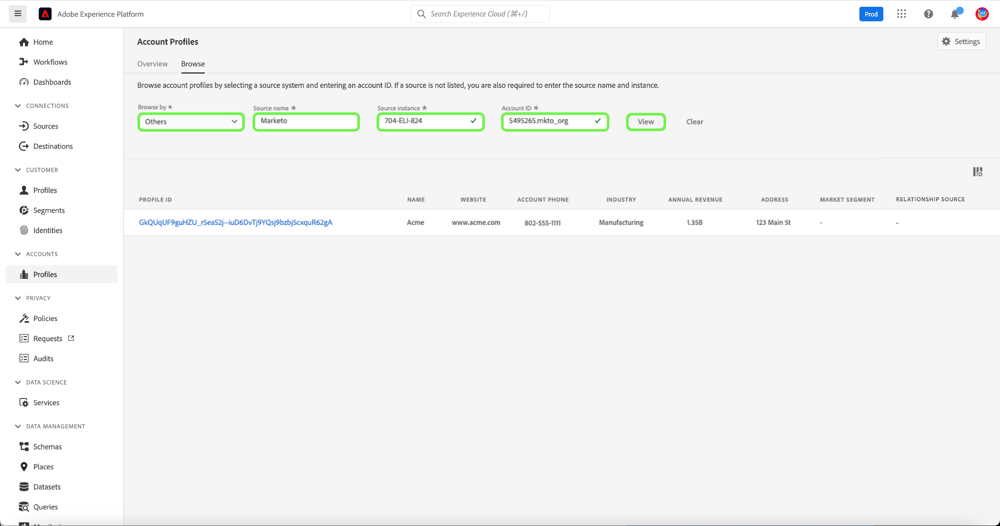

# Account profile UI guide

>[!NOTE]
>
>Account profiles are only available to Real-Time Customer Data Platform B2B Edition customers. To learn more about Real-Time CDP, including the features and functionality available to each license type, please begin by reading the [Real-Time CDP overview](../overview.md).

Account profiles enable you to unify account information from multiple sources. This unified view of an account brings together data from across your many marketing channels and the diverse systems that your organization is currently using to store customer account information. This document provides a guide to interacting with account profiles using the Real-Time CDP, B2B Edition capabilities available in the Adobe Experience Platform user interface (UI).

To learn more about how account profiles are created as part of the B2B workflow, please see the [end-to-end tutorial](../b2b-tutorial.md).

## Account profiles overview {#account-profiles-overview}

Select **[!UICONTROL Profiles]** under [!UICONTROL Accounts] in the left-navigation to view the overview of account profiles. Under the [!UICONTROL Overview] tab, the dashboard shows a graphic or chart displaying widgets in a single entry point.

See the documentation on the [[!UICONTROL Account Profiles]](../../dashboards/guides/account-profiles.md) dashboard to learn more.

## Configure lead to account matching {#configure-lead-to-account-matching}

>[!IMPORTANT]
>
> Only B2B AI administrators can enable, disable, and configure the lead to account matching service. Upon disabling the service, matching results will be deleted within 24 hours.

To configure lead to account matching, select **[!UICONTROL Profiles]** under [!UICONTROL Accounts] in the left navigation. On the **[!UICONTROL Overview]** tab, select **[!UICONTROL Settings]** in the top right.

 

The **[!UICONTROL Account settings]** dialog opens. From here select the **[!UICONTROL Enable lead-to-account-matching]** toggle to enable the feature. Use the dropdown menu to select **[!UICONTROL Daily]** for the **[!UICONTROL Matching cadence]** setting. Finally, select the relevant **[!UICONTROL Matching criteria]** options followed by **[!UICONTROL Save]** to confirm your settings and return to the **[!UICONTROL Account Profiles]** screen.

>[!NOTE]
>
> The Address cannot be used as the only matching criteria. One or more of the other matching criteria must be selected.

To learn more about lead to account matching, please refer to the [Lead to account matching in Real-Time CDP B2B overview](../../rtcdp/b2b-ai-ml-services/lead-to-account-matching.md).

## Browse account profiles {#browse-account-profiles}

To browse account profiles, begin by selecting **[!UICONTROL Profiles]** under [!UICONTROL Accounts] in the left-navigation. 

On the **[!UICONTROL Browse]** tab, you can explore account profiles using an account ID from a connected enterprise source or by entering source details directly.

### Browse by [!UICONTROL Connected enterprise source] {#browse-by-connected-enterprise-source}

To browse account profiles by a connected enterprise source, select **[!UICONTROL Connected enterprise source]** from the **[!UICONTROL Browse by]** dropdown, then choose a connected source using the selector button next to the **[!UICONTROL Source]** field.

This opens the **[!UICONTROL Select source]** dialog, where you can select a source based on the connections that your organization has established.

>[!NOTE]
>
>Your organization may have multiple sources configured for the same service provider (for example, Marketo), so it is important to review the connection name, source system, and source system instance to ensure you are searching by the correct source instance.

To learn more about connecting enterprise sources, please refer to the [sources overview](../sources/sources-overview.md).

You can choose a source by selecting the radio button next to the connection name, and then use **[!UICONTROL Select]** to return to the [!UICONTROL Browse] tab.

With a source selected, you must now enter an **[!UICONTROL Account ID]** related to the source. For example, selecting a Salesforce source would require you to enter an account ID from the Salesforce instance in order to view the account profile tied to that ID.

>[!NOTE]
>
>For Marketo account IDs, there are two possible account tables that can be referenced, therefore you must use a specific syntax in order to ensure you are viewing the correct account. 
>
>The most common, standard syntax is the Marketo account ID appended by `.mkto_org` (for example, `1234567.mkto_org`). Marketo Account-Based Marketing customers may have additional values that can be found using the Marketo account ID appended by `.mkto_account`. If you are unsure of which syntax to use, please check with your Marketo administrator.

### Browse by [!UICONTROL Others] {#browse-by-others}

Real-Time CDP, B2B Edition supports the ability to perform a direct lookup by allowing you to enter a **[!UICONTROL Source name]**, **[!UICONTROL Source instance]**, and **[!UICONTROL Account ID]** for an account that you would like to view. By entering the source name and instance directly, you provide the context necessary for Experience Platform to search for, and display, the correct account profile data.

The ability to perform a direct lookup is useful under circumstances where a source connection directly to the data is not possible. For example, if your organization has data governance policies in place that prevent connecting directly to a CRM, you can export that data into a cloud storage system and then ingest it into Experience Platform. 

Another example could be that you are performing a transformation on the data between the time it leaves a system and enters Platform. You can use the direct lookup functionality to provide context for the data (such as specifying that it is Marketo data, despite the fact that it is coming from an Amazon S3 bucket, for example) so that the system knows where to look for, and how to properly render, the data.

To begin a direct lookup, select **[!UICONTROL Others]** from the **[!UICONTROL Browse by]** dropdown, then enter a **[!UICONTROL Source name]**, **[!UICONTROL Source instance]**, and **[!UICONTROL Account ID]** for the account that you would like to view.

## View account profile details {#view-account-profile-details}

After using the **[!UICONTROL Browse]** tab to locate an account profile, selecting the **[!UICONTROL Profile ID]** opens the **[!UICONTROL Detail]** tab for the account profile. The profile information displayed on the **[!UICONTROL Detail]** tab has been merged together from multiple profile fragments to form a single view of the individual account. This includes account details such as basic attributes and social media data. 

The default fields shown can also be changed at an organizational-level to display preferred account profile attributes. 

>[!NOTE]
>
>Similar functionality is available for customer profiles and a step-by-step guide has been created with instructions for adding and removing attributes, resizing panels, etc. Please read the [profile detail customization guide](../../profile/ui/profile-customization.md) to learn more.

You can view additional details related to the account by selecting another of the available tabs. These tabs include attributes, people, and the opportunities tab that shows open and closed opportunities related to the account across your enterprise systems. Please refer to the following sections for more information about each tab.

## Attributes tab {#attributes-tab}

The **[!UICONTROL Attributes]** tab lists all of the record information related to the account. This includes attribute data coming from multiple sources that has been merged together to form a single view of the account.

In addition to being able to view the data in a list, you can use the search bar to search for specific attributes or view the record data as JSON.

## People tab {#people-tab}

The **[!UICONTROL People]** tab provides a list of individual people associated with the account. These people may be contacts and leads from different enterprise systems managed by different teams within your organization, but in Real-Time CDP, B2B Edition they are presented together as a single list enabling you to see a more holistic view of your account contacts.

>[!NOTE]
>
>The [!UICONTROL People] tab displays a list of up to 25 people associated with the account. For accounts with more than 25 associated people, the system shows a random sampling of 25 records.

In addition to showing you a snapshot of information for the contact, each person listed also includes a **[!UICONTROL Profile ID]**, which is a clickable link that allows you to explore the Real-Time Customer Profile for that individual. To learn more about viewing individual customer profiles related to your accounts, please visit the guide for [browsing profiles in Real-Time CDP, B2B Edition](../profile/profile-browse.md).

## Opportunities tab {#opportunities-tab}

The **[!UICONTROL Opportunities]** tab provides information for open and closed opportunities related to the account. These opportunities may be ingested into Experience Platform from multiple sources, however Real-Time CDP, B2B Edition makes it easy for marketers to see all of these opportunities together in one place.

>[!NOTE]
>
>The [!UICONTROL Opportunities] tab displays a list of up to 25 opportunities associated with the account. For accounts with more than 25 associated opportunities, the system shows a random sampling of 25 records.

Each opportunity includes information such as the name of the opportunity, its amount, stage, and whether the opportunity is open, closed, won, or lost.

## Related accounts tab {#related-accounts-tab}

The **[!UICONTROL Related accounts]** tab provides information about other accounts that may be related to the account that you are browsing. For in-depth information about the functionality, read the [related accounts overview](/help/rtcdp/b2b-ai-ml-services/related-accounts.md).

>[!NOTE]
>
>* A Related accounts group can have maximum 30 account profiles. If more than 30 account profiles were found related, they are arbitrarily split into multiple groups, each having no more than 30 members. The Related accounts group of an account profile always includes itself.
>* The [!UICONTROL Related accounts] tab currently displays a list of up to 25 related accounts associated with the account you are browsing. This is a limitation that will be addressed in a future update. Despite this UI limitation, when you use related accounts in segment definitions, for groups of 30 related account profiles all profiles are used for targeting.

Each related account includes information such as the account profile ID and name, its account source key, and further information related to homepage, address, parent account, phone, industry, and annual revenue.

You can use the related accounts in this list for segmentation purposes. See a [segmentation example](/help/rtcdp/segmentation/b2b.md#related-account) to understand how to use related accounts to expand your reach in segment definitions.