# Manage predictive lead and account scoring in Adobe Real-Time Customer Data Platform, B2B Edition

>[!NOTE]
>
>Only users with Manage B2B AI permission can create, change, and delete score goals.

This tutorial walks you through the steps to manage score goals of the predictive lead and account scoring service. Score goals can be for either person profile or account profile

## Create a new score 

To create a new score, select the **[!UICONTROL Services]** in the sidebar and select **[!UICONTROL Create score]**.

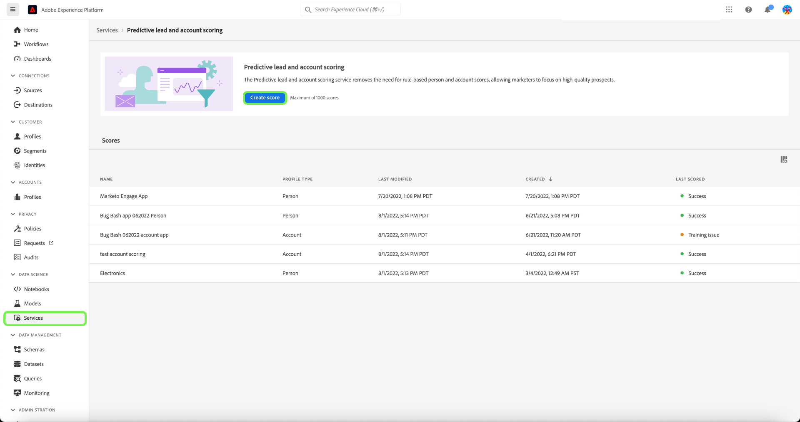

The **[!UICONTROL Basic information]** screen appears, prompting you to select a profile type, enter a name, and an optional description. When finished, select **[!UICONTROL Next]**.

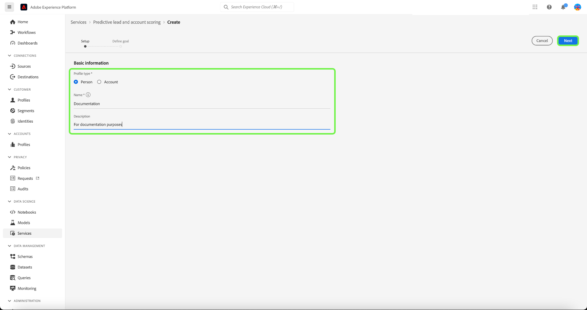

The **[!UICONTROL Define your goal]** screen appears. Select the dropdown arrow and then select a goal type from the dropdown window that appears.

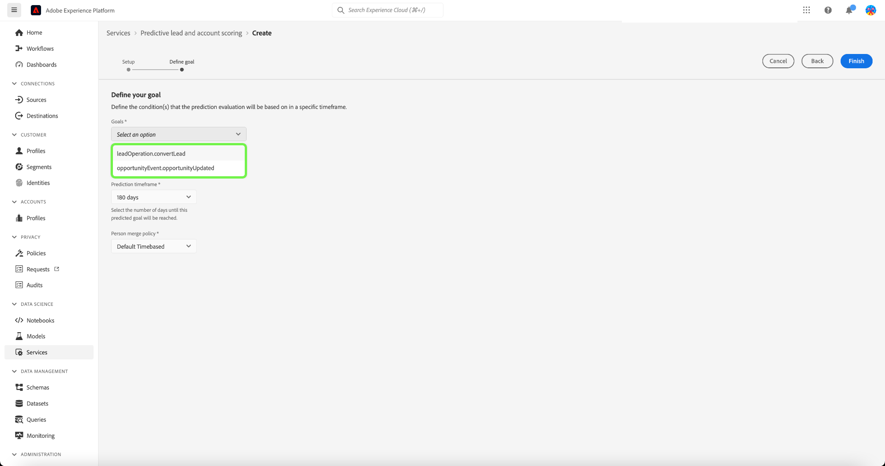

The **[!UICONTROL Goal specifics]** dialogue opens. Select the dropdown arrow and then select goal field name from the dropdown window that appears.

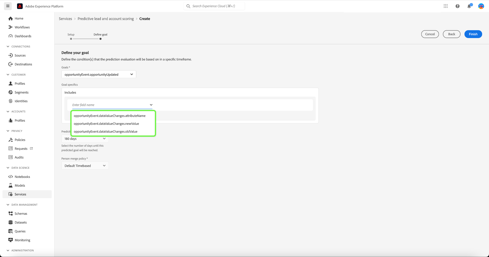

The **[!UICONTROL Goal conditions]** selection appears. Select the dropdown arrow and then select condition from the dropdown window that appears.

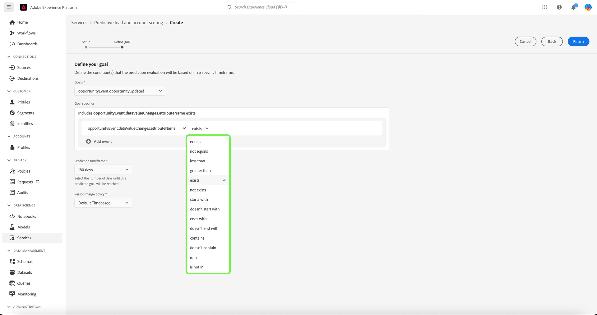

The **[!UICONTROL Goal value]** field appears. Next, configure your [!UICONTROL Goal specifics]. Select the [!UICONTROL Enter Field Value] panel and enter your goal value.

>[!NOTE]
>
>Multiple goal values can be added.

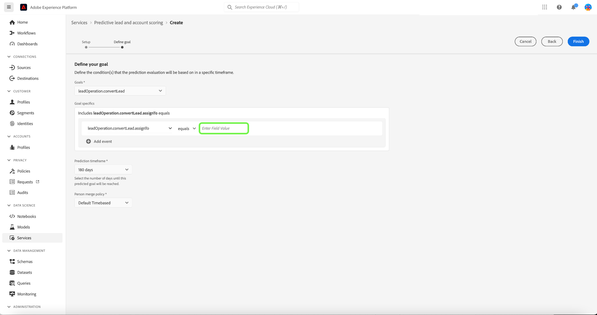

To add additional fields, select **[!UICONTROL Add field]**.

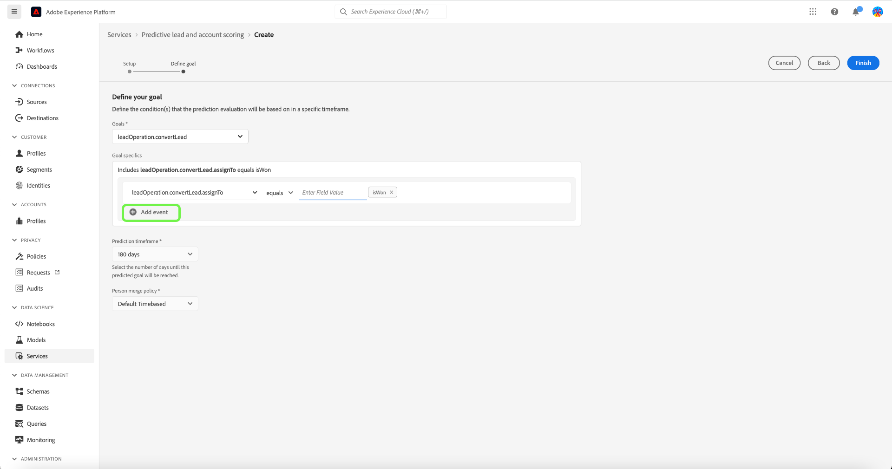

To configure the prediction timeframe, select the dropdown arrow and then select your timeframe of choice.

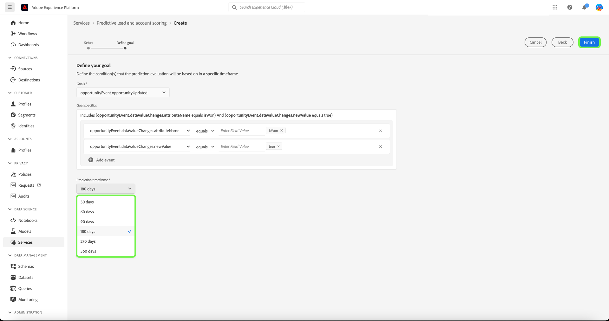

The selected merge policy determines how the field values of a person profile are selected. Using the dropdown arrow select your merge policy of choice and then select **[!UICONTROL Finish]**.

The **[!UICONTROL Scoring setup is complete]** dialogue appears confirming the new score has been created. Select **[!UICONTROL OK]**.

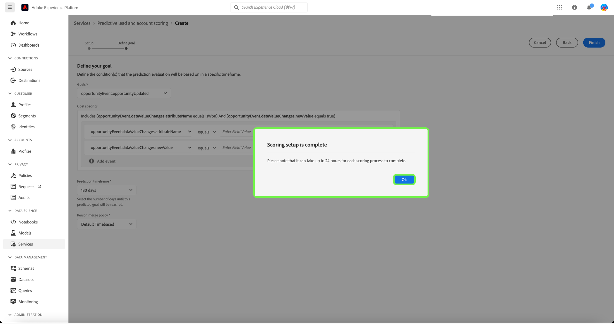

>[!NOTE]
>
>It can take up to 24 hours for each scoring process to complete.

You are returned to the **[!UICONTROL Services]** tab where you can see the new score created in the list of scores.

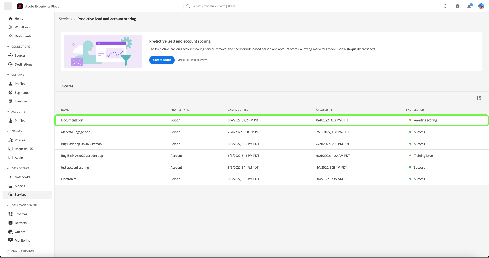

Select the score to view details and additional information about the last run details. 

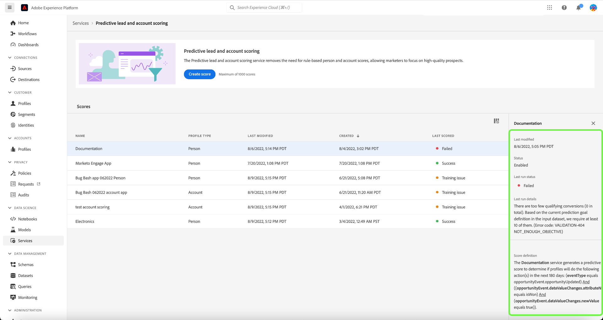

For more detailed information about the error codes that can be seen under the last run details, please refer to the section on [leads AI pipeline error codes](#leads-ai-pipeline-error-codes) in this document.

## Edit a score

To edit a score, select a score from the **[!UICONTROL Services]** tab and select **[!UICONTROL Edit]** from the additional details panel on the right side of the screen.

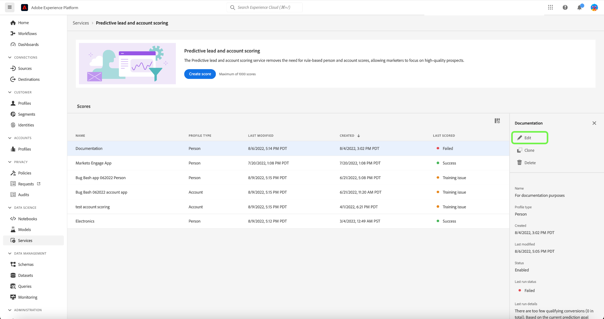

The **[!UICONTROL Edit instance]** dialogue appears, where you can edit the description for the score. Make your changes and select **[!UICONTROL Save]**.

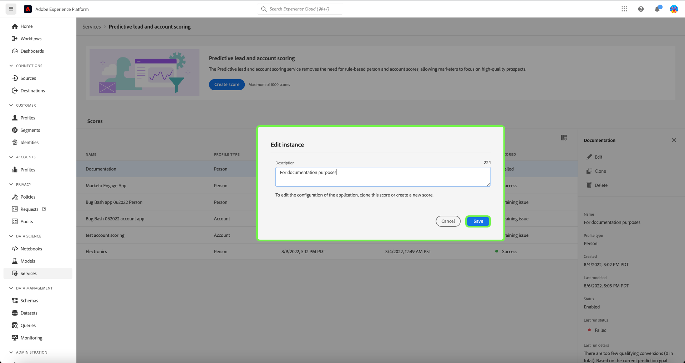

>[!NOTE]
>
>The score configuration cannot be changed as this will trigger model retraining and re-scoring. It is the equivalent of deleting the score and creating a new score. To edit the configuration of the score, you will need to clone this score or create a new score.

You are returned to the **[!UICONTROL Services]** tab. Select the score to view the updated description details in the additional details panel on the right side of the screen.

## Clone a score

To clone a score, select a score from the **[!UICONTROL Services]** tab and select **[!UICONTROL Clone]** from the additional details panel on the right side of the screen.

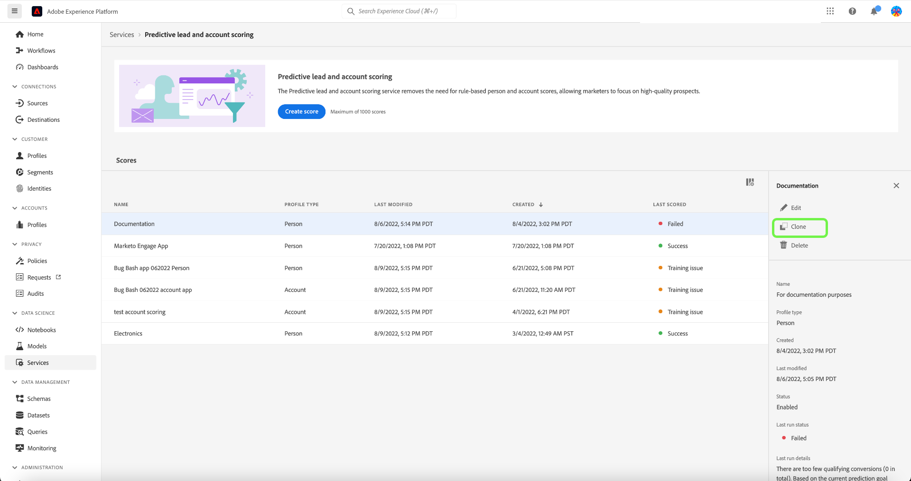

The **[!UICONTROL Basic information]** screen appears. The profile type, name, and description is cloned from the original score. Amend these details and select **[!UICONTROL Next]**.

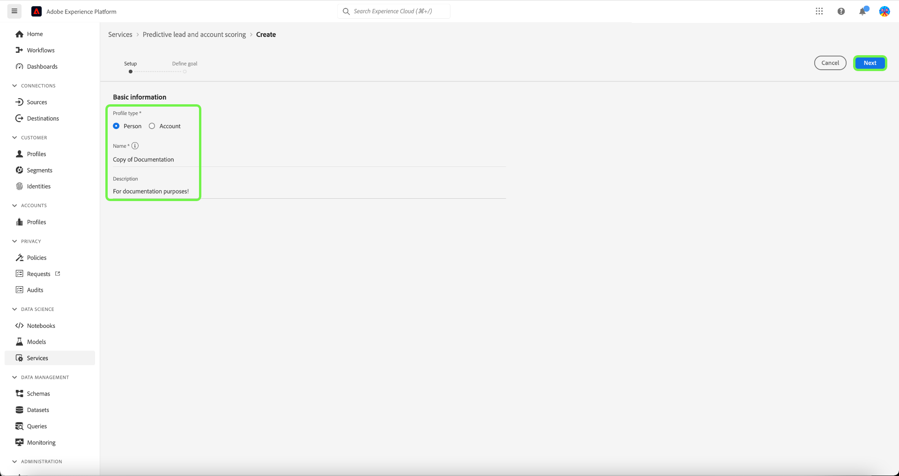

The **[!UICONTROL Define your goal]** screen appears. Complete the goals section as you would when creating a new score and select **[!UICONTROL Finish]**. 

You are returned to the **[!UICONTROL Services]** tab where you can see the newly cloned score in the list.

>[!NOTE]
>
>The **[!UICONTROL Define your goal]** section is not cloned from the original score.

## Delete a score

To delete a score, select a score from the **[!UICONTROL Services]** tab and select **[!UICONTROL Delete]** from the additional details panel on the right side of the screen.

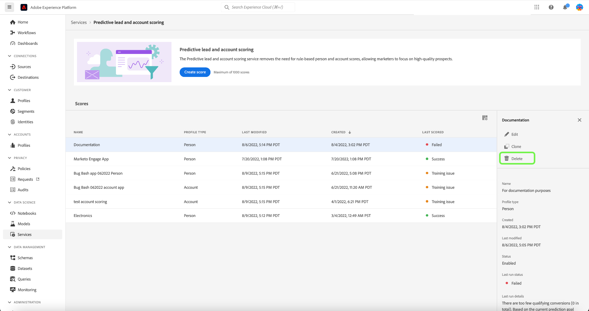

The **[!UICONTROL Delete documentation]** confirmation dialog appears. Select **[!UICONTROL Delete]**.

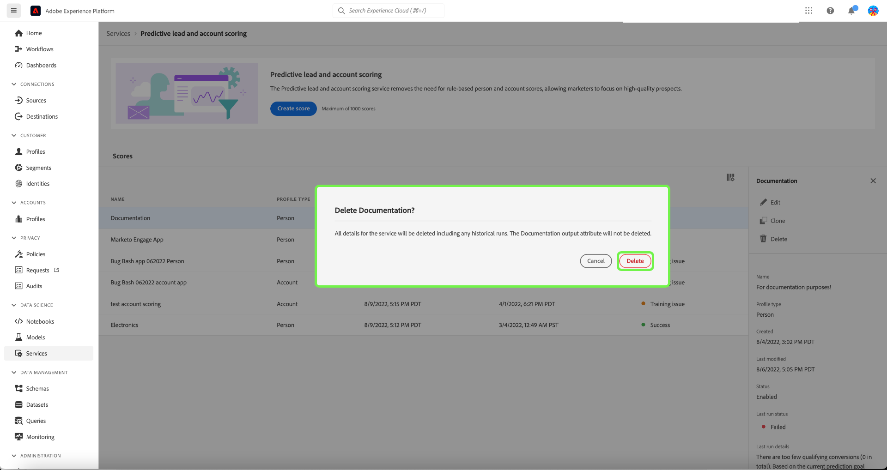

>[!NOTE]
>
>Deleting the score definition would also delete all the predicted scores on person profile or account profile, but not the field group created for the score definition. The field group will be left "orphaned" in the data model.

You are returned to the **[!UICONTROL Services]** tab where you can no longer see the score in the list.

## Leads AI pipeline error codes

| Error code | Error message |
| --- | --- |
| 401 | ERROR 401. Leads AI pipeline stopped: not enough valid accounts for account scoring. Count of accounts: {}. |
| 402 | ERROR 402. Leads AI pipeline stopped: not enough valid contacts for contact scoring. Count of contacts: {}. |
| 403 | ERROR 403. Leads AI pipeline stopped: not enough activity volume for model training. Count of events: {}. |
| 404 | ERROR 404. Leads AI pipeline stopped: not enough conversions for model training. Count of conversions: {}. |
| 405 | ERROR 405. Leads AI pipeline stopped: activity too sparse for valid model training. Only {} percent of accounts has activity. |
| 406 | ERROR 406. Leads AI pipeline stopped: activity too sparse for valid model training. Only {} percent of contacts has activity. |
| 407 | ERROR 407. Leads AI pipeline stopped: scoring data activity types do not match with training data. |
| 408 | ERROR 408. Leads AI pipeline stopped: missing rate is too high for activity features. Missing rate: {}. |
| 409 | ERROR 409. Leads AI pipeline stopped: test auc is too low. Test auc: {}. |
| 410 | ERROR 410. Leads AI pipeline stopped: test auc is too low after parameter tuning. Test auc: {}. |
| 411 | ERROR 411. Leads AI pipeline stopped: training data does not have enough conversions to produce reliable model. Conversions: {}. |
| 412 | ERROR 412. Leads AI pipeline stopped: test data does not have any conversion to calculate AUC-ROC. |

| Warning/info code | Message |
| --- | --- |
| 100 | INFO 100. Leads AI quality check: the count of accounts is: {}. |
| 101 | INFO 101. Leads AI quality check: the count of contacts is: {}. |
| 102 | INFO 102. Leads AI quality check: the count of opportunities is: {}. |
| 103 | INFO 103. Leads AI quality check: testing auc is low. Start parameter tuning. Testing auc: {}. |
| 200 | WARNING 200. Leads AI quality check: the missing rate of firmographic features is: {}. |
| 201 | WARNING 201. Leads AI quality check: the missing rate of activity features is: {}. |

## Next steps

By following this tutorial, you can now successfully create and manage scores. See the following documents for more details:

* [Predictive lead and account scoring](/help/rtcdp/b2b-ai-ml-services/predictive-lead-and-account-scoring.md)
* [Monitor predictive lead and account scoring jobs](/help/dataflows/ui/b2b/monitor-profile-enrichment.md)
