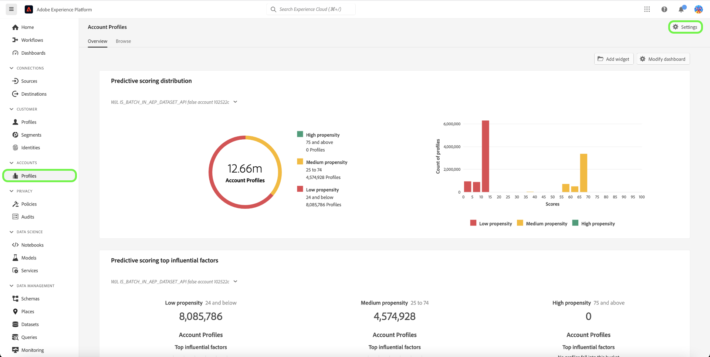
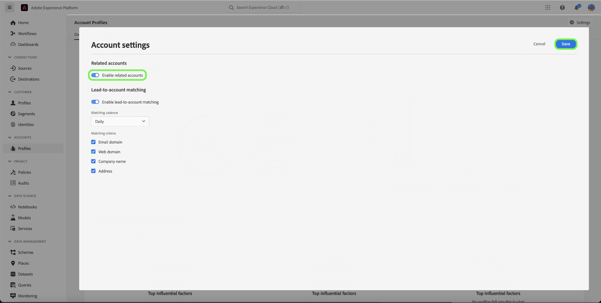

# Related accounts in Real-Time CDP B2B Edition

## Overview {#overview}

B2B enterprises often have their customer information stored in multiple systems, each including only partial or even conflicting data for the same real-world business entity. This creates a massive challenge of arriving at an accurate view of their customers, therefore reducing the efficiency and effectiveness of their B2B marketing and sales efforts.

| ID | Name | Website | Industry | State | Phone | Has open opportunity with amount > `$1 million` |
|---|---|---|---|---|---|---|
| 1 | Acme | acme.com | Software | CA  | (408)536-6000 |   |
| 2 | Acme |  acm.com | Software | CA  | 4085366000 | x |
| 3 | Acme Inc |   |   |  CA | (408)5366000 |   |
| 4 | Acme Consulting Service | `http://www.acme.com/consulting` | Technology Consulting | NY  | (212)471-0904 | x |
| 5 | Acme IT |   |   | CA  |   |   |

{style="table-layout:auto"}

With related accounts, [!DNL Real-Time CDP B2B] now shows you a list of accounts that are similar to the account you are browsing.

Use this feature to view related account profiles for an account profile in the Experience Platform UI and then include the related accounts in your segment definitions to broaden your reach or apply wider criteria in your audiences.

## Enable the related accounts service {#enable}

To enable the service, select **[!UICONTROL Profiles]** in the sidebar followed by **[!UICONTROL Settings]**.

Select the toggle beside [!UICONTROL Enable related accounts] to enable the service, and then select **[!UICONTROL Save]**.

## How it works {#how-it-works}

Daily-run machine learning jobs use a hierarchical algorithm to cluster similar account profiles into groups based on three factors:

* Parent account link
* Web domain
* Account name
  
Following a successful processing job, each member of the account profile group is tagged with the Related Accounts list. You can view the list in the **Related Accounts** tab of the Account Profile page, and use the related accounts in segment definitions.

See the documentation for more information about the [profile enrichment related accounts jobs](/help/dataflows/ui/b2b/monitor-profile-enrichment.md).

## How to view related accounts {#how-to-view}

You can view related accounts for an account you are browsing in the Experience Platform UI.

See the documentation for more information about the [how to find related accounts in the UI](/help/rtcdp/accounts/account-profile-ui-guide.md#related-accounts-tab).

## How you can use related accounts {#how-to-use}

You can use accounts and related accounts in segmentation. The decision whether to use related accounts in your segment definitions depends on your marketing use case. For example, you could use related accounts for email marketing or advertising campaigns where you may accept a lower accuracy in exchange for a wider reach.

See a [segmentation example](/help/rtcdp/segmentation/b2b.md#related-accounts) that uses related accounts.
