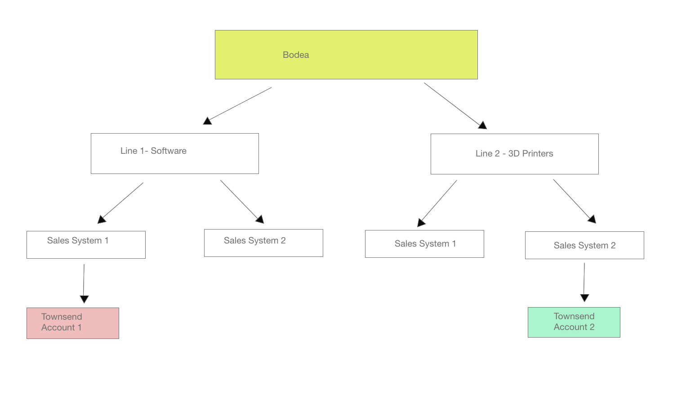

# Getting started with Real-time Customer Data Platform B2B Edition

>[!IMPORTANT]
>
>The Real-time CDP Business to Business Edition is currently in beta. The documentation and the functionality are subject to change.

The Real-time Customer Data Platform B2B Edition is expanding the existing [!DNL Real-time CDP] and Adobe Experience Platform offerings to support B2B data and workflows. This example use case demonstrates the additional benefits provided by the B2B Edition. They include:

- Combine person and account data from different siloed data sources to produce a comprehensive view that enables a better understanding of the customers and more accurate segmentation. See the documentation on creating XDM schema relationships for use with varied B2B sources for more information. 
  <!-- PLACEHOLDER [creating XDM schema relationships]() -->
- Segment an audience based on attributes of related entities. This includes Accounts, Opportunities, Campaigns, and Marketing Lists. Segments are no longer limited to just Person attributes and Experience Events. See the B2B segmentation documentation for more examples on creating B2B specific audiences.
  <!-- PLACEHOLDER [B2B segmentation documentation]()  -->
- Natively support the use case of one person related to multiple accounts.

## Use Case

Bodea, a technology company, has a new product and wants to specifically target its marketing campaign towards previous customers who have spent over one million dollars on its products previously.

In order to maximize the efficiency of their marketing campaign, Bodea also wants to target the people associated with that existing account who have done at least $1 million in business AND have visited the new product page in the last month.

However, Bodea has two different lines of business. Bodea's first line of business 'Line 1' creates software for the automotive industry. Its second line of business 'Line 2' sells 3D printers that create automobile parts. Each line of business has its own sales system, 'Sales-System 1' and 'Sales-System 2'. Each line of Bodea has different corporate information silos. 

Both Line 1 and Line 2 sell to the Townsend company. 

As a result of Bodea's two lines of business, the revenue generated from Bodea's customer accounts is not unified in a single view. The Townsend business relationship data is recorded as two separate accounts in each Sales-System.

As the relevant Townsend information is recorded as Account 1 in Sales-System 1, and Account 2 in Sales-System 2 Bodea's marketing team is unaware of the siloed information.

This prohibits Bodea's marketing team from efficiently targeting specific business contacts at these companies with this new opportunity. 

Using their old system, a segment created to find customers who have spent over one million dollars on its products would not include anyone from Townsend because the segment would not find anyone qualified in either Sales-System 1 or Sales-System 2.

### Benefits of the B2B Edition

Line 1 has just released a new software product and would like to up-sell it to Bodea’s existing top-tier customer base. Bodea launches a marketing campaign with that specific target audience in mind.

The B2B Edition allows Bodea to use the combined data from disparate sources:

- In Sales-System 1, Account 1 has two related people – p1@townsend.com and p2@townsend.com, and one closed-won Opportunity 1 of $200k.

- In Sales-System 2, Account 2 has also two related people – p2@townsend.com and p3@townsend.com, and one closed-won Opportunity 2 of $900k.

For integration or some other corporate control purposes, Bodea also has a Master Data Management (MDM) system where it maintains a record indicating Account 1 in Sales-System 1 and Account 2 in Sales-System 2 are the same company.

In the last month, p2@townsend.com visited the new product page and the web visit was recorded in Sales-System 1.

### HOW B2B SOLVES THE PROBLEM

With Real-time CDP B2B Edition, Bodea's marketing team can:

- Bring the data from all of Sales-System 1, Sales-System 2, and the MDM into B2B CDP and create unique segments using this aggregate data for varied marketing initiatives.

- Create a segment that would provide the following related data:

| People |
|---|
| p1@townsend.com  |
| p2@townsend.com (who visited the new product page in the last month) |
|  p3@townsend.com |

| Opportunities (closed-won) |
|---|
| Opportunity 1, $200k  |
| Opportunity 2, $900k  |

Now the segment above would include p2@townsend.com who is the most efficient recipient of Bodea's new marketing campaign.

## Next steps

By reading this document you now have an understanding of the types of objectives and problems that can be solved using the Real-time CDP B2B Edition. 

<!-- The following documentation is recommended to improve your understanding of B2B specific features:  -->

<!-- - [B2B connector]() -->
<!-- - [Account Profiles]() -->
<!-- - [B2B Segmentation examples]() -->
<!-- PLACEHOLDERS to tutorial / account profiles / B2B connectors / segmentation examples -->
