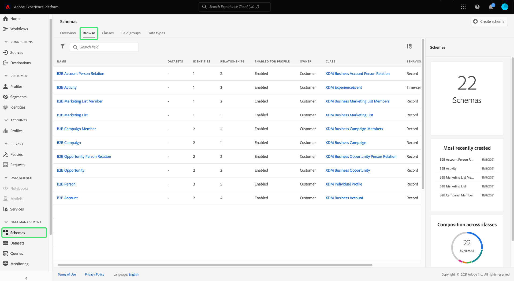
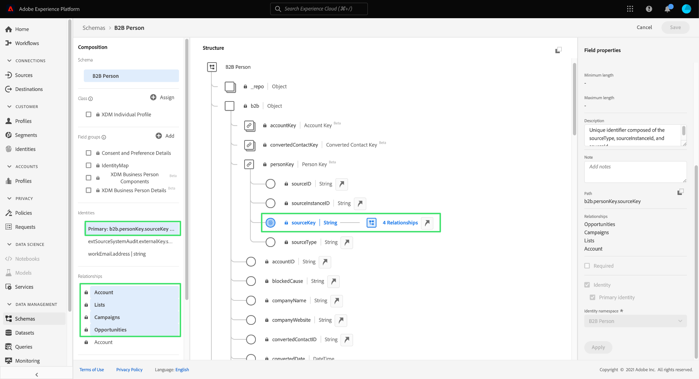
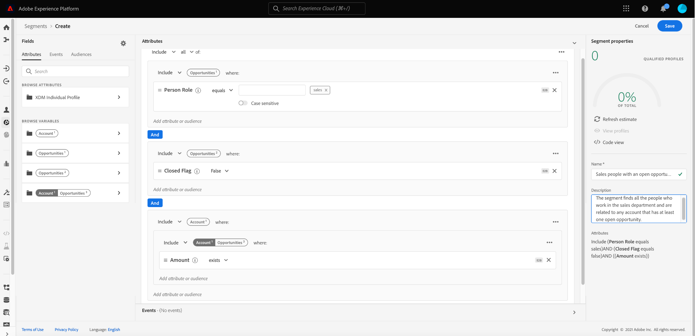
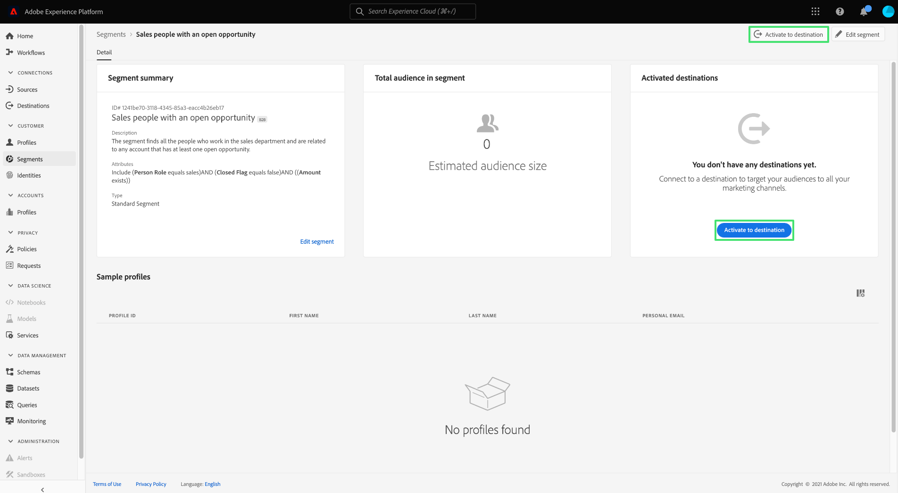

# Getting started with Real-Time Customer Data Platform B2B Edition

This document provides a high-level end-to-end workflow for getting started with Real-Time Customer Data Platform (CDP) B2B Edition, using an example use case to illustrate key concepts.

The technology company Bodea wants to combine person and account data from different siloed data sources in order to effectively target customers with an email and a LinkedIn advertisement campaign for its new product. Bodea uses a marketing automation platform and needs to segment a B2B-specific audience from multiple CRMs containing customer data.

## Getting started

This tutorial workflow relies on several Adobe Experience Platform services as part of the demonstration. If you want to follow along it is recommended to have a good understanding of the following services:

- [Experience Data Model (XDM)](../xdm/home.md)
- [Sources](../sources/home.md)
- [Segmentation](../segmentation/home.md)
- [Destinations](../destinations/home.md)

## Create schemas for your data

As part of the initial setup, Bodea's IT department needs to create an XDM schema to ensure that their data follows a standard format when being brought into Experience Platform, and is actionable across different Experience Platform services and Adobe Experience Cloud products (such as Adobe Analytics and Adobe Target). 

>[!WARNING]
>
>You must follow the ingestion patterns as described in the relevant sources documentation linked to throughout this tutorial. Other field mapping methods are not guaranteed to work.

Adobe Experience Platform allows you to automatically generate the schemas and namespaces required for B2B data sources. This tool ensures that the schemas created describe the data in a structured reusable way. Follow the [B2B namespaces and schema auto-generation utility documentation](../sources/connectors/adobe-applications/marketo/marketo-namespaces.md) for a complete reference to the setup process.

Within the Adobe Experience Platform UI, the Bodea marketer selects **[!UICONTROL Schemas]** in the left rail, followed by the **[!UICONTROL Browse]** tab. Since they used the auto-generation utility, the new empty schemas appear in the list and all have a prefix of "B2B".

The auto-generation utility defined the data model structure for the schemas using standard XDM B2B classes (such as [XDM Business Account](../xdm/classes/b2b/business-account.md) and [XDM Business Opportunity](../xdm/classes/b2b/business-opportunity.md)) that capture fundamental B2B data entities. In addition, the auto-generated B2B schemas built on these classes have pre-established relationships that allow for advanced segmentation use cases. Any additional field groups required for the data structure can easily be made here through the UI. See the [XDM UI guide, adding field groups to a schema section](../xdm/ui/resources/schemas.md#add-field-groups) for more information.

>[!NOTE]
> 
>If you are not using the auto-generator utility or should a new relationship need to be created, see the tutorial on [creating relationships between B2B schemas](../xdm/tutorials/relationship-b2b.md).

Real-Time Customer Profile merges data from disparate sources to create consolidated profiles of key B2B entities. Since profiles are generated based on a single class, the auto-generation utility sets up relationships between schemas based on common business use cases. As a result, the Bodea team is now ready to ingest data based on their B2B schemas.

>[!NOTE]
> 
>Default identity namespaces, primary keys, and relationships created for the schemas by the auto-generation utility are easily discoverable within the Schema workspace.
>
>

## Ingest your data into Experience Platform

Next, the Bodea marketer uses a [source connector](../sources/home.md) to ingest data into Experience Platform for use in downstream services. You can also ingest data by using one of the approved sources for Real-Time CDP B2B Edition.

>[!NOTE]
> 
>To learn which source connectors are available to your organization, you can view the sources catalog in the Experience Platform UI. To access the catalog, select **Sources** in the left navigation, then select **Catalog**.

In order to create a connection between a source account and Experience Platform, you must acquire authentication credentials. For detailed instructions on attaining authentication credentials for each type of source, refer to the [sources overview](../sources/home.md).

After acquiring authentication credentials, the Bodea marketer creates a connection between the source account and their Experience Platform organization. See the [sources documentation](../sources/home.md) for more information on setting up a source connection.

The source connector provides an auto-mapping feature to make the process of mapping all of your data fields to those of the newly created schemas much easier. 

>[!NOTE]
> 
>If you have made custom field groups in your XDM schemas you may have unconnected fields at this stage of the process. Make sure to check all the values that are populating your custom field groups.

The Bodea marketer checks that all field groups are appropriately mapped and continues the sources setup process by initializing a dataflow. By creating a dataflow to bring in source data, incoming data can be used by downstream Experience Platform services. During the initial ingestion process, data is brought into Experience Platform as a batch. After this, subsequent ingested data is then streamed into Profile with near-real-time updates.

## Create an audience to evaluate your data

The next task is to create an audience for Bodea's new email marketing campaign based on specific attributes from related entities in the source data. Within the Experience Platform UI, the Bodea marketer first selects **[!UICONTROL Segments]** in the left navigation, then **[!UICONTROL Create segment]**.

In this example, the audience finds all the people who work in the sales department and are related to any account that has at least one open opportunity. This audiences requires a link between the XDM Individual Profile class, XDM Business Account class, and XDM Business Opportunity class.

 

>[!NOTE]
> 
>For instructions on how to create audiences to evaluate your data see the [Segment Builder UI guide](../segmentation/ui/segment-builder.md). For more specific B2B segmentation use cases, refer to the [segmentation overview for Real-Time CDP B2B Edition](./segmentation/b2b.md).

The Segment Builder allows you to create a marketable audience from Real-Time Customer Profile data and view estimates of your prospective audience based on the combination of attributes, events, and existing audiences you defined.

## Activate your evaluated data to a destination

After the audience is successfully created, a summary is provided in the [!UICONTROL Details] section of the workspace. As no destinations are currently activated for the segment definition, the Bodea marketer needs to export the audience to a dataset where it can be accessed and acted upon.

Within the [!UICONTROL Segments] workspace of the Experience Platform UI, the Bodea marketer selects **[!UICONTROL Activate to destination]**.

>[!NOTE]
> 
>See the tutorial on [activating an audience to a destination](https://experienceleague.adobe.com/docs/marketo/using/product-docs/core-marketo-concepts/smart-lists-and-static-lists/static-lists/push-an-adobe-experience-cloud-segment-to-a-marketo-static-list.html) for comprehensive steps on how to accomplish this.

The Bodea marketer activates the audience to a destination, which allows them to push audience data from Experience Platform to their marketing automation platform. Read the [destinations catalog](../destinations/catalog/overview.md) for more information on available destinations.

## Next steps

By following this tutorial, you have successfully leveraged the various Adobe Experience Platform services used by Real-Time CDP B2B Edition. As a result, you have learned to ingest, segment, evaluate, and export your B2B data as actionable audiences that can be engaged across different channels.
