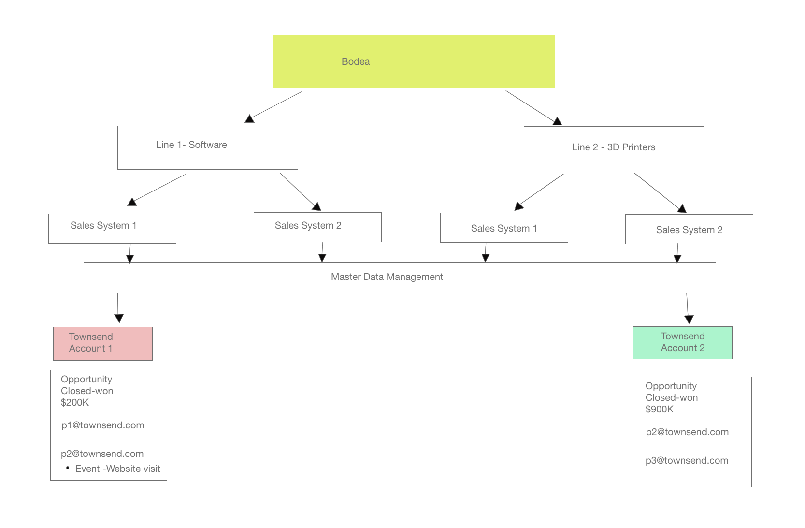

# Example Use Case for Real-Time Customer Data Platform B2B Edition

Real-Time Customer Data Platform B2B Edition expands the existing Real-Time CDP and Adobe Experience Platform offerings to support B2B data and workflows. This document provides an example use case that demonstrates the additional benefits provided by the B2B Edition. They include:

- Combine person and account data from different siloed data sources to produce a comprehensive view that enables a better understanding of the customers and more accurate segmentation. See the documentation on [creating XDM schema relationships](./schemas/b2b.md) for use with varied B2B sources for more information. 
- Segment an audience based on attributes of related entities. This includes Accounts, Opportunities, Campaigns, and Marketing Lists. Segments are no longer limited to just Person attributes and Experience Events. See the [B2B segmentation documentation](./segmentation/b2b.md) for more examples of creating B2B-specific audiences.
- Natively support the use case of one person related to multiple accounts.

## Use case

Bodea, a technology company, has a new product and wants to simultaneously target customers with an email and a LinkedIn advertisement campaign. In order to maximize the efficiency of their marketing campaign, Bodea also wants to target the people associated with that existing account who have spent over one million dollars on its products previously, AND have visited the new product page in the last month.

However, Bodea has two different lines of business. Bodea's first line of business "Line 1" creates software for the automotive industry. Its second line of business "Line 2" sells 3D printers that create automobile parts. As a result of Bodea's two lines of business, the revenue data generated from Bodea's customer accounts is not unified in a single view. 

Each line of business has its own sales system: "CRM 1" and "CRM 2". Both of these CRM sales systems are connected to their own marketing automation platform "Marketo 1" and "Marketo 2". Data from CRM 1 gets synced only into Marketo 1 and Data from CRM2 gets synced only into Marketo 2. Ultimately, their data is maintained in different corporate information silos.

## Current data situation

As both lines of Bodea's business sell to the Townsend company, the Townsend business data is recorded as two separate accounts in each sales system.

In Marketo 1, Townsend is recorded as Account 1. It has two related people (p1@townsend.com and p2@townsend.com) and one closed-won opportunity of $200k ("Opportunity 1") in CRM 1. That data is synced from CRM 1 into Marketo 1.

In Marketo 2, Townsend is recorded as Account 2. Account 2 also has two related people (p2@townsend.com and p3@townsend.com) and one closed-won opportunity of $900k ("Opportunity 2") in CRM 2. That data is synced from CRM 2 to Marketo 2.

For integration and additional corporate control purposes, Bodea also has a Master Data Management (MDM) system where it maintains a record indicating that Account 1 in Marketo 1 (and CRM 1) and Account 2 in Marketo 2 (and CRM 2) are the same company.

In the last month, `p2@townsend.com` visited the new product page and the web visit was recorded by Marketo 1.

## The problem

Line 1 has just released a new software product and would like to up-sell it to Bodea's existing top-tier customer base. Bodea launches a marketing campaign with that specific target audience in mind.

As the relevant Townsend information is recorded as Account 1 in Marketo 1 and Account 2 in Marketo 2, Bodea's marketing team is unable to efficiently utilize the siloed information.

This prohibits Bodea's marketing team from efficiently targeting specific business contacts at these companies with this new opportunity. 

To date, Townsend has spent more than a million dollars cumulatively on Bodea products across all of their accounts. However, a segment created using their old system would not include anyone from Townsend unless the total spent within a single sales system totaled more than 1 million dollars. This is because the revenue data is siloed in accounts under different sales systems.

As Townsend's spending is split across different sales systems and does not individually total more than one million, the segment would not find anyone qualified in either Marketo 1 or Marketo 2.

### How Real-Time CDP B2B Edition solves the problem

With Real-Time CDP B2B Edition, Bodea's marketing team can:

- Combine the data from all disparate sources (multiple Marketo and CRM instances, and the Master Data Management) into Real-Time CDP B2B Edition.

With RT-CDP B2B Edition, Bodea can use the Marketo Engage Source Connector to bring B2B data from Marketo 1 and Marketo 2 into Experience Platform and keep this data current using Platform connected applications. See the [Marketo source connector](../sources/connectors/adobe-applications/marketo/marketo.md) documentation for more information. 

B2B data (People, Accounts, Opportunities, and activity ) from CRM1 is synced into Marketo 1. Similarly, all B2B data from CRM 2 is synced into Marketo 2. They get synced into Adobe Experience Platform via the Marketo source connector. However, If Bodea wants to bring in additional data from a CRM into Experience Platform, they can use existing CRM Connectors.

For simplicity's sake and the purpose of this example, people are being identified by their emails. The combined account data for this example looks as follows:

| People |
|---|
| p1@townsend.com  |
| p2@townsend.com (who visited the new product page in the last month) |
| p3@townsend.com |

| Opportunities (closed-won) |
|---|
| Opportunity 1, $200k  |
| Opportunity 2, $900k  |

- Create unique segments using this aggregate data for varied marketing initiatives. In this example, the segment finds all the people who:

  - Have associated opportunities (across ALL accounts) exceed $1 million in value
  - AND
  - Have visited the product page in the last month

- Create an audience who are the most efficient recipients of Bodea's new marketing campaign. In this example, RT-CDP, B2B Edition will help the marketer identify `p2@townsend.com` as the right target for this marketing campaign. 

By using the Marketo Engage and LinkedIn destinations, Bodea has an end-to-end customer experience management (CXM) solution for its marketing team. The audience created in Experience Platform is pushed to the Marketo destination where it appears as a static list. This audience is then automatically added to a Marketo marketing campaign. Simultaneously, the audience can also be sent to a LinkedIn marketing campaign by the RT-CDP B2B Edition.

## Next steps

By reading this document, you have now been introduced to the types of objectives and problems that can be solved using Real-Time CDP B2B Edition. 

The following documentation is recommended to improve your understanding of B2B specific features: 

- [Real-Time Customer Data Platform B2B Edition end-to-end tutorial](./b2b-tutorial.md)
- [Sources in Real-Time Customer Data Platform B2B Edition](./sources/b2b.md)
- [Schemas in Real-Time Customer Data Platform B2B Edition](./schemas/b2b.md)
- [B2B Segmentation examples](./segmentation/b2b.md)
- [Account Profiles Overview](./accounts/account-profile-overview.md)
- [Destinations in Real-Time Customer Data Platform B2B Edition](./destinations/b2b.md)
- [Configure a LinkedIn Matched Audiences destination](../destinations/catalog/social/linkedin.md)
