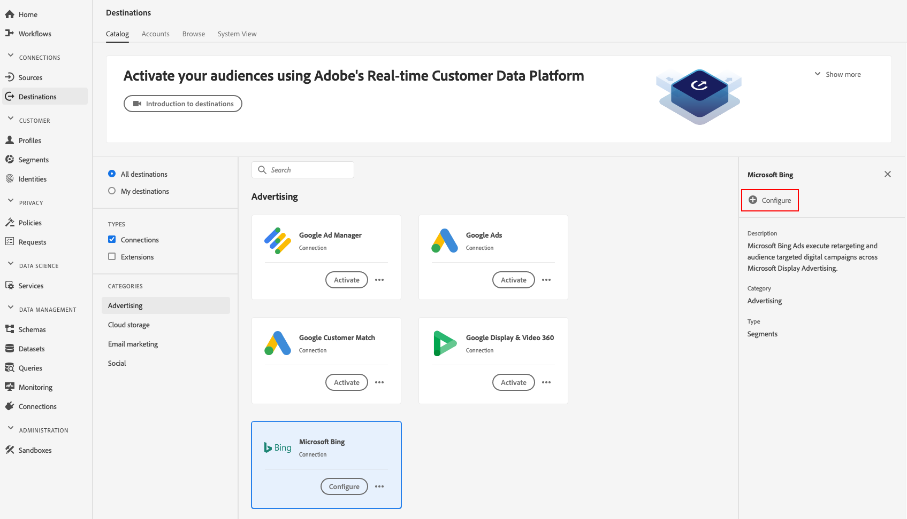
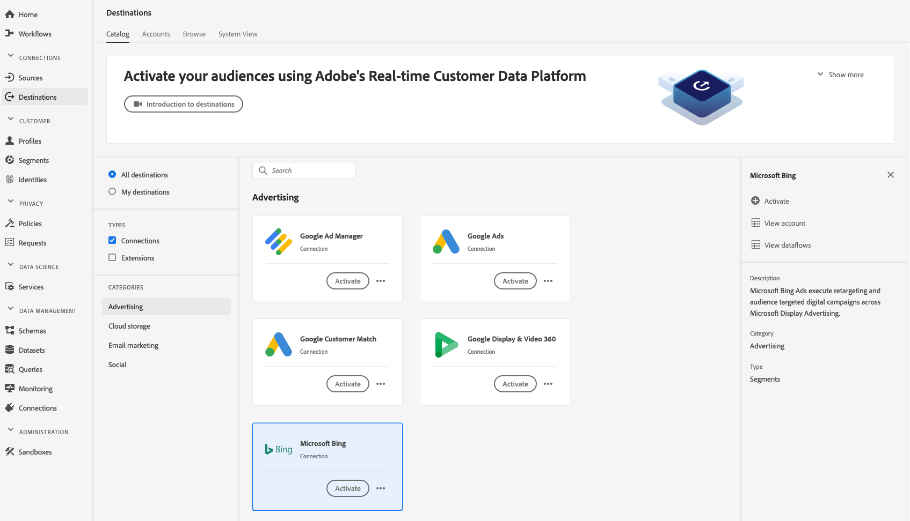

# [!DNL Microsoft Bing] Destination 

## Overview {#overview}

The [!DNL Microsoft Bing] destination is an Adobe Real-Time Customer Data Platform destination that helps you send profile data to [!DNL Microsoft Display Advertising].

To send profile data to [!DNL Microsoft Bing], you must first connect to the destination in the [[!DNL Adobe Real-Time Customer Data Platform]](#connect-destination).

## Use Cases {#use-cases}

## Connect to Destination {#connect-destination}

1.  In **[!UICONTROL Connections]** > **[!UICONTROL Destinations]**, select [!DNL Microsoft Bing], and select **[!UICONTROL Configure]**.

    

    >[!NOTE]
    >
    >If a connection with this destination already exists, you can see an **[!UICONTROL Activate]** button on the destination card. For more information about the difference between **[!UICONTROL Activate]** and **[!UICONTROL Configure]**, refer to the [Catalog](../destinations/destinations-workspace.md#catalog) section of the destination workspace documentation.
    >
    >

1. In the [!UICONTROL Authentication] step, you must enter the destination connection details:
   *  **[!UICONTROL Name]**: enter a name by which you will recognize this destination in the future.
   *  **[!UICONTROL Description]**: enter a description that will help you identify this destination in the future.
   *  **[!UICONTROL Account ID]**: enter your [!DNL Bing Ads] [!UICONTROL Account ID].
   *  **[!UICONTROL Marketing use case]**: Marketing use cases indicate the intent for which data will be exported to the destination. You can select from Adobe-defined marketing use cases or you can create your own marketing use case. For more information about marketing use cases, see the [Data Governance in Real-time CDP](../privacy/data-governance-overview.md#destinations) page. For information about the individual Adobe-defined marketing use cases, see the [Data usage policies overview](../../data-governance/policies/overview.md#core-actions).

    
    
1. Click **[!UICONTROL Create destination]**.

## Activate Segments

See [Activate profiles and segments to a destination](activate-destinations.md#select-attributes) for information about the segment activation workflow.

## Exported data {#exported-data}

To verify if data has been exported successfully to the [!DNL Microsoft Bing] destination, check your [!DNL Microsoft Bing Ads] account. If activation was successful, audiences are populated in your account. 