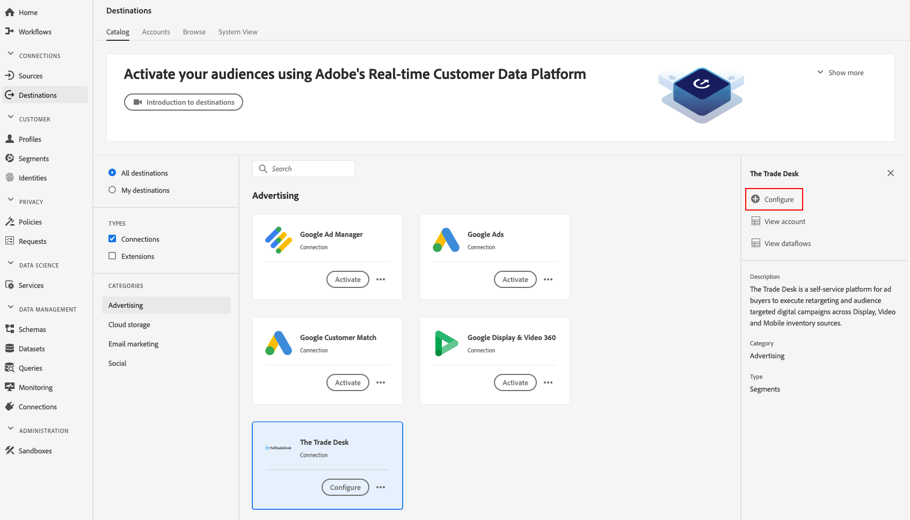

# [!DNL Braze] Destination 

## Overview {#overview}

The [!DNL Braze] destination helps you send profile data to [!DNL Braze].

[!DNL Braze] is a self-service platform for ad buyers to execute retargeting and audience targeted digital campaigns across display, video and mobile inventory sources.

To send profile data to [!DNL Braze], you must first connect to the destination.

## Destination Specs {#destination-specs}

Note the following details that are specific to the Braze destination:

* You can send the following [identities](../../identity-service/namespaces.md) to the [!DNL Braze] destination: .

## Use Cases {#use-cases}

## Export Type {#export-type}

**[!DNL Segment Export]** - you are exporting all members of a segment (audience) to the destination.

## Connect to Destination {#connect-destination}

1.  In **[!UICONTROL Connections]** > **[!UICONTROL Destinations]**, select [!DNL Braze], and select **[!UICONTROL Configure]**.

    

    >[!NOTE]
    >
    >If a connection with this destination already exists, you can see an **[!UICONTROL Activate]** button on the destination card. For more information about the difference between **[!UICONTROL Activate]** and **[!UICONTROL Configure]**, refer to the [Catalog](../destinations/destinations-workspace.md#catalog) section of the destination workspace documentation.
    >
    >

2. In the [!UICONTROL Authentication] step, you need to enter the [!DNL Braze] connection details:
   * **[!UICONTROL Name]**: enter a name by which you will recognize this destination in the future.
   * **[!UICONTROL Description]**: enter a description that will help you identify this destination in the future.
   * **[!UICONTROL Account ID]**: enter your [!DNL Braze] [!UICONTROL Account ID].
   * **[!UICONTROL Client Secret]**: the [!DNL clientSecret] parameter used in the [!DNL OAuth2] client credentials.
   * **[!UICONTROL Server Location]**: ask your Trade Desk representative which regional server you should use.
   * **[!UICONTROL Marketing use case]**: Marketing use cases indicate the intent for which data will be exported to the destination. You can select from Adobe-defined marketing use cases or you can create your own marketing use case. For more information about marketing use cases, see the [Data Governance in Adobe Experience Platform](../privacy/data-governance-overview.md#destinations) page. For information about the individual Adobe-defined marketing use cases, see the [Data usage policies overview](../../data-governance/policies/overview.md#core-actions). 

    

3. Click **[!UICONTROL Create destination]**. Your destination is now created. You can click [!UICONTROL Save & Exit] if you want to activate segments later, or you can select [!UICONTROL Next] to continue the workflow and select segments to activate. In either case, see the next section, [Activate Segments](#activate-segments), for the rest of the workflow.

## Activate Segments {#activate-segments}

See [Activate profiles and segments to a destination](activate-destinations.md#select-attributes) for information about the segment activation workflow.

## Exported data {#exported-data}

To verify if data has been exported successfully to [!DNL Braze] destination, check your [!DNL Braze] account. If activation was successful, audiences are populated in your account. 
