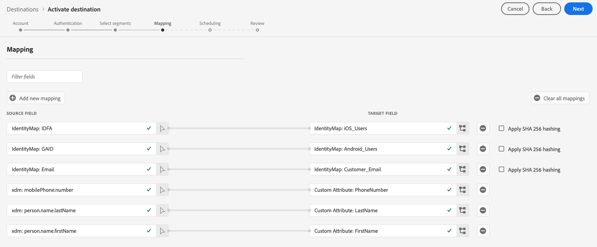

# (Beta) [!DNL Braze] destination

>[!IMPORTANT]
>
>The Braze destination in Adobe Experience Platform is currently in Beta. The documentation and the functionality are subject to change.

## Overview {#overview}

The [!DNL Braze] destination helps you send profile data to [!DNL Braze].

[!DNL Braze] is a comprehensive customer engagement platform that powers relevant and memorable experiences between customers and the brands they love.

To send profile data to [!DNL Braze], you must first connect to the destination.

## Destination specs {#destination-specs}

Note the following details that are specific to the [!DNL Braze] destination:

* You can send any [identity](../../identity-service/namespaces.md) to the [!DNL Braze] destination, as long as you map it to the [!DNL Braze] [`external_id`](https://www.braze.com/docs/api/basics/#external-user-id-explanation).
* [!DNL Adobe Experience Platform] segments are exported to [!DNL Braze] under the `AdobeExperiencePlatformSegments` attribute.

## Use cases {#use-cases}

As a marketer, I want to target users in a mobile engagement destination, with segments built in [!DNL Adobe Experience Platform]. Additionally, I want to deliver personalized experiences to them, based on attributes from their [!DNL Adobe Experience Platform] profiles, as soon as segments and profiles are updated in [!DNL Adobe Experience Platform].

## Export type {#export-type}

**[!DNL Profile-based]** - you are exporting all members of a segment, together with the desired schema fields (for example: email address, phone number, last name) and/or identities, according to your field mapping.
[!DNL Adobe Experience Platform] segments are exported to [!DNL Braze] under the `AdobeExperiencePlatformSegments` attribute.

## Connect to destination {#connect-destination}

1.  In **[!UICONTROL Connections]** > **[!UICONTROL Destinations]**, select [!DNL Braze], and select **[!UICONTROL Configure]**.

    

    >[!NOTE]
    >
    >If a connection with this destination already exists, you can see an **[!UICONTROL Activate]** button on the destination card. For more information about the difference between **[!UICONTROL Activate]** and **[!UICONTROL Configure]**, refer to the [Catalog](../destinations/destinations-workspace.md#catalog) section of the destination workspace documentation.
    >
    >

1. In the [!UICONTROL Account] step, you need to provide your [!DNL Braze] account token. This is your [!DNL Braze] [!DNL API] key. You can find detailed instructions on how to obtain your [!DNL API] key here: [REST API Key Overview](https://www.braze.com/docs/api/api_key/). Enter the token and click **[!UICONTROL Connect to destination]**. 

   

1. Click **[!UICONTROL Next]**.

1. In the [!UICONTROL Authentication] step, you need to enter the [!DNL Braze] connection details:
   * **[!UICONTROL Name]**: enter a name by which you will recognize this destination in the future.
   * **[!UICONTROL Description]**: enter a description that will help you identify this destination in the future.
   * **[!UICONTROL Endpoint Instance]**: ask your [!DNL Braze] representative which endpoint instance you should use.
   * **[!UICONTROL Marketing use case]**: marketing use cases indicate the intent for which data will be exported to the destination. You can select from Adobe-defined marketing use cases or you can create your own marketing use case. For more information about marketing use cases, see the [Data Governance in Adobe Experience Platform](../privacy/data-governance-overview.md#destinations) page. For information about the individual Adobe-defined marketing use cases, see the [Data usage policies overview](../../data-governance/policies/overview.md#core-actions). 
  
   

1. Click **[!UICONTROL Create destination]**. Your destination is now created. You can click **[!UICONTROL Save & Exit]** if you want to activate segments later, or you can select **[!UICONTROL Next]** to continue the workflow and select segments to activate. In either case, see the next section, [Activate Segments](#activate-segments), for the rest of the workflow.

## Activate segments {#activate-segments}

See [Activate profiles and segments to a destination](activate-destinations.md#select-attributes) for information about the segment activation workflow.

## Field mapping {#field-mapping}

To correctly send your audience data from [!DNL Adobe Experience Platform] to the [!DNL Braze] destination, you need to go through the field mapping step.

Mapping consists of creating a link between your [!DNL Experience Data Model] (XDM) schema fields in your [!DNL Platform] account, and their corresponding equivalents from the target destination.

To correctly map your XDM fields to the [!DNL Braze] destination fields, follow these steps:

1. In the [!UICONTROL Mapping] step, click **[!UICONTROL Add new mapping]**.
   
   

2. In the [!UICONTROL Source Field] section, click the arrow button next to the empty field.
   
    

3. In the [!UICONTROL Select source field] window, you can choose between two categories of XDM fields:
   * [!UICONTROL Select attributes]: use this option to map a specific field from your XDM schema to a [!DNL Braze] attribute.

        

   * [!UICONTROL Select identity namespace]: Use this option to map a [!DNL Platform] identity namespace to a [!DNL Braze] namespace.

        

    Choose your source field, then click **[!UICONTROL Select]**.

4. In the [!UICONTROL Target Field] section, click the mapping icon to the right of the field.
   
   

5. In the [!UICONTROL Select target field] window, you can choose between three categories of target fields:
   * [!UICONTROL Select attributes]: Use this option to map your XDM attributes to standard [!DNL Braze] attributes.
   * [!UICONTROL Select identity namespace]: Use this option to map [!DNL Platform] identity namespaces to [!DNL Braze] identity namespaces.
   * [!UICONTROL Select custom attributes]: Use this option to map XDM attributes to custom [!DNL Braze] attributes that you defined in your [!DNL Braze] account.
     * You can also use this option to rename existing XDM attributes into [!DNL Braze]. For instance, mapping a `lastName` XDM attribute to a custom `Last_Name` attribute in [!DNL Braze], will create the `Last_Name` attribute in [!DNL Braze], if it doesn't already exist, and map the `lastName` XDM attribute to it.
  
    

    Choose your target field, then click **[!UICONTROL Select]**.

6. You should now see your field mapping in the list.
   
   
   
7. To add more mappings, repeat steps 1 through 6.

### Example {#mapping-example}

Let's say your XDM profile schema and your [!DNL Braze] instance contain the following attributes and identities:

||XDM Profile Schema|[!DNL Braze] Instance|
|---|---|---|
|Attributes|<ul><li><code>person.name.firstName</code></li><li><code>person.name.lastName</code></li><li><code>mobilePhone.number</code></li></ul>|<ul><li><code>FirstName</code></li><li><code>LastName</code></li><li><code>PhoneNumber</code></li></ul>|
|Identities|<ul><li><code>Email</code></li><li><code>Google Ad ID (GAID)</code></li><li><code>Apple ID For Advertisers (IDFA)</code></li></ul>|<ul><li><code>external_id</code></li></ul>|

The correct mapping would look like this:

## Exported data {#exported-data}

To verify if data has been exported successfully to the [!DNL Braze] destination, check your [!DNL Braze] account. [!DNL Adobe Experience Platform] segments are exported to [!DNL Braze] under the `AdobeExperiencePlatformSegments` attribute.

## Data usage and governance {#data-usage-governance}

All [!DNL Adobe Experience Platform] destinations are compliant with data usage policies when handling your data. For detailed information on how [!DNL Adobe Experience Platform] enforces data governance, see [Data Governance in Real-time CDP](/help/rtcdp/privacy/data-governance-overview.md).

