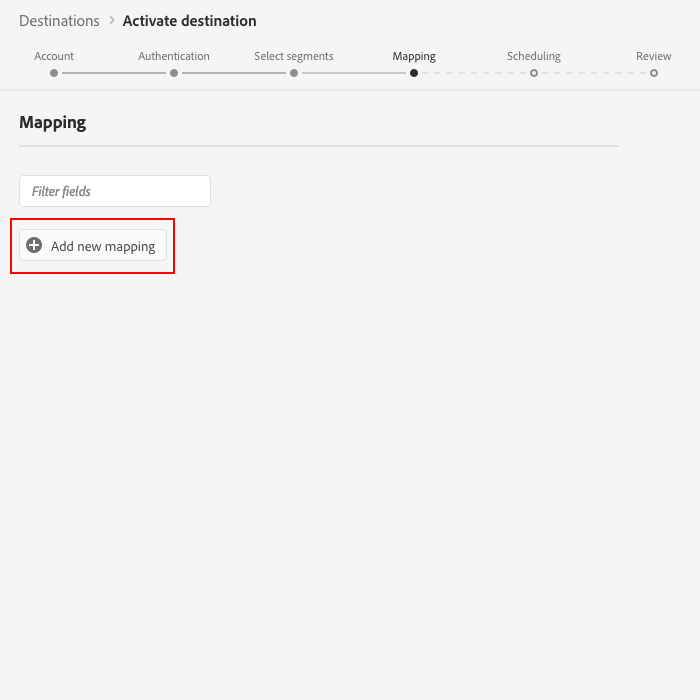

# [!DNL Braze] Destination 

## Overview {#overview}

The [!DNL Braze] destination helps you send profile data to [!DNL Braze].

To send profile data to [!DNL Braze], you must first connect to the destination.

## Destination Specs {#destination-specs}

Note the following details that are specific to the Braze destination:

* You can send the following [identities](../../identity-service/namespaces.md) to the [!DNL Braze] destination: .

## Use Cases {#use-cases}

## Export Type {#export-type}

**[!DNL Profile-based]** - you are exporting all members of a segment, together with the desired schema fields (for example: email address, phone number, last name) and/or identities, according to your field mapping.

## Connect to Destination {#connect-destination}

1.  In **[!UICONTROL Connections]** > **[!UICONTROL Destinations]**, select [!DNL Braze], and select **[!UICONTROL Configure]**.

    

    >[!NOTE]
    >
    >If a connection with this destination already exists, you can see an **[!UICONTROL Activate]** button on the destination card. For more information about the difference between **[!UICONTROL Activate]** and **[!UICONTROL Configure]**, refer to the [Catalog](../destinations/destinations-workspace.md#catalog) section of the destination workspace documentation.
    >
    >

1. In the [!UICONTROL Account] step, you need to provide your [!UICONTROL Braze] account token. Enter the token and click [!UICONTROL Connect to destination].
   

1. Click [!UICONTROL Next].

1. In the [!UICONTROL Authentication] step, you need to enter the [!DNL Braze] connection details:
   * **[!UICONTROL Name]**: enter a name by which you will recognize this destination in the future.
   * **[!UICONTROL Description]**: enter a description that will help you identify this destination in the future.
   * **[!UICONTROL Endpoint Instance]**: ask your [!DNL Braze] representative which endpoint instance you should use.
   * **[!UICONTROL Marketing use case]**: marketing use cases indicate the intent for which data will be exported to the destination. You can select from Adobe-defined marketing use cases or you can create your own marketing use case. For more information about marketing use cases, see the [Data Governance in Adobe Experience Platform](../privacy/data-governance-overview.md#destinations) page. For information about the individual Adobe-defined marketing use cases, see the [Data usage policies overview](../../data-governance/policies/overview.md#core-actions). 
  
    

1. Click **[!UICONTROL Create destination]**. Your destination is now created. You can click [!UICONTROL Save & Exit] if you want to activate segments later, or you can select [!UICONTROL Next] to continue the workflow and select segments to activate. In either case, see the next section, [Activate Segments](#activate-segments), for the rest of the workflow.

## Activate Segments {#activate-segments}

See [Activate profiles and segments to a destination](activate-destinations.md#select-attributes) for information about the segment activation workflow.

## Field Mapping {#field-mapping}

To correctly send your audience data from [!DNL Adobe Experience Platform] to the [!DNL Braze] destination, you need to go through the field mapping step.

Mapping consists of creating a link between your XDM schema fields in your Adobe Experience Platform account, and their corresponding equivalents from the target destination.

To correctly map your XDM fields to the [!DNL Braze] destination fields, follow these steps:

1. In the [!UICONTROL Mapping] step, click [!UICONTROL Add new mapping].
   
   

1. In the [!UICONTROL Source Field] section, click the arrow button next to the empty field.
   
    

1. In the [!UICONTROL Select source field] window, you can choose between two categories of XDM fields:
   * [!UICONTROL Select attributes]: use this option to map a specific field from your XDM schema to a [!DNL Braze] attribute.

        

   * [!UICONTROL Select identity namespace]: use this option to map an entire Platform identity namespace to a [!DNL Braze] namespace.

        

    Choose your source field, then click [!UICONTROL Select].

1. In the [!UICONTROL Target Field] section, click the mapping icon to the right of the field.
   
   

1. In the [!UICONTROL Select target field] window, you can choose between three categories of target fields:
   * [!UICONTROL Select attributes]: use this option to map your XDM attributes to standard [!DNL Braze] attributes.
   * [!UICONTROL Select identity namespace]: use this option to map Platform identity namespaces to [!DNL Braze] identity namespaces.
   * [!UICONTROL Select custom attributes]: use this option to map XDM attributes to custom [!DNL Braze] attributes that you defined in your [!DNL Braze] account.
  
    

    Choose your target field, then click [!UICONTROL Select].

1. That's it! You should now see your field mapping in the list.
   
   
   
1. To add more mappings, repeat steps 1 through 6.

### Example 1: Mapping XDM Attributes to Custom Braze Attributes {#mapping-example}

Let's say your XDM profile schema contains the following source fields:

* `person.name.firstName`
* `person.name.lastName`
* `mobilePhone.number`

At the same time, you defined the following custom attributes in your [!DNL Braze] instance:

* `FirstName`
* `LastName`
* `PhoneNumber`

To correctly map the fields:

* At step 3 in the workflow above you would use the [!UICONTROL Select attributes] option to navigate your schema choose your source fields.
* At step 5 in the workflow above you would use either:
  * The [!UICONTROL Select attributes] option to choose the standard Braze attributes to map your source fields to.
  * The [!UICONTROL Select custom attributes] option to choose the custom Braze attributes (that you defined in your Braze account) to map your source fields to.

The final mapping would look like this:

### Example 2: Mapping Platform Identity Namespaces to Braze Namespaces {#mapping-example}

Let's say your [!DNL Platform] account contains an `Email` namespace, and your [!DNL Braze] account contains an `external_id` namespace.

To correctly map the namespaces:

* At step 3 in the workflow above you would use the [!UICONTROL Select identity namespace] option to choose your `Email` namespace.
* At step 5 in the workflow above you would use the [!UICONTROL Select identity namespace] to choose your `external_id` namespace.

The final mapping would look like this:

## Exported data {#exported-data}

To verify if data has been exported successfully to [!DNL Braze] destination, check your [!DNL Braze] account. If activation was successful, audiences are populated in your account. 
