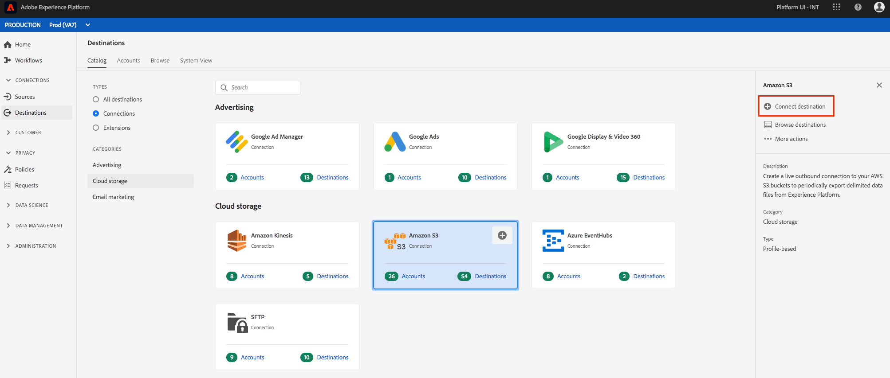
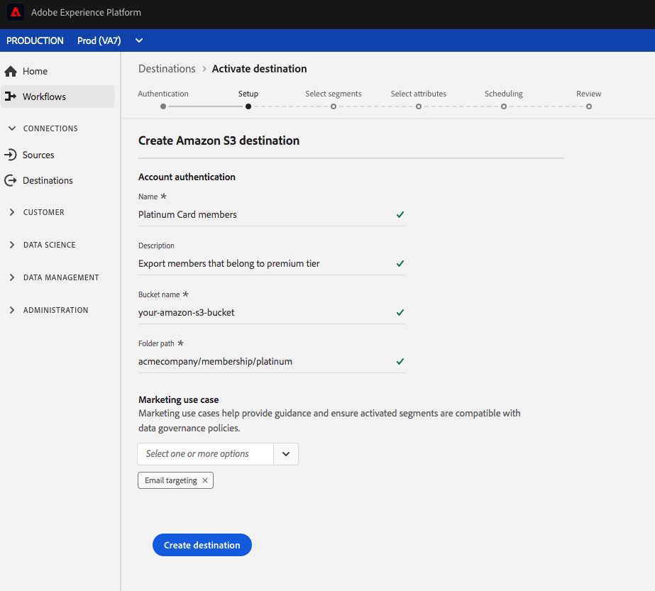
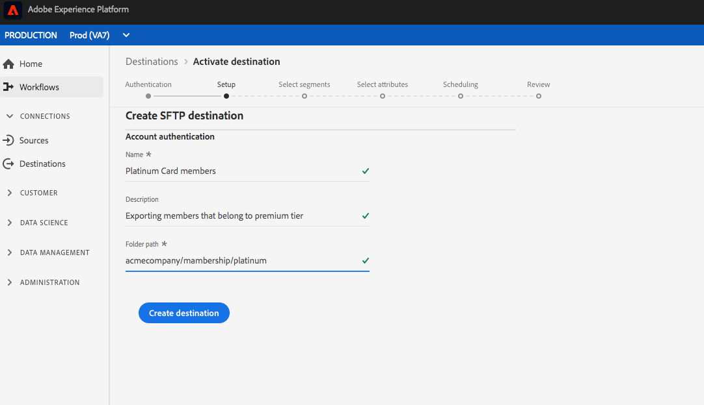
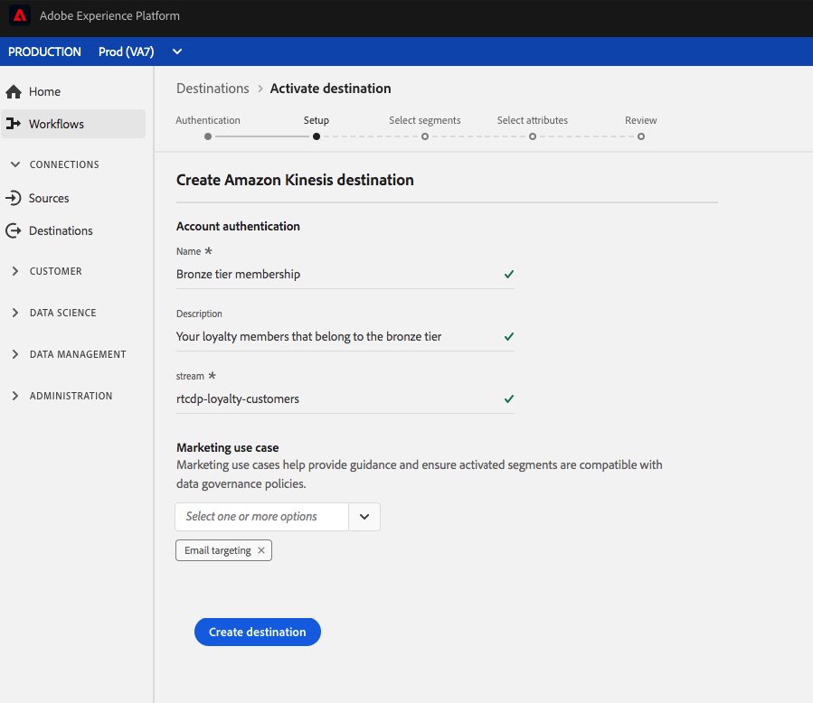

# Workflow to create cloud storage destinations

## Overview

This page explains how you can connect to cloud storage locations in Adobe Real-time Customer Data Platform.

1. In **[!UICONTROL Connections]** > **[!UICONTROL Destinations]**, select your preferred cloud storage destination, then select **[!UICONTROL Configure]**.

    

    >[!NOTE]
    >
    >If a connection with this destination already exists, you can see an **[!UICONTROL Activate]** button on the destination card. For more information about the difference between **[!UICONTROL Activate]** and **[!UICONTROL Configure]**, refer to the [Catalog](/help/rtcdp/destinations/destinations-workspace.md#catalog) section of the destination workspace documentation.   

2. In the **[!UICONTROL Authentication]** step, if you had previously set up a connection to your cloud storage destination, select **[!UICONTROL Existing Account]** and select your existing connection. Or, you can select **[!UICONTROL New Account]** to set up a new connection to your cloud storage destination. Fill in your account authentication credentials and select **[!UICONTROL Connect to destination]**. Optionally, you can attach your RSA-formatted public key to add encryption to your exported files. Note that this public key **must** be written as a Base64 encoded string.   See [Amazon S3](/help/rtcdp/destinations/amazon-s3-destination.md) destination, [[!DNL Amazon Kinesis]](/help/rtcdp/destinations/amazon-kinesis-destination.md) destination, [[!DNL Azure Event Hubs]](/help/rtcdp/destinations/azure-event-hubs-destination.md) destination, and [SFTP](/help/rtcdp/destinations/sftp-destination.md) destination for specifics around credentials input in the **Authentication** step.

    >[!NOTE]
    >
    >Adobe Real-time CDP supports credentials validation in the authentication process and displays an error message if you input incorrect credentials to your cloud storage location. This ensures that you don't complete the workflow with incorrect credentials.

    

3. In the **[!UICONTROL Setup]** step, enter a **[!UICONTROL Name]** and a **[!UICONTROL Description]** for your activation flow.   
Also in this step, you can select any **[!UICONTROL Marketing use case]** that should apply to this destination. Marketing use cases indicate the intent for which data will be exported to the destination. You can select from Adobe-defined marketing use cases or you can create your own marketing use case. For more information about marketing use cases, see the [Data Governance in Real-time CDP](/help/rtcdp/privacy/data-governance-overview.md#destinations) page. For information about the individual Adobe-defined marketing use cases, see the [Data usage policies overview](/help/data-governance/policies/overview.md#core-actions).  
   For Amazon S3 destinations, insert the **[!UICONTROL Bucket name]** and the **[!UICONTROL Folder path]** in your cloud storage destination where the files will be delivered. Select **[!UICONTROL Create Destination]** after you filled in the fields above.

   

   For SFTP destinations, insert the **[!UICONTROL Folder path]** where the files will be delivered. Select **[!UICONTROL Create Destination]** after you filled in the fields above.

   

   For [!DNL Amazon Kinesis] destinations, provide the name of your existing data stream in your [!DNL Amazon Kinesis] account. Adobe Real-time CDP will export data to this stream. Select **[!UICONTROL Create Destination]** after you filled in the fields above.

   

   For [!DNL Azure Event Hubs] destinations, provide the name of your existing data stream in your [!DNL Amazon Kinesis] account. Adobe Real-time CDP will export data to this stream. Select **[!UICONTROL Create Destination]** after you filled in the fields above.

      

4. Your destination is now created. You can select **[!UICONTROL Save & Exit]** if you want to activate segments later on or you can select **[!UICONTROL Next]** to continue the workflow and select segments to activate. In either case, see the next section, [Activate segments](#activate-segments), for the rest of the workflow to export data.

## Activate segments {#activate-segments}

See [Activate profiles and segments to a destination](/help/rtcdp/destinations/activate-destinations.md) for information about the segment activation workflow.