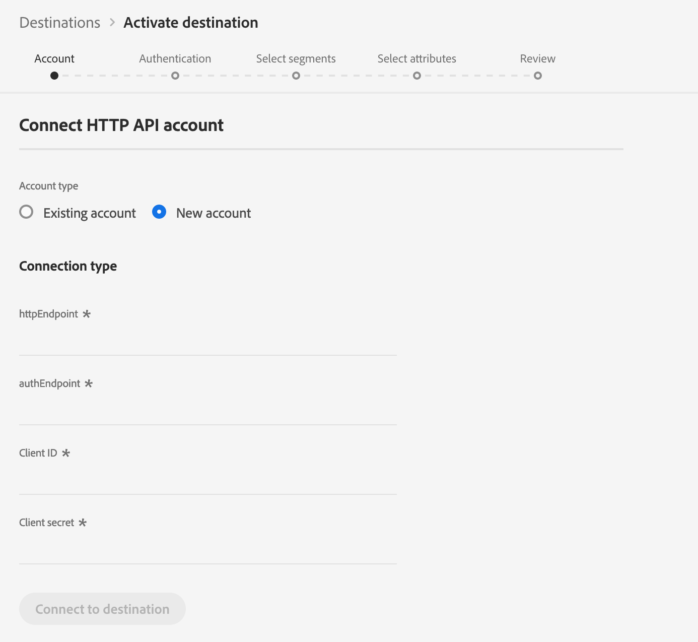
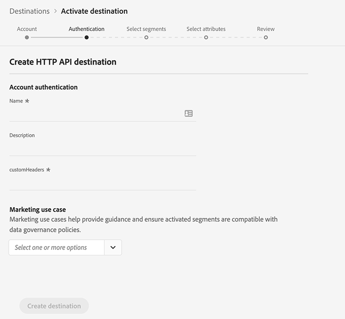

# Custom HTTP Destination (Beta)

## Overview

The [!DNL Custom HTTP] destination is an [!DNL Adobe Real-Time Customer Data Platform] streaming destination that helps you send profile data to third-party [!DNL HTTP] endpoints.

To send profile data to custom [!DNL HTTP] endpoints, you must first connect to the destination in the [!DNL Adobe Real-Time Customer Data Platform](#connect-destination).

## Connect to Destination {#connect-destination}

1. In **[!UICONTROL Connections]** > **[!UICONTROL Destinations]**, select HTTP API, then click **[!UICONTROL Activate]**.
    
2. In the [!UICONTROL Account] step, you need to define the HTTP endpoint connection detials. Select **[!UICONTROL New account]** and enter the connection details for the HTTP endpoint that you want to conenct to.
   * **[!UICONTROL httpEndpoint]**: the complete [!DNL URL] of the HTTP endpoint that you want to send the profile data to.
     * Optionally you can add query parameters to the [!UICONTROL httpEndpoint] [!DNL URL].
   * **[!UICONTROL authEndpoint]**: the complete [!DNL URL] of the HTTP endpoint used for [!DNL OAuth2] authentication.
   * **[!UICONTROL Client ID]**: the [!DNL clientID] parameter used in the [!DNL OAuth2] client credentials.
   * **[!UICONTROL Client Secret]**: the [!DNL clientSecret] parameter used in the [!DNL OAuth2] client credentials.
    
    >[!NOTE]
    >
    >Only [!DNL OAuth2] client credentials are currently supported.

    
3. Click **[!UICONTROL Connect to destination]**.
4. After the connection succeeds, click **[!UICONTROL Next]**. 
5. In the [!UICONTROL Authentication] step, enter the account authentication credentials:
   *  **[!UICONTROL Name]**: enter a name by which you will recognize this destination in the future.
   *  **[!UICONTROL Description]**: enter a description that will help you identify this destination in the future.
   *  **[!UICONTROL Custom Headers]**: enter any custom headers that you want to be included in the destination calls, following this format: `header1:value1,header2:value2,...headerN:valueN`.

        >[!IMPORTANT]
        >
        >The current implementation requires at least one custom header.
    
    

6. Select a marketing use case for this destination. This information is required per the [Data Governance](rtcdp/privacy/data-governance-overview.md) regulations.
7. Click **[!UICONTROL Create destination]**.

## Activate Segments

See [Activate profiles and segments to a destination](/help/rtcdp/destinations/activate-destinations.md) for information about the segment activation workflow.

## Destination Attributes

When [activating segments](/help/rtcdp/destinations/activate-destinations.md) to a [!DNL custom HTTP] destination, we recommend that you select a unique identifier from your [union schema](../../profile/home.md#profile-fragments-and-union-schemas). Select the unique identifier and any other XDM fields that you want to export to the destination.

