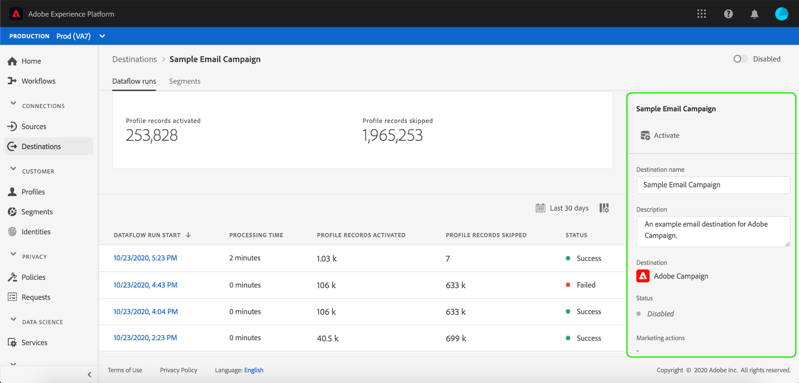
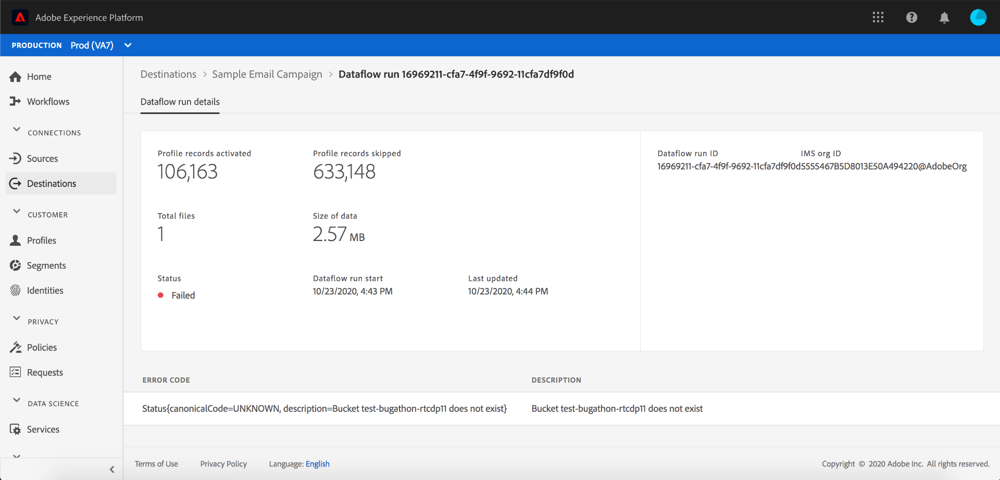

# Destination details page

In the Adobe Experience Platform user interface, you can view and monitor the attributes and activities of your destinations. These details include the destination's name and ID, controls to activate or disable the destinations, and more. Details for batch destinations also include metrics for activated profile records and a history of dataflow runs.

>[!NOTE]
>
>The destinations details page is part of the [!UICONTROL Destinations] workspace in the Platform UI. See the [[!UICONTROL Destinations] workspace overview](./destinations-workspace.md) for more information.

In the **[!UICONTROL Destinations]** workspace within the Platform UI, navigate to the **[!UICONTROL Browse]** tab and select the name of a destination that you want to view.

The details page for the destination appears, showing its available controls. If you are viewing the details of a batch destination, a monitoring dashboard also appears.

## Right rail

The right rail displays the basic information about the destination.

The following table covers the controls and details provided by the right rail:

| Right-rail item | Description |
| --- | --- |
| [!UICONTROL Activate] | Select this control to edit which segments are mapped to the destination. See the guide on [activating segments to a destination](../../ui/activate-destinations.md) for more information. |
| [!UICONTROL Destination name] | This field can be edited in order to update the destination's name. |
| [!UICONTROL Description] |  This field can be edited in order to update or add an optional description to the destination. |
| [!UICONTROL Destination] | Represents the destination platform that audiences are sent to. See the [destinations catalog](./destinations-catalog.md) for more information. |
| [!UICONTROL Status] | Indicates whether the destination is enabled or disabled. |
| [!UICONTROL Marketing actions] | Indicates the marketing actions (use cases) that apply for this destination for data-governance purposes. |
| [!UICONTROL Category] | Indicates the destination type. See the [destinations catalog](./destinations-catalog.md) for more information. |
| [!UICONTROL Connection type] | Indicates the form by which your audiences are being sent to the destination. Possible values include "[!UICONTROL Cookie]" and "[!UICONTROL Profile-based]". |
| [!UICONTROL Frequency] | Indicates how often the audiences are sent to the destination. Possible values include "[!UICONTROL Streaming]" and "[!UICONTROL Batch]".  |
| [!UICONTROL Identity] | Represents the identity namespace accepted by the destination, such as `GAID`, `IDFA`, or `email`. For more information on accepted identity namespaces, see the [identity namespace overview](../../identity-service/namespaces.md). |
| [!UICONTROL Created by] | Indicates the user who created this destination. |
| [!UICONTROL Created] | Indicates the UTC datetime when this destination was created. |

## [!UICONTROL Enabled]/[!UICONTROL Disabled] toggle

You can use the **[!UICONTROL Enabled]/[!UICONTROL Disabled]** toggle to start and pause all data exports to the destination.

## [!UICONTROL Dataflow runs]

The [!UICONTROL Dataflow runs] tab provides metric data on your dataflow runs to batch destinations. A list of individual runs and their particular metrics is displayed, along with the following totals for profile records:

* **[!UICONTROL Profile records activated]**: The total count of profile records that were created or updated for activation.
* **[!UICONTROL Profile records skipped]**:  The total count of profile records that are skipped for activation based on profile exits or missing attributes.

>[!NOTE]
>
>Dataflow runs are generated based on the destination dataflow's schedule frequency. A separate dataflow run is made for each merge policy applied to a segment.

To view the details of a particular dataflow run, select the run's start time from the list. The details page for a dataflow run contains additional information such as the size of data processed and a list of any errors that occurred with details for error diagnostics.

## [!UICONTROL Segments]

The [!UICONTROL Segments] tab displays a list of segments that have been mapped to the destination, including their start date and end date (if applicable). To view the details about a particular segment, select its name from the list.

>[!NOTE]
>
>For details on exploring the details page of a segment, refer to the [Segmentation UI overview](../../segmentation/ui/overview.md#segment-details).

## Next steps

This document covered the capabilities of the destination details page. For more information on managing destinations in the UI, see the overview on the [[!UICONTROL Destinations] workspace](./destinations-workspace.md).