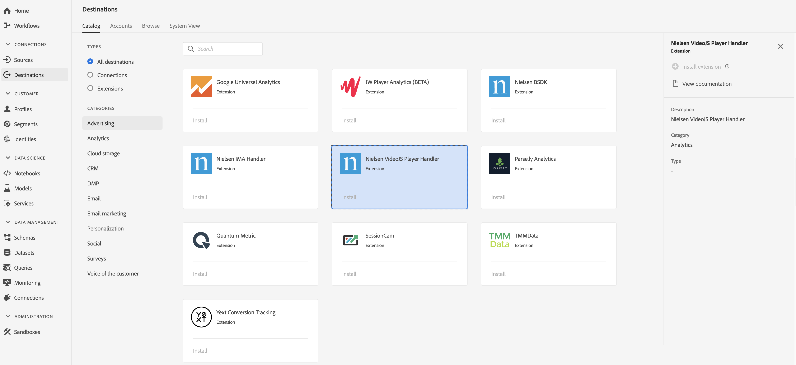

# [!DNL Nielsen VideoJS Player Handler] Extension {#nielsen-vjs-extension}

## Overview {#overview}

[!DNL Nielsen Digital SDK] launch extension offers audience measurement via the following digital measurement products:

DCR: A measurement solution that provides daily measurement of non-linear digital content, including content with ads will enable a comprehensive view of digital content audience consumption across Desktop, Mobile, Tablet and Connected Devices.

DTVR: This accounts for linear TV viewing occurring on desktop and mobile devices for participating programming sources. This is the first solution to receive accreditation from the MRC for its contribution to TV audience measurement for programming viewed on computers and mobile devices.

[!DNL Nielsen VideoJS Player Handler] is an analytics extension in Adobe Real-time Customer Data Platform. For more information about the extension functionality, see the extension page on [Adobe Exchange](https://exchange.adobe.com/experiencecloud.details.101361.nielsen-digital-sdk-extension.html).

This destination is an Experience Platform Launch extension. For more information about how Launch extensions work in Adobe Real-time CDP, see [Experience Platform Launch extensions overview](/help/rtcdp/destinations/experience-platform-launch-extensions.md).

## Prerequisites {#prerequisites}

This extension is available in the [!DNL Destinations] catalog for all customers who have purchased Adobe Real-time CDP.

To use this extension, you need access to Experience Platform Launch. Experience Platform Launch is offered to Adobe Experience Cloud customers as an included, value-add feature. Contact your organization administrator to get access to Launch and ask them to grant you the **[!UICONTROL manage_properties]** permission so you can install extensions.

## Install extension {#install-extension}

To install the [!DNL Nielsen VideoJS Player Handler] extension:

1. In the [Adobe Real-time CDP interface](http://platform.adobe.com/), go to **[!UICONTROL Destinations]** > **[!UICONTROL Catalog]**.
2. Select the extension from the catalog or use the search bar.
3. Click on the destination to highlight it, then select **[!UICONTROL Configure]** in the right rail. If the **[!UICONTROL Configure]** control is greyed out, you are missing the **[!UICONTROL manage_properties]** permission. See [Prerequisites](#prerequisites).
4. In the **[!UICONTROL Select available Launch property]** window, select the Launch property in which you want to install the extension. You also have the option of creating a new property in Launch. A property is a collection of rules, data elements, configured extensions, environments, and libraries. Learn about properties in the [Properties page section](https://docs.adobe.com/content/help/en/launch/using/reference/admin/companies-and-properties.html#properties-page) of the Launch documentation.
5. The workflow takes you to Launch to complete the installation. 

For information about the extension configuration options and installation support, see the [Nielsen Digital SDK page on Adobe Exchange](https://exchange.adobe.com/experiencecloud.details.101361.nielsen-digital-sdk-extension.html).

You can also install the extension directly in the [Experience Platform Launch interface](https://launch.adobe.com/). See [Add a new extension](https://docs.adobe.com/content/help/en/launch/using/reference/manage-resources/extensions/overview.html#add-a-new-extension) in the Launch documentation.

## How to use the extension {#how-to-use}

Once you have installed the extension, you can start setting up rules for it directly in Launch.

In Launch, you can set up rules for your installed extensions to send event data to the extension destination only in certain situations. For more information about setting up rules for your extensions, see [Rules documentation](https://docs.adobe.com/help/en/launch/using/reference/manage-resources/rules.html).

## Configure, upgrade, and delete extension {#configure-upgrade-delete}

You can configure, upgrade, and delete extensions in the Launch interface.

>[!TIP]
>
>If the extension is already installed on one of your properties, the Adobe Real-time CDP UI still displays **[!UICONTROL Install]** for the extension. Kick off the installation workflow as described in [Install extension](#install-extension) to get to Launch and configure or delete your extension.

To upgrade your extension, see [Extension upgrade](https://docs.adobe.com/content/help/en/launch/using/reference/manage-resources/extensions/extension-upgrade.html) in the Launch documentation.