# Getting started with Real-Time Customer Data Platform

This getting started guide leads you through a sample implementation of Real-Time Customer Data Platform (Real-Time CDP). You can use it as an example when setting up your own implementation. Although this guide shows specific examples, it links to additional information you can use while creating your setup.

This example shows the power of Real-Time Customer Data Platform, powered by Adobe Experience Platform, to:

* Ingest data from multiple sources
* Merge them into a single [!DNL real-time customer profile]
* Deliver a consistent, relevant, and personalized experience across devices.

## Use case

Luma, an athletic apparel company, is always trying to improve their customer experience. They have a new initiative to increase gift-related sales. They also want to reduce overexposure, such as annoying ads that follow customers around.

Currently, they're spending too much on media that retargets against items that the visitor isn’t going to buy moving forward. For example, Luma doesn’t want to retarget someone with an item that was intended as a one-time purchase for someone else.

Right now, Luma's data is dispersed across multiple sources. As a result, they face significant challenges:

* The marketing organization must work with various teams that each own a data source, including a website, mobile app, loyalty systems, CRM, and so on. 
* By the time the marketing team gets access to the data, it's often stale and is no longer relevant for their time-sensitive campaign.  
* They need to unify the data so they target a person, not channels. 

As a result, Luma has the following business objectives:

* Create a real-time single view of their consumers from their disparate sources of data.
* Personalize marketing campaigns with relevant messages across different channels and devices.

To meet these goals, the marketing team needs to be able to manage customer data at scale. 

With Real-Time CDP, powered by Adobe Experience Platform, Luma’s marketing organization can:  

1. Collect data from disparate platforms and make sure it's available downstream for other marketing activities. 
1. Create a single, real-time view of their consumers, independent of where data originates.  
1. Drive a consistent, relevant and personalized experience across every touchpoint.

## Steps

This tutorial includes the following steps:

1. Build the [customer profile](#customer-profile).
1. [Personalize](#personalizing-the-user-experience) the user experience.
1. Use [multiple data sources](#using-multiple-data-sources).
1. [Configure a data source](#configuring-a-data-source). 
1. [Collect the data](#bringing-the-data-together-for-a-specific-customer) for a specific customer.
1. Set up [segments](#segments).
1. Set up [destinations](#destinations).
1. [Stitch the profile across devices](#cross-device-identity-stitching).
1. [Analyze the profile](#analyzing-the-profile).

## Customer profile

When customers first visit your site, you don't know anything about them. 

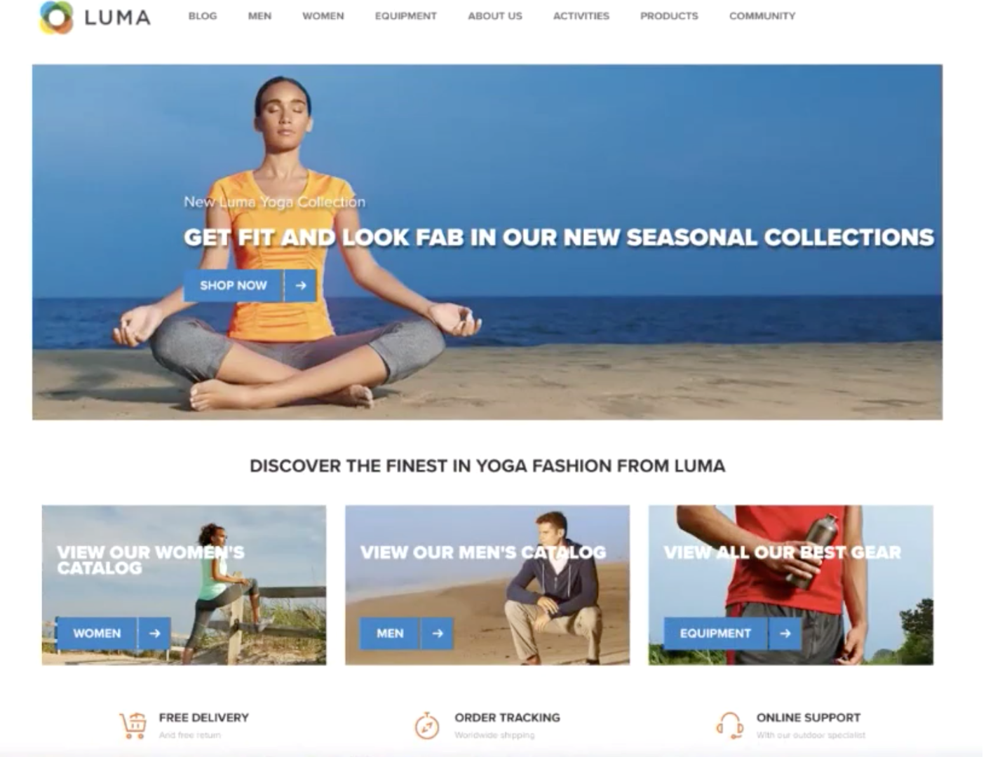

As they navigate, data is captured in real time and sent not only to a report suite in Adobe Analytics, but also sent directly to Adobe Experience Platform. As data is collected, you begin to form a single view of the consumer, based on behavioral data in [!DNL Experience Platform's real-time customer profile].  

Many visitors to the website are probably repeat customers who have previously purchased from Luma.  It's important for Luma to personalize messaging and offerings to address both new and repeat visitors, as well as known customers.

### New customer's first visit

For example, an unidentifed visitor navigates to the Men’s section on the Luma site, and views a couple running sweatshirts. 

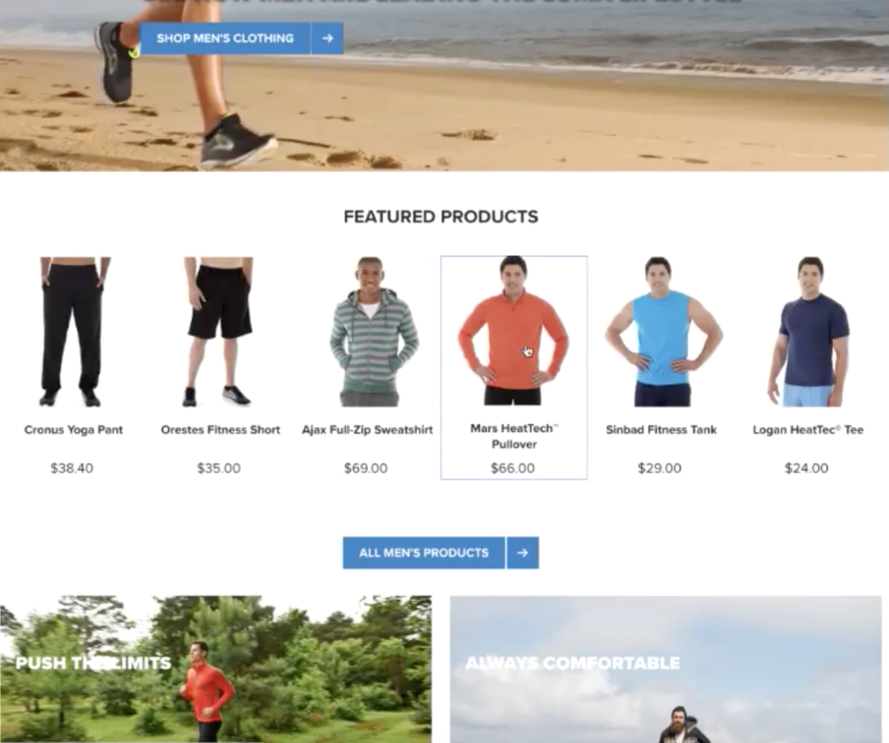

As the customer navigates to learn more about these products, these product views are collected in Adobe Analytics and sent to [!DNL Experience Platform].  

<!--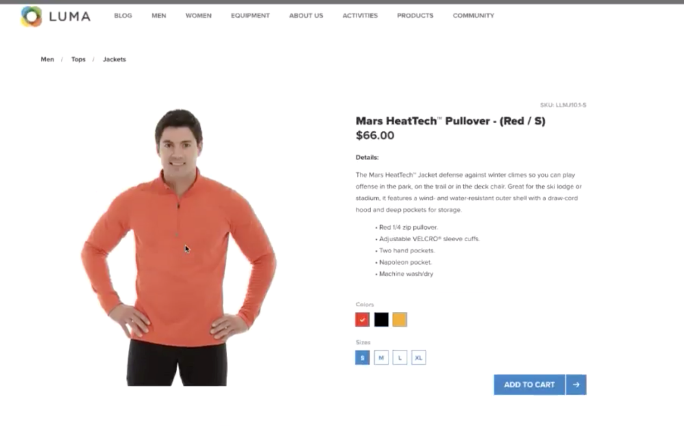-->

Luma can map the visitor's behavior to a user profile on Adobe Experience Platform and begin to assemble a richer view of that consumer's behavior.

### Getting a more detailed view of the customer

As the customer continues to interact with the website, a more clear picture emerges. For example, assume the visitor adds a product to the shopping cart and logs in.

When the customer logs in, she identifies herself as Sarah Rose. 

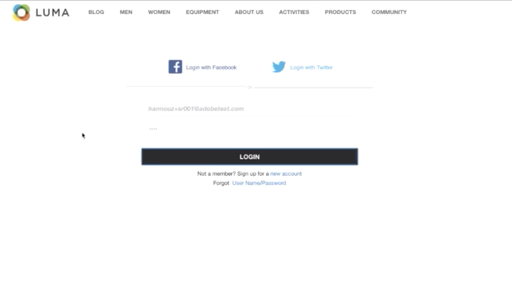

Two identies are merged:

* The anonymous browsing data
* The existing data associated with Sarah Rose's account

Both identies are combined into a single profile in [!DNL Experience Platform]. Luma now has a unified view of this consumer.

Based on the browsing behavior of the anonymous visitor in the Men's section of the site, it might have been assumed that the customer was a male. Now that she’s logged in, Luma recognizes Sarah Rose. Luma uses the power of the [!DNL Real-Time Customer Profile] to refine the messaging delivered to her across channels.  

## Personalizing the user experience

Sarah is welcomed with a loyalty message and thanked for being a Bronze member with more information on benefits and how to increase her status and points.

She navigates to the home page to browse some more.  

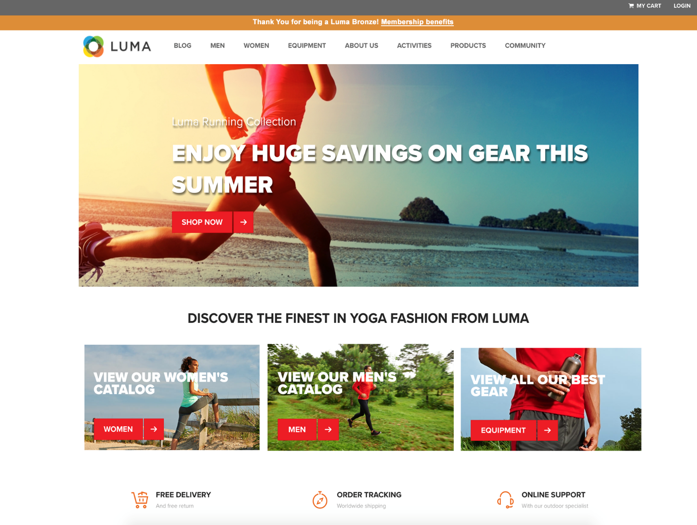

Sarah receives a personalized home page experience that is dynamically delivered, based on her [!DNL Real-Time Customer Profile] in Adobe Experience Platform.  

She sees relevant content, thanks to Adobe Sensei-powered personalization in Adobe Target, which takes into account her past purchases and affinity toward running apparel and gear. Luma also tailors the men’s catalog content toward running gear for men based on her most recent browse.

Further down the page, Sarah is shown featured products, as well as a new recommendations tray based on her most recently viewed items.  

This personalized content helps Sarah find relevant items quickly. This increases conversions and provides a more delightful customer experience.

### Bringing the customer back

Sarah gets distracted and leaves the site, ending her session. Luma can use her data in Adobe Experience Platform to help bring her back to the site.

Real-Time Customer Data Platform, powered by Adobe Experience Platform, is built for customer experience management. It enables organizations to:

* Simplify data integration and activation 
* Govern known and unknown data usage 
* Accelerate marketing use cases at scale 

## Using multiple data sources

The team at Luma has all of their behavioral and customer data in a single place. 

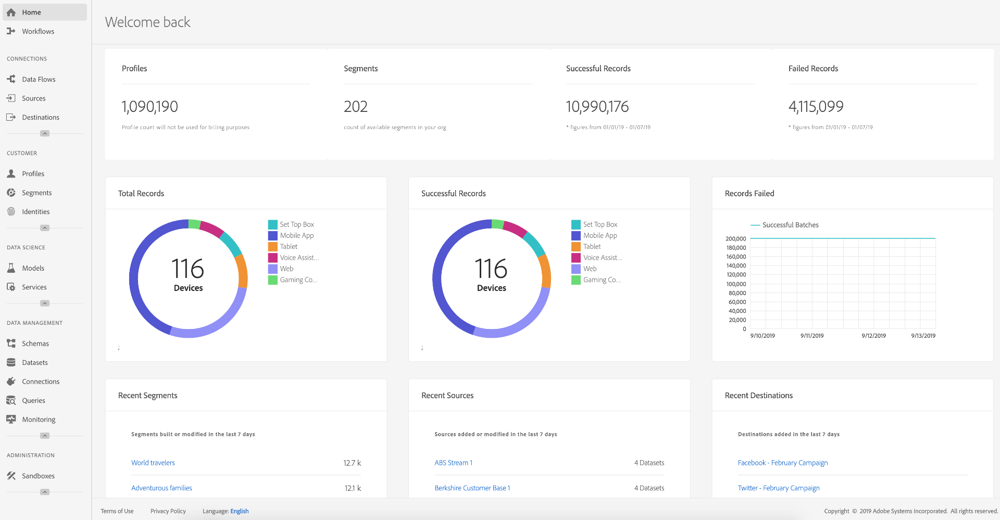

They can ingest data from all of the following sources:

* Existing Adobe Experience Cloud solutions data
* Non-Adobe sources, such as Luma's loyalty program, call center, and point-of-sale system data
* Real-time streaming data from Luma data sources
* Real-time data from Adobe solutions (no new tags required)

All this data from disparate sources is merged into a single unified customer profile.

## Configuring a data source

Use [!DNL Real-Time Customer Data Platform] to bring new sources of data into Platform. Real-Time CDP includes a catalog of data sources that can be quickly and easily added to the profile.  

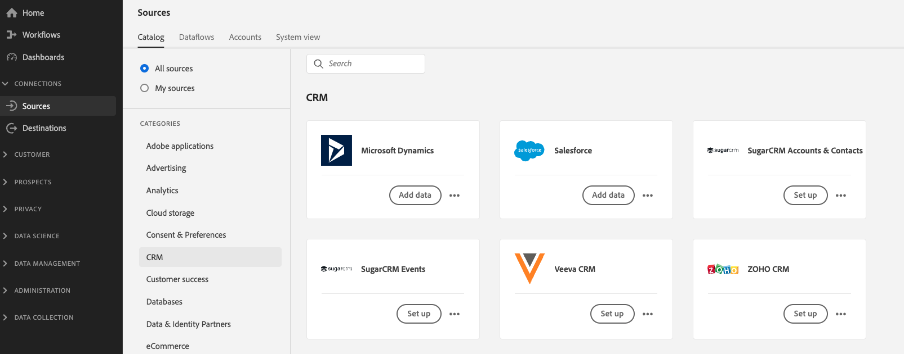

For example, to ingest Luma’s CRM data, filter the catalog by *CRM*, and all out-of-the-box connectors containing *CRM* are listed. To add [!DNL Microsoft Dynamics CRM] data:

1. Authorize the connection.

    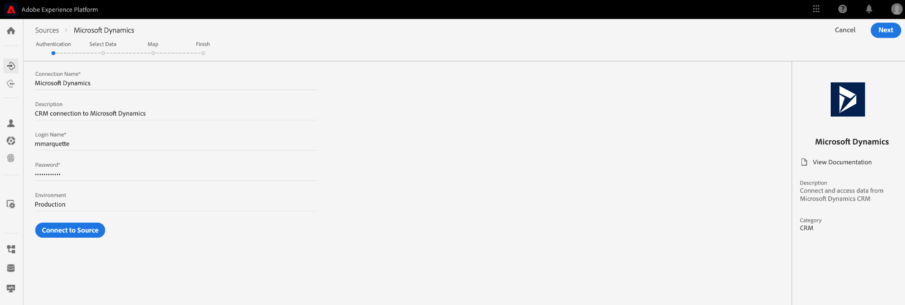

1. Choose what you want to import from a recommended list of XDM pre-mapped tables. 

    <!--    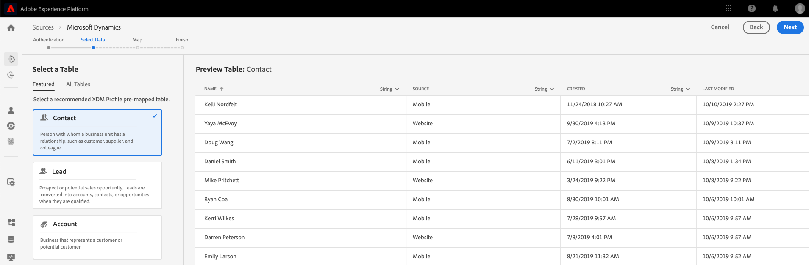 -->
    
    For example, select **[!UICONTROL Contacts]**. A preview of the contacts data automatically loads so you can make sure everything looks as expected.

    Adobe Experience platform takes a lot of the manual work out of this process by auto-mapping standard fields to the [!DNL Experience Data Model] (XDM) profile schema. 
    
1. Review the field mappings.

    <!--    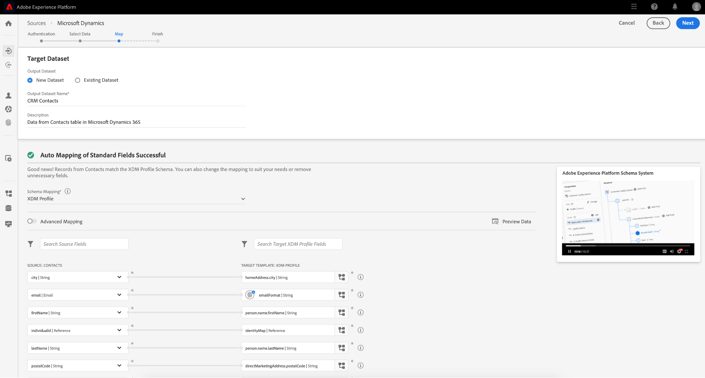 -->

    For example, double check that the email field for contacts is mapped correctly.  
    You have the option to preview the data and perform advanced mapping.  

1. Set a schedule. 

    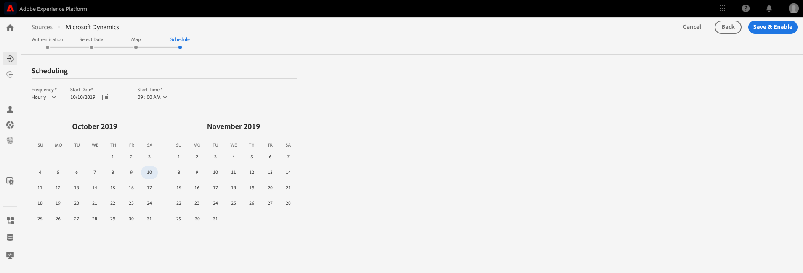

It's done. You just added [!DNL Microsoft CRM] as a data source into [!DNL Experience Platform].

### Labeling ingested data for usage policies

Luma has many internal policies that restrict the usage of certain kinds of collected information, and must also comply with legal and privacy-related concerns regarding data usage. Using Adobe Experience Platform Data Governance, predefined data usage labels can be applied to datasets (and specific fields within those datasets), allowing Luma to categorize their data according to specific usage restrictions.

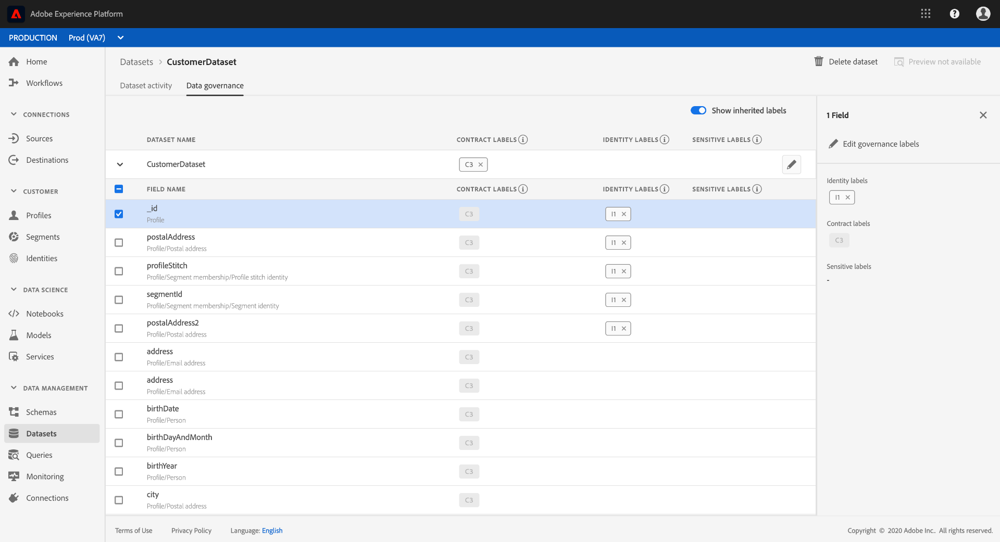

Once data usage labels have been applied, Luma can then use Data Governance to create data usage policies. Data usage policies are rules that describe the kinds of actions that you are allowed to perform on data that contains certain labels. When attempting to perform an action in Real-Time CDP that constitutes a policy violation, the action is prevented and an alert is given to show which policy was violated and why.

## Bringing the data together for a specific customer

In this scenario, search profiles for Sarah Rose. Her profile appears, with the email she used to log in. 

<!-- 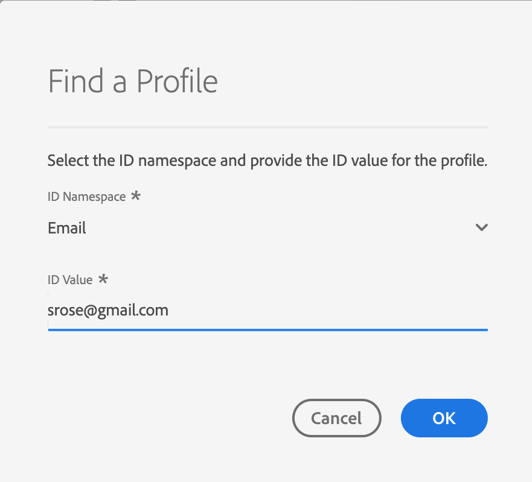 -->

All of the profile information Luma has about Sarah displays. This includes her personal information like address and phone number, communication preferences, and the segments she qualifies for.

|Category|Description|
|---|---|
|Identities|Shows the identities that have been linked together in [!DNL Platform] from Sarah's interactions with Luma across channels and devices. Her ECID from the website is displayed. Her identity also includes the ECID from her mobile app, her email ID, a CRM ID from the recently added [!DNL Microsoft Dynamics] dataset, and a loyalty ID passed into Adobe Experience Platform from the Luma loyalty system.|  
|Events|Shows all of Sarah's interaction data with the Luma brand. This includes the item she just viewed, anything she's viewed in the past, the emails she's received, her interactions with the call center, and what channel and device each of those interactions happened on.|

The Real-Time CDP profile reduces the Luma marketing team's workflow from weeks to minutes and unlocks possibilities for personalization based on this 360-degree customer view. The profile merges the behavioral data from when she browsed the site before she signed in, with her existing customer profile, creating a comprehensive view of Sarah. 

The marketing team can use this enhanced, [!DNL Real-Time Customer Profile] to better personalize Sarah's experience and increase her brand loyalty with Luma.

## Segments

The powerful Adobe Experience Platform segmentation capabilities enable marketers to combine attributes, events and existing segments, based on data captured in the [!DNL Real-Time Customer Profile]. 

<!-- 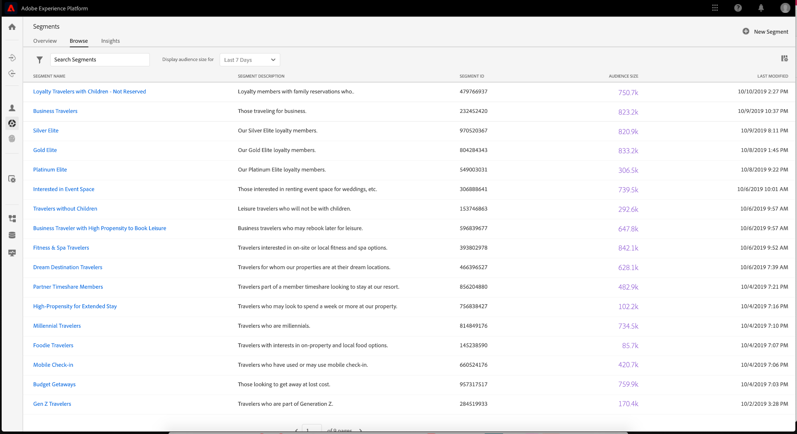 -->

In this scenario, Sarah's recent interactions on the site exhibit a different behavior than her past actions. She usually buys women's apparel. However, the item in her cart is a men’s large sweatshirt. 

The Luma data science team has created models around propensity to buy. One model identifies a sudden change in apparel category (such as mens/womens) or size for the existing consumer. Sarah's change in purchasing behavior suggests she isn’t shopping for herself.  

<!-- 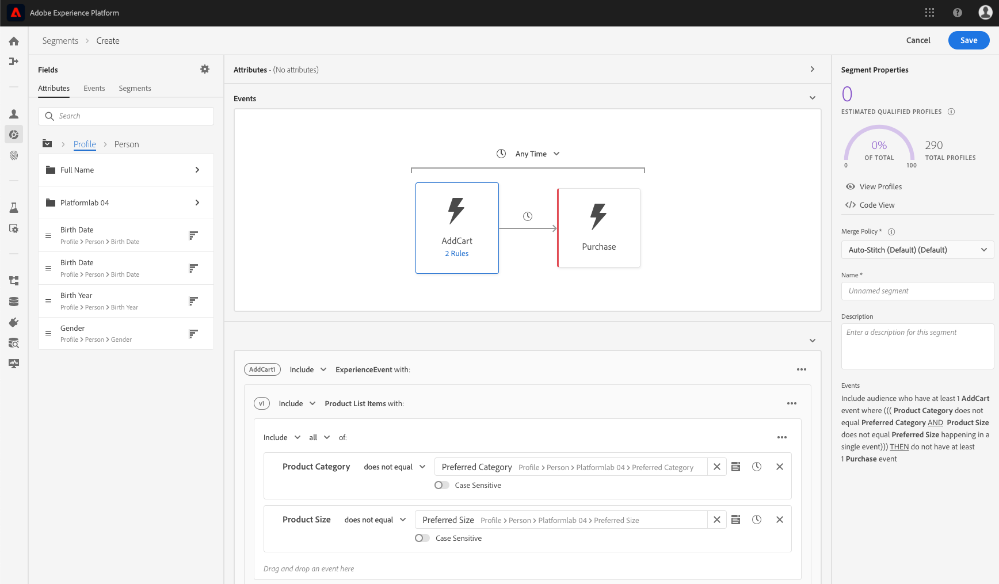 -->

### Defining a segment

Modify or create a segment that represents cart abandoners who appear to be in the process of buying a gift:  

```sql
Profile: Category != Preferred Category 
AND 
Product Size != Preferred Size 
in last 7 days.  
AND 
Abandoned Cart 
AND 
Loyalty member 
```

<!-- 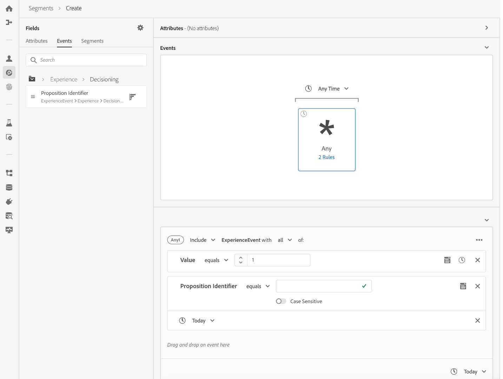-->

Because Sarah added an apparent gift item in the cart and abandoned it, Luma can target her with a free gift wrap offer.

## Destinations

When you've added the “Gift Giving Cart Abandoners” segment, you can see roughly how many people are part of this segment. You can take action on it and make it available for personalization across channels.  

Select **[!UICONTROL Send to destinations]**.

In Real-Time CDP, Luma can seamlessly act on their audience segments for personalization.  
Here we see all of the destinations available for Luma to send this destination to, both Adobe and non-Adobe solutions:

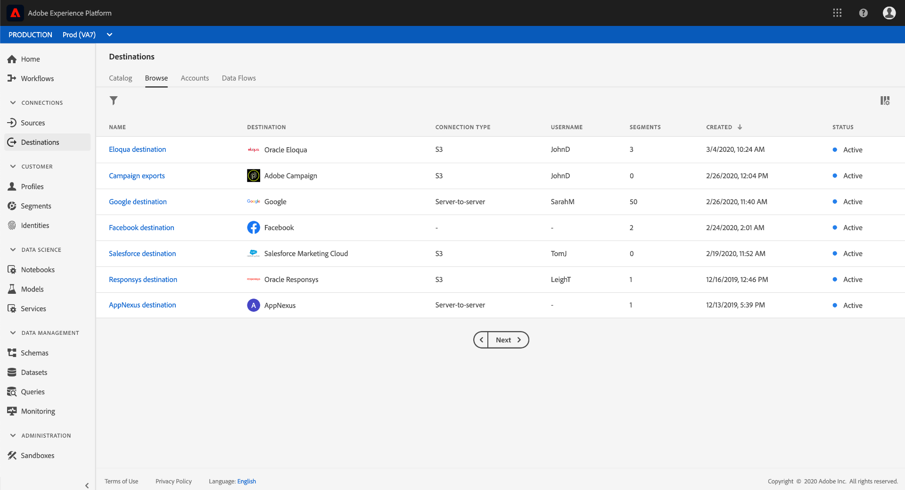

### Selecting destinations

In this scenario, Luma wants to retarget this audience with personalization across these destinations:

* Google, for display
    <!--* Facebook -->
* Adobe Campaign, for email

<!-- 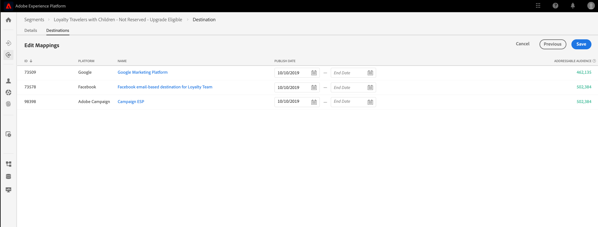 -->

### Scheduling destinations

You can also schedule the segment to start or end at a particular time. The segment will be posted and automatically update in the configured platforms on the scheduled dates. 

>[!NOTE]
>
>Optionally, if you select the date field, it automatically schedules for 90 days out. 

Select **[!UICONTROL Save]** to go to the next page. 

When a customer in this audience makes a purchase, their membership to this audience is suppressed in real time. They don’t qualify anymore because their status has changed. 

This saves the director of the Luma media team  hundreds of thousands of dollars by not using up inventory for an audience that is not qualified.

### Enforcing data usage policies for destinations

Adobe Experience Platform includes privacy and security controls to determine whether a segment is available to be activated to a particular destination. Activation is enabled or restricted based on the marketing purpose(s) assigned to the destination when it was created, as well as data usage policies defined by your organization.

If your activity violates policy, a warning appears. This warning contains data lineage information that can help you identify why the policy was violated, and what you can do to resolve the violation.

With these controls, [!DNL Experience Platform] helps Luma comply with regulations and market responsibly. These controls are flexible and can be modified to meet the requirements of Luma’s security and governance teams, allowing them to confidently address regional and organizational requirements for managing known and unknown customer data.

### Data flow canvas

When you save, a visual data flow canvas shows the segment mapped from the unified profile to the three destinations you selected.

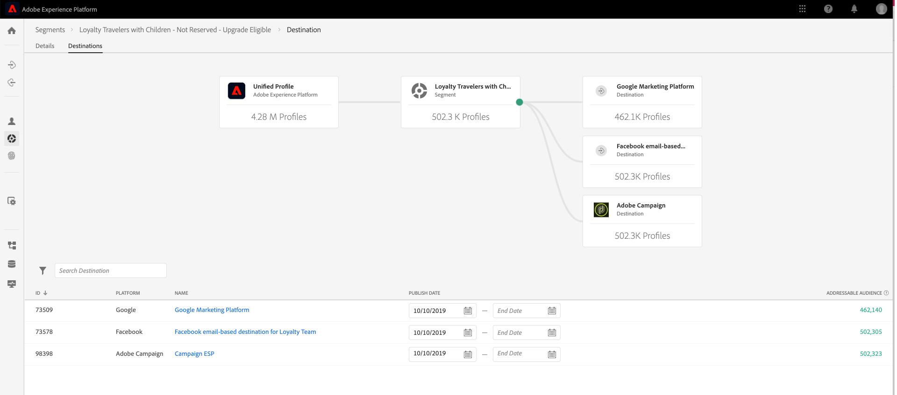

## Cross-device identity stitching

Sarah browses a social media site on her mobile device, and she sees a Luma ad. It reminds her of the item she left in her cart.

Later, she opens her email and sees the retargeted emails. She selects a link to Luma from an email.

The link takes Sarah to the mobile Luma homepage, where she sees a highly personalized experience powered by Adobe Target.

* She is welcomed as a Bronze member.  
* She sees the “Gift” message.  
* She also sees “Free Gift Wrap” message, which is part of her Bronze membership benefits.  
* She's still targeted in the hero image based on her affinity for running.

She buys the sweater, adds gift wrap, and writes a gift note. She also has the option to remember this event and get a reminder next year to get at gift at this time. She says yes, and is scheduled into an email campaign the following year to remind her to buy another gift.

Thanks to audience suppression capabilities, Sarah will not be targeted with that men"s sweater moving forward.

## Analyzing the profile

Luma marketers use Adobe Experience Platform to look at the gift givers segment on the Real-Time CDP Dashboard. They view the results of this initiative over time and see that it's growing. Customers are responding to offers and spending more money.  

These insights enable the marketers to take action on this signal, which was fueled by having this data available in CDP and having customers like Sarah attached to the segment.  

Luma uses this CDP data to drive increased loyalty and customer satisfaction.
