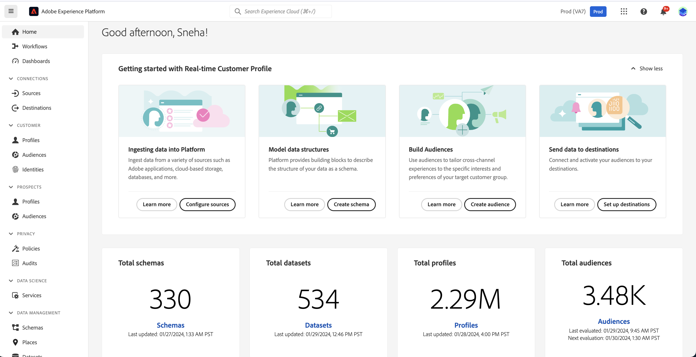
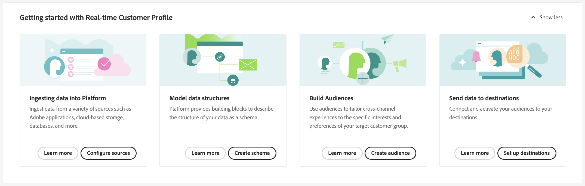
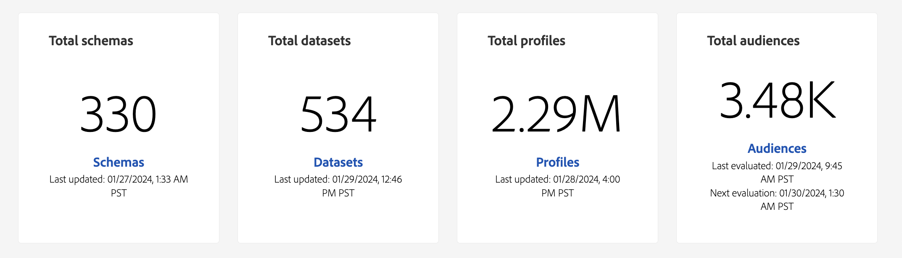
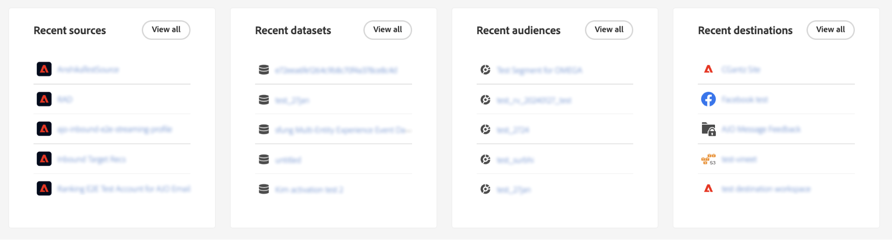
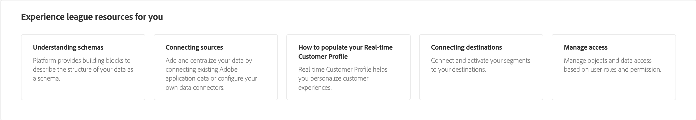
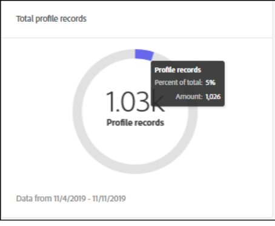
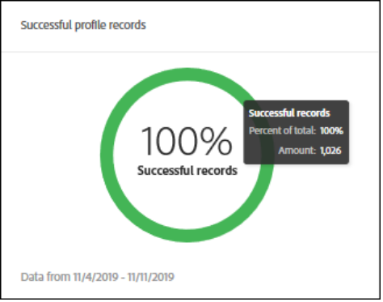

# [!DNL Real-Time Customer Data Platform] home page

The Adobe Real-Time Customer Data Platform (Real-Time CDP) home page is the first page that appears after logging in to Real-Time CDP.

The Real-Time CDP home page includes a getting started widget that allows you to quickly access several different features and a metrics section that displays up-to-date up-to-date information on data within your organization.

This document provides an overview of the Real-Time CDP home page and metrics dashboard.

## Getting started widget

The [!UICONTROL Getting started with Real-Time Customer Profile] widget is divided into four sections: 

* **Ingest data into Platform**: This widget directs you to the sources catalog. Use the sources catalog to select a source and ingest your data to Experience Platform. For more information, read the [sources overview](../sources/home.md)
* **Model data structures**: This widget directs you to the schemas overview. Use the schemas overview to browse for existing schemas or create building blocks that describe the structure of your data. For more information, read the [schemas overview](../xdm/home.md).
* **Segment audiences**: This widget directs you to the [!DNL Segment Builder] in the UI. Use the [!DNL Segment Builder] to interact with Profile data elements and define rules for your segments. For more information, read the [Segmentation Service overview](../segmentation/home.md).
* **Send data to destinations**: This widget directs you to the destinations catalog. Use the destinations catalog to select a destination that you can then connect to and send segments to. For more information, read the [destinations overview](../destinations/home.md)

## Metrics dashboard

The metrics dashboard displays up-to-date information on your Experience Platform data. The dashboard is divided into two sections:

### The leaderboard

The leaderboard shows the current total number of schemas, datasets, profiles, and segments in your organization as well as their most recent update date.

* **Total schemas**: The **Total Schemas** counter displays the number of schemas in the system. This counter is updated when a schema is created. For more information, read the [schemas overview](../xdm/home.md).
* **Total datasets**: The **Total Datasets** counter shows the number of datasets in the system and the amount of data in [!DNL Platform]. This counter is updated when a dataset is created. For more information about datasets, read the [datasets overview](../catalog/datasets/overview.md).
* **Total profiles**: The **Profiles** count shows the total number of people with profiles in the [!DNL Real-Time Customer Profile]. It does not include profile fragments. This is your total addressable audience. This count uses the default [merge policy](profile/merge-policies.md) as set in the merge policy configuration in Unified Profile. The number of profiles is updated once every 24 hours. For more information about profiles, read the [Real-Time Customer Profile overview](../profile/home.md).
* **Total segments**: **Segments** shows the total number of segments created for the organization. This number is updated when new segments are created. For more information about segments, read the [Segmentation Service overview](../segmentation/home.md).

### Recent items

Recent items lists the most recent changes in your organization. In the example below, the most recent changes pertain to datasets, sources, segments, and destinations.

* **Recent datasets**: The **[!UICONTROL Recent datasets]** card shows the five most recent datasets created within the organization. This list is updated when a new dataset is created. Select a dataset to view the details for that item, or select **[!UICONTROL View all]** for a list of datasets. From there, you can select a specific source for details. For more information about datasets, see the [datasets overview](../catalog/datasets/overview.md).
* **Recent sources**: The **[!UICONTROL Recent sources]** metric card shows the five most recent sources created within the organization. This list is updated when a new source is created. Select a source to view the details for that item, or select **[!UICONTROL View all]** for a list of sources. From there, you can select a specific source for details. For more information about sources, see [Sources overview](../sources/home.md).
* **Recent segments**: The **[!UICONTROL Recent segments]** metric card shows the five most recent segments created within the organization. This list is updated when a new segment is created. Select a segment to view the details for that item, or select **[!UICONTROL View all]** for a list of segments. For more information about segments, see [Segmentation Service overview](../segmentation/home.md).
* **Recent destinations**: The **[!UICONTROL Recent destinations]** metric card shows the five most recent destinations created within the organization. This list is updated when a new destination is created. Select a destination to view the details for that item, or select **[!UICONTROL View all]** for a list of destinations. For more information, read the [destinations overview](../destinations/home.md).

## Resources

Finally, the resources widget provides you with additional documentation resources that you can refer to. These include:

* [Understanding schemas](../xdm/schema/composition.md)
* [Connecting sources](../sources/home.md)
* [How to populate your Real-Time Customer Profile](../profile/home.md)
* [Connecting destinations](../destinations/home.md)
* [Manage access](../access-control/abac/overview.md)

<!-- ### Successful profile records

In the leaderboard **[!UICONTROL Successful profile records]** shows the total number of records that have been successfully processed into the profile.

There is also a metric card that shows the percentage of successful records. Select **[!UICONTROL View datasets]** to see more details about the profile records. Hover over the colored area of the graph to see additional details:

The number of successful profile records is updated hourly. 

For more information about profiles, see [A unified view of your customer in Real-Time CDP](profile/profile-overview.md).

### Total profile records

The **[!UICONTROL Total profile records]** metric card shows the total number of data records enabled to feed into the profiles, and the percentage that are successful, updated once per day. This does not include all data in the data lake, because some data might not be enabled to feed into the profiles.

 Hover over the colored area of the graph to see additional details about the successful profiles:

Select **[!UICONTROL View profiles]** to see more details about the profile records.

For more information about profiles, see [A unified view of your customer in Real-Time CDP](profile/profile-overview.md).

For more information about viewing a specific profile, see [Profile viewer](profile/profile-viewer.md).

### Failed profile records

In the leaderboard, **[!UICONTROL Failed profile records]** counts the number of records that failed to process into the profile.

The **[!UICONTROL Failed profile records]** metric card shows this count, and includes a graphical representation that helps you see how failures have trended during the time shown below the graphic. This chart is updated hourly. Select **[!UICONTROL View datasets]** to see more details about the profile records.

The number of failed profile records is updated hourly. -->
