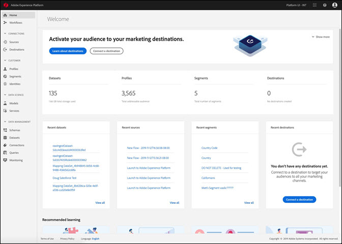
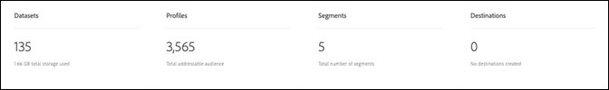
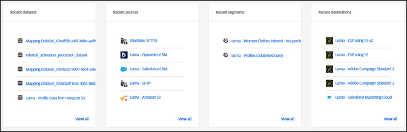

# [!DNL Real-time Customer Data Platform] metrics overview

The Adobe Real-time Customer Data Platform (Real-time CDP) home page, which includes a metrics dashboard, appears when you log in to Real-time CDP.

The home page is only one of the places where metric cards appear. Real-time CDP provides metric cards throughout your experience. These metrics inform you about the data, profile, and segment audiences in the system. 

If there is no data in the system when you log in to Real-time CDP, the dashboard on the home page does not appear. In this case, the home page provides learning material for a first time user experience. As data is collected--in other words, as <!--sources-->datasets, profiles, segments, and destinations are created and data flows into the system--the dashboard automatically updates to display information about that data<!-- in metric cards-->. 

## Home page dashboard view

<!--The dashboard shows information in several areas. Each category of information displays for the time range shown beneath the data.-->

The dashboard is divided into<!-- two areas.-->:

* **The leaderboard** is across the top of the dashboard. The leaderboard shows the number of datasets, profiles, segments, and destinations in the system. 

    

<!-- * **Metric cards** display beneath the leaderboard. Metric cards show additional information, such as percentages or trends. Metric cards appear as data is collected.
    
Some information is shown in different ways on both the leaderboard and metric cards. -->
* **Recent items** lists the five most recent datasets, sources, segments, and destinations added to the system.

    

Additional metrics--for example for profiles and segments--are available in other parts of Real-time Customer Data Platform.

### Datasets

The **[!UICONTROL Datasets]** counter shows the number of datasets in the system and the amount of data in [!DNL Platform]. This counter is updated when a dataset is created.

For more information about datasets, see the [datasets overview](../catalog/datasets/overview.md).

### Profiles

The **[!UICONTROL Profiles]** count shows the total number of people with profiles in the [!DNL Real-time Customer Profile]. It does not include profile fragments. This is your total addressable audience.

This count uses the default [merge policy](profile/merge-policies.md) as set in the merge policy configuration in Unified Profile. 

The number of profiles is updated once every 24 hours.  

For more information about profiles, see [A unified view of your customer in Real-time CDP](profile/profile-overview.md).

### Segments

**[!UICONTROL Segments]** shows the total number of segments created for the organization. This number is updated when new segments are created.

For more information about segments, see [Segmentation Service overview](segmentation/segmentation-overview.md).

### Destinations

**[!UICONTROL Destinations]** shows the total number of destinations created for the organization. This number is updated when new destinations are created.

For more information about destinations, see [Destinations overview](destinations/destinations-overview.md).

<!-- ### Successful profile records

In the leaderboard **[!UICONTROL Successful profile records]** shows the total number of records that have been successfully processed into the profile.

There is also a metric card that shows the percentage of successful records. Click **[!UICONTROL View datasets]** to see more details about the profile records. Hover over the colored area of the graph to see additional details:

The number of successful profile records is updated hourly. 

For more information about profiles, see [A unified view of your customer in Real-time CDP](profile/profile-overview.md).

### Total profile records

The **[!UICONTROL Total profile records]** metric card shows the total number of data records enabled to feed into the profiles, and the percentage that are successful, updated once per day. This does not include all data in the data lake, because some data might not be enabled to feed into the profiles.

 Hover over the colored area of the graph to see additional details about the successful profiles:

Click **[!UICONTROL View profiles]** to see more details about the profile records.

For more information about profiles, see [A unified view of your customer in Real-time CDP](profile/profile-overview.md).

For more information about viewing a specific profile, see [Profile viewer](profile/profile-viewer.md).

### Failed profile records

In the leaderboard, **[!UICONTROL Failed profile records]** counts the number of records that failed to process into the profile.

The **[!UICONTROL Failed profile records]** metric card shows this count, and includes a graphical representation that helps you see how failures have trended during the time shown below the graphic. This chart is updated hourly. Click **[!UICONTROL View datasets]** to see more details about the profile records.

The number of failed profile records is updated hourly. -->

### Recent datasets

The **[!UICONTROL Recent datasets]** card shows the five most recent datasets created within the organization. This list is updated when a new dataset is created.

Click a dataset to view the details for that item, or **[!UICONTROL View all]** to see the list of datasets. From there, you can click on a specific source for details.

For more information about datasets, see the [datasets overview](../catalog/datasets/overview.md).

### Recent sources

The **[!UICONTROL Recent sources]** metric card shows the five most recent sources created within the organization. This list is updated when a new source is created.

Click a source to view the details for that item, or **[!UICONTROL View all]** to see the list of sources. From there, you can click on a specific source for details.

For more information about sources, see [Sources overview](sources/sources-overview.md).

### Recent segments

The **[!UICONTROL Recent segments]** metric card shows the five most recent segments created within the organization. This list is updated when a new segment is created.

Click a segment to view the details for that item, or **[!UICONTROL View all]** to see information about more segments.

For more information about segments, see [Segmentation Service overview](segmentation/segmentation-overview.md).

### Recent destinations

The **[!UICONTROL Recent destinations]** metric card shows the five most recent destinations created within the organization. This list is updated when a new destination is created.

Click a destination to view the details for that item, or **[!UICONTROL View all]** to see information about more destinations.

For more information about destinations, see [Destinations overview](destinations/destinations-overview.md).
