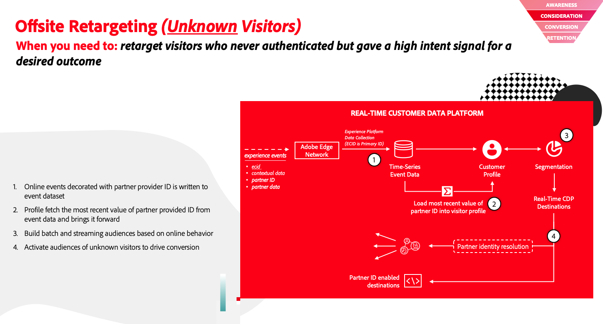
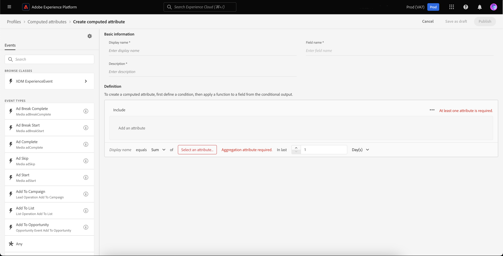
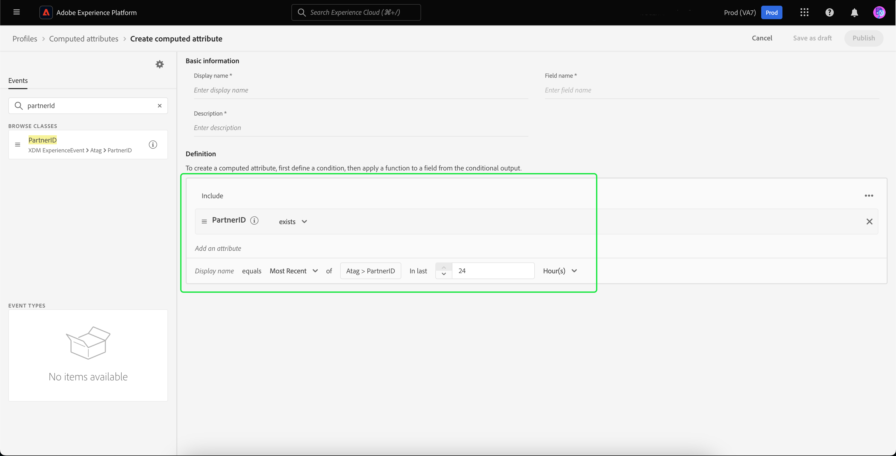
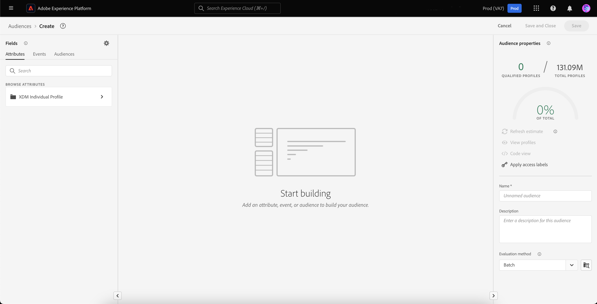
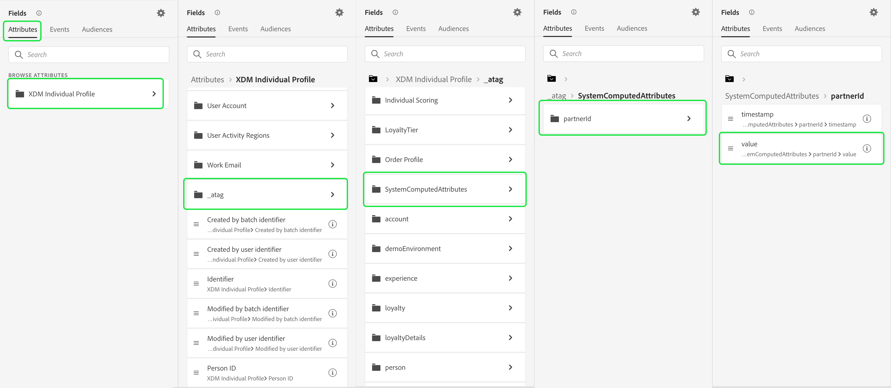
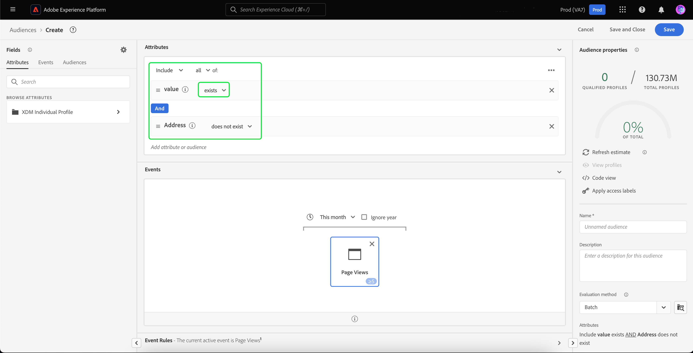
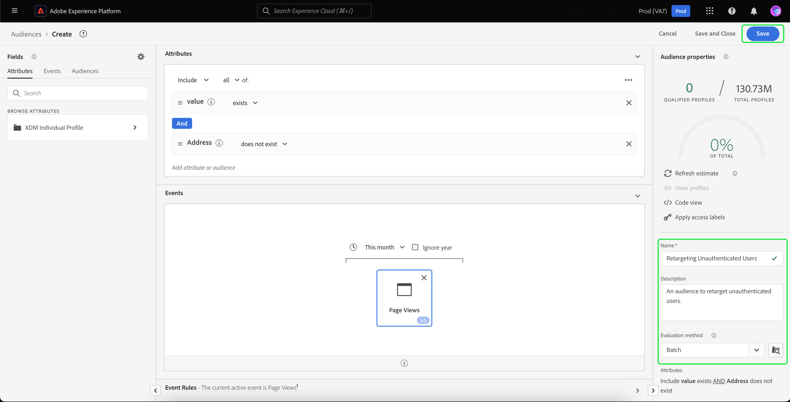
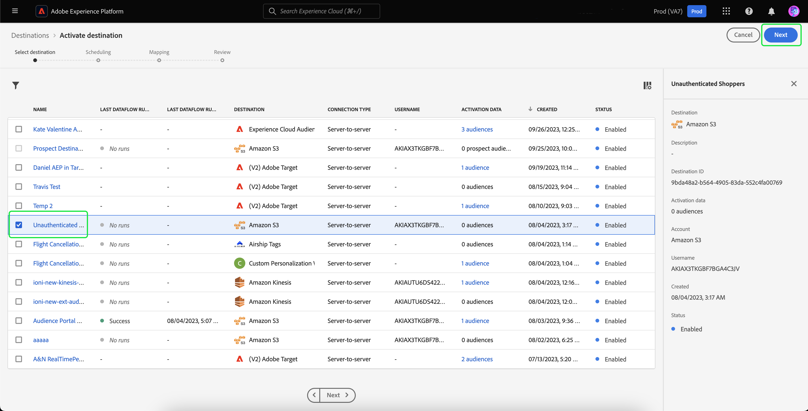
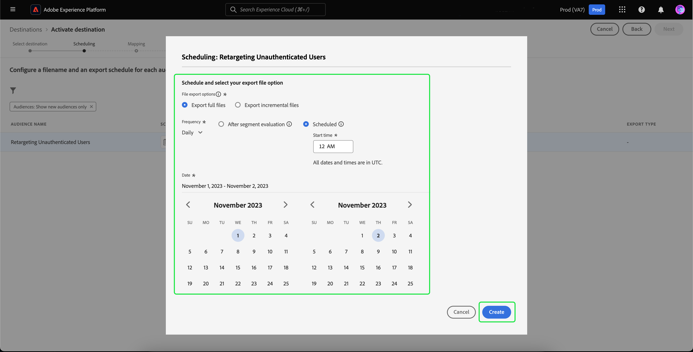
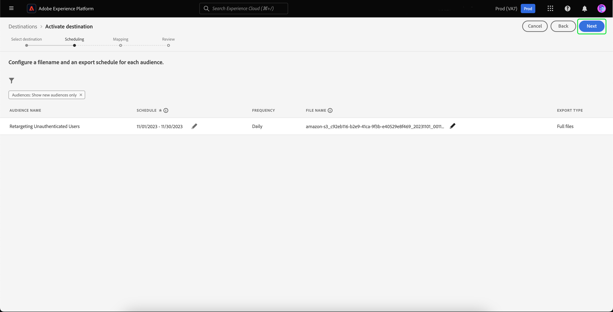

# Offsite retargeting of unauthenticated visitors

>[!AVAILABILITY]
>
>This functionality is available to customers who have licensed Real-Time CDP (App Service), Adobe Experience Platform Activation, Real-Time CDP, Real-Time CDP Prime, Real-Time CDP Ultimate. Read more about these packages in the [product descriptions](https://helpx.adobe.com/legal/product-descriptions.html) and contact your Adobe representative for more information.

Learn how to build an audience of unauthenticated visitors and retarget them using partner provided durable IDs.

## Why to consider this use case {#why-use-case}

With the phasing out of third-party cookies, digital marketers must reimagine their strategies for re-engaging with anonymous visitors. Brands that choose to integrate with identity vendors for real-time visitor recognition can also leverage partner provided durable identifiers for off-site paid-media retargeting.

Despite high volume of traffic, many brands see a significant drop-off at the conversion stage. Visitors engage with content and product demos but leave without signing up or making a purchase.

Not only can you build audiences based on on-site engagement to personalize marketing messages, you can also use Adobe's support for partner IDs to re-engage with visitors across paid-media destinations.

## Prerequisites and planning {#prerequisites-and-planning}

When planning on retargeting unauthenticated visitors, please consider the following prerequisites during your planning process:

- Have I set up the partner IDs with the proper identity namespaces?

Additionally, in order to implement the use case, you will make use of the following Real-Time CDP functionality and UI elements. Ensure that you have the necessary attribute-based access control permissions for all these areas or ask your system administrator to grant you the necessary permissions.

- [Audiences](../../segmentation/home.md)
- [Computed attributes](../../profile/computed-attributes/overview.md)
- [Destinations](../../destinations/home.md)
- [Web SDK](../../web-sdk/home.md)

## Get partner data into Real-Time CDP {#get-data-in}

To create an audience of unauthenticated visitors, you'll first need to get your partner data into Real-Time CDP.

To learn how to best import data into Real-Time CDP using Web SDK, please read the [data management and event data collection sections](./onsite-personalization.md#data-management) of the onsite personalization use case.

## Bringing partner provided IDs forward {#bring-partner-ids-forward}

After importing the partner provided IDs into an event dataset, you'll need to get this data into the profile records. You can do this by utilizing computed attributes.

Computed attributes let you quickly convert profile behavioral data into aggregated values at the profile level. As a result, you can use these expressions, such as "lifetime purchase total" to the profile, allowing you to easily use the computed attribute within your audiences. More information about computed attributes can be found in the [computed attributes overview](../../profile/computed-attributes/overview.md).

To access computed attributes, select **[!UICONTROL Profiles]** followed by **[!UICONTROL Computed attributes]** and **[!UICONTROL Create computed attribute]**.

![The [!UICONTROL Create computed attributes] button is highlighted in addition to the [!UICONTROL Computed attributes] tab within the [!UICONTROL Profiles] workspace.](../assets/offsite-retargeting/create-ca.png)

The **[!UICONTROL Create computed attribute]** page appears. On this page, you can use the components to create your computed attribute.

>[!NOTE]
>
>For more detailed information on creating computed attributes, please read the [computed attributes UI guide](../../profile/computed-attributes/ui.md).

For this use case, you can create a computed attribute that, if the partner ID exists, gets the most recent value of the partner ID within the last 24 hours.

Using the search bar, you can locate and add the "Partner ID" event that [you created during the onsite personalization use case](#get-data-in) to the computed attribute canvas.

![The [!UICONTROL Events] tab and the search bar are highlighted.](../assets/offsite-retargeting/ca-add-partner-id.png)

After adding the "Partner ID" event to the definition, set the event filtering condition to **[!UICONTROL Exists]**, set the event filtering condition to be the **[!UICONTROL Most Recent]** value of the added partner ID, and with a lookback period of 24 hours.

Give the computed attribute an appropriate name (such as "Partner ID") and description, then select **[!UICONTROL Publish]** to complete the computed attribute creation process.

## Create an audience using the computed attribute {#create-audience}

Now that you've created the computed attribute, you can use this computed attribute to create an audience. In this example, you will be creating an audience comprised of visitors that visited your website more than 5 times this month but have not yet signed up.

To create an audience, select **[!UICONTROL Audiences]**, followed by **[!UICONTROL Create audience]**.

![The [!UICONTROL Create audience] button is highlighted.](../assets/offsite-retargeting/create-audience.png)

A dialog appears, asking you to choose between [!UICONTROL Compose audience] and [!UICONTROL Build rule]. Select **[!UICONTROL Build rule]** followed by **[!UICONTROL Create]**.

![The [!UICONTROL Build rule] button is highlighted.](../assets/offsite-retargeting/select-build-rule.png)

The Segment Builder page appears. On this page, you can use the components to build your audience.

>[!NOTE]
>
>For more detailed information about using the Segment Builder, please read the [Segment Builder UI guide](../../segmentation/ui/segment-builder.md).

To achieve the goal of finding these visitors, you'll first need to add a **[!UICONTROL Page View]** event to your audience. Select the **[!UICONTROL Events]** tab under **[!UICONTROL Fields]**, then drag and drop the **[!UICONTROL Page View]** event and add it to the events section canvas.

![The [!UICONTROL Events] tab in the [!UICONTROL Fields] section is highlighted, while displaying the [!UICONTROL Page View ]event.](../assets/offsite-retargeting/add-page-view.png)

Select the newly added **[!UICONTROL Page View]** event. Change the lookback period from **[!UICONTROL Any time]** to **[!UICONTROL This month]**, and change the event rule to include **At least 5**.

![Details of the added [!UICONTROL Page View] event are displayed.](../assets/offsite-retargeting/edit-event.png)

After adding your event, you'll need to add an attribute. Since you're working with unauthenticated visitors, you can add the computed attribute you just created. This newly created computed attribute lets you link partner IDs to an audience.

To add the computed attribute, under **[!UICONTROL Attributes]**, select **[!UICONTROL XDM Individual Profile]**, followed by **[your organization's tenant ID](../../xdm/api/getting-started.md#know-your-tenant-id).**, **[!UICONTROL SystemComputedAttributes]**, and **[!UICONTROL PartnerID]**. Now, add the **[!UICONTROL Value]** of the computed attribute to the attributes section of the canvas.

Additionally, search for **[!UICONTROL Personal Email]** and add the **[!UICONTROL Address]** attribute below **[!UICONTROL PartnerID]** to the attributes section of the canvas.

![The [!UICONTROL PartnerID] computed attribute and the [!UICONTROL Personal Email Address] attribute are highlighted on the Segment Builder canvas.](../assets/offsite-retargeting/added-attributes.png)

Now that you've added your attributes, you'll need to set their evaluation criteria. For **[!UICONTROL PartnerID]**, set the criterion to **[!UICONTROL exists]**, and for **[!UICONTROL Address]**, set the criterion to **[!UICONTROL does not exist]**. 

You've now successfully created an audience that looks for high intensity visitors who have a partner-provided ID but have not yet signed up for your site. Name your audience "Retargeting Unauthenticated Users" and select **[!UICONTROL Save]** to finish creating your audience.

## Activate your audience {#activate-audience}

After successfully creating your audience, you can now activate this audience to downstream destinations. Select **[!UICONTROL Audiences]** on the left navigation rail, look for your newly created audience, select the ellipsis icon, and select **[!UICONTROL Activate to destination]**. 

![The [!UICONTROL Activate to destination] button is highlighted.](../assets/offsite-retargeting/activate-to-destination.png)

>[!NOTE]
>
>All destination types, including file-based destinations, support audience activation with partner IDs.
>
>For more information on activating audiences to a destination, please read the [activation overview](../../destinations/ui/activation-overview.md).

The **[!UICONTROL Activate destination]** page appears. On this page, you can select which destination you want to activate your destination to. After selecting the destination of choice, select **[!UICONTROL Next]**.

The **[!UICONTROL Scheduling]** page appears. On this page, you can create a schedule that determines how frequently you want the audience activated. Select **[!UICONTROL Create schedule]** to create a schedule for the audience activation.

![The [!UICONTROL Create schedule] button is highlighted.](../assets/offsite-retargeting/select-create-schedule.png)

The [!UICONTROL Scheduling] popover appears. On this page, you can create the schedule for your audience activation. After configuring the schedule, select **[!UICONTROL Create]** to continue.

After confirming the scheduling details, select **[!UICONTROL Next]**.

The **[!UICONTROL Select attributes]** page appears. On this page, you can select which attributes you want to export along with the activated audience. At a minimum, you'll want to include the partner ID, since this will let you identify the visitors you plan to retarget. Select **[!UICONTROL Add new mapping]** and search for the computed attribute. After adding the necessary attributes, select **[!UICONTROL Next]**.

![Both the [!UICONTROL Add new mapping] button and the computed attribute are highlighted.](../assets/offsite-retargeting/add-new-mapping.png)

The **[!UICONTROL Review]** page appears. On this page, you can review the details of your audience activation. If you're satisfied with the provided details, select **[!UICONTROL Finish]**.

![The [!UICONTROL Review] page is displayed, showing details of the audience activation.](../assets/offsite-retargeting/review-destination-activation.png)

You have now activated an audience of unauthenticated users to a downstream destination for further retargeting.

## Other use cases {#other-use-cases}

You can explore further use cases enabled through partner data support in Real-Time CDP:

- [Engage and acquire new customers](./prospecting.md) by using partner data.
- [Personalize onsite experiences](./offsite-retargeting.md) with partner-aided visitor recognition.
- [Supplement First-party profiles](./supplement-first-party-profiles.md) with Partner-provided attributes.
