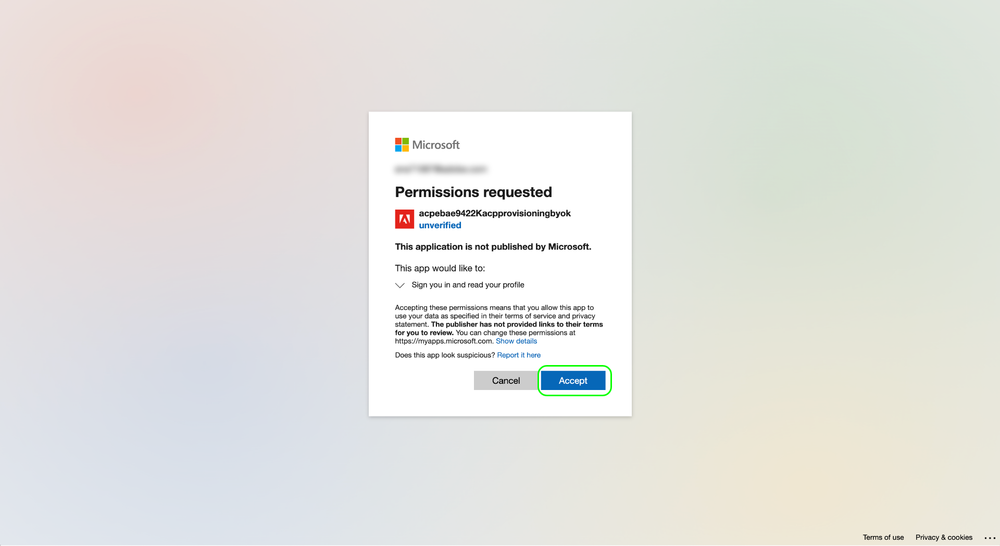

# Customer-managed keys in Real-Time Customer Data Platform (Beta)

>[!IMPORTANT]
>
>This feature is currently in beta and your organization may not have access to it yet. The documentation and functionality are subject to change.

All data stored on Adobe Experience Platform is encrypted at rest using system-level keys. In Real-Time Customer Data Platform (Real-Time CDP), you can opt to use your own encryption keys instead, giving you greater control over your data security.

This document covers the process for enabling the customer-managed keys (CMK) feature in Real-Time CDP.

## Process summary

CMK is included in the Healthcare Shield and the Privacy and Security Shield offerings from Adobe. After your organization purchases one of these offerings, the process for setting up CMK can be summarized as follows:

1. [Create an Azure Key Vault](#create-key-vault), then [generate or import an encryption key](#generate-or-import-key) (based on your organization's policies) that will ultimately be shared with Adobe.
1. Use API calls to [register the CMK app](#register-app) with your Azure tenant.
1. [Assign the service principal for the CMK app](#assign-to-role) to an appropriate role for the key vault. 
1. Use API calls to [send your encryption key ID to Adobe](#send-to-adobe).

Once the setup process is complete, your organization's data across all sandboxes will be encrypted using your Azure key setup.

## Create an Azure Key Vault {#create-key-vault}

CMK only supports keys from a Microsoft Azure Key Vault. To get started, you must work with Azure to create a new enterprise account, or use an existing enterprise account  and follow the steps below to create the Key Vault.

>[!NOTE]
>
>The documentation below only covers the basic steps to create the key vault. Outside of this guidance, you should configure the key vault as per your organization's policies.

Log in to the Azure portal and use the search bar to locate **[!DNL Key vaults]** under the list of services.


The **[!DNL Key vaults]** page appears after selecting the service. From here, select **[!DNL Create]**.


Using the provided form, fill in the basic details for the key vault, including a name and an assigned resource group.

>[!WARNING]
>
>While most options can be left as their default values, **make sure that you enable the purge protection option**. If you do not turn this feature on, you could risk losing access to your data if the key vault is deleted.
>
>

From here, continue going through the key vault creation workflow and configure the different options according to your organization's policies.

Once you arrive at the **[!DNL Review + create]** step, you can review the details of the key vault while it goes through validation. Once validation passes, select **[!DNL Create]** to complete the process.


## Generate or import a key {#generate-or-import-key}

Once you have created a key vault, you can import an existing key or generate a new one. Navigate to the **[!DNL Keys]** tab and select **[!DNL Generate/Import]**.


Use the provided form to configure the key you want to generate or import. When finished, select **[!DNL Create]**.


The configured key appears in the list of keys for the vault.


## Register the CMK app {#register-app}

Once you have your key vault configured, the next step is to register for the CMK application that will link to your Azure tenant.

>[!NOTE]
>
>Registering the CMK app requires you to make calls to Platform APIs. For details on how to gather the required authentication headers to make these calls, see the [Platform API authentication guide](../../landing/api-authentication.md).
>
>While the authentication guide provides instructions on how to generate your own unique value for the required `x-api-key` request header, all API operations in this guide use the static value `acp_provisioning` instead. You must still provide your own values for `{ACCESS_TOKEN}` and `{ORG_ID}`, however.

### Send a registration request

To start the registration process, make a POST request to the app registration endpoint. This endpoint gathers your organization's identity information and generates an integration path.

**Request**

```shell
curl -X POST \
  https://platform.adobe.io/data/infrastructure/manager/byok/app-registration \ 
  -H 'Authorization: Bearer {ACCESS_TOKEN}' \
  -H 'x-api-key: acp_provisioning' \
  -H 'x-gw-ims-org-id: {ORG_ID}'
```

>[!NOTE]
>
>This endpoint does not accept a payload for POST requests.

**Response**

A successful response returns the details of the registration job, confirming that the process has started.

```json
{
    "id": "5a6e59a0-f73c-43b4-adf3-289ac2a0a147",
    "jobType": "CustomerPolicyJob",
    "workflowType": "BYOK_APP_REGISTRATION",
    "status": "CREATED",
    "currentState": "CALL_PROVISIONING_ENDPOINT",
    "recoverableState": true,
    "doRetryCurrentState": true,
    "retryCount": 3,
    "retryDelayInSeconds": 5,
    "jobData": {
        "x-request-id": "FRbDemUrUxZvi4BrOzoAKQ0RjJTjWvkQ",
        "userId": ""
    },
    "imsOrgId": "{ORG_ID}",
    "executionComplete": false,
    "recovered": false,
    "timeOutForCurrentStateInMins": 5,
    "monitorJob": true,
    "firstJobStateTimestamp": 0,
    "startTime": 1647539834087,
    "endTime": 0
}
```

### Fetch and use the app authentication URL

Once you have sent the initial registration request, make a GET request to the same endpoint to fetch the required authentication URL.

**Request**

```shell
curl -X GET \
  https://platform.adobe.io/data/infrastructure/manager/byok/app-registration \ 
  -H 'Authorization: Bearer {ACCESS_TOKEN}' \
  -H 'x-api-key: acp_provisioning' \
  -H 'x-gw-ims-org-id: {ORG_ID}'
```

**Response**

A successful response returns an `applicationRedirectUrl` property, containing the authentication URL.

```json
{
    "id": "acpebae9422Kacpprovisioningbyok",
    "name": "acpebae9422Kacpprovisioningbyok",
    "applicationUri": "https://adobe.com/acpebae9422Kacpprovisioningbyok",
    "applicationId": "e463a445-c6ac-4ca2-b36a-b5146fcf6a52",
    "applicationRedirectUrl": "https://login.microsoftonline.com/common/oauth2/authorize?response_type=code&client_id=e463a445-c6ac-4ca2-b36a-b5146fcf6a52&redirect_uri=https://adobe.com/acpebae9422Kacpprovisioningbyok&scope=user.read"
}
```

Copy and paste the `applicationRedirectUrl` link into your browser to open an authentication dialog. Select **[!DNL Accept]** to add the CMK app service principal to your Azure tenant.



## Assign the CMK app to a role {#assign-to-role}

After completing the authentication process, navigate back to your Azure Key Vault and select **[!DNL Access control]** in the left navigation. From here, select **[!DNL Add]** followed by **[!DNL Add role assignment]**.


The next screen prompts you to choose a role for this assignment. Select **[!DNL Key Vault Crypto Service Encryption User]** before selecting **[!DNL Next]** to continue.


On the next screen, choose **[!DNL Select members]** to open a dialog in the right rail. Use the search bar to locate the service principal for the CMK application and select it from the list. When finished, select **[!DNL Save]**.

## Send your key URI to Adobe {#send-to-adobe}

After installing the CMK app on Azure, you can send your encryption key identifier to Adobe. Select **[!DNL Keys]** in the left navigation, followed by the name of the key you want to send.


Select the latest version of the key and its details page appears. From here, select the copy icon for the **[!UICONTROL Key Identifier]** field to copy the URI to your clipboard.


Once you have obtained the key identifier, you can send it using a POST request to the CMK configuration endpoint.

**Request**

```shell
curl -X POST \
  https://platform.adobe.io/data/infrastructure/manager/customer/config \ 
  -H 'Authorization: Bearer {ACCESS_TOKEN}' \
  -H 'x-api-key: acp_provisioning' \
  -H 'x-gw-ims-org-id: {ORG_ID}' \
  -d '{
        "name": "config1",
        "type": "BYOK_CONFIG",
        "imsOrgId": "{ORG_ID}",
        "configData": {
          "providerType": "AZURE_KEYVAULT",
          "keyVaultUri": "https://adobecmkexample1.vault.azure.net/keys/adobeCMK-key/02cee357ad5d4c72b2b04881fdffd626",
          "keyName": "key1"
        }
      }'
```

| Property | Description |
| --- | --- |
| `name` | A name for the configuration. |
| `type` | The configuration type. Must be set to `BYOK_CONFIG`. |
| `imsOrgId` | Your IMS Organization ID. This must be the same value as provided under the `x-gw-ims-org-id` header. |
| `configData` | Contains the following details about the configuration:<ul><li>`providerType`: Must be set to `AZURE_KEYVAULT`.</li><li>`keyVaultUri`: The key identifier URI that you copied earlier.</li><li>`keyName`: A name for the key.</li></ul> |

**Response**

A successful response returns the details of the configuration job.

```json
{
  "id": "042db66e-3525-4a2b-b9de-703f21294425",
  "jobType": "CustomerPolicyJob",
  "workflowType": "BYOK_CONFIG",
  "status": "CREATED",
  "currentState": "CALL_PROVISIONING_ENDPOINT",
  "recoverableState": true,
  "doRetryCurrentState": true,
  "retryCount": 3,
  "retryDelayInSeconds": 5,
  "jobData": {
    "x-request-id": "oh6TPkZSgf3DNgHLWm6CezFf0pafIOwZ",
    "userId": "",
    "config": {
      "name": "config1",
      "type": "BYOK_CONFIG",
      "status": "NEW",
      "configData": {
        "providerType": "AZURE_KEYVAULT",
        "keyVaultUri": "https://adobecmkexample1.vault.azure.net/keys/adobeCMK-key/02cee357ad5d4c72b2b04881fdffd626",
        "keyName": "key1"
      },
      "imsOrgId": "{ORG_ID}"
    }
  },
  "imsOrgId": "{ORG_ID}",
  "executionComplete": false,
  "recovered": false,
  "timeOutForCurrentStateInMins": 5,
  "monitorJob": true,
  "firstJobStateTimestamp": 0,
  "startTime": 1647624472445,
  "endTime": 0
}
```

The job should should complete processing within a few minutes. To check the status of the job, you can make a GET request.

**Request**

To check the status of a request, you must append the `name` of the configuration to the path (`config1` in the example below) and include a `configType` query parameter set to `BYOK_CONFIG`.

```shell
curl -X GET \
  https://platform.adobe.io/data/infrastructure/manager/customer/config/config1?configType=BYOK_CONFIG \ 
  -H 'Authorization: Bearer {ACCESS_TOKEN}' \
  -H 'x-api-key: acp_provisioning' \
  -H 'x-gw-ims-org-id: {ORG_ID}'
```

**Response**

A successful response returns the status of the job. A complete job contains a `status` value of `COMPLETED`.

```json
{
  "name": "config1",
  "type": "BYOK_CONFIG",
  "status": "COMPLETED",
  "configData": {
    "keyVaultUri": "https://adobecmkexample1.vault.azure.net/keys/adobeCMK-key/02cee357ad5d4c72b2b04881fdffd626",
    "keyName": "key1",
    "providerType": "AZURE_KEYVAULT"
  },
  "imsOrgId": "{ORG_ID}",
  "subscriptionId": "undefined",
  "id": "282397ed-ab19-47fb-9bf2-057270d401aa",
  "rowType": "BYOK_KEY"
}
```

## Next steps

By completing the above steps, you have successfully enabled CMK for your organization. All data that is ingested into Platform will now be encrypted and decrypted using the key(s) in your Azure Key Vault. If you want to revoke Platform access to your data, you can disable the key within Azure.

After disabling a key, it takes 5-10 minutes for data to no longer by accessible in Platform. When enabling a previously disabled key, it takes 45-50 minutes for data to become available again.
