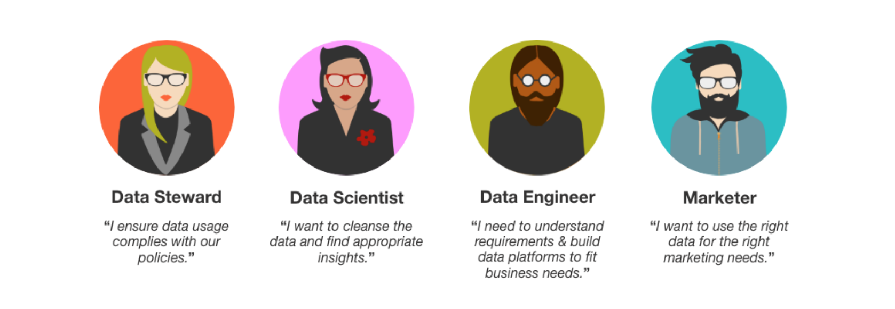

# Data Governance overview

Real-time Customer Data Platform (Real-time CDP) brings data from multiple enterprise systems together, allowing marketers to better identify, understand, and engage their customers. This data may be subject to usage restrictions defined by your organization or by legal regulations. Therefore, it is important to ensure that Real-time CDP is compliant with usage policies when handling your data.

Adobe Experience Platform Data Governance allows you to manage customer data and ensure compliance with regulations, restrictions, and policies applicable to data use. It plays a key role within Real-time CDP, allowing you to define usage policies, categorize your data based on those policies, and check for policy violations when performing certain marketing actions.

This document provides a high-level overview of Data Governance in Real-time CDP, covering the following topics:

* [Data governance roles](#data-governance-roles)
* [DULE framework](#dule)
* [Data usage labels](#data-usage-labels)
* [Data usage policies](#data-usage-policies)

## Data governance roles

As a concept, data governance is neither automatic, nor does it occur in a vacuum. What began as a role for one individual, typically recognized as a **data steward**, has grown considerably as the data governance ecosystem has expanded. Today, data governance requires continual management and monitoring in order to be successful and relies on data stewards having tools with which data can be properly labeled, usage policies can be created, and compliance with those policies can be enforced.

While data governance should be the responsibility of every individual in the organization, some of the essential roles within the data governance cycle can be summarized as follows:

### Data steward

Data stewards are the heart of data governance. This role is responsible for interpreting regulations, contractual restrictions, and policies, and applying them directly to the data. Informed by their understanding of these regulations, restrictions, and policies, the role of a data steward includes:

* Reviewing data, datasets, and data samples to apply and manage metadata usage labeling.
* Creating data policies and applying them to datasets or fields.
* Communicating data policies to the organization.

### Marketer

Marketers are the end point of data governance. They request data from the data governance infrastructure created by data stewards, scientists, and engineers. Marketers encompass a number of different specialties under the marketing umbrella, including the following:

* Marketing Analysts request data to enable understanding of customers, both as individuals and in groups (also known as segments or audiences).
* Marketing Specialists and Experience Designers use data to design new customer experiences. 

## DULE framework

Data Governance in Real-time CDP uses Data Usage Labeling and Enforcement (DULE) to simplify and streamline the process of categorizing data and creating data usage policies. Once data labels have been applied and data usage policies are in place, marketing actions can be evaluated to ensure that your data is being used for the right marketing needs.

There are two key elements to the DULE framework:

1. **Labels:** Classify data that reflects privacy-related or contractual conditions that restrict it from being used for certain marketing actions.
1. **Policies:** Describe what kinds of marketing actions are allowed or not allowed to be taken on data with specific labels.

## Data usage labels

Data Governance in Real-time CDP allows you label your data according to specific usage policies that apply to that data. Labels can be applied to datasets, or specific fields (column headers) within datasets.

The DULE framework includes predefined data usage labels that can be used to categorize data in three ways:

* **Contract "C" data labels:** Categorize data that has contractual obligations or is related to customer data governance policies.
* **Identity "I" data labels:** Categorize data that can identify or contact a specific person.
* **Sensitive "S" data labels:** Categorize data related to sensitive information such as geographic data.

For a complete list of available labels, as well as definitions for each label type, see the guide on [supported data usage labels](https://www.adobe.io/apis/experienceplatform/home/dule/duleservices.html#!api-specification/markdown/narrative/technical_overview/data_governance/dule_supported_labels.md) in the Adobe Experience Platform documentation.

### When and how to apply usage labels

Data usage labels can be applied to entire datasets, or specific fields (column headers) within those datasets. Labels can be applied at any time, providing flexibility in how you choose to govern data. Best practices encourage labeling data as soon as it is ingested into Real-time CDP.

For step-by-step instructions on how to manage DULE labels, see the sections on managing labels at the dataset level and at the dataset field level in the [DULE labels user guide](https://www.adobe.io/apis/experienceplatform/home/tutorials/alltutorials.html#!api-specification/markdown/narrative/tutorials/dule/dule_working_with_labels.md) for Adobe Experience Platform.

> **Important:** The user guide linked above also provides instructions for applying labels to data connections. However, this feature is not available in Real-time CDP.

## Data usage policies

In order for data usage labels to effectively support data compliance, data usage policies must be implemented. Data usage policies are rules that describe the kinds of marketing actions that you are allowed to, or restricted from, performing on data within Experience Platform.

In the context of data governance, a marketing action is any action a Real-time CDP data consumer takes for which there is a need to check for violations of data usage policies. An example of a marketing action might be the desire to export a dataset to a third-party service. If there is a policy in place saying that specific types of data, such as Personally Identifiable Information (PII), cannot be exported and an "I" label (Identity data) has been applied to the dataset, you will receive a response from the Policy Service telling you that a data usage policy has been violated.

### How to create and work with data usage policies

Once data usage labels have been applied, data stewards can create policies using the DULE Policy Service API.

As a data steward, you can use the Policy Service API to manage and evaluate policies related to marketing actions being taken on data containing DULE labels. Using the API, you can create and update policies, determine the status of a policy, and work with marketing actions to evaluate whether a specific action violates a data usage policy.

The Adobe Experience Platform documentation provides more information on how to work with DULE policies. For information on performing the key operations provided by the DULE Policy Service API, see the [Policy Service developer guide](https://www.adobe.io/apis/experienceplatform/home/dule/duleservices.html#!api-specification/markdown/narrative/technical_overview/data_governance/dule_policy_service_developer_guide.md). For a step-by-step DULE policy workflow, see the tutorial on [creating and evaluating DULE policies](https://www.adobe.io/apis/experienceplatform/home/tutorials/alltutorials.html#!api-specification/markdown/narrative/tutorials/dule/create_a_dule_policy_tutorial.md). 