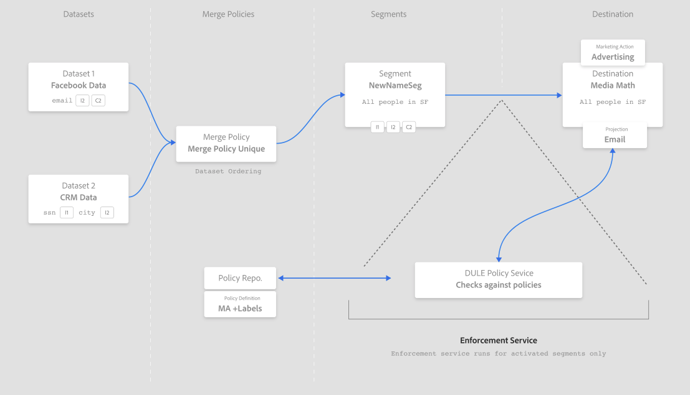
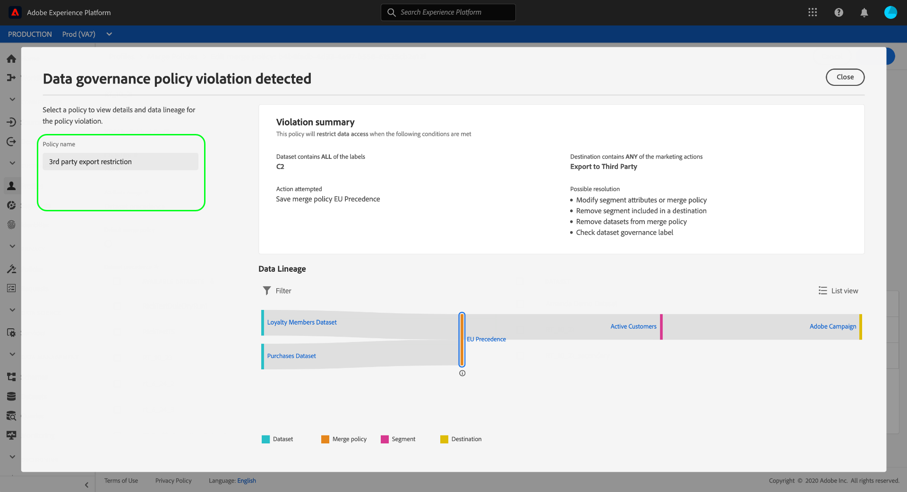
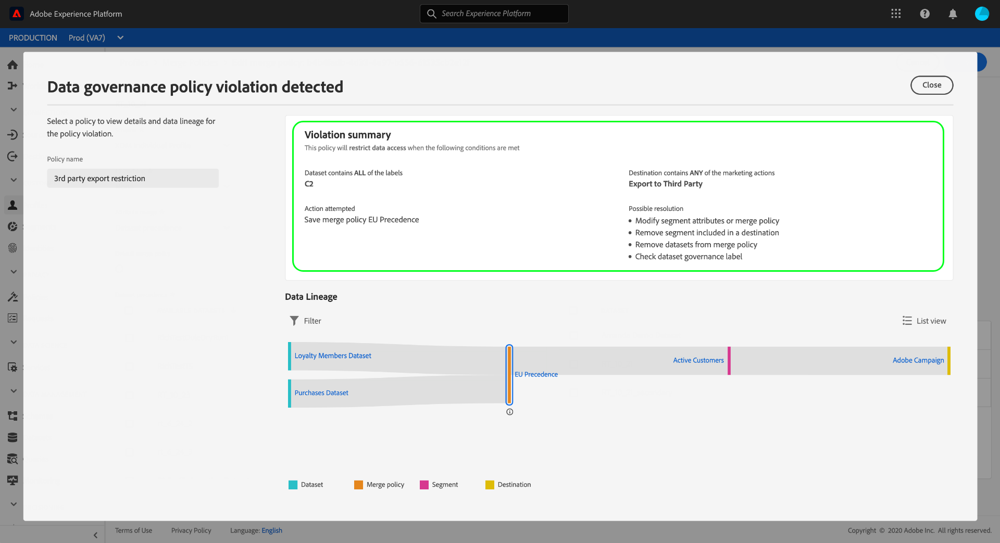
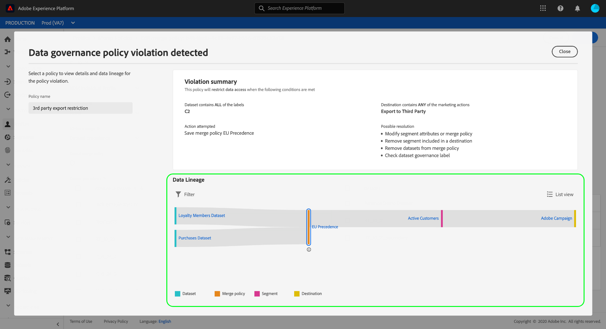
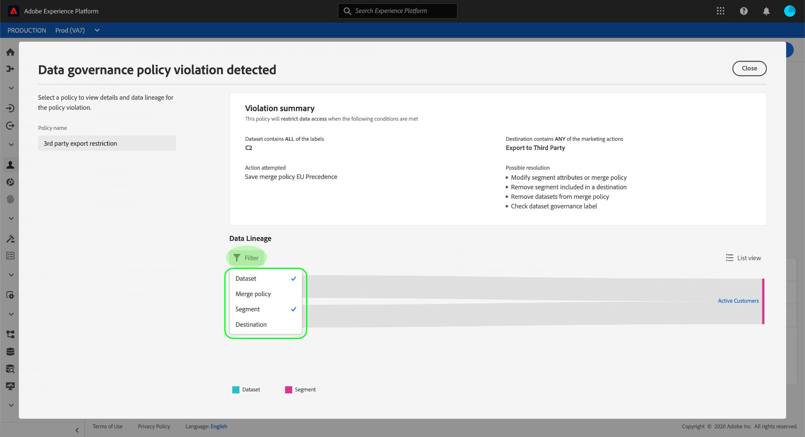
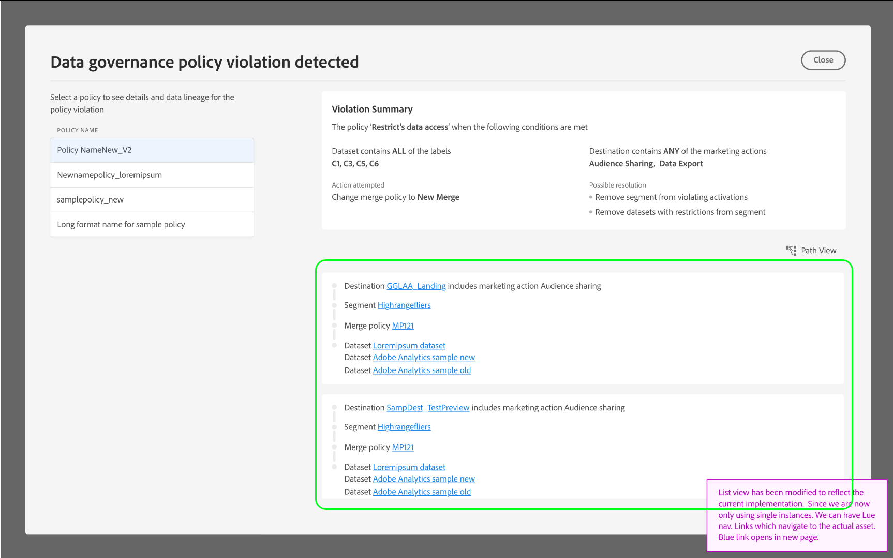

# [!DNL Data Governance] in Real-time CDP

[!DNL Real-time Customer Data Platform] (Real-time CDP) brings data from multiple enterprise systems together, allowing marketers to better identify, understand, and engage their customers. This data may be subject to usage restrictions defined by your organization or by legal regulations. Therefore, it is important to ensure that Real-time CDP is compliant with usage policies when handling your data.

Adobe Experience Platform [!DNL Data Governance] allows you to manage customer data and ensure compliance with regulations, restrictions, and policies applicable to data use. It plays a key role within Real-time CDP, allowing you to define usage policies, categorize your data based on those policies, and check for policy violations when performing certain marketing actions.

Real-time CDP is built on top of Adobe Experience Platform, and therefore the majority of [!DNL Data Governance] capabilities are covered in the [!DNL Experience Platform] documentation. This document is intended to complement the [Data Governance overview](../../data-governance/home.md) for [!DNL Experience Platform], and outlines the Governance features that are available in Real-time CDP. The following topics are covered:

* [Apply usage labels to your data](#labels)
* [Manage data usage policies](#policies)
* [Enforce data usage compliance](#enforce-data-usage-compliance)

## Apply usage labels to your data {#labels}

[!DNL Data Governance] allows you to apply usage labels to your data, either at the dataset or dataset-field level. Data usage labels allow you to categorize data according to usage policies that apply to that data. 

For detailed information on working with data usage labels, see the [data usage labels user guide](../../data-governance/labels/overview.md) for Adobe Experience Platform.

## Configure marketing use cases for destinations {#destinations}

You can set data usage restrictions on a destination by defining marketing use cases (also called marketing actions) for that destination. A marketing use case for a destination indicates the intent of the data that will be exported to that destination.

>[!NOTE]
>
>For more information on marketing actions and their use in data usage policies, see the [data usage policies overview](../../data-governance/policies/overview.md) in the [!DNL Experience Platform] documentation.

Defining marketing use cases on destinations allows you to ensure that any profiles or segments sent to those destinations are compliant with data usage policies. You should therefore add appropriate marketing use cases to your destinations based on your organization's needs to enforce policy restrictions on activation.

Marketing use cases can only be selected when setting up a destination for the first time. Depending on the type of destination you are working with, the opportunity to configure marketing use cases will appear at different points in the setup workflow. See the [destinations documentation](../destinations/destinations-overview.md#data-governance) for steps on how to configure your particular destination.

## Manage data usage policies {#policies}

In order for data usage labels to effectively support data compliance, data usage policies must be defined and enabled. Data usage policies are rules that describe the kinds of marketing actions that you are allowed to, or restricted from, performing on data within Real-time CDP. See the "Data usage policies" section in the [!DNL Experience Platform] [Data Governance overview](../../data-governance/home.md) for more information.

Adobe Experience Platform provides several core policies for common customer experience use cases. These policies can be viewed in the UI by navigating to the **[!UICONTROL Policies]** workspace and selecting the **[!UICONTROL Browse]** tab. See the [policies user guide](../../data-governance/policies/user-guide.md) in the [!DNL Experience Platform] documentation for more detailed steps on working with policies in the UI, including how to make your own custom policies.

## Enforce data usage compliance {#enforce-data-usage-compliance}

Once data is labeled and usage policies are defined, you can enforce data usage compliance with policies. When activating audience segments to destinations in Real-time CDP, [!DNL Data Governance] automatically enforces usage policies should any violations occur.

The following diagram illustrates how policy enforcement is integrated into the data flow of segment activation:

When a segment is first activated, [!DNL Policy Service] checks for policy violations based on the following factors:

* The data usage labels applied to fields and datasets within the segment to be activated.
* The marketing purpose of the destination. 

>[!NOTE]
>
>If there are data usage labels that have only been applied to certain fields within a dataset (rather than the entire dataset), enforcement of those field-level labels on activation only occurs under the following conditions:
>* The fields are used in the segment definition.
>* The fields are configured as projected attributes for the target destination.

### Data lineage {#lineage}

In Real-time CDP, data lineage plays a key role in how policies are enforced. In general terms, data lineage refers to the origin of a set of data, and what happens to it (or where it moves) over time. In the context of [!DNL Data Governance], data lineage provides an audit trail that indicates where and why a policy violation occurred.

In Real-time CDP, policy enforcement is concerned with the following lineage:

1. Data is ingested into Real-time CDP and stored in **datasets**.
1. Customer profiles are identified from those datasets and constructed through **merge policies**.
1. Groups of profiles are divided into **segments** based on common attributes.
1. Segments are activated to downstream **destinations**.

Each stage in the above timeline represents an entity that may contribute to a policy being violated, as outlined in the table below:

| Data lineage stage | Role in policy enforcement |
| --- | --- |
| Dataset | Datasets contain data usage labels (applied at the dataset or field level) that define which use cases the entire dataset or specific fields can be used for. Policy violations will occur if a dataset or field containing certain labels is used for a purpose that a policy restricts. |
| Merge policy | Merge policies define which datasets take precedence when constructing customer profiles. Policy violations will occur if your merge policies are configured so that datasets with restricted labels are activated to a destination. See the guide on [merge policies](../../profile/ui/merge-policies.md) for more information. |
| Segment | Segment rules define which attributes should be included from customer profiles. Depending on which fields a segment definition includes, the segment will inherit any applied usage labels for those fields. Policy violations will occur if you activate a segment whose inherited labels are restricted by the target destination's applicable policies, based on its marketing use case. |
| Destination | When setting up a destination, a marketing action (sometimes called a marketing use case) can be defined. This use case correlates to a marketing action as defined in a data usage policy. In other words, the marketing use case you define for a destination determines which data usage policies are applicable to that destination. Policy violations will occur if you activate a segment whose usage labels are restricted by the target destination's applicable policies. |

When policy violations occur, the resulting messages that appear in the UI provide useful tools for exploring the violation's contributing data lineage to help resolve the issue. More details are provided in the next section.

### Policy violation messages {#enforcement}

If a policy violation occurs from attempting to activate a segment (or [making edits to an already activated segment](#policy-enforcement-for-activated-segments)) the action is prevented and a popover appears indicating that one or more policies have been violated. Once a violation has triggered, the **[!UICONTROL Save]** button is disabled for the entity you are modifying until the appropriate components are updated to comply with data usage policies.

Select a policy violation in the popover's left column to display details for that violation.

The violation message provides a summary of the policy that was violated, including the conditions the policy is configured to check for, the specific action that triggered the violation, and a list of possible resolutions for the issue.

A data lineage graph is displayed below the violation summary, allowing you to visualize which datasets, merge policies, segments, and destinations were involved in the policy violation. The entity that you are currently changing is highlighted in the graph, indicating which point in the flow is causing the violation to occur. You can select an entity name within the graph to open the details page for the entity in question.

You can also use the **[!UICONTROL Filter]** icon to filter the displayed entities by category. At least two categories must be selected in order for data to be displayed.

Select **[!UICONTROL List view]** to display the data lineage as a list. To switch back to the visual graph, select **[!UICONTROL Path view]**.

### Policy enforcement for activated segments {#policy-enforcement-for-activated-segments}

Policy enforcement still applies to segments after they have been activated, restricting any changes to a segment or its destination that would result in a policy violation. Due to how [data lineage](#lineage) works in policy enforcement, any of the following actions can potentially trigger a violation:

* Updating data usage labels
* Changing datasets for a segment
* Changing segment predicates
* Changing destination configurations

If any of the above actions triggers a violation, that action is prevented from being saved and a policy violation message is displayed, ensuring that your activated segments continue to comply with data usage policies when being modified.

## Next steps

Now that you have been introduced to the key [!DNL Data Governance] features on Real-time CDP and how [!DNL Experience Platform] enables them, please continue to the [documentation for Data Governance on Adobe Experience Platform](../../data-governance/home.md). The documentation provides overviews of essential [!DNL Data Governance] concepts, as well as step-by-step workflows for managing data usage labels and policies.

The following video provides an overview of [!DNL Data Governance] in Real-time CDP, including the use of marketing use-cases on destinations and example workflows for different scenarios:

>[!VIDEO](https://video.tv.adobe.com/v/33631?quality=12&learn=on)